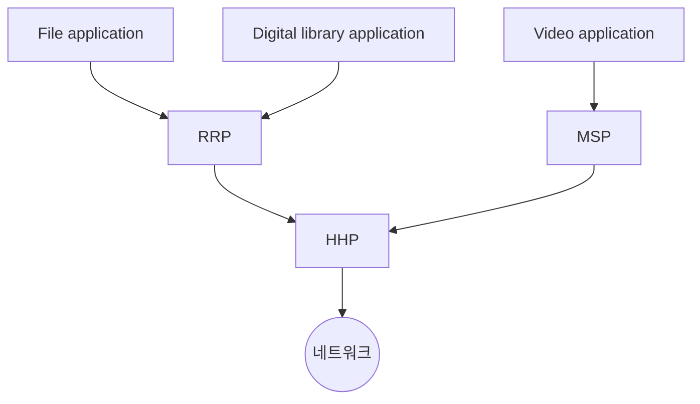



요약

여러 프로토콜을 "누가 누구를 딛고 서 있나"로 이어 그린 그림이다. 여러 응용이 아래의 프로토콜 하나를 함께 쓰므로, 아래 프로토콜은 받은 데이터를 위의 누구에게 올려 줄지 알아야 한다. 그래서 머리말에 역다중화 키(demux key)를 넣는다. 함께 쓰는 덕분에 부품을 다시 쓸 수 있지만, 층마다 나눠 주는 일과 그 표시가 더해진다.

## 예시로 보기

슬라이드의 호스트에는 응용 셋과 프로토콜 셋이 있다[^1].

RRP는 요청·응답(Request/Reply), MSP는 메시지 흐름(Message Stream), HHP는 호스트 사이(Host-to-Host) 프로토콜이다[^s1]. 화살표 "A → B"는 "A가 B의 서비스를 쓴다"는 뜻이다.

Host 2의 HHP가 메시지 하나를 받았다. HHP는 이것을 RRP와 MSP 중 누구에게 올려야 할까? 보낸 쪽 HHP가 머리말에 적어 둔 키를 보고 고른다. RRP도 같은 방식으로 파일 응용과 전자도서관 응용 중 하나를 고른다[^1][^2]. 이 키가 [다중화](/Hongs_Blog/studies/computer-communication/multiplexing/)의 DEMUX 키와 같은 역할을 한다. 링크 하나를 여러 연결이 나눠 쓰듯, 아래 프로토콜 하나를 여러 위 프로토콜이 나눠 쓴다.

## 정의

정의

**프로토콜 그래프**(protocol graph, 프로토콜 스택)는 프로토콜의 모음과 그들 사이의 의존 관계를 나타낸 방향 그래프 $$G_P = (V_P, E_P)$$다[^1]. 꼭짓점은 프로토콜이고, 간선 $$(u, v) \in E_P$$는 "$$u$$가 $$v$$의 서비스를 쓴다"는 뜻이다.  
$$v$$로 들어오는 간선이 둘 이상이면 $$v$$는 하위 프로토콜을 공유당하는 것이다. 이때 $$v$$는 위 프로토콜들의 데이터를 합쳐 보내고(다중화), 받은 데이터를 알맞은 위 프로토콜에 나눠 준다(역다중화). 나눌 때 쓰는 머리말 속 식별자가 **demux key**다[^1].

동료 사이의 통신은 대개 간접적이다. 실제 전달은 아래층에 맡겨서 이루어지고, 하드웨어 수준에서만 동료가 직접 닿는다[^1]. 슬라이드 그림에서 RRP와 RRP 사이의 빨간 점선은 논리적 통신이고, 초록 화살표(RRP → HHP → 망 → HHP → RRP)가 실제 경로다[^3].

## 활용

- 인터넷의 프로토콜 그래프가 모래시계 모양이다: [인터넷 구조](/Hongs_Blog/studies/computer-communication/internet-architecture/)
- 인터넷에서는 IP 머리말의 프로토콜 번호(TCP인가 UDP인가)와 TCP·UDP 머리말의 포트 번호(어느 응용인가)가 demux key다[^s1].
- 필기: 분리할 때 감당해야 할 오버헤드가 생긴다[^2]. 층마다 키를 읽고 나눠 주는 처리와, 키를 적을 머리말 공간이 든다.

## 확인 문제

<b>C1</b> "파일 응용과 전자도서관 응용은 RRP를, 비디오 응용은 MSP를 쓰고, RRP와 MSP는 HHP를 쓴다"를 그래프로 그리고, 역다중화 키가 필요한 프로토콜과 각 키가 가를 대상 수를 쓰라.

**답:** 위 Mermaid 그림과 같다. 키가 필요한 것은 들어오는 간선이 둘 이상인 RRP(파일 / 전자도서관, 2가지)와 HHP(RRP / MSP, 2가지)다. MSP는 위 사용자가 비디오 응용 하나뿐이다.  
**흔한 오답:** MSP에도 키가 필요하다고 하는 것. 나눠 줄 대상이 하나면 가를 것이 없다. 다만 나중에 응용이 늘 것에 대비해 칸을 두는 설계는 흔하다.

<b>C2</b> Host 2의 HHP가 메시지를 받았다. HHP 머리말의 키는 "RRP", 그다음 RRP 머리말의 키는 "Digital library"다. 메시지가 올라가는 경로를 쓰라.

**답:** HHP → RRP → Digital library application. HHP는 자기 머리말을 떼고 키를 보고 RRP에 넘긴다. RRP도 자기 머리말을 떼고 키를 보고 전자도서관 응용에 넘긴다.

<b>C3</b> 다중화 문서의 MUX·DEMUX·DEMUX 키가 프로토콜 그래프에서는 각각 무엇에 대응하는가? 대응이 깨지는 지점도 하나 쓰라.

**답:** MUX = 공유되는 하위 프로토콜이 위 프로토콜들의 데이터를 받아 하나의 흐름으로 보내는 일. DEMUX = 받는 쪽 하위 프로토콜이 알맞은 위 프로토콜에 나눠 주는 일. DEMUX 키 = 머리말의 demux key. 깨지는 지점: 링크의 다중화는 시간 칸이나 주파수 위치 자체가 키일 수 있다(시분할·주파수 분할). 프로토콜 그래프에서는 키를 늘 머리말에 적어 보낸다. 통계적 다중화와 같은 방식이다.

[^1]: 4-1학기/pasted_images/Pasted image 20260925024434.png — 슬라이드 "(전체) 프로토콜 정의: 프로토콜 그래프". 원문의 빨간 글씨: 그래프, 스택, 간접적으로
[^2]: 4-1학기/컴퓨터 통신/2.필기노트/02.2주차.md, 59~66행
[^3]: 4-1학기/pasted_images/Pasted image 20260925025456.png — RRP·HHP 그림 위의 빨간 점선과 초록 화살표. 표시가 없는 원본 그림은 4-1학기/pasted_images/Pasted image 20260925025309.png
[^s1]: 에이전트 보충. RRP, MSP, HHP의 풀이와 인터넷의 프로토콜 번호·포트 번호 예는 원본에 없다. 슬라이드는 약자만 쓴다. 풀이와 인터넷의 demux key는 Peterson & Davie, *Computer Networks: A Systems Approach*, 1.3절의 내용이다.

