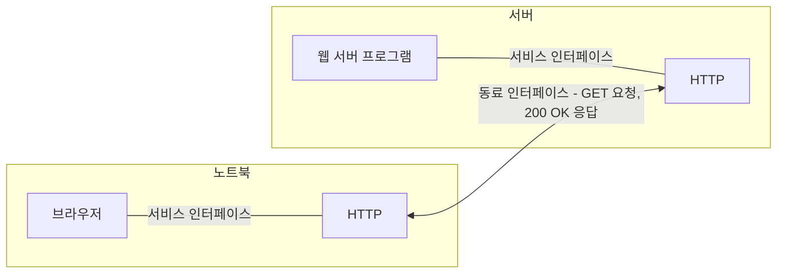



요약

프로토콜은 통신하는 양쪽이 미리 맞춰 둔 약속이다. 두 사람이 같은 언어와 같은 순서로 말해야 대화가 되듯, 보내는 쪽과 받는 쪽이 같은 프로토콜을 써야 한다. 계층 구조에서 프로토콜 하나는 한 층을 맡은 부품이다. 그래서 같은 컴퓨터의 위층에 해 주는 일과, 상대 컴퓨터의 같은 층과 주고받는 말을 따로 정한다.

## 예시로 보기

웹 브라우저가 웹 페이지를 가져오는 장면을 두 방향으로 본다[^s1].

- **위아래(같은 컴퓨터 안):** 브라우저는 아래의 HTTP 모듈에 "이 주소의 페이지를 가져와"라고 요청만 한다. 요청을 어떻게 전하는지는 모른다. 이 요청 창구가 **서비스 인터페이스**다.
- **옆(다른 컴퓨터와):** 노트북의 HTTP는 서버의 HTTP에게 `GET /index.html` 같은 정해진 형식의 메시지를 보낸다. 서버는 `200 OK`와 페이지로 답한다. 이 메시지의 형식과 순서가 **동료 인터페이스**다.

슬라이드 그림에서 Host 1과 Host 2의 "Protocol" 상자 사이의 가로선이 동료 인터페이스이고, 각 호스트 안의 세로선이 서비스 인터페이스다[^1]. 이 장면에서 HTTP가 한 층의 프로토콜이고, 브라우저가 그 위의 "high-level object"다. 페이지 내용은 따지지 않고, 누가 누구와 어떤 창구로 말하는지만 본다.

한 컴퓨터 안의 위아래 선이 서비스 인터페이스이고, 두 컴퓨터의 HTTP 사이를 잇는 가로선이 동료 인터페이스다. 브라우저는 가로선에 오가는 메시지의 형식을 몰라도 된다[^s2].

## 정의

프로토콜은 통신에 쓰는 약속이다. 송수신 양쪽이 같아야 한다. 예: TCP, UDP[^2]. 프로토콜은 매우 복잡해서 체계화가 필요하고, 그 방법이 [계층화](/Hongs_Blog/studies/computer-communication/layering/)다[^2].

(전체) 프로토콜을 이루는 각 계층, 즉 프로토콜의 구성 요소를 **프로토콜 계층** 또는 **프로토콜 개체**라 한다. 이것 자체도 프로토콜이라 부른다[^1].

정의

프로토콜에는 계층이 필수이므로, 각 프로토콜 개체는 두 인터페이스를 갖는다[^1].
- **서비스 인터페이스**: 같은 호스트의 위층 개체에게 이 프로토콜이 해 주는 작업을 정의한다.
- **동료 인터페이스**: 다른 호스트의 같은 층 개체(동료)와 주고받는 메시지를 정의한다.

동료 인터페이스가 맞으려면 양쪽 층이 대칭이어야 한다. 즉 두 호스트의 같은 층은 같은 프로토콜이어야 한다[^2].

## 연결

- 선수: [계층화](/Hongs_Blog/studies/computer-communication/layering/)
- 프로토콜들이 서로 기대어 선 모양: [프로토콜 그래프](/Hongs_Blog/studies/computer-communication/protocol-graph/)
- 동료 인터페이스의 메시지가 실제로 실리는 방식: [캡슐화](/Hongs_Blog/studies/computer-communication/encapsulation/)

## 확인 문제

<b>C1</b> 프로토콜 개체가 갖는 두 인터페이스의 이름을 쓰고, 각각 무엇을 정의하는지 쓰라.

**답:** 서비스 인터페이스는 같은 호스트의 위층에게 해 주는 작업(연산)을 정의한다. 동료 인터페이스는 다른 호스트의 같은 층(동료)과 주고받는 메시지를 정의한다. 
**흔한 오답:** 두 인터페이스를 "보내는 쪽 인터페이스와 받는 쪽 인터페이스"로 나누는 것. 기준은 방향(보내기·받기)이 아니라 상대(위층인가, 동료인가)다.

<b>C2</b> 다음은 서비스 인터페이스와 동료 인터페이스 중 무엇에 속하나? (a) 응용이 TCP에게 "이 바이트들을 보내 줘"라고 함수를 부른다 (b) TCP가 상대 TCP에게 "잘 받았다(ACK)"는 메시지를 보낸다 (c) TCP 헤더의 각 칸이 몇 비트이고 무슨 뜻인지 정한 규격 (d) 운영체제가 응용에게 제공하는 소켓 함수 목록

**답:** (a) 서비스. (b) 동료. (c) 동료. 동료끼리 주고받는 메시지의 형식이다. (d) 서비스. 위층(응용)에게 주는 작업 목록이다[^s1].

<b>C3</b> 송수신 양쪽이 같은 프로토콜을 써야 하는 이유를 동료 인터페이스로 설명하라.

**답:** 동료 인터페이스는 주고받는 메시지의 형식과 뜻을 정한다. 받는 쪽이 다른 프로토콜이면 보낸 쪽의 머리말을 다른 형식으로 읽어서 뜻을 알 수 없다. 서비스 인터페이스는 호스트마다 달라도 되지만, 동료 인터페이스는 양쪽이 같아야 한다.

[^1]: 수업 슬라이드 캡처 — 슬라이드 "프로토콜 계층/개체"
[^2]: 컴퓨터 통신 2회 필기 「2주차」, 42~44행, 55~57행
[^s1]: 보충 HTTP, `GET`/`200 OK`, 소켓 함수 예는 원본에 없다. HTTP 메시지 형식은 RFC 9110(2022)에, 소켓 API는 POSIX 표준에 정의되어 있다. 두 인터페이스의 구분은 Peterson & Davie, *Computer Networks: A Systems Approach*, 1.3절과 같다.
[^s2]: 보충 다이어그램 1개는 원본에 없다. 슬라이드 "프로토콜 계층/개체"의 Host 1·Host 2 그림을 이 문서 '예시로 보기'의 브라우저·HTTP 장면으로 옮겨 그렸다.

