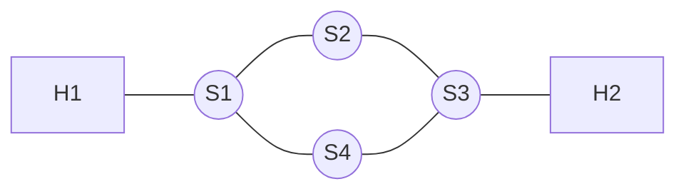
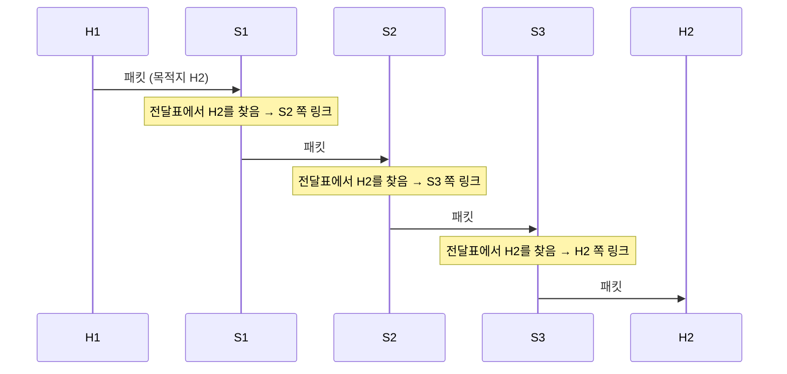



요약

내비게이션에 목적지를 넣으면 경로를 계산하듯, 주소로 상대가 정해진 뒤 그곳까지 어떤 길로 보낼지 정하는 일이다. 길이 여러 갈래인 간접 연결에서만 필요하다. 한 길이 끊겨도 다른 길로 돌아갈 수 있게 해 준다.

## 예시로 보기

내비게이션은 목적지까지 경로를 계산한다(라우팅). 운전 중에는 교차로마다 계산된 방향으로 꺾는다(포워딩). 네트워크로 옮기면 교차로가 스위치, 도로가 링크다. "다음 교차로에서 왼쪽" 같은 안내 한 줄이 스위치가 가진 전달표의 한 줄이다[^s1].

H1에서 H2로 가는 경로는 S1–S2–S3와 S1–S4–S3 두 가지다. S1의 전달표에 "목적지 H2 → S2 쪽 링크"라고 적혀 있으면 위쪽 경로로 간다.

내비게이션은 보통 출발 전에 전체 경로를 한 번에 계산한다. 인터넷에서는 대개 각 라우터가 다음 한 구간만 정한다. 전체 경로는 그 선택들이 이어져서 만들어진다(홉 단위 전달)[^s1].

스위치마다 자기 전달표만 보고 다음 한 구간을 고른다. 전체 경로 S1–S2–S3는 이 세 번의 선택이 이어져 만들어진다[^s2].

## 정의

라우팅은 주소로 상대가 정해졌을 때, 그 상대까지 가는 경로를 찾는 일이다[^1].

정의

**라우팅**은 출발지에서 목적지까지 거쳐 갈 노드들을 차례로 정하는 일이다. 스위치마다 **전달표**가 있다. 전달표는 "이 목적지로 가는 데이터는 이 링크로 내보낸다"를 적어 둔 표다. 경로 위의 스위치들이 모두 그 목적지에 대해 다음 노드 쪽 링크를 가리키고 있으면, 데이터는 그 경로를 따라간다[^s1].

**기호로 쓰면.** 네트워크 그래프 $$G = (V, E)$$(노드 모음 $$V$$, 링크 모음 $$E$$), 출발지 $$s \in V$$($$\in$$은 "~에 속한다"), 목적지 $$d \in V$$가 있다. 라우팅은 $$s$$에서 $$d$$로 가는 경로 $$s = v_0, v_1, \dots, v_k = d$$를 정하는 일이다. 스위치 $$v$$의 전달표 $$T_v$$는 목적지 주소를 $$v$$에 붙은 링크 하나로 보내는 함수다. 경로 위의 각 $$v_i$$($$0 \le i < k$$)에 대해 $$T_{v_i}(d) = (v_i, v_{i+1})$$(다음 노드로 가는 링크)이면 데이터가 이 경로를 따라간다.

## 예제

- 라우팅인 것: 인터넷 라우터가 목적지 IP 주소를 보고 다음 라우터를 고른다. 전화망의 회선 설정에서 A–I–II–III–D 경로를 고른다[^2]. 경로 위 링크가 고장 나면 다른 경로로 돌아가도록 전달표를 고친다[^s1].
- 라우팅이 필요 없는 것: [점대점 링크](/Hongs_Blog/studies/computer-communication/point-to-point-link/) 하나로 된 연결(경로가 하나뿐), [다중 접근 링크](/Hongs_Blog/studies/computer-communication/multiple-access-link/)에서 같은 매체의 상대에게 보내기(중계 노드가 없음)

검증: 위 그래프의 H1 → H2 단순 경로 2개, S2–S3 고장 뒤 S1의 다음 노드 S4 — [11_routing_verify.py](/Hongs_Blog/studies/computer-communication/code/11_routing_verify/)

## 활용

- [패킷 스위칭](/Hongs_Blog/studies/computer-communication/packet-switching/)에서는 패킷마다 스위치가 전달표를 찾아 내보낸다[^s1].
- [회선 스위칭](/Hongs_Blog/studies/computer-communication/circuit-switching/)에서는 경로를 연결 설정 때 한 번 정하고, 전송 중에는 그 경로로만 흘려보낸다[^s1].

## 연결

- 선수: [스위칭 네트워크](/Hongs_Blog/studies/computer-communication/switched-network/), [주소 지정](/Hongs_Blog/studies/computer-communication/addressing/)
- 여러 네트워크를 건너는 경로: [인터네트워크](/Hongs_Blog/studies/computer-communication/internetwork/)

## 확인 문제

<b>C1</b> 라우팅을 정의하고, 라우팅에 앞서 무엇이 정해져 있어야 하는지 쓰라.

**답:** 주소가 주어져 상대가 지정되었을 때, 그 상대까지 가는 경로를 찾는 일이다. 앞서 주소 지정으로 상대(목적지)가 정해져 있어야 한다.

<b>C2</b> 라우팅과 포워딩은 어떻게 다른가?

**답:** 라우팅은 경로를 정해 전달표를 만드는 일이다. 포워딩은 데이터가 올 때마다 그 표를 찾아 해당 출력 링크로 내보내는 일이다. 
**흔한 오답:** 둘을 같은 말로 쓰는 것. 라우팅은 경로 계산, 포워딩은 교차로에서 꺾기다.

<b>C3</b> 링크가 S1–S2, S2–S3, S1–S4, S4–S3, H1–S1, H2–S3인 네트워크에서 H1→H2 경로를 모두 쓰라. S1의 전달표에 "H2 → S2 쪽"이 있었는데 S2–S3 링크가 고장 났다면 S1의 표는 어떻게 바뀌어야 하는가?

**답:** 경로: H1–S1–S2–S3–H2, H1–S1–S4–S3–H2. 고장 뒤에는 S1의 표를 "H2 → S4 쪽"으로 바꿔야 한다.

[^1]: 4-1학기/컴퓨터 통신/2.필기노트/01.1주차.md, 47행
[^2]: 4-1학기/pasted_images/Pasted image 20260924200141.png — 슬라이드 "간접 연결 방법: 스위칭 정책"의 전화망 그림
[^s1]: 에이전트 보충. 라우팅과 포워딩의 구분, 전달표, hop-by-hop 전달, 고장 시 경로 변경은 원본에 없다. Peterson & Davie, *Computer Networks: A Systems Approach*, 1.2절과 3장의 내용이다. 회선 설정의 경로 선택을 라우팅의 예로 본 것은 해석이다.
[^s2]: 에이전트 보충. 다이어그램 1개는 원본에 없다. 이 문서 '예시로 보기'의 그래프, S1 전달표의 예, 홉 단위 전달 설명을 바탕으로 그렸다. S2와 S3의 전달표 내용은 위쪽 경로를 따르도록 정한 설명용 값이다.

