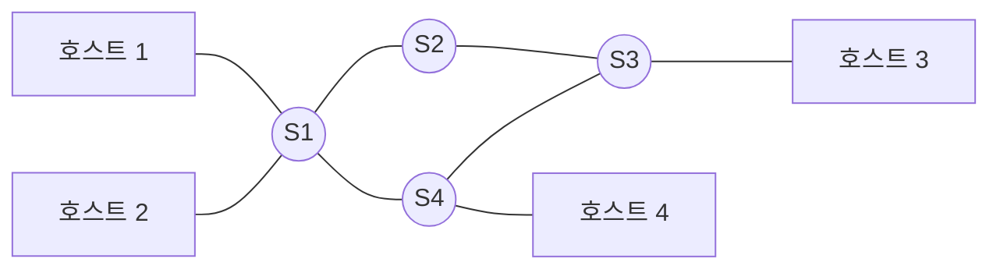



요약

모든 도시 사이에 직통 트럭을 두지 않고 허브 터미널을 거쳐 짐을 옮기는 택배처럼, 기기 사이에 중계 장치를 두고 여러 번 거쳐 전달하는 연결이다. 기기가 많고 멀리 떨어져도 선을 무한정 늘리지 않고 이을 수 있다. 대신 중계 장치마다 받은 데이터를 어디로, 어떤 방식으로 넘길지 정해야 한다.

## 예시로 보기

택배 회사는 각 도시의 짐을 허브 터미널로 모으고, 터미널끼리 옮긴 뒤 목적지 도시로 보낸다. 도시를 호스트(단말)로, 허브 터미널을 스위치로, 도로를 링크로 추상화한다. 슬라이드의 구름 그림에서 구름 안쪽 상자가 스위치, 바깥 상자가 호스트다[^2].

호스트 모음이 아래 정의의 $$V_h$$, 스위치 모음이 $$V_s$$다. "터미널을 거쳐 간다"가 "경로 위에 스위치가 하나 이상 있다"가 된다. 트럭 크기나 도로 길이는 버린다. 택배는 짐을 항상 터미널에 내려 두지만, 스위치는 방식에 따라 저장 없이 흘려보내기도 한다([회선 스위칭](/Hongs_Blog/studies/computer-communication/circuit-switching/)).

## 정의

정의

호스트 집합 $$V_h$$, 스위치 집합 $$V_s$$($$V_h \cap V_s = \varnothing$$), 링크 집합 $$E$$로 된 그래프 $$G = (V_h \cup V_s, E)$$를 생각하자. 두 호스트 $$h_1, h_2 \in V_h$$ 사이의 통신은 경로

$$h_1,\ v_1,\ v_2,\ \dots,\ v_k,\ h_2 \qquad (k \ge 1,\ v_i \in V_s)$$

를 따라 전달된다. 사이에 스위치가 적어도 하나 있다는 점($$k \ge 1$$)이 직접 링크와 다르다.

스위치는 보는 관점에 따라 노드이기도 하고 링크이기도 하다[^1][^s1].

- 네트워크 안에서 보면 스위치는 링크 여러 개가 만나는 노드다.
- 양 끝 호스트에서 보면 스위칭 네트워크 전체(구름)가 나와 상대를 잇는 하나의 링크처럼 보인다. 구름 그림은 안쪽을 가리고 "연결해 주는 것"으로만 보는 표현이다. 이 관점을 되풀이하면 [인터네트워크](/Hongs_Blog/studies/computer-communication/internetwork/)가 된다.

## 예제

- 해당하는 예: 전화망(교환기가 회선을 이어 줌)[^3], 인터넷(라우터가 패킷을 전달)[^4], 모든 PC가 스위치에 붙은 건물 이더넷[^s2]
- 해당하지 않는 예: 두 PC를 케이블 하나로 직접 이은 것([점대점 링크](/Hongs_Blog/studies/computer-communication/point-to-point-link/)), 여러 기기가 버스 하나에 붙은 것([다중 접근 링크](/Hongs_Blog/studies/computer-communication/multiple-access-link/), 중계 노드 없음)
- 링크 수: 호스트 6개를 스위치 2개에 3개씩 붙이고 스위치끼리 이으면 링크 7개다. 완전 연결은 15개다.

검증: 링크 수 7 vs 15 — [01_point-to-point-link_verify.py](/Hongs_Blog/studies/computer-communication/code/01_point-to-point-link_verify/)

## 활용

- 직접 연결은 거리와 노드 수가 늘면 선을 무한정 늘릴 수 없다. 스위치로 중계하면 호스트마다 링크 하나로 충분하다[^1].
- 스위치가 어느 링크로 넘길지 정하려면 [주소 지정](/Hongs_Blog/studies/computer-communication/addressing/)과 [라우팅](/Hongs_Blog/studies/computer-communication/routing/)이 필요하다.
- 스위치 하나가 고장 나면 그 스위치에만 붙은 호스트는 끊긴다. 스위치 사이 경로가 여럿이면 돌아갈 수 있다(위 그림의 S1–S2–S3와 S1–S4–S3)[^s2].

## 연결

- 선수: [점대점 링크](/Hongs_Blog/studies/computer-communication/point-to-point-link/)
- 이어지는 개념: 스위칭 방식 [회선 스위칭](/Hongs_Blog/studies/computer-communication/circuit-switching/)과 [패킷 스위칭](/Hongs_Blog/studies/computer-communication/packet-switching/), 확장 [인터네트워크](/Hongs_Blog/studies/computer-communication/internetwork/)

## 확인 문제

<b>C1</b> 간접 연결이 필요해진 이유 두 가지(필기 기준)와, 이를 해결하는 장치의 이름을 쓰라.

**답:** 거리가 늘어나는 것과 노드 수 $$n$$이 늘어나는 것 때문에 직접 연결의 선을 무한정 늘릴 수 없다. 중간에 중계 장치인 스위치를 둔다.

<b>C2</b> 호스트 6개를 스위치 2개에 3개씩 붙이고 두 스위치를 링크 하나로 이은 그림을 그려라. 필요한 링크 수를 완전 연결과 비교하라.

**답:** S1에 H1~H3, S2에 H4~H6, S1–S2 연결. 링크는 호스트 링크 6개와 스위치 사이 1개로 7개다. 완전 연결은 $$6 \cdot 5 / 2 = 15$$개. 
**흔한 오답:** 스위치 사이 링크를 빼고 6개로 세는 것.

<b>C3</b> 필기의 "스위치는 스위치이자, 노드이자, 링크이기도 하다(관점의 차이)"를 두 관점으로 설명하라.

**답:** 네트워크 안에서 보면 스위치는 링크들이 만나는 노드다. 양 끝 호스트에서 보면 스위치들로 된 네트워크 전체가 두 호스트를 잇는 하나의 링크처럼 보인다. 슬라이드의 구름이 이 관점이다.

[^1]: 4-1학기/컴퓨터 통신/2.필기노트/01.1주차.md, 25~29행(간접 연결), 57~58행(스위치의 관점)
[^2]: 4-1학기/pasted_images/Pasted image 20260924190531.png — 슬라이드 "간접 연결: Switched Networking"
[^3]: 4-1학기/pasted_images/Pasted image 20260924200141.png — 슬라이드 "간접 연결 방법: 스위칭 정책", 회선 스위칭: 전화 네트워크
[^4]: 4-1학기/pasted_images/Pasted image 20260924201830.png — 슬라이드 "패킷 스위칭: 인터넷/우편"
[^s1]: 에이전트 보충. 필기의 "관점의 차이"를 두 관점으로 푼 것은 해석이다. 구름을 링크 하나로 보는 관점은 Peterson & Davie, *Computer Networks: A Systems Approach*, 1.2절의 구름 표기와 같다.
[^s2]: 에이전트 보충. 건물 이더넷 예와 고장 시나리오는 원본에 없다.

