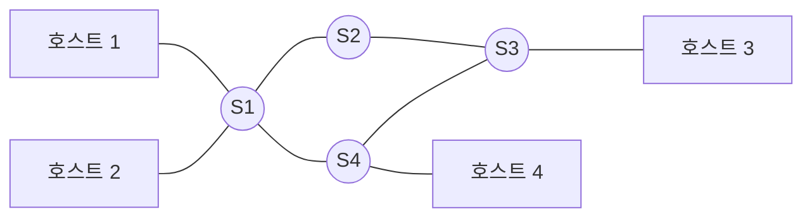



요약

택배는 서울에서 부산으로 직통 트럭을 보내지 않는다. 짐을 허브 터미널에 모았다가 갈 곳별로 나눠 보낸다. 컴퓨터도 서로 직접 선으로 잇지 않고, 중간의 중계 장치(스위치)를 거쳐 데이터를 보낼 수 있다. 이렇게 하면 컴퓨터가 많고 멀리 떨어져 있어도 선이 끝없이 늘지 않는다. 대신 스위치는 받은 데이터를 어느 쪽으로, 어떤 방식으로 넘길지 매번 정해야 한다.

## 예시로 보기

컴퓨터 몇 대를 모두 서로 직접 이으면 선이 얼마나 필요할까? $$n$$대면 $$n(n-1)/2$$개다. 4대면 6개라 괜찮지만, 100대면 4,950개다[^s3]. 기기가 늘수록 선을 감당할 수 없다[^1]. 그래서 중간에 거쳐 가는 장치를 둔다.

택배에 빗대면 각 도시가 컴퓨터, 허브 터미널이 스위치, 도로가 선이다. 네트워크에서는 데이터를 보내고 받는 끝쪽 컴퓨터를 호스트, 컴퓨터와 스위치를 잇는 선 하나하나를 링크라 부른다. 슬라이드의 구름 그림에서 구름 안쪽 상자가 스위치, 바깥 상자가 호스트다[^2].

호스트 1이 호스트 3에게 보내면 데이터는 S1 → S2 → S3(또는 S1 → S4 → S3)를 거쳐 간다. 비유가 맞지 않는 곳도 있다. 택배는 짐을 늘 터미널에 내려놓았다가 다시 싣는다. 스위치는 방식에 따라 데이터를 쌓아 두지 않고 그대로 흘려보내기도 한다([회선 스위칭](/Hongs_Blog/studies/computer-communication/circuit-switching/)).

## 직접 연결과 다른 점

두 호스트 사이에 스위치가 **적어도 하나** 끼어 있다. 데이터는 스위치를 한 번 이상 거쳐서 간다. 이것 하나가 직접 연결([점대점 링크](/Hongs_Blog/studies/computer-communication/point-to-point-link/))과 다른 점이다.

기호로 쓰면

호스트 집합 $$V_h$$, 스위치 집합 $$V_s$$($$V_h \cap V_s = \varnothing$$, 둘은 겹치지 않는다), 링크 집합 $$E$$로 된 그래프 $$G = (V_h \cup V_s, E)$$를 생각하자. 두 호스트 $$h_1, h_2 \in V_h$$($$\in$$은 "~에 속한다") 사이의 통신은 경로

$$h_1,\ v_1,\ v_2,\ \dots,\ v_k,\ h_2 \qquad (k \ge 1,\ v_i \in V_s)$$

를 따라 간다. $$k \ge 1$$이 "스위치가 적어도 하나"라는 뜻이다.

그럼 스위치를 거치는 횟수는 적을수록 좋을까? 대체로 그렇다. 스위치를 하나 거칠 때마다 데이터를 받아서 다시 보내는 시간이 더해진다[^s3]. 얼마나 더해지는지는 [패킷 스위칭](/Hongs_Blog/studies/computer-communication/packet-switching/)에서 계산한다.

스위치는 어디서 보느냐에 따라 다르게 보인다[^1][^s1].

- 네트워크 안에서 보면 스위치는 선 여러 개가 모이는 갈림길이다.
- 양 끝 호스트에서 보면 안쪽의 스위치들은 보이지 않는다. 나와 상대를 잇는 긴 선 하나처럼 보일 뿐이다. 슬라이드가 안쪽을 구름으로 가려 그린 것이 이 모습이다. 이렇게 "네트워크 전체를 선 하나로 보기"를 한 번 더 하면 네트워크끼리 잇는 [인터네트워크](/Hongs_Blog/studies/computer-communication/internetwork/)가 된다.

## 예제

- 스위칭 네트워크인 것: 전화망(교환기가 통화 선을 이어 준다)[^3], 인터넷(라우터가 데이터 묶음을 넘겨준다)[^4], 모든 PC가 스위치에 꽂힌 건물 안 이더넷[^s2]
- 아닌 것: 두 PC를 케이블 하나로 바로 이은 것([점대점 링크](/Hongs_Blog/studies/computer-communication/point-to-point-link/)), 여러 기기가 선 하나를 같이 쓰는 것([다중 접근 링크](/Hongs_Blog/studies/computer-communication/multiple-access-link/)). 둘 다 중간에 거쳐 가는 장치가 없다.
- 선 개수 세기: 호스트 6대를 스위치 2대에 3대씩 꽂고 두 스위치를 이으면 선이 7개다. 6대를 서로 다 직접 이으면 15개가 필요하다.

검증: 링크 수 7 vs 15 — [01_point-to-point-link_verify.py](/Hongs_Blog/studies/computer-communication/code/01_point-to-point-link_verify/)

## 활용

- 직접 연결은 거리가 멀어지고 기기가 많아지면 선을 감당할 수 없다. 스위치로 중계하면 호스트마다 선 하나면 된다[^1].
- 스위치가 어느 선으로 넘길지 정하려면 받는 쪽의 주소([주소 지정](/Hongs_Blog/studies/computer-communication/addressing/))와 길 찾기([라우팅](/Hongs_Blog/studies/computer-communication/routing/))가 필요하다.
- 스위치 하나가 고장 나면, 그 스위치에만 꽂힌 호스트는 끊긴다. 스위치 사이에 길이 여러 개면 다른 길로 돌아갈 수 있다(위 그림의 S1–S2–S3와 S1–S4–S3)[^s2].

## 연결

- 선수: [점대점 링크](/Hongs_Blog/studies/computer-communication/point-to-point-link/)
- 이어지는 개념: 스위치가 데이터를 넘기는 두 방식 [회선 스위칭](/Hongs_Blog/studies/computer-communication/circuit-switching/)과 [패킷 스위칭](/Hongs_Blog/studies/computer-communication/packet-switching/), 더 크게 넓힌 [인터네트워크](/Hongs_Blog/studies/computer-communication/internetwork/)

## 확인 문제

<b>C1</b> 직접 잇지 않고 중간을 거쳐 연결해야 하는 이유 두 가지(필기 기준)와, 중간에 두는 장치의 이름을 쓰라.

**답:** 거리가 멀어지고, 기기 수 $$n$$이 늘어나면 직접 잇는 선을 끝없이 늘릴 수 없다. 그래서 중간에 중계 장치인 스위치를 둔다.

<b>C2</b> 호스트 6개를 스위치 2개에 3개씩 붙이고 두 스위치를 링크 하나로 이은 그림을 그려라. 필요한 링크 수를 완전 연결과 비교하라.

**답:** S1에 H1~H3, S2에 H4~H6, S1–S2 연결. 링크는 호스트 쪽 6개와 스위치 사이 1개로 7개다. 서로 다 직접 이으면 $$6 \cdot 5 / 2 = 15$$개. 
**흔한 오답:** 스위치 사이 링크를 빼고 6개로 세는 것.

<b>C3</b> 필기의 "스위치는 스위치이자, 노드이자, 링크이기도 하다(관점의 차이)"를 두 자리에서 본 모습으로 설명하라.

**답:** 네트워크 안에서 보면 스위치는 선 여러 개가 모이는 갈림길(노드)이다. 양 끝 호스트에서 보면 스위치들로 된 네트워크 전체가 두 호스트를 잇는 선 하나(링크)처럼 보인다. 슬라이드의 구름 그림이 이 모습이다.

[^1]: 4-1학기/컴퓨터 통신/2.필기노트/01.1주차.md, 25~29행(간접 연결), 57~58행(스위치의 관점)
[^2]: 4-1학기/pasted_images/Pasted image 20260924190531.png — 슬라이드 "간접 연결: Switched Networking"
[^3]: 4-1학기/pasted_images/Pasted image 20260924200141.png — 슬라이드 "간접 연결 방법: 스위칭 정책", 회선 스위칭: 전화 네트워크
[^4]: 4-1학기/pasted_images/Pasted image 20260924201830.png — 슬라이드 "패킷 스위칭: 인터넷/우편"
[^s1]: 에이전트 보충. 필기의 "관점의 차이"를 두 자리에서 본 모습으로 푼 것은 해석이다. 네트워크 전체를 구름(링크 하나)으로 그리는 방식은 Peterson & Davie, *Computer Networks: A Systems Approach*, 1.2절의 구름 표기와 같다.
[^s2]: 에이전트 보충. 건물 이더넷 예와 고장 시나리오는 원본에 없다.
[^s3]: 에이전트 보충. 선 개수는 직접 연결 공식 $$n(n-1)/2$$에 $$n = 4, 100$$을 넣어 계산했다. 거칠 때마다 시간이 더해진다는 설명은 패킷 스위칭 문서의 저장 후 전달 지연($$H$$개 링크면 $$H \cdot L/R$$)에 근거한다. 회선 스위칭처럼 저장 없이 흘려보내는 방식에서는 더해지는 시간이 훨씬 작다.

