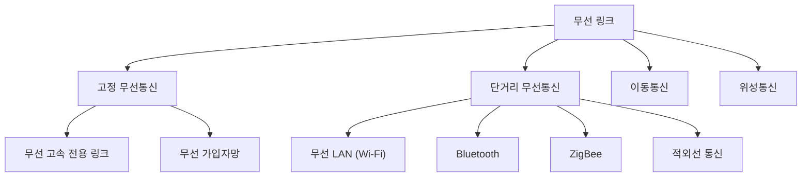



요약

무선 링크는 선 대신 공기를 쓴다. 선을 깔 필요가 없어서 들고 다니며 쓸 수 있고, 설치 없이 바로 쓸 수 있다. 대신 신호가 사방으로 퍼져서 가까운 링크끼리 간섭하고, 벽에 튕긴 신호가 여러 길로 조금씩 늦게 도착해 섞인다. 그래서 전파 사용을 허가제로 관리하고, 신호는 주로 아날로그 파형을 쓴다.

## 예시로 보기

카페에서 노트북이 와이파이 공유기와 통신한다. 전파의 일부는 곧장 가고, 일부는 벽에 튕겨 300 m 더 돌아간 뒤 도착한다고 하자. 튕긴 신호는 $$300 / (3.0 \times 10^8) = 1$$ μs 늦다[^s1].

| 전송률 | 비트 폭 | 1 μs 늦은 반사파가 겹치는 범위 |
|---|---|---|
| 0.1 Mbps | 10 μs | 같은 비트의 뒤쪽 10% |
| 1 Mbps | 1 μs | 다음 비트 하나 전체 |
| 10 Mbps | 0.1 μs | 뒤 비트 10개 |

같은 반사라도 전송률이 높을수록 여러 비트에 겹친다. 속도가 올라 비트 폭이 줄면 신호가 겹쳐 간섭이 심해진다는 필기의 설명이 이것이다[^1]. 이것을 다중 경로 문제라 부른다. 신호가 여러 길로 와서 생기는 문제라는 뜻이다.

두 그림 모두 곧장 온 신호(파란 선)에 60% 세기의 반사파가 1 μs 늦게 더해졌다. 0.1 Mbps(위)에서는 비트가 바뀌는 자리마다 칸의 10%만 흐트러지고, 칸 가운데는 깨끗하다. 10 Mbps(아래)에서는 10칸 앞의 비트가 칸 전체에 겹친다. 그래서 같은 1이라도 칸마다 높이가 달라지고, 낮아진 칸은 잡음이 조금만 더해져도 반대 비트로 읽히기 쉽다[^s2].

검증: 1 μs, 표의 겹침, 고정 무선 가입자망의 150 Mbit/s와 약 201 km² — [34_wireless-links_verify.py](/Hongs_Blog/studies/computer-communication/code/34_wireless-links_verify/)

## 정의

| 장점 | 단점 |
|---|---|
| 고정된 링크가 없다. 이동성을 지원한다 | 신호가 공중으로 퍼져 나간다 |
| 즉시 쓸 수 있다 (선을 깔 필요가 없다) | 고주파와 저주파의 특성이 다르다 |
| | 인접한 링크 사이에 간섭이 일어날 수 있다. 그래서 전파 사용에 규제가 필요하다(라이선스 제도) |
| | 다중 경로 문제 |

신호는 아날로그를 주로 쓴다. 디지털 신호는 쓰기 어렵다[^2].

무선 링크를 쓰임새로 나누면 다음과 같다.

고정 무선통신과 단거리 무선통신은 이 문서에서, 이동통신과 위성통신은 따로 다룬다[^s3].

**고정 무선통신.** 무선의 두 번째 장점(즉시 사용)을 살린다[^3][^1].
- 무선 고속 전용 링크: 본사와 지점 사이에 국경이 있어 선을 깔기 어려우면, 두 건물 사이에 무선 링크를 연다.
- 무선 가입자망: 가입자의 링크를 무선으로 만든다. 슬라이드의 기지국은 반경 8 km를 72° 부채꼴(섹터)로 나누고, 섹터마다 30 Mbit/s를 준다. 안테나의 방향성으로 공간을 나눠 같은 주파수를 섹터마다 다시 쓴다. 섹터가 5개이므로 기지국 하나가 모두 150 Mbit/s, 약 201 km²를 맡는다[^s1].

**단거리 무선통신.** 누구나 허가 없이 쓸 수 있는 공용 대역을 쓴다[^4]. 라이선스가 없어서 누구든 쓸 수 있고 소비자층이 크지만, 간섭이 생길 수 있다[^1].

| 기술 | 범위 | 속도 (슬라이드 그림) |
|---|---|---|
| 무선 LAN (Wi-Fi, IEEE 802.11b/a/g) | LAN (넓은 쪽) | 인터넷~다채널 영상 |
| Bluetooth | PAN (좁은 쪽) | 인터넷~스트리밍 영상 |
| ZigBee (IEEE 802.15.4) | PAN | 텍스트~인터넷 (가장 느림) |
| 적외선 통신 | | 요즘은 잘 쓰지 않는다[^1] |

넓은 순서로 WAN(Wide Area Network), LAN(Local Area Network), PAN(Personal Area Network)이다[^4].

## 연결

- 선수: [신호와 변조](/Hongs_Blog/studies/computer-communication/signal-and-modulation/)(주파수)
- 공기는 모두가 함께 쓰는 매체라 [다중 접근 링크](/Hongs_Blog/studies/computer-communication/multiple-access-link/)다. 여럿이 동시에 보내면 간섭(충돌)이 생긴다.
- 셀로 나눈 무선: [이동통신](/Hongs_Blog/studies/computer-communication/cellular-networks/). 하늘의 중계기: [위성통신](/Hongs_Blog/studies/computer-communication/satellite-systems/)

## 확인 문제

<b>C1</b> 슬라이드가 든 무선 링크의 장점 두 가지와 단점 네 가지를 쓰라. 전파 사용에 라이선스 제도가 필요한 이유는?

**답:** 장점: 이동성 지원, 즉시 사용 가능. 단점: 공중으로 퍼져 나감, 고주파와 저주파의 특성 차이, 인접 링크 사이의 간섭, 다중 경로 문제. 인접한 링크가 같은 주파수를 쓰면 서로 간섭하므로, 누가 어느 주파수를 쓸지 규제해야 한다.

<b>C2</b> 같은 반사 환경에서 전송률을 높이면 다중 경로 문제가 왜 더 심해지는가? 수치 예를 들어 설명하라.

**답:** 반사파가 늦게 도착하는 시간은 경로의 길이 차로 정해지고 전송률과 무관하다. 전송률을 높이면 비트 폭(1 ÷ 전송률)이 줄어서, 같은 늦음이 더 많은 비트에 겹친다. 예: 1 μs 늦은 반사파는 0.1 Mbps(비트 폭 10 μs)에서는 한 비트의 10%에만 겹치지만, 10 Mbps(0.1 μs)에서는 뒤 비트 10개에 겹친다[^s1].

<b>C3</b> 다음에는 Wi-Fi, Bluetooth, ZigBee 중 무엇이 맞는가? (a) 스마트 전구의 켜짐·꺼짐 센서, 건전지로 몇 년 (b) 무선 이어폰 (c) 노트북으로 고화질 영상 스트리밍

**답:** (a) ZigBee. 텍스트 수준의 아주 느린 속도로 충분하고, 짧은 거리(PAN)다. (b) Bluetooth. 개인 주변(PAN)에서 음악 정도의 속도다. (c) Wi-Fi. LAN 범위에서 가장 빠른 속도가 필요하다.

[^1]: 컴퓨터 통신 4회 필기 「4주차」, 53~65행, 84~93행, 103~110행
[^2]: 수업 슬라이드 캡처 — 슬라이드 "무선 링크 (Wireless Links): 일반"
[^3]: 수업 슬라이드 캡처 — 슬라이드 "고정 무선통신(Wireless Fixed links)". 기지국 그림: 8 km, 72°, 30 Mbit/s per sector
[^4]: 수업 슬라이드 캡처 — 슬라이드 "단거리 무선통신(Short Range)"
[^s1]: 보충 카페 예, 300 m와 1 μs, 비트 폭 표, 기지국당 150 Mbit/s와 면적은 원본에 없다. 슬라이드의 수치(72°, 30 Mbit/s, 8 km)와 비트 폭 = 1 ÷ 전송률(전송 속도와 대역폭 문서)에서 나온 계산이다.
[^s2]: 보충 그림 한 장은 원본에 없다. 반사파의 세기 60%와 비트열은 설명용 가정이다. [34_wireless-links_plot.py](/Hongs_Blog/studies/computer-communication/code/34_wireless-links_plot/)로 그렸고, 반사파 지연 1 μs가 0.1, 1, 10 Mbps에서 비트 0.1개, 1개, 10개 폭이라는 것과 0.1 Mbps에서는 칸 가운데의 부호가 보낸 비트와 모두 같다는 것을 같은 코드로 확인했다.
[^s3]: 보충 다이어그램 1개는 원본에 없다. 이 문서의 '고정 무선통신'·'단거리 무선통신' 절(슬라이드 "고정 무선통신(Wireless Fixed links)", "단거리 무선통신(Short Range)")과 '연결' 절의 이동통신·위성통신을 한 그림에 모았다. 위성통신 슬라이드도 같은 "무선 링크" 단원 아래에 있다.

