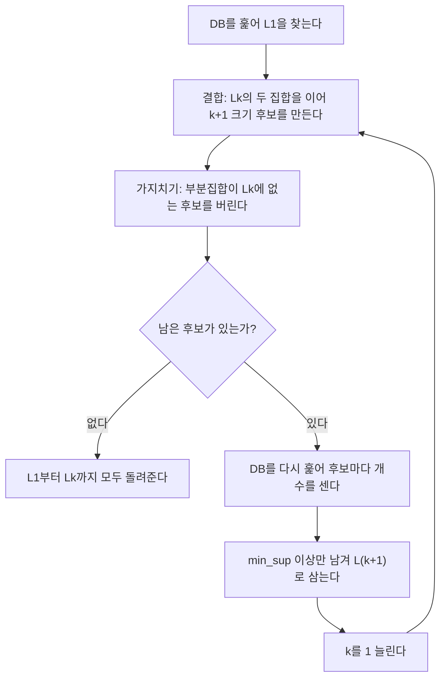


<div class="callout callout-summary" markdown="1">
<div class="callout-title callout-title--default" markdown="span">요약</div>

빈발 묶음을 작은 것부터 한 크기씩 키워 가며 찾는다. 핵심은 "빈발 묶음의 일부는 반드시 빈발"이라는 성질이다. 뒤집으면 일부라도 빈발이 아닌 묶음은 볼 필요가 없어서, 후보를 크게 줄인다. 대신 크기를 하나 키울 때마다 데이터 전체를 다시 훑어야 하고, 빈발 항목이 많으면 후보가 여전히 엄청나게 많아진다.

</div>


## 예시로 보기

물건이 6개면 2개짜리 묶음만 $$\binom62 = 15$$개, 모든 묶음은 63개다. 물건이 수천 개면 모든 묶음을 다 세는 것은 불가능하다. 그런데 {견과}가 빈발이 아니면 {견과, 무엇}은 볼 필요도 없다. 견과가 든 거래보다 많이 나타날 수 없기 때문이다[^1][^2].

거래 4개, 최소 지지 개수 2로 따라가 본다[^3]. $$C_k$$는 크기 $$k$$ 후보, $$L_k$$는 크기 $$k$$ 빈발 집합이다.

| 단계 | 하는 일 | 결과 |
|---|---|---|
| DB 1번째 훑기 | $$C_1$$ 세기 | A 2, B 3, C 3, D 1, E 3 |
| | 2 미만 버리기 | $$L_1$$ = {A, B, C, E} (D 탈락) |
| 후보 만들기 | $$L_1$$끼리 잇기 | $$C_2$$ = AB, AC, AE, BC, BE, CE (D가 든 묶음은 아예 안 만든다) |
| DB 2번째 훑기 | $$C_2$$ 세기 | AB 1, AC 2, AE 1, BC 2, BE 3, CE 2 |
| | 2 미만 버리기 | $$L_2$$ = {AC, BC, BE, CE} |
| 후보 만들기 | $$L_2$$끼리 잇기 + 가지치기 | $$C_3$$ = {BCE} |
| DB 3번째 훑기 | $$C_3$$ 세기 | BCE 2 → $$L_3$$ = {BCE} |
| 후보 만들기 | $$L_3$$ 하나로는 이을 짝이 없다 | 끝 |

| 거래 | 항목 |
|---|---|
| 10 | A, C, D |
| 20 | B, C, E |
| 30 | A, B, C, E |
| 40 | B, E |

<div class="callout callout-check" markdown="1">
<div class="callout-title" markdown="span">검증: 위 추적, 후보 생성 예(abcd만 남고 acde는 가지치기), 연습 1의 빈발 13개와 규칙, 무작위 자료 300개에서 모든 부분집합을 세는 방법과 일치 — [13_apriori_impl.py](/Hongs_Blog/studies/data-science/code/13_apriori_impl/)</div>

</div>


## 정의

**아프리오리 성질.** 빈발 항목 집합의 부분집합은 모두 빈발이다. 대우로 쓰면, 어떤 부분집합이 빈발이 아닌 집합은 빈발일 수 없다[^1]. 그래서 빈발이 아닌 집합의 상위 집합은 만들지도 않는다(가지치기 원리)[^2].

### 입출력과 의사코드

입력: 거래 DB $$D$$, 최소 지지 개수 min_sup. 출력: 모든 빈발 항목 집합과 그 지지 개수[^4].

```
L1 ← DB를 한 번 훑어 찾은 빈발 1-항목 집합
k ← 1
반복:
    C(k+1) ← 후보 생성(Lk)            # 결합 + 가지치기
    C(k+1)이 비면 멈춘다
    DB를 훑어 C(k+1)의 각 후보가 든 거래를 센다
    L(k+1) ← 지지 개수가 min_sup 이상인 후보
    k ← k + 1
L1 ∪ L2 ∪ ... 를 돌려준다
```



고리 한 바퀴가 묶음 크기 하나다. 가지치기 뒤 남은 후보가 없으면 고리를 빠져나온다[^s2].

**후보 생성**은 두 단계다. 항목은 정해진 순서(예: 알파벳)로 정렬해 둔다[^5][^6].

1. **결합:** $$L_k$$의 두 집합 $$p, q$$가 앞 $$k - 1$$개 항목이 같고 마지막 항목이 $$p$$ 쪽이 작으면, 합쳐 크기 $$k + 1$$ 후보를 만든다.
2. **가지치기:** 후보의 크기 $$k$$ 부분집합 중 하나라도 $$L_k$$에 없으면 버린다.

예: $$L_3$$ = {abc, abd, acd, ace, bcd}. 결합하면 abc + abd → abcd, acd + ace → acde다. abcd의 부분집합 abc, abd, acd, bcd는 모두 $$L_3$$에 있어 남는다. acde는 부분집합 ade, cde가 $$L_3$$에 없어 버린다. 남는 후보는 abcd 하나다[^5].

결합 조건에서 "앞 $$k-1$$개가 같다"를 요구하는 이유는 같은 후보를 여러 번 만들지 않기 위해서다. abc와 acd는 앞 2개(ab, ac)가 달라 잇지 않는다. 이을 수 있다면 abcd가 나오지만, abcd는 abc + abd에서 이미 나온다[^6].

### 정확성

**주장.** 후보 생성은 빈발인 크기 $$k + 1$$ 집합을 하나도 빠뜨리지 않는다. 그래서 Apriori는 모든 빈발 집합을 찾는다[^s1].

<details class="callout callout-proof" markdown="1">
<summary class="callout-title" markdown="span">증명 펼치기</summary>

1. **빈발 집합의 두 부분집합.** $$X = \{x_1 < \cdots < x_{k+1}\}$$이 빈발이라 하자. 마지막 항목을 뺀 $$p = X - \{x_{k+1}\}$$과 끝에서 두 번째 항목을 뺀 $$q = X - \{x_k\}$$는 $$X$$의 부분집합이다. — 정의
2. **둘 다 $$L_k$$에 있다.** 아프리오리 성질에 따라 $$p$$와 $$q$$는 빈발이다. 귀납 가정(모든 빈발 크기 $$k$$ 집합이 $$L_k$$에 있다)에 따라 $$L_k$$에 있다. — 아프리오리 성질, 귀납 가정
3. **결합된다.** $$p$$와 $$q$$는 앞 $$k - 1$$개($$x_1, \dots, x_{k-1}$$)가 같고 마지막이 $$x_k < x_{k+1}$$이다. 그래서 결합 단계가 $$p \cup q = X$$를 만든다. — 결합 조건
4. **가지치기에서 살아남는다.** $$X$$의 크기 $$k$$ 부분집합은 모두 빈발이라 $$L_k$$에 있다. — 아프리오리 성질
5. **세어서 남는다.** DB를 훑어 정확히 세므로 $$X$$는 $$L_{k+1}$$에 들어간다. 반대로 $$L_{k+1}$$에는 실제로 센 지지도가 min_sup 이상인 것만 들어가므로 빈발이 아닌 것은 없다. — 셈
6. $$L_1$$은 DB를 직접 세어 맞다. 수학적 귀납법으로 모든 $$k$$에서 $$L_k$$는 정확히 빈발 크기 $$k$$ 집합의 모임이다. ∎

</details>


### 스스로 설명해 보기

<details class="callout callout-question" markdown="1">
<summary class="callout-title" markdown="span">1. 3단계에서 $$p$$와 $$q$$를 "마지막 항목을 뺀 것"과 "끝에서 두 번째 항목을 뺀 것"으로 고른 이유</summary>

결합 조건이 "앞 $$k-1$$개가 같고 마지막만 다르다"이기 때문이다. 이 두 부분집합이 바로 그 조건을 만족하는 짝이다. 다른 두 부분집합을 고르면 앞부분이 달라 결합 단계가 잇지 않는다.

</details>


<details class="callout callout-question" markdown="1">
<summary class="callout-title" markdown="span">2. 4단계 가지치기가 빈발 집합을 잘못 버리지 않는 이유</summary>

가지치기는 "크기 $$k$$ 부분집합 중 $$L_k$$에 없는 것이 있으면" 버린다. 빈발 집합은 아프리오리 성질에 따라 모든 부분집합이 빈발이고, 귀납 가정에 따라 모두 $$L_k$$에 있다. 그래서 버려질 조건에 걸리지 않는다.

</details>


<details class="callout callout-question" markdown="1">
<summary class="callout-title" markdown="span">3. 가지치기를 빼도 결과는 맞는가?</summary>

맞다. 가지치기는 셀 후보 수만 줄인다. 빼면 빈발이 아닌 후보를 더 세게 될 뿐, 셈 단계(5단계)에서 걸러진다. 가지치기는 정확성이 아니라 속도를 위한 것이다.

</details>


<details class="callout callout-question" markdown="1">
<summary class="callout-title" markdown="span">이 증명의 핵심 아이디어는?</summary>

빈발 집합은 "자기보다 하나 작은 빈발 집합 둘"로 반드시 만들어진다. 그래서 작은 크기부터 정확히 찾아 두면, 다음 크기의 빈발 집합은 그것들만 조합해도 빠짐없이 나온다.

</details>


<details class="callout callout-question" markdown="1">
<summary class="callout-title" markdown="span">이 방법을 쓸 수 있는 다른 상황은?</summary>

"부분이 조건을 어기면 전체도 어긴다"는 성질(아래로 닫힘)이 있는 모든 탐색. 예: 백트래킹에서 부분해가 조건을 어기면 그 가지를 더 내려가지 않는 것, 동적 계획법에서 작은 부분 문제의 답으로 큰 문제를 짓는 것.

</details>


### 실행 추적: 규칙 만들기까지

3-4 풀이의 연습 1(거래 9개, min_sup 2, min_conf 50%)을 끝까지 돈다[^7].

| 단계 | 결과 |
|---|---|
| $$L_1$$ | A 6, B 7, C 6, D 2, E 2 |
| $$C_2$$ | 10개 (AB, AC, AD, AE, BC, BD, BE, CD, CE, DE) |
| $$L_2$$ | AB 4, AC 4, AE 2, BC 4, BD 2, BE 2 (AD 1, CD 0, CE 1, DE 0 탈락) |
| $$C_3$$ | ABC, ABE (BCD 등은 CD가 $$L_2$$에 없어 가지치기) |
| $$L_3$$ | ABC 2, ABE 2 |
| $$C_4$$ | ABCE를 결합으로 만들지만 ACE, BCE가 $$L_3$$에 없어 가지치기 → 끝 |

가장 긴 빈발 집합 ABC와 ABE에서 규칙을 만든다(min_conf 50%).

| 규칙 | 신뢰도 | | 규칙 | 신뢰도 |
|---|---|---|---|---|
| A → BC | 2/6 = 33% | | A → BE | 2/6 = 33% |
| B → AC | 2/7 = 28.6% | | B → AE | 2/7 = 28.6% |
| C → AB | 2/6 = 33% | | E → AB | 2/2 = 100% |
| AB → C | 2/4 = 50% | | AB → E | 2/4 = 50% |
| AC → B | 2/4 = 50% | | AE → B | 2/2 = 100% |
| BC → A | 2/4 = 50% | | BE → A | 2/2 = 100% |

50% 이상인 규칙만 강한 규칙이다.

### 복잡도

- **DB 훑기:** 가장 긴 빈발 집합의 크기가 $$K$$면 약 $$K$$번(위 예는 3번). 크기마다 한 번씩 훑는다[^8].
- **후보 수:** 빈발 1-항목이 $$m$$개면 $$C_2$$만 $$\binom{m}{2}$$개다. 빈발 항목이 $$10^4$$개면 $$C_2$$가 약 $$5 \times 10^7$$개다[^s1].
- **메모리:** 후보와 그 개수를 모두 들고 있어야 해 많이 쓴다[^8].

## 활용

- 구현: [13_apriori_impl.py](/Hongs_Blog/studies/data-science/code/13_apriori_impl/) (후보 생성, 규칙 만들기, 무식한 방법과의 비교 테스트)
- 연습: [Apriori 예제 사다리](/Hongs_Blog/studies/data-science/apriori-ladder/)
- 한계: 후보가 아주 많이 생기고(너비 우선 탐색), 후보를 셀 때마다 DB 전체를 다시 훑는다[^8]. 이를 피하는 방법이 [ECLAT](/Hongs_Blog/studies/data-science/eclat/)(DB를 한 번만 읽고 교집합으로 센다)과 [FP-Growth](/Hongs_Blog/studies/data-science/fp-growth/)(후보를 만들지 않는다)다.
- 흔한 실수: $$C_{k+1}$$을 만들 때 가지치기를 잊고 $$L_k$$의 아무 두 집합이나 합치는 것. 결과는 맞지만 후보가 불필요하게 많아지고, 크기가 $$k + 2$$인 집합이 섞일 수 있다.

## 연결

- 선수: [빈발 패턴](/Hongs_Blog/studies/data-science/frequent-patterns/), [연관 규칙](/Hongs_Blog/studies/data-science/association-rules/)
- 한 크기씩 넓혀 가는 탐색은 [너비 우선 탐색](/Hongs_Blog/studies/algorithms/bfs/)과 같은 순서다.
- 세 방법 비교: [빈발 패턴 마이닝 방법 비교](/Hongs_Blog/studies/data-science/contrast--fp-mining-methods/)

## 자주 하는 오해

<div class="callout callout-misconception" markdown="1">
<div class="callout-title" markdown="span">"Apriori는 빈발이 아닌 후보를 아예 세지 않는다"</div>

아니다. 가지치기는 "부분집합 중 빈발이 아닌 것이 있다"고 이미 알려진 후보만 버린다. 모든 부분집합이 빈발이어도 자기 자신은 빈발이 아닐 수 있고, 그런 후보는 DB를 훑어 세어 봐야 안다. 예시에서 AB는 A, B가 모두 빈발이라 $$C_2$$에 들어갔지만 실제로 세어 보니 지지 개수 1이라 탈락했다. 가지치기는 셀 양을 줄일 뿐 세는 일을 없애지 않는다.

</div>


## 확인 문제

<details class="callout callout-question" markdown="1">
<summary class="callout-title" markdown="span">**C1** 아프리오리 성질을 쓰고, 그것이 후보 생성의 어느 단계에서 어떻게 쓰이는지 말하라.</summary>

**답:** 빈발 집합의 모든 부분집합은 빈발이다. 가지치기 단계에서, 크기 $$k$$ 부분집합 중 하나라도 $$L_k$$에 없는 크기 $$k + 1$$ 후보를 버리는 데 쓴다.

</details>


<details class="callout callout-question" markdown="1">
<summary class="callout-title" markdown="span">**C2** $$L_2$$ = {AC, BC, BE, CE}에서 $$C_3$$을 만들라. 결합으로 나오는 후보와 가지치기로 버려지는 후보를 모두 쓰라.</summary>

**답:** 앞 1개가 같은 짝: BC + BE → BCE. (AC는 앞이 A인 짝이 없고, CE는 앞이 C인 짝이 없다.) BCE의 부분집합 BC, BE, CE가 모두 $$L_2$$에 있어 남는다. $$C_3$$ = {BCE}. 버려지는 후보는 없다.

</details>


<details class="callout callout-question" markdown="1">
<summary class="callout-title" markdown="span">**C3** 아래 의사코드가 하는 일을 한 문장으로 쓰라.</summary>

```
for p in Lk: for q in Lk:
    if p[:k-1] == q[:k-1] and p[k-1] < q[k-1]:
        c = p ∪ q
        if 모든 크기 k 부분집합 s of c 가 Lk에 있다: C(k+1)에 c를 넣는다
```
**답:** 앞 $$k-1$$개가 같은 빈발 $$k$$-집합 둘을 이어 $$k+1$$ 크기 후보를 중복 없이 만들고, 빈발이 아닌 부분집합을 가진 후보는 버린다.

</details>


<details class="callout callout-question" markdown="1">
<summary class="callout-title" markdown="span">**C4** 증명 3단계에서 빈발 집합 $$X = \{x_1 < \dots < x_{k+1}\}$$이 결합 단계에서 반드시 만들어지는 이유를 대라.</summary>

**답:** $$X$$에서 마지막 항목을 뺀 집합과 끝에서 두 번째 항목을 뺀 집합은 둘 다 $$X$$의 부분집합이라 빈발이고 $$L_k$$에 있다. 둘은 앞 $$k-1$$개가 같고 마지막 항목만 $$x_k < x_{k+1}$$로 달라 결합 조건을 만족한다. 합치면 $$X$$다.

</details>


<details class="callout callout-question" markdown="1">
<summary class="callout-title" markdown="span">**C5** Apriori가 DB를 여러 번 훑어야 하는 이유는? 가장 긴 빈발 집합의 크기가 10이면 대략 몇 번 훑는가?</summary>

**답:** 크기 $$k + 1$$ 후보는 크기 $$k$$의 결과가 나와야 만들 수 있고, 후보의 개수는 DB를 훑어 세야 안다. 그래서 크기마다 한 번씩 훑는다. 크기 10이면 약 10번(마지막 후보가 비지 않으면 한 번 더)이다.

</details>


[^1]: 데이터 과학 3회 강의 자료 「3-1_FP」, p.17 (Agrawal & Srikant, VLDB 1994)
[^2]: 같은 자료, p.18
[^3]: 같은 자료, p.20
[^4]: 같은 자료, p.19
[^5]: 같은 자료, p.21
[^6]: 같은 자료, p.22
[^7]: 데이터 과학 3회 강의 자료 「3-4-solutions」, p.1~2 (3-1 p.24 연습 1의 풀이). 풀이는 B → AC를 28.5%로 적는다. 2/7 = 28.57%라 반올림하면 28.6%다
[^8]: 데이터 과학 3회 강의 자료 「3-1_FP」, p.25, p.39
[^s1]: <span class="fn-tag" title="수업 자료에 없고 따로 보탠 내용">보충</span> 정확성 증명, 스스로 설명해 보기, 후보 수 예, 오해 항목, 카드 C2~C5는 원본에 없다. 구현 코드가 무작위 자료 300개에서 모든 부분집합을 세는 방법과 같은 결과를 냈다.
[^s2]: <span class="fn-tag" title="수업 자료에 없고 따로 보탠 내용">보충</span> 다이어그램 1개는 원본에 없다. 문서의 의사코드와 후보 생성 두 단계(원본 3-1 p.19~22)를 근거로 그렸다.

