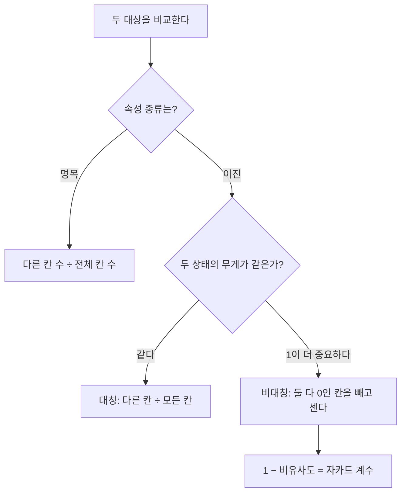



요약

이름표로 된 속성끼리는 빼기를 할 수 없으니, 두 대상이 몇 칸에서 같은 값을 가졌는지 세어 비슷함을 잰다. 다른 칸이 많을수록 덜 비슷하다. 그런데 "둘 다 없음"까지 같다고 세면 문제가 생긴다. 드문 병의 검사처럼 0이 대부분인 자료에서는 거의 모든 사람이 서로 비슷하게 나오므로, 그런 자료에서는 "둘 다 0"인 칸을 빼고 센다(자카드 계수).

## 예시로 보기

군집화나 이상치 찾기는 "두 대상이 얼마나 다른가"를 수로 잴 수 있어야 시작할 수 있다[^1]. 숫자 속성이면 빼서 재지만, 머리색이나 학년은 뺄 수 없다.

슬라이드의 두 학생을 속성 7개로 비교한다[^2].

| | 1 | 2 | 3 | 4 | 5 | 6 | 7 |
|---|---|---|---|---|---|---|---|
| 객체 2 | Black | Student | A | B | C | D | E |
| 객체 3 | Black | Student | A | V | C | D | F |

같은 칸이 5개, 다른 칸이 2개다. 그래서 비유사도는 $$\frac{7 - 5}{7} = \frac27$$, 유사도는 $$1 - \frac27 = \frac57$$이다.

이번에는 검사 6개(1 = 양성)를 받은 두 환자를 비교한다. 대부분의 검사가 둘 다 음성이다.

| | 열 | 기침 | 검사 1 | 검사 2 | 검사 3 | 검사 4 |
|---|---|---|---|---|---|---|
| Jack | 1 | 0 | 1 | 0 | 0 | 0 |
| Jim | 1 | 1 | 0 | 0 | 0 | 0 |

모든 칸을 똑같이 세면 6칸 중 2칸이 달라 비유사도가 $$\frac26$$이다. 그런데 둘이 같은 이유의 대부분은 "둘 다 그 병이 없다"는 것이다. 건강한 두 사람은 이 방식으로 완전히 같다고 나온다. "둘 다 음성"인 3칸을 빼면 비유사도는 $$\frac23$$이 된다[^s1].

검증: 슬라이드 $$\frac27$$, 환자 예 0.33·0.67·0.75, 둘 다 0인 칸을 늘려도 비대칭 비유사도는 그대로, 카드 C2 — [03_categorical-dissimilarity_verify.py](/Hongs_Blog/studies/data-science/code/03_categorical-dissimilarity_verify/)

## 정의

$$n$$개 대상을 $$p$$개 속성으로 적은 표(대상 × 속성)를 데이터 행렬이라 한다. 모든 대상 쌍의 비유사도 $$d(i, j)$$를 모은 표(대상 × 대상)를 비유사도 행렬이라 한다. 두 대상이 비슷할수록 $$d(i, j)$$는 0에 가깝고, $$d(i, j) = d(j, i)$$라 행렬은 대칭이다. 유사도는 $$\operatorname{sim}(i, j) = 1 - d(i, j)$$로 쓴다[^1].

**명목 속성.** $$p$$(속성 수) 중 $$m$$(같은 값을 가진 속성 수)을 뺀 비율이다[^2].

$$d(i, j) = \frac{p - m}{p}$$

**이진 속성.** 두 대상의 값을 네 가지로 센다[^3].

| | $$j$$가 1 | $$j$$가 0 |
|---|---|---|
| $$i$$가 1 | $$q$$ (둘 다 1) | $$r$$ |
| $$i$$가 0 | $$s$$ | $$t$$ (둘 다 0) |

- **대칭 이진:** 두 상태가 같은 무게다. 다른 칸의 비율이다.

$$d(i, j) = \frac{r + s}{q + r + s + t}$$

- **비대칭 이진:** 1이 더 중요하다. 둘 다 1인 일치($$q$$)는 의미가 크고, 둘 다 0인 일치($$t$$)는 별 의미가 없다. 그래서 분모에서 $$t$$를 뺀다.

$$d(i, j) = \frac{r + s}{q + r + s}, \qquad \operatorname{sim}(i, j) = \frac{q}{q + r + s} = 1 - d(i, j)$$

뒤의 유사도를 자카드 계수라 부른다. 1인 칸을 집합으로 보면 "둘 다 가진 것 ÷ 둘 중 하나라도 가진 것", 즉 $$\frac{\vert X \cap Y\vert }{\vert X \cup Y\vert }$$다[^s1].

먼저 속성 종류로 갈리고, 이진이면 두 상태의 무게로 한 번 더 갈린다. 비대칭 쪽만 둘 다 0인 칸을 셈에서 뺀다[^s3].

Jack과 Jim에게 '둘 다 음성'인 검사를 계속 더했다. 대칭 비유사도는 0으로 내려가 두 사람이 점점 똑같아 보인다. 비대칭 비유사도는 $$\frac23$$에서 움직이지 않는다[^s2].

## 활용

- 장바구니처럼 "산 것"만 의미가 있는 자료는 비대칭 이진이다. 상품 수만 개 중 두 사람이 둘 다 안 산 상품은 수만 개라, 대칭 방식이면 모든 사람이 거의 같아 보인다. 추천과 문서 비교에서 자카드 계수를 쓰는 이유다[^s1].
- 속성 종류가 섞인 자료는 속성마다 이 문서의 방법과 [민코프스키 거리](/Hongs_Blog/studies/data-science/minkowski-distance/)를 따로 계산해 합친다[^s1].

## 연결

- 선수: [속성의 종류](/Hongs_Blog/studies/data-science/attribute-types/)(명목, 대칭·비대칭 이진)
- 수치 속성의 비유사도: [민코프스키 거리](/Hongs_Blog/studies/data-science/minkowski-distance/)
- 자카드 계수의 집합 표현: [집합](/Hongs_Blog/studies/discrete-math/sets/)의 교집합과 합집합

## 확인 문제

**C1** 대칭 이진 비유사도와 비대칭 이진 비유사도의 식을 $$q, r, s, t$$로 쓰고, 둘이 다른 이유를 말하라.

**답:** 대칭은 $$\frac{r + s}{q + r + s + t}$$, 비대칭은 $$\frac{r + s}{q + r + s}$$. 비대칭에서는 둘 다 0인 일치($$t$$)가 별 의미가 없어서 분모에서 뺀다.

**C2** 상품 6개 중 두 고객이 둘 다 산 것 1개, 한 사람만 산 것 2개, 둘 다 안 산 것 3개다. 대칭 비유사도, 비대칭 비유사도, 자카드 계수를 구하라.

**답:** $$q = 1$$, $$r + s = 2$$, $$t = 3$$. 대칭 $$\frac{2}{6} = \frac13$$, 비대칭 $$\frac{2}{3}$$, 자카드 $$\frac13$$.

**C3** 상품이 1만 개인 쇼핑몰에서 두 고객의 구매 기록을 대칭 이진 비유사도로 비교하면 어떤 일이 생기는가?

**답:** 거의 모든 상품이 둘 다 안 산 것($$t$$)이라 분모가 1만에 가깝고, 비유사도가 거의 0이 된다. 모든 고객이 서로 비슷해 보여 구별하지 못한다. 둘 다 0인 칸을 빼는 비대칭 비유사도(자카드)를 써야 한다.

[^1]: 3-2학기/데이터 과학/1.수업자료/02.2-1_data-measure-preprocess.pdf, p.21~22
[^2]: 같은 자료, p.23
[^3]: 같은 자료, p.24
[^s1]: 에이전트 보충. 환자 예(Jack·Mary·Jim)는 Han, Kamber, Pei, *Data Mining: Concepts and Techniques* 3판, 2.4.3절의 예다. 자카드 계수의 집합 표현, 장바구니 활용, 섞인 속성의 합치기, 카드 C2·C3은 원본에 없다. 수치는 검증 코드로 확인했다.
[^s2]: 에이전트 보충. 그림 1장은 원본에 없다. [03_categorical-dissimilarity_plot.py](/Hongs_Blog/studies/data-science/code/03_categorical-dissimilarity_plot/)로 그렸고, 둘 다 0인 칸이 3개일 때 $$\frac13$$과 $$\frac23$$, 10,000개일 때 대칭 비유사도가 0.001 미만임을 같은 코드로 확인했다.
[^s3]: 에이전트 보충. 다이어그램 1개는 원본에 없다. 문서 `정의`의 명목·대칭 이진·비대칭 이진 식을 근거로 그렸다.

