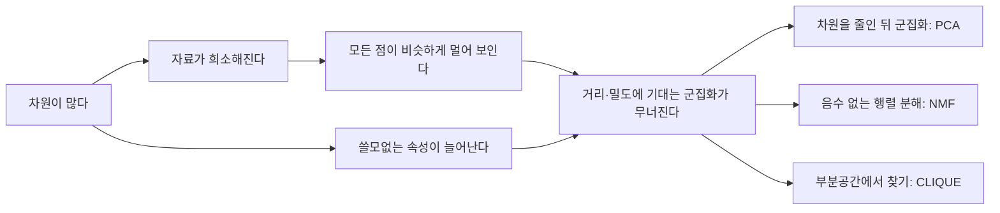



요약

속성(차원)이 많아지면 공간이 너무 넓어져 자료가 듬성듬성 흩어진다. 그러면 가장 가까운 이웃조차 멀리 있고, 모든 점 쌍의 거리가 거의 같아져 "가깝다, 멀다"를 가리는 일이 무의미해진다. 거리에 기대는 k-평균, GMM, DBSCAN은 고차원에서 제대로 일하지 못한다. 그래서 차원을 줄이거나(PCA, 행렬 분해), 일부 차원만 보거나(CLIQUE) 해야 한다.

## 예시로 보기

한 변이 1인 상자 안에 점 1,000개를 고르게 뿌렸다. 어떤 점의 가장 가까운 이웃 10개를 담으려면, 그 점을 둘러싼 작은 상자의 한 변 $$l$$이 얼마나 길어야 할까? 작은 상자의 부피가 전체의 $$\frac{10}{1000}$$이어야 하므로 $$l^d = \frac{10}{1000}$$이다[^1].

| 차원 $$d$$ | 1 | 2 | 3 | 10 | 100 | 1000 |
|---|---|---|---|---|---|---|
| 한 변 $$l$$ | 0.01 | 0.1 | 0.22 | 0.63 | 0.955 | 0.9954 |

1차원에서는 길이 0.01이면 충분하지만, 1000차원에서는 한 변이 0.9954, 거의 공간 전체다. "가장 가까운 10개"가 사실상 공간 곳곳에 흩어져 있다는 뜻이다[^1].

무작위 점 60개의 모든 쌍 거리에서 가장 먼 것과 가장 가까운 것의 차이를 가장 가까운 거리로 나누면, 2차원에서 94.6, 1000차원에서 0.14다[^s1]. 고차원에서는 거리가 좁은 범위에 몰린다[^2].

같은 실험의 쌍 거리 1,770개를 평균 거리로 나눠 분포를 그렸다. 2차원에서는 평균의 0.02배부터 2.3배까지 넓게 퍼진다. 1000차원에서는 모든 쌍이 평균의 0.93~1.06배 안에 몰린다[^s2].

검증: 표의 $$l$$ 값, 차원별 거리 퍼짐, 카드 C2 — [34_curse-of-dimensionality_verify.py](/Hongs_Blog/studies/data-science/code/34_curse-of-dimensionality_verify/)

## 정의

고차원 자료를 군집화할 때의 어려움은 다음과 같다[^3].

- **차원의 저주:** 자료가 희소해지고 거리가 덜 의미 있어진다. 모든 점이 비슷하게 멀어 보인다.
- **쓸모없는 속성:** 많은 차원이 잡음이거나 상관없고, 의미 있는 군집을 가린다.
- 과적합 위험, 계산 비용, 해석의 어려움.

단위 초입방체에 고르게 흩은 점 $$n$$개 중 가까운 $$k$$개를 담는 초입방체의 한 변은 $$l = \left(\frac kn\right)^{1/d}$$이다. $$d \to \infty$$이면 $$l \to 1$$이다[^1].

기존 방법들은 이렇게 무너진다[^4].

| | k-평균 | GMM | DBSCAN | CLIQUE |
|---|---|---|---|---|
| 거리·밀도의 믿음직함 | 거리가 무의미해진다 | 가능도가 거리에 기댄다 | 밀도가 고르게 된다 | 고른 부분공간에서는 통한다 |
| 고차원 대응 | 방법이 없다 | 공분산 추정 불안정($$O(d^2)$$ 개 값) | 이웃 개념이 무너진다 | 부분공간 접근 |

슬라이드는 해결책으로 두 가지를 다룬다. (1) 차원을 줄인 뒤 군집화하는 [PCA](/Hongs_Blog/studies/probability-statistics/pca/), (2) 음수 없는 제약과 L1 정칙화를 건 [행렬 분해](/Hongs_Blog/studies/data-science/nmf-clustering/)[^4].

왼쪽 두 갈래 원인이 가운데에서 한 문제로 모인다. 오른쪽 세 칸이 그 문제를 피하는 방법이다[^s3].

## 연결

- 선수: [민코프스키 거리](/Hongs_Blog/studies/data-science/minkowski-distance/), [군집화 알고리즘 비교](/Hongs_Blog/studies/data-science/contrast--clustering-algorithms/)
- 해결책: [CLIQUE](/Hongs_Blog/studies/data-science/clique/)(부분공간), [주성분 분석](/Hongs_Blog/studies/probability-statistics/pca/)(과목별 관점), [행렬 분해 군집화](/Hongs_Blog/studies/data-science/nmf-clustering/)

## 확인 문제

**C1** 고차원에서 k-평균이 잘 동작하지 않는 이유를 "가장 가까운 이웃" 예로 설명하라.

**답:** 점 1,000개 중 가까운 10개를 담으려면 한 변이 $$(0.01)^{1/d}$$인 상자가 필요하고, $$d = 100$$이면 0.955로 거의 공간 전체다. 가까운 점도 사실상 멀리 있고 모든 거리가 비슷해져, "가장 가까운 중심"을 고르는 일이 거의 무작위가 된다.

**C2** 점 100개를 단위 초입방체에 고르게 흩었을 때, 가장 가까운 1개를 담는 상자의 한 변이 0.5 이상이 되는 가장 작은 차원은?

**답:** $$(1/100)^{1/d} \ge 0.5$$ ⇔ $$d \ge \frac{\ln 100}{\ln 2} \approx 6.64$$. 7차원이다[^s1].

[^1]: 3-2학기/데이터 과학/1.수업자료/10.10-1_high-dim-clustering.pdf, p.10
[^2]: 같은 자료, p.11
[^3]: 같은 자료, p.9
[^4]: 같은 자료, p.12
[^s1]: 에이전트 보충. 점 60개 실험과 카드 C2는 원본에 없다. 검증 코드로 계산했다.
[^s2]: 에이전트 보충. 그림 1장은 원본에 없다. [34_curse-of-dimensionality_plot.py](/Hongs_Blog/studies/data-science/code/34_curse-of-dimensionality_plot/)로 그렸다. 검증 코드와 같은 난수로 같은 점을 만들었고, (최대 − 최소)/최소 94.6과 0.14, 1000차원에서 0.93~1.06배 범위를 같은 코드로 확인했다.
[^s3]: 에이전트 보충. 다이어그램 1개는 원본에 없다. 문서 `정의`의 어려움 목록, 방법별 표, 해결책 문단(원본 10-1 p.9~12)을 근거로 그렸다.

