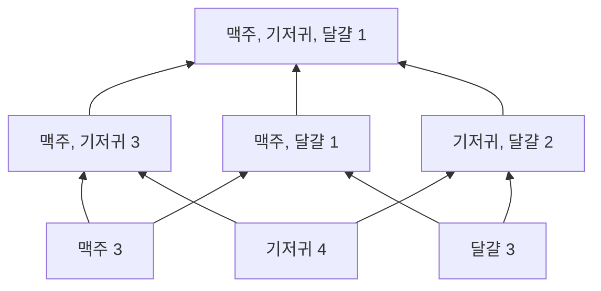



요약

마트 영수증 수천 장을 모아 보면 "기저귀와 맥주를 같이 산 영수증이 많다" 같은 사실이 보인다. 이렇게 자료에 자주 함께 나타나는 묶음이 빈발 패턴이다. 몇 장의 영수증에 나타났는지(지지도)가 정해 둔 기준 이상이면 빈발하다고 한다. 묶음이 자주 나타난다는 사실만 알려 줄 뿐 무엇이 무엇을 부르는지는 말하지 않고, 기준을 낮추면 빈발 묶음의 수가 폭발적으로 늘어난다.

## 예시로 보기

가게는 "무엇을 같이 사는가"를 알면 묶음 상품을 만들고 진열을 바꿀 수 있다[^1]. 영수증 5장이 있다[^2].

| 거래 | 산 것 |
|---|---|
| 1 | 맥주, 견과, 기저귀 |
| 2 | 맥주, 커피, 기저귀 |
| 3 | 맥주, 기저귀, 달걀 |
| 4 | 견과, 달걀, 우유 |
| 5 | 견과, 커피, 기저귀, 달걀, 우유 |

영수증 한 장(산 물건들의 집합)을 거래라 부른다. 물건 묶음 하나, 예를 들어 {맥주, 기저귀}를 항목 집합이라 부르고, 물건이 $$k$$개면 $$k$$-항목 집합이다.

{맥주, 기저귀}가 든 거래는 1, 2, 3번으로 3개다. 이 개수가 지지도(지지 개수)다. 5장 중 3장이니 상대 지지도는 60%다[^2]. "아무 영수증을 집었을 때 이 묶음이 들어 있을 확률"이다.

기준을 50%로 정하면[^3]:

| 크기 | 빈발 | 빈발 아님 |
|---|---|---|
| 1 | 기저귀 80%, 맥주·견과·달걀 60% | 커피·우유 40% |
| 2 | {맥주, 기저귀} 60% | {견과, 달걀} 40%, {맥주, 달걀} 20%, … |
| 3 | 없음 | {맥주, 견과, 기저귀} 20%, … |

검증: 지지 개수, 빈발 1·2·3항목, 무작위 자료에서 "빈발 집합의 부분집합은 빈발", 카드 C2 — [10_frequent-patterns_verify.py](/Hongs_Blog/studies/data-science/code/10_frequent-patterns_verify/)

## 정의

**빈발 패턴**은 자료에 자주 나타나는 패턴이다. 항목 집합(함께 산 물건), 순서 있는 열(스마트폰 → 스마트 TV → 스마트홈 기기), 부분 구조(화합물의 부분 구조)가 모두 패턴이 될 수 있다[^1]. 이 과목에서는 항목 집합을 다룬다.

항목 전체를 $$I = \{I_1, I_2, \dots, I_m\}$$, 거래 데이터베이스를 $$D$$라 한다. 거래 $$T$$는 $$I$$의 공집합 아닌 부분집합이다. 항목 집합 $$X \subseteq I$$에 대해[^2]

- **지지 개수** $$\operatorname{support}(X)$$는 $$X$$를 모두 담은 거래 수, $$\vert \{T \in D : X \subseteq T\}\vert $$다.
- **상대 지지도**는 그 비율 $$\frac{\operatorname{support}(X)}{\vert D\vert }$$다. 거래 하나가 $$X$$를 담을 확률이다.

$$X$$의 지지도가 기준 $$\sigma$$(min_sup) 이상이면 $$X$$를 **빈발 항목 집합**이라 한다[^3].

**아프리오리 성질.** 빈발 항목 집합의 부분집합은 모두 빈발이다. $$X \subseteq Y$$이면 $$Y$$를 담은 거래는 모두 $$X$$도 담으므로 $$\operatorname{support}(X) \ge \operatorname{support}(Y)$$이기 때문이다[^4]. 그래서 길이 100인 빈발 집합 하나가 있으면 그 부분집합 $$2^{100} - 1 \approx 1.27 \times 10^{30}$$개가 모두 빈발이다. 전부 계산하고 저장하기는 불가능하다[^4].

맥주, 기저귀, 달걀로 만들 수 있는 묶음을 아래에서 위로 쌓았다. 숫자는 지지 개수다. 화살표를 따라 위로 갈수록 묶음이 커지고 지지 개수는 같거나 줄어든다. 기준 50%(5장 중 3장 이상)를 넘는 묶음은 한 개짜리 셋과 {맥주, 기저귀}뿐이다[^s1].

## 연결

- 집합의 언어: [집합](/Hongs_Blog/studies/discrete-math/sets/)(부분집합, 멱집합의 크기 $$2^n$$)
- 상대 지지도는 확률이다: [확률의 공리와 계산](/Hongs_Blog/studies/probability-statistics/probability-axioms/)
- 빈발 패턴으로 만드는 규칙: [연관 규칙](/Hongs_Blog/studies/data-science/association-rules/)
- 너무 많은 빈발 패턴을 줄이는 법: [닫힌 패턴과 최대 패턴](/Hongs_Blog/studies/data-science/closed-maximal-patterns/)
- 빈발 패턴을 찾는 방법: [Apriori 알고리즘](/Hongs_Blog/studies/data-science/apriori/)

## 확인 문제

**C1** 항목 집합 $$X$$의 지지 개수와 상대 지지도를 정의하고, $$X$$가 빈발이라는 것의 뜻을 쓰라.

**답:** 지지 개수는 $$X$$를 모두 담은 거래 수, 상대 지지도는 그 수를 전체 거래 수로 나눈 것이다. 지지도가 정해 둔 최소 지지도(min_sup) 이상이면 빈발이다.

**C2** 예시의 영수증 5장에서 {견과, 우유}의 지지 개수와 상대 지지도는? 최소 지지도 50%에서 빈발인가?

**답:** 거래 4, 5에 들어 있어 2개, 40%. 50%보다 작아 빈발이 아니다.

**C3** {맥주, 기저귀, 달걀}의 지지도는 {맥주, 기저귀}의 지지도보다 클 수 없다. 이유를 대라.

**답:** {맥주, 기저귀, 달걀}을 담은 거래는 반드시 {맥주, 기저귀}도 담는다. 그래서 앞 집합을 담은 거래들은 뒤 집합을 담은 거래들의 일부다. 큰 집합의 지지도는 그 부분집합의 지지도 이하다(아프리오리 성질의 근거).

[^1]: 3-2학기/데이터 과학/1.수업자료/03.3-1_FP.pdf, p.3~6
[^2]: 같은 자료, p.7
[^3]: 같은 자료, p.8
[^4]: 같은 자료, p.11, p.17
[^s1]: 에이전트 보충. 다이어그램 1개는 원본에 없다. `예시로 보기`의 영수증 5장(원본 p.7~8)에서 맥주·기저귀·달걀로 만든 항목 집합의 지지 개수를 직접 세어 그렸다.

