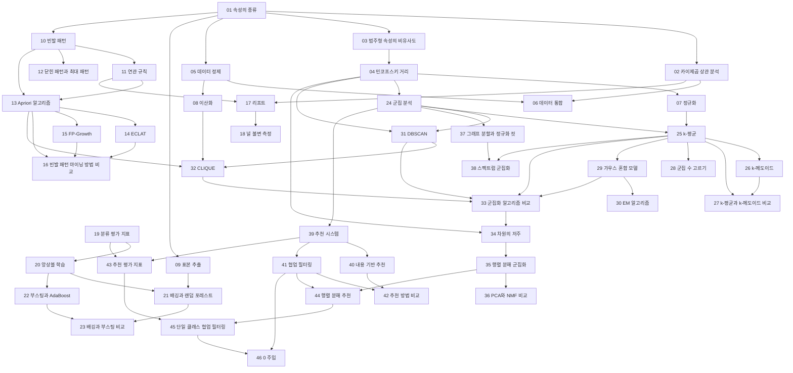


## 먼저 알아야 할 것
- [기술통계](/Hongs_Blog/studies/probability-statistics/descriptive-statistics/) (공학수학 확률과 통계): 2회의 평균·중앙값·최빈값·사분위수·상자 그림. 문서의 `과목별 관점`에 슬라이드 내용이 있다
- [분산과 표준편차](/Hongs_Blog/studies/probability-statistics/variance/), [공분산과 상관계수](/Hongs_Blog/studies/probability-statistics/covariance/) (공학수학 확률과 통계): 2회의 분산, 공분산, 피어슨 상관계수
- [내적과 노름](/Hongs_Blog/studies/linear-algebra/dot-product/) (공학수학 선형대수학): 2회의 코사인 유사도와 코사인 대 상관계수 토론
- [교차 엔트로피와 KL 발산](/Hongs_Blog/studies/probability-statistics/cross-entropy-kl/) (공학수학 확률과 통계): 2회의 KL 발산
- [과적합과 교차검증](/Hongs_Blog/studies/probability-statistics/overfitting-cv/), [가설검정과 p값](/Hongs_Blog/studies/probability-statistics/hypothesis-testing/) (공학수학 확률과 통계): 6회 복습 슬라이드의 평가 방법(홀드아웃·교차검증·부트스트랩), 편향과 분산, 짝지은 t-검정. 문서의 `과목별 관점`에 있다
- [공분산 행렬과 다변량 정규분포](/Hongs_Blog/studies/probability-statistics/multivariate-normal/), [베이즈 정리](/Hongs_Blog/studies/probability-statistics/bayes-theorem/), [최대가능도 추정](/Hongs_Blog/studies/probability-statistics/mle/) (공학수학 확률과 통계): 7회의 GMM과 EM
- [주성분 분석](/Hongs_Blog/studies/probability-statistics/pca/) (공학수학 확률과 통계): 10회의 PCA 복습과 군집화를 위한 PCA의 장단점. 문서의 `과목별 관점`에 있다
- [대칭행렬과 스펙트럼 정리](/Hongs_Blog/studies/linear-algebra/spectral-theorem/), [그래프의 기초](/Hongs_Blog/studies/discrete-math/graph-basics/) (공학수학): 10회의 그래프 라플라시안
- [특잇값 분해](/Hongs_Blog/studies/linear-algebra/svd/) (공학수학 선형대수학): 12회의 PureSVD
- [PageRank](/Hongs_Blog/studies/probability-statistics/pagerank/) (공학수학 확률과 통계): 13회 전체. 문서의 `과목별 관점`에 슬라이드의 예, 막다른 페이지, 거미줄 함정, 구글 행렬과 원본 오류 의심 2건이 있다
- [집합](/Hongs_Blog/studies/discrete-math/sets/) (공학수학 이산수학), [조건부 확률](/Hongs_Blog/studies/probability-statistics/conditional-probability/) (공학수학 확률과 통계): 3회의 항목 집합과 신뢰도

> 자료 출처: 2026년 봄학기 강의 슬라이드 (슬라이드 표기는 2026 Spring). 4·5회와 6회 앞부분(분류, 모델 평가) 슬라이드는 자료에 없다.

## 2회 · 데이터, 측정, 전처리

읽기 전에

1. 키를 cm로 적느냐 m로 적느냐에 따라 '가장 비슷한 사람'이 바뀔 수 있을까? → [민코프스키 거리](/Hongs_Blog/studies/data-science/minkowski-distance/)
2. 검사 10개 중 9개가 둘 다 음성인 두 환자는 90% 비슷한 걸까? → [범주형 속성의 비유사도](/Hongs_Blog/studies/data-science/categorical-dissimilarity/)
3. 빈 소득 칸을 0으로 채우면 무엇이 문제일까? → [데이터 정제](/Hongs_Blog/studies/data-science/data-cleaning/)

| 번호 | 개념 | 한 줄 | 개념 코드 | 연습 |
|---|---|---|---|---|
| 01 | [속성의 종류](/Hongs_Blog/studies/data-science/attribute-types/) | 칸에 든 값으로 할 수 있는 계산: 같다/다르다, 순서, 차이, 비율 | — | — |
| 02 | [카이제곱 상관 분석](/Hongs_Blog/studies/data-science/chi-square-correlation/) | 이름표 속성 둘의 관련. 독립일 때의 기대 인원과 실제 인원의 차이 | [verify](/Hongs_Blog/studies/data-science/code/02_chi-square-correlation_verify/) | — |
| 03 | [범주형 속성의 비유사도](/Hongs_Blog/studies/data-science/categorical-dissimilarity/) | 같은 칸의 비율. 비대칭 이진은 둘 다 0인 칸을 뺀다(자카드) | [verify](/Hongs_Blog/studies/data-science/code/03_categorical-dissimilarity_verify/) | — |
| 04 | [민코프스키 거리](/Hongs_Blog/studies/data-science/minkowski-distance/) | 좌표 차이의 $$h$$제곱 합. $$h = 1$$ 맨해튼, $$h = 2$$ 유클리드 | [verify](/Hongs_Blog/studies/data-science/code/04_minkowski-distance_verify/) | — |
| 05 | [데이터 정제](/Hongs_Blog/studies/data-science/data-cleaning/) | 빈칸 채우기, 비닝·회귀·이상치로 잡음 다듬기 | [verify](/Hongs_Blog/studies/data-science/code/05_data-cleaning_verify/) | — |
| 06 | [데이터 통합](/Hongs_Blog/studies/data-science/data-integration/) | 같은 대상 맞추기, 상관 분석으로 중복 속성 찾기 | — | — |
| 07 | [정규화](/Hongs_Blog/studies/data-science/normalization/) | 최소-최대(0~1)와 z-점수(평균 0, 표준편차 1) | [verify](/Hongs_Blog/studies/data-science/code/07_normalization_verify/) | — |
| 08 | [이산화](/Hongs_Blog/studies/data-science/discretization/) | 수치를 구간 이름으로. 같은 폭 칸 나누기, 개념 계층 | [verify](/Hongs_Blog/studies/data-science/code/08_discretization_verify/) | — |
| 09 | [표본 추출](/Hongs_Blog/studies/data-science/sampling/) | 비복원, 복원, 층화 추출 | [verify](/Hongs_Blog/studies/data-science/code/09_sampling_verify/) | — |

자료: 2-1_data-measure-preprocess
필기: 아직 없다.
떠올려 보기: 노트를 닫고 속성의 다섯 종류, 종류마다 쓰는 비유사도·상관 척도, 전처리의 세 단계(정제·통합·변환)를 한 장의 표로 써 본다.

## 3회 · 빈발 패턴

읽기 전에

1. {A, B}가 빈발이 아니면 {A, B, C}를 세어 볼 필요가 있을까? → [Apriori 알고리즘](/Hongs_Blog/studies/data-science/apriori/)
2. 후보 묶음을 하나도 만들지 않고 빈발 묶음을 모두 찾을 수 있을까? → [FP-Growth](/Hongs_Blog/studies/data-science/fp-growth/)
3. 학생의 75%가 시리얼을 먹는다. '축구 → 시리얼' 신뢰도 67%는 좋은 규칙일까? → [리프트](/Hongs_Blog/studies/data-science/lift/)

| 번호 | 개념 | 한 줄 | 개념 코드 | 연습 |
|---|---|---|---|---|
| 10 | [빈발 패턴](/Hongs_Blog/studies/data-science/frequent-patterns/) | 자주 함께 나오는 항목 묶음. 지지도 ≥ min_sup | [verify](/Hongs_Blog/studies/data-science/code/10_frequent-patterns_verify/) | — |
| 11 | [연관 규칙](/Hongs_Blog/studies/data-science/association-rules/) | $$X \Rightarrow Y$$의 지지도와 신뢰도 $$P(Y \mid X)$$ | — | — |
| 12 | [닫힌 패턴과 최대 패턴](/Hongs_Blog/studies/data-science/closed-maximal-patterns/) | 지지도가 같은 상위 집합이 없음(손실 없음) / 빈발 상위 집합이 없음(지지도 잃음) | [verify](/Hongs_Blog/studies/data-science/code/12_closed-maximal_verify/) | — |
| 13 | [Apriori 알고리즘](/Hongs_Blog/studies/data-science/apriori/) | 아프리오리 성질로 후보를 결합·가지치기, 크기별로 DB를 훑는다 (강조)[^강조] | [impl](/Hongs_Blog/studies/data-science/code/13_apriori_impl/) | [Apriori 예제 사다리](/Hongs_Blog/studies/data-science/apriori-ladder/) · [문제 코드](/Hongs_Blog/studies/data-science/code/13_apriori-ladder_p4/) |
| 14 | [ECLAT](/Hongs_Blog/studies/data-science/eclat/) | 항목 → 거래 번호 목록, 교집합으로 지지도. DB 한 번 | [impl](/Hongs_Blog/studies/data-science/code/14_eclat_impl/) | — |
| 15 | [FP-Growth](/Hongs_Blog/studies/data-science/fp-growth/) | 빈도순 앞부분 트리로 압축, 조건부 패턴 베이스로 재귀. 후보 없음, DB 두 번 (강조)[^강조] | [impl](/Hongs_Blog/studies/data-science/code/15_fp-growth_impl/) | [FP-Growth 예제 사다리](/Hongs_Blog/studies/data-science/fp-growth-ladder/) · [문제 코드](/Hongs_Blog/studies/data-science/code/15_fp-growth-ladder_p4/) |
| 16 | [빈발 패턴 마이닝 방법 비교](/Hongs_Blog/studies/data-science/contrast--fp-mining-methods/) | 가르는 질문: DB를 몇 번 훑나, 메모리에 무엇을 드나 | — | — |
| 17 | [리프트](/Hongs_Blog/studies/data-science/lift/) | 신뢰도 ÷ 뒤쪽의 원래 비율. 1보다 작으면 음의 상관 | [verify](/Hongs_Blog/studies/data-science/code/17_lift_verify/) | — |
| 18 | [널 불변 측정](/Hongs_Blog/studies/data-science/null-invariant-measures/) | 널 거래에 흔들리지 않는 Kulc와 불균형 비율 IR | [verify](/Hongs_Blog/studies/data-science/code/18_null-invariant_verify/) | — |

자료: 3-1_FP · 3-2_FP-eval · 3-4-solutions
필기: 아직 없다.
떠올려 보기: 노트를 닫고 같은 거래 9개(3-1 p.24)로 Apriori의 $$C_k$$·$$L_k$$와 FP-tree를 각각 그린 뒤, 세 방법(Apriori, ECLAT, FP-Growth)의 DB 훑기·후보·메모리를 표로 비교해 본다.

## 6회 · 앙상블

읽기 전에

1. 서로 상관계수가 0.5인 모델을 무한히 많이 평균 내면 분산은 0이 될까? → [앙상블 학습](/Hongs_Blog/studies/data-science/ensemble-learning/)
2. 자료가 한 벌뿐인데 서로 다른 모델 여러 개를 어떻게 만들까? → [배깅과 랜덤 포레스트](/Hongs_Blog/studies/data-science/bagging-random-forest/)
3. 겨우 찍기보다 나은 모델들만으로 훈련 오류를 0으로 만들 수 있을까? → [부스팅과 AdaBoost](/Hongs_Blog/studies/data-science/boosting-adaboost/)

| 번호 | 개념 | 한 줄 | 개념 코드 | 연습 |
|---|---|---|---|---|
| 19 | [분류 평가 지표](/Hongs_Blog/studies/data-science/classification-metrics/) | 정확도, 정밀도, 재현율, F1. 어떤 실수가 비싼지로 고른다 | [verify](/Hongs_Blog/studies/data-science/code/19_classification-metrics_verify/) | — |
| 20 | [앙상블 학습](/Hongs_Blog/studies/data-science/ensemble-learning/) | 평균의 분산 $$\sigma^2/k + \frac{k-1}{k}\rho\sigma^2$$. 서로 다를수록 효과가 크다 | [verify](/Hongs_Blog/studies/data-science/code/20_ensemble-learning_verify/) | — |
| 21 | [배깅과 랜덤 포레스트](/Hongs_Blog/studies/data-science/bagging-random-forest/) | 부트스트랩 표본마다 모델, 투표·평균. 랜덤 포레스트는 속성도 뽑는다 | [impl](/Hongs_Blog/studies/data-science/code/21_bagging_impl/) | — |
| 22 | [부스팅과 AdaBoost](/Hongs_Blog/studies/data-science/boosting-adaboost/) | 틀린 자료의 무게를 키우며 차례로 훈련, 가중 투표 | [impl](/Hongs_Blog/studies/data-science/code/22_adaboost_impl/) | — |
| 23 | [배깅과 부스팅 비교](/Hongs_Blog/studies/data-science/contrast--bagging-boosting/) | 가르는 질문: 모델들이 서로를 보며 만들어지는가 | — | — |

자료: 6-2_ensemble
필기: 아직 없다.
떠올려 보기: 노트를 닫고 오차의 세 부분(편향², 분산, 잡음), 앙상블 분산 공식, 배깅과 부스팅이 각각 무엇을 줄이는지와 그 이유를 한 장에 써 본다.

## 7회 · 군집화 기초와 밀도 기반 군집화

읽기 전에

1. 무리를 하나 늘릴 때마다 오차가 줄어든다면, 오차가 가장 작은 무리 수를 고르면 될까? → [군집 수 고르기](/Hongs_Blog/studies/data-science/choosing-k/)
2. 두 무리 가운데에 있는 점은 어느 무리에 넣어야 할까? → [가우스 혼합 모델](/Hongs_Blog/studies/data-science/gaussian-mixture-model/)
3. 고리 모양 무리 안에 덩어리가 하나 있으면, 무리 수 2로 k-평균을 돌려 둘을 나눌 수 있을까? → [DBSCAN](/Hongs_Blog/studies/data-science/dbscan/)

| 번호 | 개념 | 한 줄 | 개념 코드 | 연습 |
|---|---|---|---|---|
| 24 | [군집 분석](/Hongs_Blog/studies/data-science/cluster-analysis/) | 정답 없이 비슷한 것끼리 묶기. 안쪽은 닮고 서로는 다르게 | — | — |
| 25 | [k-평균](/Hongs_Blog/studies/data-science/k-means/) | 가까운 중심에 배정 → 평균으로 갱신. 반드시 멈추지만 국소 최적 (강조)[^강조] | [impl](/Hongs_Blog/studies/data-science/code/25_k-means_impl/) | [k-평균 예제 사다리](/Hongs_Blog/studies/data-science/k-means-ladder/) · [문제 코드](/Hongs_Blog/studies/data-science/code/25_k-means-ladder_p4/) |
| 26 | [k-메도이드](/Hongs_Blog/studies/data-science/k-medoids/) | 대표를 실제 점으로. 이상치에 견고, 아무 비유사도, 대신 느림 | [impl](/Hongs_Blog/studies/data-science/code/26_k-medoids_impl/) | — |
| 27 | [k-평균과 k-메도이드 비교](/Hongs_Blog/studies/data-science/contrast--kmeans-kmedoids/) | 가르는 질문: 대표가 실제 점이어야 하는가 | — | — |
| 28 | [군집 수 고르기](/Hongs_Blog/studies/data-science/choosing-k/) | 엘보(개선이 꺾이는 곳)와 실루엣 $$s = (b-a)/\max(a,b)$$ | [verify](/Hongs_Blog/studies/data-science/code/28_choosing-k_verify/) | — |
| 29 | [가우스 혼합 모델](/Hongs_Blog/studies/data-science/gaussian-mixture-model/) | 가우스 분포의 혼합. 점마다 군집별 확률(부드러운 배정) | — | — |
| 30 | [EM 알고리즘](/Hongs_Blog/studies/data-science/em-algorithm/) | 책임도(E)와 가중 평균·공분산·비중(M)을 번갈아. 가능도는 줄지 않는다 (강조)[^강조] | [impl](/Hongs_Blog/studies/data-science/code/30_em-gmm_impl/) | — |
| 31 | [DBSCAN](/Hongs_Blog/studies/data-science/dbscan/) | 반지름 안 이웃이 많은 핵심점에서 퍼져 나가 묶기. $$k$$ 불필요, 잡음 분리 | [impl](/Hongs_Blog/studies/data-science/code/31_dbscan_impl/) | — |
| 32 | [CLIQUE](/Hongs_Blog/studies/data-science/clique/) | 격자 칸의 밀도, 아프리오리 성질로 부분공간 찾기 | [impl](/Hongs_Blog/studies/data-science/code/32_clique_impl/) | — |
| 33 | [군집화 알고리즘 비교](/Hongs_Blog/studies/data-science/contrast--clustering-algorithms/) | 가르는 질문: $$k$$를 아는가, 모양을 가정할 수 있는가 | — | — |

자료: 7-1_basic-clustering · 7-2_density-clustering
필기: 아직 없다.
떠올려 보기: 노트를 닫고 k-평균, k-메도이드, GMM, DBSCAN, CLIQUE를 '무엇을 비슷하다고 보는가', '$$k$$ 필요', '모양 가정', '잡음' 네 칸의 표로 쓰고, k-평균과 EM이 둘 다 '번갈아 고치기'라는 것을 한 문단으로 설명해 본다.

## 10회 · 고차원 군집화와 그래프 군집화

읽기 전에

1. 점 1,000개 중 가장 가까운 10개를 담으려면, 100차원에서는 공간의 얼마를 덮어야 할까? → [차원의 저주](/Hongs_Blog/studies/data-science/curse-of-dimensionality/)
2. 문서 × 단어 표를 두 표의 곱으로 나누면 '주제'가 나올까? → [행렬 분해 군집화](/Hongs_Blog/studies/data-science/nmf-clustering/)
3. 잘리는 선만 가장 적게 하도록 그래프를 자르면 어떤 답이 나올까? → [그래프 분할과 정규화 컷](/Hongs_Blog/studies/data-science/graph-partitioning/)

| 번호 | 개념 | 한 줄 | 개념 코드 | 연습 |
|---|---|---|---|---|
| 34 | [차원의 저주](/Hongs_Blog/studies/data-science/curse-of-dimensionality/) | 차원이 늘면 가까운 이웃도 멀고 모든 거리가 비슷해진다 | [verify](/Hongs_Blog/studies/data-science/code/34_curse-of-dimensionality_verify/) | — |
| 35 | [행렬 분해 군집화](/Hongs_Blog/studies/data-science/nmf-clustering/) | $$X \approx WH$$, $$W, H \ge 0$$. 더하기만 하는 부분이 군집, L1로 뚜렷하게 | [impl](/Hongs_Blog/studies/data-science/code/35_nmf-clustering_impl/) | — |
| 36 | [PCA와 NMF 비교](/Hongs_Blog/studies/data-science/contrast--pca-nmf/) | 가르는 질문: 성분을 빼서 써도 되는가 | — | — |
| 37 | [그래프 분할과 정규화 컷](/Hongs_Blog/studies/data-science/graph-partitioning/) | 유사도 그래프를 자르기. 컷만 줄이면 외딴 점 하나, 정규화 컷으로 균형 | — | — |
| 38 | [스펙트럼 군집화](/Hongs_Blog/studies/data-science/spectral-clustering/) | 라플라시안 $$L = D - W$$의 둘째 고유벡터 부호로 2-분할, 여러 개로 k-분할 | [impl](/Hongs_Blog/studies/data-science/code/38_spectral-clustering_impl/) | — |

자료: 10-1_high-dim-clustering · 10-2_graph-clustering
필기: 아직 없다.
떠올려 보기: 노트를 닫고 고차원 군집화의 세 갈래(차원 줄이기 PCA, 부분 분해 NMF, 부분공간 CLIQUE)와 그래프 군집화의 흐름(유사도 그래프 → 정규화 컷 → 라플라시안 고유벡터 → k-평균)을 한 장에 그려 본다.

## 11회 · 추천 시스템 소개와 평가

읽기 전에

1. 평점이 하나도 없는 새 아이템을 추천할 수 있는 방법은? → [내용 기반 추천](/Hongs_Blog/studies/data-science/content-based-recommendation/)
2. 나보다 늘 1점씩 후하게 주는 친구의 평점을 어떻게 빌려 와야 할까? → [협업 필터링](/Hongs_Blog/studies/data-science/collaborative-filtering/)
3. 평점을 거의 정확히 맞히는 모델이 추천 목록 맨 위는 틀릴 수 있을까? → [추천 평가 지표](/Hongs_Blog/studies/data-science/recommender-metrics/)

| 번호 | 개념 | 한 줄 | 개념 코드 | 연습 |
|---|---|---|---|---|
| 39 | [추천 시스템](/Hongs_Blog/studies/data-science/recommender-systems/) | 좋아할 것 몇 개만 골라 보여 주기. 내용 정보와 협업 정보 | — | — |
| 40 | [내용 기반 추천](/Hongs_Blog/studies/data-science/content-based-recommendation/) | TF-IDF 아이템 프로필과 사용자 프로필의 코사인. 새 아이템에 강함 | [verify](/Hongs_Blog/studies/data-science/code/40_content-based_verify/) | — |
| 41 | [협업 필터링](/Hongs_Blog/studies/data-science/collaborative-filtering/) | 비슷한 사용자(또는 아이템)의 평점을 평균 보정해 빌려 오기 | [impl](/Hongs_Blog/studies/data-science/code/41_collaborative-filtering_impl/) | — |
| 42 | [추천 방법 비교](/Hongs_Blog/studies/data-science/contrast--recommendation-methods/) | 가르는 질문: 새 것이 사용자인가 아이템인가, 다양성인가 규모인가 | — | — |
| 43 | [추천 평가 지표](/Hongs_Blog/studies/data-science/recommender-metrics/) | 평점 오차(MAE, RMSE), 목록(P·R·HR@K), 순위(MR, MRR, nDCG) | [verify](/Hongs_Blog/studies/data-science/code/43_recommender-metrics_verify/) | — |

자료: 11-1_intro-rec · 11-2_eval-rec
필기: 아직 없다.
떠올려 보기: 노트를 닫고 내용 기반·사용자 기반·아이템 기반을 '근거, 쓰는 정보, 장점, 한계' 표로 쓰고, 평가 지표 세 갈래(평점, 목록, 순위)의 대표 식을 하나씩 써 본다.

## 12회 · 행렬 분해 기반 추천과 희소성

읽기 전에

1. 평점표의 빈칸을 0으로 채우면 무엇이 문제일까? → [행렬 분해 추천](/Hongs_Blog/studies/data-science/mf-recommendation/)
2. '봤다'는 기록만 있고 '싫다'는 기록이 없으면 무엇을 배워야 할까? → [단일 클래스 협업 필터링](/Hongs_Blog/studies/data-science/one-class-cf/)
3. 비어 있는 칸 중 일부만 0으로 채우면 왜 추천이 좋아질까? → [0 주입](/Hongs_Blog/studies/data-science/zero-injection/)

| 번호 | 개념 | 한 줄 | 개념 코드 | 연습 |
|---|---|---|---|---|
| 44 | [행렬 분해 추천](/Hongs_Blog/studies/data-science/mf-recommendation/) | $$R \approx PQ^\top$$. PureSVD, 편향 $$\mu + b_u + b_i + p_u^\top q_i$$, SVD++ | [impl](/Hongs_Blog/studies/data-science/code/44_mf-recommendation_impl/) | — |
| 45 | [단일 클래스 협업 필터링](/Hongs_Blog/studies/data-science/one-class-cf/) | 1과 빈칸만으로. WRMF는 빈칸에 작은 무게, BPR은 순서를 배운다 | [impl](/Hongs_Blog/studies/data-science/code/45_one-class-cf_impl/) | — |
| 46 | [0 주입](/Hongs_Blog/studies/data-science/zero-injection/) | 사용 전 선호가 가장 낮은 빈칸에만 0을 넣어 행렬을 빽빽하게 | [verify](/Hongs_Blog/studies/data-science/code/46_zero-injection_verify/) | — |

자료: 12-1_MF-based · 12-2_sparsity
필기: 아직 없다.
떠올려 보기: 노트를 닫고 PureSVD, 편향 MF, SVD++, WRMF, BPR을 '자료, 개인화, 학습, 손실, 목표' 다섯 칸의 표로 써 본다.

## 13회 · PageRank
개념: 이 회차는 공학수학의 [PageRank](/Hongs_Blog/studies/probability-statistics/pagerank/) 문서에 `과목별 관점`으로 합쳤다(무작위 서퍼, 거듭제곱법, 막다른 페이지, 거미줄 함정, 구글 행렬).
자료: 13_pagerank
필기: 아직 없다.

## 다른 과목과의 연결
- 2회의 통계·유사도 내용은 공학수학 문서에 `과목별 관점`으로 합쳐 두었다(위 '먼저 알아야 할 것').
- [Apriori 알고리즘](/Hongs_Blog/studies/data-science/apriori/) ↔ [너비 우선 탐색](/Hongs_Blog/studies/algorithms/bfs/), [FP-Growth](/Hongs_Blog/studies/data-science/fp-growth/) ↔ [트라이](/Hongs_Blog/studies/algorithms/trie/) (알고리즘): 크기별로 넓혀 가는 탐색과 앞부분 공유 트리
- [DBSCAN](/Hongs_Blog/studies/data-science/dbscan/) ↔ [깊이 우선 탐색](/Hongs_Blog/studies/algorithms/dfs/) (알고리즘): 핵심점에서 퍼져 나가는 그래프 탐색
- [CLIQUE](/Hongs_Blog/studies/data-science/clique/) ↔ [Apriori 알고리즘](/Hongs_Blog/studies/data-science/apriori/) (같은 과목 3회): 같은 아프리오리 가지치기를 격자 칸에 쓴다
- [스펙트럼 군집화](/Hongs_Blog/studies/data-science/spectral-clustering/) ↔ [주성분 분석](/Hongs_Blog/studies/probability-statistics/pca/) (공학수학): 둘 다 대칭행렬의 고유벡터로 새 공간을 만든다. PCA는 큰 고윳값, 스펙트럼은 작은 고윳값
- [널 불변 측정](/Hongs_Blog/studies/data-science/null-invariant-measures/) ↔ [자카드 계수](/Hongs_Blog/studies/data-science/categorical-dissimilarity/) (같은 과목 2회): 둘 다 '둘 다 없음'을 빼서 희소한 자료를 지킨다

## 흐름

[^강조]: 원본에서 연습 문제와 풀이가 따로 있는 개념. Apriori: 3-1 p.17~25(예, 의사코드, 연습 1), 3-4 풀이 p.1~2. FP-Growth: 3-1 p.29~36(4쪽에 걸친 추적, 연습 2), 3-4 풀이 p.3~11. k-평균: 7-1 p.8~13(목적 함수, 3쪽에 걸친 과정 그림, 한계)과 7-2·10-1의 복습. EM: 7-1 p.27~30(4쪽, 의사코드 그림)과 7-2 p.5 복습.

