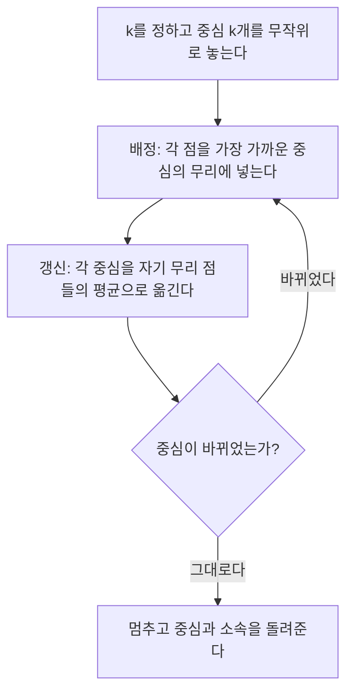


<div class="callout callout-summary" markdown="1">
<div class="callout-title callout-title--default" markdown="span">요약</div>

무리 수 $$k$$를 정하고 중심 $$k$$개를 아무렇게나 놓은 뒤, 두 일을 번갈아 한다. 모든 점을 가장 가까운 중심의 무리에 넣고, 각 무리의 평균 위치로 중심을 옮긴다. 중심이 더 움직이지 않을 때까지 되풀이하면 점들이 자기 중심에 가깝게 모인다. 빠르고 간단하지만 처음 위치에 따라 다른 답에 멈추고, 둥글고 크기가 비슷한 무리만 잘 찾으며, 튀는 점 하나에 중심이 끌려간다.

</div>


## 예시로 보기

점을 $$k$$개 무리로 나누는 방법을 모두 시험하면 가장 좋은 답을 찾을 수 있다. 하지만 나누는 방법의 수는 점 수에 따라 지수적으로 늘어 불가능하다[^1]. 그래서 두 단계를 번갈아 하며 답을 다가간다.

1차원 점 1, 2, 3, 8, 9, 10, 25를 $$k = 2$$로 나눈다. 처음 중심은 1과 2다. $$J$$는 각 점에서 자기 중심까지 거리 제곱의 합이다[^s1].

| 단계 | 소속 (중심 1 / 중심 2) | 중심 | $$J$$ |
|---|---|---|---|
| 배정 | {1} / {2, 3, 8, 9, 10, 25} | 1, 2 | 679 |
| 갱신 | 그대로 | 1, 9.5 | 341.5 |
| 배정 | {1, 2, 3} / {8, 9, 10, 25} | 1, 9.5 | 248 |
| 갱신 | 그대로 | 2, 13 | 196 |
| 배정 | 그대로 | 2, 13 | 196 → 멈춤 |

$$J$$는 단계마다 줄거나 그대로다. 그런데 둘째 중심이 13이다. 8, 9, 10의 무리인데 25 하나에 끌려갔다. 같은 자료를 {1, 2, 3, 8, 9, 10}과 {25}로 나누면 $$J = 77.5$$로 훨씬 작다. k-평균은 멈췄지만 가장 좋은 답은 아니다.

<div class="callout callout-check" markdown="1">
<div class="callout-title" markdown="span">검증: 위 추적, 무작위 200회에서 $$J$$ 단조 감소, 국소 최적 예(정사각형 네 점에서 $$J$$ = 1 또는 16), $$k$$를 늘리면 최적 $$J$$가 줄고 $$k = n$$이면 0 — [25_k-means_impl.py](/Hongs_Blog/studies/data-science/code/25_k-means_impl/)</div>

</div>


## 정의

k-평균은 중심 기반 군집화다. 핵심 생각은 "각 점은 가장 가까운 군집의 중심 가까이 있다"이다[^2].

**목적 함수.** 모든 점에서 자기 군집 중심까지의 거리(제곱)를 더한 값을 가장 작게 한다[^2].

$$\text{최소화} \quad J = \sum_{i=1}^{n}\sum_{\alpha=1}^{k}[\mathbf z_i]_\alpha\, d_{i\alpha}, \qquad d_{i\alpha} = \Vert \mathbf x_i - \boldsymbol\mu_\alpha\Vert ^2, \qquad \boldsymbol\mu_\alpha = \frac{\sum_{i=1}^{n}[\mathbf z_i]_\alpha\mathbf x_i}{\sum_{i=1}^{n}[\mathbf z_i]_\alpha}$$


$$\mathbf z_i \in \mathbb{R}^k$$는 점 $$i$$의 소속을 적은 벡터로, 소속 군집 $$\alpha$$ 자리만 1이고 나머지는 0이다(원-핫). 그래서 $$[\mathbf z_i]_\alpha d_{i\alpha}$$는 점 $$i$$가 군집 $$\alpha$$에 속할 때만 거리를 더한다. $$\boldsymbol\mu_\alpha$$는 군집 $$\alpha$$에 속한 점들의 평균이다.

이 목적 함수는 매끄럽지도 볼록하지도 않아 한 번에 풀 수 없다[^1].

### 의사코드

```
입력: 점 x_1..x_n, 군집 수 k
중심 μ_1..μ_k를 무작위로 정한다
반복:
    (1) 배정: 각 점을 가장 가까운 중심의 군집에 넣는다
    (2) 갱신: 각 중심을 자기 군집 점들의 평균(무게중심)으로 옮긴다
중심이 더 바뀌지 않으면 멈춘다
```



고리는 배정과 갱신 두 칸뿐이다. 한 칸은 중심을 고정하고 소속을 고치고, 다른 칸은 소속을 고정하고 중심을 고친다[^s3].

슬라이드의 그림처럼 이 두 단계를 중심이 바뀌지 않을 때까지 되풀이한다[^3].


둥근 세 무리(점 90개)에서 처음 중심(×)을 한쪽 구석에 몰아 두고 시작했다. 한 번 갱신하자 중심이 각 무리로 흩어지고, $$J$$는 709 → 126 → 70으로 줄다가 멈춘다. 오른쪽 그림의 선은 중심이 지나온 길이다[^s2].

### 정확성: 반드시 멈춘다

**주장.** 두 단계는 각각 $$J$$를 늘리지 않는다. 그래서 k-평균은 유한 번 안에 멈춘다[^s1].

<details class="callout callout-proof" markdown="1">
<summary class="callout-title" markdown="span">증명 펼치기</summary>

1. **배정 단계.** 중심을 고정하면 $$J$$는 점마다 따로 더한 값이다. 각 점을 가장 가까운 중심에 넣으면 그 점의 항이 가장 작아지므로 $$J$$는 줄거나 그대로다. — 항별 최소화
2. **갱신 단계.** 소속을 고정하면 군집 $$\alpha$$의 항 $$\sum_{i \in C_\alpha}\Vert \mathbf x_i - \boldsymbol\mu\Vert ^2$$을 $$\boldsymbol\mu$$에 대해 최소화하는 값은 평균이다. 미분해 0으로 놓으면 $$-2\sum(\mathbf x_i - \boldsymbol\mu) = 0$$, 즉 $$\boldsymbol\mu = \frac{1}{\vert C_\alpha\vert }\sum\mathbf x_i$$이다. 그래서 $$J$$는 줄거나 그대로다. — 미분과 최소화
3. **유한 번.** 점을 $$k$$개 무리로 나누는 방법은 유한하다(많아야 $$k^n$$). $$J$$가 줄어들 때마다 같은 나눔으로 돌아갈 수 없으므로(같은 나눔이면 같은 중심, 같은 $$J$$), 새 나눔을 무한히 거칠 수 없다. — 비둘기집 원리
4. 결론: $$J$$가 더 줄지 않는 곳(중심이 바뀌지 않는 곳)에서 멈춘다. 그곳이 전역 최소라는 보장은 없다. ∎

</details>


### 스스로 설명해 보기

<details class="callout callout-question" markdown="1">
<summary class="callout-title" markdown="span">1. 2단계에서 평균이 최소인 이유를 미분 없이</summary>

$$\sum\Vert \mathbf x_i - \boldsymbol\mu\Vert ^2 = \sum\Vert \mathbf x_i - \bar{\mathbf x}\Vert ^2 + \vert C\vert \,\Vert \bar{\mathbf x} - \boldsymbol\mu\Vert ^2$$이다(교차항은 $$\sum(\mathbf x_i - \bar{\mathbf x}) = 0$$이라 사라진다). 둘째 항은 $$\boldsymbol\mu = \bar{\mathbf x}$$일 때 0이 되어 가장 작다.

</details>


<details class="callout callout-question" markdown="1">
<summary class="callout-title" markdown="span">2. 3단계에서 "같은 나눔으로 돌아갈 수 없다"의 이유</summary>

나눔이 같으면 갱신된 중심도 같고 $$J$$도 같다. $$J$$가 엄밀히 줄어든 뒤에는 그 이전 나눔의 $$J$$보다 작으므로, 이전 나눔을 다시 만나면 $$J$$가 다시 커진 것이 되어 1·2단계에 어긋난다.

</details>


<details class="callout callout-question" markdown="1">
<summary class="callout-title" markdown="span">3. 멈춘 곳이 전역 최소가 아닐 수 있는 이유</summary>

1·2단계는 "한쪽을 고정하고 다른 쪽을 고치는" 작은 개선만 한다. 두 쪽을 동시에 크게 바꿔야 더 좋은 답이 나오는 경우(예시의 25 하나만 따로 떼기)에는 어느 한 단계로도 $$J$$가 줄지 않아 멈춘다.

</details>


<details class="callout callout-question" markdown="1">
<summary class="callout-title" markdown="span">이 증명의 핵심 아이디어는?</summary>

번갈아 최소화(좌표 하강): 변수를 두 묶음(소속, 중심)으로 나눠 한 묶음씩 최적으로 고치면 목적 함수는 계속 줄고, 가능한 상태가 유한하면 반드시 멈춘다.

</details>


<details class="callout callout-question" markdown="1">
<summary class="callout-title" markdown="span">이 방법을 쓸 수 있는 다른 상황은?</summary>

[EM 알고리즘](/Hongs_Blog/studies/data-science/em-algorithm/)(책임도와 매개변수를 번갈아 고친다, 같은 단조성), 행렬 분해의 교대 최소제곱(사용자 행렬과 아이템 행렬을 번갈아 푼다).

</details>


### 복잡도

반복 한 번에 점 $$n$$개와 중심 $$k$$개 사이의 거리를 모두 재므로 $$O(nkd)$$다($$d$$는 차원). 반복 횟수는 보통 작아서 효율적이고 큰 자료에도 쓸 수 있다[^4].

## 활용

- 구현: [25_k-means_impl.py](/Hongs_Blog/studies/data-science/code/25_k-means_impl/). 연습: [k-평균 예제 사다리](/Hongs_Blog/studies/data-science/k-means-ladder/)
- 사이킷런 `KMeans`는 처음 중심을 서로 멀리 고르는 k-means++와 여러 번 다시 시작하기(`n_init`)로 국소 최적 문제를 줄인다[^s1].
- **한계**(슬라이드 p.13)[^5].
    - 둥글고 크기·분산이 비슷한 군집을 가정한다. 유클리드 거리가 모든 방향을 똑같이 보기 때문이다. 길쭉하거나 크기가 다른 군집에 약하다. 속성마다 단위가 다르면 먼저 [정규화](/Hongs_Blog/studies/data-science/normalization/)한다.
    - 중심이 실제 점이 아니라 평균이라 이상치에 민감하다(예시의 25).
    - 각 점을 군집 하나에만 넣어(하드 배정) 겹치는 군집이나 경계의 점을 표현하지 못한다.
    - 군집 수 $$k$$를 미리 정해야 한다 → [군집 수 고르기](/Hongs_Blog/studies/data-science/choosing-k/)


비스듬하고 길쭉한 두 무리다. k-평균은 열 번 다시 시작한 가장 좋은 답에서도 무리를 길이 방향으로 반씩 자른다. 그렇게 자른 쪽의 $$J$$(1194)가 실제 나눔의 $$J$$(2430)보다 작다. 알고리즘이 실수한 것이 아니라, 목적 함수 자체가 둥근 무리를 원한다[^s2].

## 연결

- 선수: [군집 분석](/Hongs_Blog/studies/data-science/cluster-analysis/), [정규화](/Hongs_Blog/studies/data-science/normalization/)
- 갱신 단계의 최소화: [도함수의 활용과 최적화](/Hongs_Blog/studies/calculus/curve-analysis/)
- 실제 점을 중심으로: [k-메도이드](/Hongs_Blog/studies/data-science/k-medoids/). 부드러운 배정으로: [가우스 혼합 모델](/Hongs_Blog/studies/data-science/gaussian-mixture-model/)

## 자주 하는 오해

<div class="callout callout-misconception" markdown="1">
<div class="callout-title" markdown="span">"k-평균은 늘 가장 좋은 군집을 찾는다"</div>

아니다. k-평균은 반드시 멈추지만, 멈춘 곳은 "한 단계로는 더 좋아지지 않는 곳"일 뿐이다. 정사각형 네 점 (0,0), (0,1), (4,0), (4,1)에서 처음 중심을 (0,0), (4,0)으로 두면 왼쪽·오른쪽으로 나뉘어 $$J = 1$$이지만, (0,0), (0,1)로 두면 아래·위로 나뉜 채 $$J = 16$$에서 멈춘다. 그럴듯해 보이는 이유는 $$J$$가 계속 줄어드는 것을 보면 끝까지 가면 최소라고 믿기 때문이다. 확인하는 법: 처음 값을 바꿔 여러 번 돌려 $$J$$를 비교한다.

</div>


## 확인 문제

<details class="callout callout-question" markdown="1">
<summary class="callout-title" markdown="span">**C1** k-평균의 목적 함수와 두 단계를 쓰라.</summary>

**답:** $$J = \sum_i \sum_\alpha [\mathbf z_i]_\alpha \Vert \mathbf x_i - \boldsymbol\mu_\alpha\Vert ^2$$를 최소화한다. ① 배정: 각 점을 가장 가까운 중심에 넣는다. ② 갱신: 중심을 군집 점들의 평균으로 옮긴다. 중심이 바뀌지 않을 때까지 되풀이한다.

</details>


<details class="callout callout-question" markdown="1">
<summary class="callout-title" markdown="span">**C2** 1차원 점 0, 2, 4, 10, 12, 처음 중심 0과 4($$k = 2$$)로 k-평균을 돌려라. 멈출 때의 중심과 $$J$$는?</summary>

**답:** 배정: {0, 2}(2는 0과 4에서 같은 거리, 앞 중심으로) / {4, 10, 12}. 갱신: 1, 8.67. 배정: {0, 2, 4} / {10, 12}. 갱신: 2, 11. 배정: 그대로 → 멈춤. $$J = 4 + 0 + 4 + 1 + 1 = 10$$[^s1].

</details>


<details class="callout callout-question" markdown="1">
<summary class="callout-title" markdown="span">**C3** 의사코드의 "갱신" 줄이 목적 함수에 하는 일을 한 문장으로 쓰라.</summary>

**답:** 소속을 고정한 채 각 군집에서 거리 제곱 합을 가장 작게 하는 위치(평균)로 중심을 옮겨 $$J$$를 줄이거나 그대로 둔다.

</details>


<details class="callout callout-question" markdown="1">
<summary class="callout-title" markdown="span">**C4** k-평균이 무한히 반복하지 않고 반드시 멈추는 이유를 대라.</summary>

**답:** 두 단계 모두 $$J$$를 늘리지 않고, 점을 $$k$$개로 나누는 방법은 유한하다. $$J$$가 줄어든 뒤 같은 나눔으로 돌아갈 수 없으므로 언젠가 나눔이 더 바뀌지 않는다.

</details>


<details class="callout callout-question" markdown="1">
<summary class="callout-title" markdown="span">**C5** $$k$$를 늘리면 $$J$$의 최솟값이 늘 줄어드는데, 왜 $$J$$가 가장 작은 $$k$$를 고르면 안 되는가?</summary>

**답:** $$k = n$$이면 모든 점이 자기 혼자 군집이라 $$J = 0$$이다. 이것은 아무 구조도 찾지 못한 답이다. $$J$$만 보면 늘 $$k$$가 큰 쪽이 이기므로, 개선 폭이 갑자기 줄어드는 곳(엘보)이나 실루엣처럼 다른 기준이 필요하다[^6].

</details>


[^1]: 데이터 과학 7회 강의 자료 「7-1_basic-clustering」, p.9
[^2]: 같은 자료, p.8
[^3]: 같은 자료, p.10~12
[^4]: 같은 자료, p.16
[^5]: 같은 자료, p.13
[^6]: 같은 자료, p.17
[^s1]: <span class="fn-tag" title="수업 자료에 없고 따로 보탠 내용">보충</span> 1차원 추적, 수렴 증명, 스스로 설명해 보기, 복잡도 식, k-means++, 오해 항목의 정사각형 예, 카드 C2·C4는 원본에 없다. 구현 코드로 확인했다(Lloyd, 1982. Arthur & Vassilvitskii, 2007).
[^s2]: <span class="fn-tag" title="수업 자료에 없고 따로 보탠 내용">보충</span> 그림 2장은 원본에 없다. [25_k-means_plot.py](/Hongs_Blog/studies/data-science/code/25_k-means_plot/)로 그렸고, 그림 1에서 $$J$$가 줄기만 하고 세 무리를 정확히 나누는 것, 그림 2에서 k-평균의 $$J$$ 1194 < 실제 나눔의 $$J$$ 2430, 맞힌 비율 0.54를 같은 코드로 확인했다.
[^s3]: <span class="fn-tag" title="수업 자료에 없고 따로 보탠 내용">보충</span> 다이어그램 1개는 원본에 없다. 문서의 의사코드(원본 7-1 p.10~12)를 근거로 그렸다.

