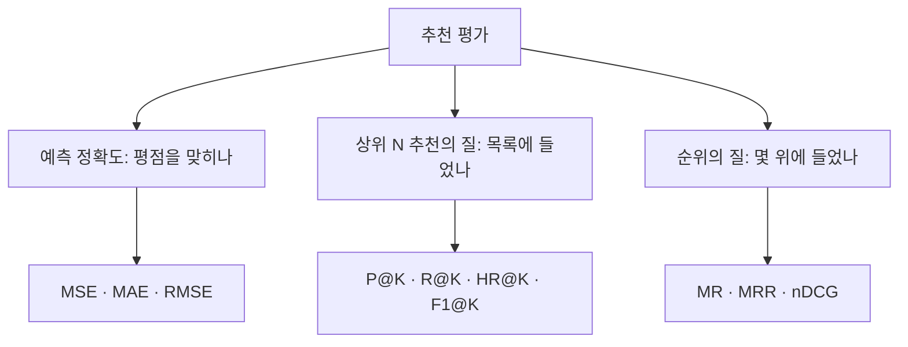



요약

추천이 좋은지 재는 눈금은 세 종류다. 평점을 얼마나 정확히 맞혔나(평균 오차), 추천 목록 안에 좋아할 것이 몇 개 들었나(정밀도·재현율), 좋아할 것이 목록 위쪽에 있나(순위 지표)다. 평점을 정확히 맞혀도 목록의 맨 위가 엉망이면 사용자는 만족하지 못하므로, 실제 추천에는 순위를 보는 지표가 중요하다. 지표마다 놓치는 면이 있어 여러 개를 함께 쓴다.

## 예시로 보기

**평점 맞히기.** 실제 평점 $$r = [5, 4, 3, 2, 1]$$, 예측 $$\hat r = [4, 5, 2, 1, 5]$$. 오차는 1, 1, 1, 1, 4다[^1][^2].

| 지표 | 계산 | 값 |
|---|---|---|
| MSE | $$\frac{1 + 1 + 1 + 1 + 16}{5}$$ | 4 |
| MAE | $$\frac{1 + 1 + 1 + 1 + 4}{5}$$ | 1.6 |
| RMSE | $$\sqrt{4}$$ | 2 |

크게 틀린 하나(4점 차이)가 MSE에서는 16으로 부풀어 전체를 좌우한다.

**목록 평가.** 추천 목록 $$[A, B, C, D, E]$$, 사용자가 실제로 좋아한 것(관련 항목) $$\{B, D, F, G\}$$[^3][^4][^5].

| 지표 | 계산 | 값 |
|---|---|---|
| Precision@5 | 목록 5개 중 관련 2개 | 0.4 |
| Recall@5 | 관련 4개 중 목록에 든 2개 | 0.5 |
| HR@5 | 관련 항목이 하나라도 들었나 | 1 |

**순위 평가.** 관련 항목이 $$\{B, D\}$$면 B는 2위, D는 4위다[^6][^7][^8].

| 지표 | 계산 | 값 |
|---|---|---|
| MR | $$\frac{2 + 4}{2}$$ | 3 |
| RR | 첫 관련 항목 순위 2의 역수 | 0.5 |
| DCG@5 | $$\frac{1}{\lg 3} + \frac{1}{\lg 5}$$ | 1.062 |
| IDCG@5 | 이상적 순서 [B, D, …]: $$\frac{1}{\lg 2} + \frac{1}{\lg 3}$$ | 1.631 |
| nDCG@5 | $$\frac{1.062}{1.631}$$ | 0.651 |

검증: 위 세 표, MRR이 같아도 nDCG가 다른 예, 카드 C2 — [43_recommender-metrics_verify.py](/Hongs_Blog/studies/data-science/code/43_recommender-metrics_verify/)

## 정의

추천 시스템은 세 가지로 평가한다. ① 예측 정확도(평점을 얼마나 정확히 추정하나) ② 상위 N 추천의 질(목록에 관련 항목이 얼마나 들었나) ③ 순위의 질(관련 항목이 얼마나 위에 있나)[^9].

세 갈래는 묻는 것이 다르다. 왼쪽부터 점수가 맞는지, 좋아할 것이 목록에 들었는지, 몇 위에 들었는지를 본다[^s2].

**예측 정확도**[^1][^2]. $$\hat r_i$$는 예측 평점, $$r_i$$는 실제 평점이다.

$$MSE = \frac1N\sum_{i=1}^{N}(\hat r_i - r_i)^2, \qquad MAE = \frac1N\sum_{i=1}^{N}\vert \hat r_i - r_i\vert , \qquad RMSE = \sqrt{MSE}$$

MSE는 큰 실수를 세게 벌하지만 이상치에 민감하고 단위가 제곱이라 읽기 어렵다. MAE는 오차가 그대로(직선으로) 더해져 읽기 쉽고 이상치에 덜 흔들리지만 큰 실수를 덜 벌한다. RMSE는 큰 실수를 세게 벌하면서 단위를 평점 단위로 되돌린다. 셋 다 순위를 보지 않는다. 오차가 낮다고 좋은 추천 목록인 것은 아니다[^2].

**상위 N 평가**[^3][^4][^5]. $$Rec_u^K$$는 사용자 $$u$$에게 추천한 상위 $$K$$개, $$Rel_u$$는 $$u$$의 관련 항목 집합이다. 사용자 전체($$U$$)에 대해서는 평균을 낸다.

$$P@K(u) = \frac{\vert Rec_u^K \cap Rel_u\vert }{K}, \quad R@K(u) = \frac{\vert Rec_u^K \cap Rel_u\vert }{\vert Rel_u\vert }, \quad HR@K(u) = \mathbf 1\left(\vert Rec_u^K \cap Rel_u\vert  > 0\right)$$

정밀도는 목록의 순도(만족과 관련), 재현율은 관련 항목을 얼마나 덮었나다. 둘을 합친 $$F1@K = \frac{2 \cdot P@K \cdot R@K}{P@K + R@K}$$도 쓴다. 재현율과 적중률은 많이 추천하면 오르고, 셋 다 순위를 보지 않는다.

**순위 평가**[^6][^7][^8]. $$r_1, \dots, r_m$$은 관련 항목들의 순위, $$r_u$$는 첫 관련 항목의 순위다.

$$MR(u) = \frac1m\sum_{j=1}^{m}r_j, \qquad RR(u) = \frac{1}{r_u}, \qquad DCG@K = \sum_{i=1}^{K}\frac{2^{rel_i} - 1}{\log_2(i + 1)}, \qquad nDCG@K = \frac{DCG@K}{IDCG@K}$$

$$rel_i \in \{0, 1\}$$은 $$i$$위의 관련 여부, $$\log_2(i + 1)$$은 아래 순위일수록 깎는 할인 인자, $$IDCG@K$$는 관련 항목을 맨 위로 몰아 놓은 이상적 순서의 DCG다. MR은 낮을수록, MRR과 nDCG는 높을수록 좋다.

| 지표 | 보는 것 | 관련 항목 여럿 | 순위에 민감 | 약점 |
|---|---|---|---|---|
| MR | 관련 항목의 평균 순위 | 본다 | 그렇다 | 이상치에 민감 |
| MRR | 첫 관련 항목의 순위 | 안 본다 | 아주 그렇다 | 뒤의 관련 항목 무시 |
| nDCG | 목록 전체의 순위 질 | 본다 | 그렇다 | 더 복잡 |

표는 슬라이드 p.20을 옮긴 것이다[^10]. MR은 낮을수록 좋아 직관적이지 않고, 1위와 2위의 차이를 101위와 102위의 차이와 같게 보며, 사용자나 자료가 달라지면 비교할 수 없다. MRR은 $$[A, B, C, D, E]$$에 관련 $$\{B, D\}$$인 목록과 관련 $$\{B\}$$ 하나뿐인 목록을 같은 0.5로 본다. nDCG는 관련 여부가 0/1이 아니라 1~5 평점일 때 값이 크게 바뀔 수 있고, 특정 할인 인자를 가정한다[^7][^11].

어느 지표 하나로 추천의 질을 다 잡을 수 없어 MR, MRR, nDCG 등을 함께 쓴다[^12].

## 연결

- 선수: [추천 시스템](/Hongs_Blog/studies/data-science/recommender-systems/), [분류 평가 지표](/Hongs_Blog/studies/data-science/classification-metrics/)(정밀도·재현율·F1의 원래 뜻)
- 순위를 직접 학습하는 방법: [BPR](/Hongs_Blog/studies/data-science/one-class-cf/)
- 할인 인자의 로그: [로그](/Hongs_Blog/studies/college-math/logarithm/)

## 확인 문제

**C1** Precision@K, Recall@K, MRR, nDCG@K의 식을 쓰라.

**답:** $$P@K = \frac{\vert Rec^K \cap Rel\vert }{K}$$, $$R@K = \frac{\vert Rec^K \cap Rel\vert }{\vert Rel\vert }$$, $$RR = \frac{1}{r_u}$$($$r_u$$는 첫 관련 항목 순위)를 사용자 평균한 것이 MRR, $$nDCG@K = \frac{DCG@K}{IDCG@K}$$, $$DCG@K = \sum_{i=1}^{K}\frac{2^{rel_i} - 1}{\log_2(i + 1)}$$.

**C2** 추천 목록 $$[X, Y, Z, W]$$에 관련 항목은 $$\{Z\}$$ 하나다. P@4, R@4, RR, nDCG@4를 구하라.

**답:** P@4 = 0.25, R@4 = 1, RR = $$\frac13$$, nDCG@4 = $$\frac{1/\log_2 4}{1/\log_2 2} = 0.5$$[^s1].

**C3** RMSE가 낮은 모델이 상위 5개 추천에서는 더 나쁠 수 있는 이유를 설명하라.

**답:** RMSE는 모든 평점의 크기 오차를 고르게 본다. 추천에서 중요한 것은 좋아할 아이템의 순서인데, 예를 들어 두 아이템의 예측이 4.20과 4.23처럼 순서만 뒤바뀌어도 오차는 작지만 목록 맨 위가 틀린다. 평점의 분포를 잘 맞히는 것과 순위를 잘 매기는 것은 다르다[^2].

[^1]: 3-2학기/데이터 과학/1.수업자료/11.11-2_eval-rec.pdf, p.11
[^2]: 같은 자료, p.12
[^3]: 같은 자료, p.13
[^4]: 같은 자료, p.14
[^5]: 같은 자료, p.15
[^6]: 같은 자료, p.16
[^7]: 같은 자료, p.17
[^8]: 같은 자료, p.18
[^9]: 같은 자료, p.10
[^10]: 같은 자료, p.20
[^11]: 같은 자료, p.19
[^12]: 같은 자료, p.21
[^s1]: 에이전트 보충. 카드 C2는 원본에 없다. 검증 코드로 계산했다.
[^s2]: 에이전트 보충. 다이어그램 1개는 원본에 없다. 문서 `정의`의 세 갈래와 지표 목록(원본 11-2 p.10~19)을 근거로 그렸다.

