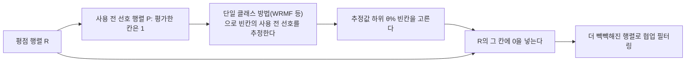



요약

평점표는 95% 넘게 비어 있다. 그런데 빈칸 중에는 "관심이 없어서 아예 안 본" 아이템이 많다. 0 주입은 먼저 사용자마다 각 아이템을 써 보기 전에 얼마나 끌렸을지(사용 전 선호)를 추정하고, 가장 끌리지 않았을 빈칸에만 0을 넣는다. 그러면 표가 빽빽해져 어떤 추천 방법이든 비교할 칸이 늘고, 0을 넣은 아이템은 추천 후보에서도 뺀다. 다만 어느 빈칸을 0으로 볼지 정하는 기준이 틀리면 좋아할 아이템까지 지워 버린다.

## 예시로 보기

협업 필터링은 평점 행렬에 기대는데, 원소의 95% 이상이 비어 있다. 그래서 정확도가 낮고, 차가운 시작 문제가 생기고, 추천할 수 있는 범위가 좁다[^1].

사용자 1은 아이템 1, 2에 5, 4를, 사용자 2는 아이템 3, 4에 4, 5를 주었다. 함께 평가한 아이템이 없어 둘의 유사도를 계산할 수 없다. 두 사용자에게 관심 없을 아이템(사용 전 선호 추정이 낮은 것)에 0을 넣으면 $$[5, 4, 0, 0, 0]$$, $$[0, 0, 4, 5, 0]$$이 되어 피어슨 상관계수 −0.653을 계산할 수 있다. 서로 다른 것을 좋아한다는 정보가 생긴다[^2][^s1].

검증: 0 주입 전후의 유사도, 슬라이드 p.14의 θ = 20% 예, 카드 C2 — [46_zero-injection_verify.py](/Hongs_Blog/studies/data-science/code/46_zero-injection_verify/)

## 정의

**사용자의 선호**는 두 부분이다[^3].

- **사용 전 선호:** 실제로 써 보기 전의 선호("좋아 보인다").
- **사용 후 선호:** 써 본 경험으로 생긴 선호(평점).

평가한 아이템은 평점과 상관없이 실제로 썼으므로 사용 전 선호가 높다. 평가하지 않은 아이템은 아마 사용 전 선호가 낮거나 아직 모르는 것이다[^3]. 평가하지 않은 아이템 중 사용 전 선호가 낮은 것을 **관심 없는 아이템**이라 부른다. 이것으로 사용자의 부정적 선호를 잡을 수 있다[^4].

**관심 없는 아이템을 쓰는 법**[^5]: ① 관심 있는 아이템과 관심 없는 아이템을 함께 써서 추천한다 ② 관심 없는 아이템을 추천 후보에서 뺀다.

**0 주입의 과정**[^6][^7]:

1. **바꾸기:** 평점 행렬 $$R$$을 사용 전 선호 행렬 $$P$$로 바꾼다. 평가한 칸은 모두 1(사용 전 선호가 높다고 안전하게 볼 수 있다), 평가하지 않은 칸은 비워 둔다.
2. **사용 전 선호 추정:** $$P$$에 WRMF 같은 단일 클래스 방법을 돌려 빈칸의 사용 전 선호를 추정한다.
3. **평점 행렬 보강:** 추정값이 가장 낮은 빈칸(하위 $$\theta\%$$)만 "확실히 관심 없는" 아이템으로 보고 $$R$$에 0을 넣는다. 그 아이템은 추천 후보에서도 뺀다. 0을 넣은 행렬 $$Z$$를 아무 협업 필터링 방법에 넣는다.

0은 원래의 평점 행렬 R에 들어간다. P는 어느 칸에 0을 넣을지 고르는 데에만 쓰인다[^s2].

$$\theta$$를 키울수록 0이 많아져 행렬이 빽빽해진다. 슬라이드 p.14의 추정값에서 1이 아닌 칸 9개는 0.1, 0.9, 0.8, 0.2, 0.8, 0.4, 0.1, 0.8, 0.3이고, $$\theta = 20\%$$이면 가장 낮은 0.1 두 칸에 0을 넣는다[^7][^s1].

**효과**[^8]. 0이 들어가 행렬이 빽빽해지면, 함께 산 아이템이 없던 두 사용자 사이에도 유사도를 계산할 수 있다(사용자 기반). 아이템 기반에서는 아이템 하나가 아니라 여러 아이템으로 예측한다. 실험에서 0 주입은 어떤 협업 필터링 방법이든 정확도를 높였다[^9].

## 활용

- 슬라이드의 질문 "PureSVD는 왜 좋아지나?"[^9]: PureSVD는 모든 빈칸을 0으로 채워 좋아할 아이템까지 "싫어함"으로 다룬다. 0 주입 뒤에는 확실히 관심 없는 칸만 0이 되고, 그 아이템은 후보에서도 빠진다. 남은 빈칸의 점수가 덜 왜곡된다[^s1].
- 흔한 실수: $$\theta$$를 너무 크게 잡는 것. 몰라서 비어 있던 좋아할 아이템까지 0으로 지워 추천 범위가 좁아진다.

## 연결

- 선수: [단일 클래스 협업 필터링](/Hongs_Blog/studies/data-science/one-class-cf/)(사용 전 선호 추정), [협업 필터링](/Hongs_Blog/studies/data-science/collaborative-filtering/)(보강한 행렬을 쓰는 곳)
- 빈칸을 무엇으로 채우나의 다른 예: [데이터 정제](/Hongs_Blog/studies/data-science/data-cleaning/)의 결측값 처리

## 확인 문제

**C1** 사용 전 선호와 사용 후 선호를 구별하고, 0 주입의 세 단계를 쓰라.

**답:** 사용 전 선호는 써 보기 전의 끌림, 사용 후 선호는 써 본 뒤의 평가(평점)다. ① 평점 행렬을 평가했으면 1인 사용 전 선호 행렬로 바꾼다 ② 단일 클래스 방법으로 빈칸의 사용 전 선호를 추정한다 ③ 추정값이 가장 낮은 하위 $$\theta\%$$ 빈칸에 0을 넣고, 그 아이템을 후보에서 뺀다.

**C2** 사용자의 빈칸이 100개이고 $$\theta = 80\%$$다. 0을 넣는 칸과 추천 후보로 남는 빈칸은 각각 몇 개인가?

**답:** 0을 넣는 칸 80개, 남는 빈칸 20개. 남은 20개 중에서 추천한다[^s1].

**C3** 평가한 아이템은 평점이 1점이어도 사용 전 선호를 높게(1) 보는 이유는?

**답:** 평점이 낮은 것은 써 본 뒤의 평가(사용 후 선호)가 나빴다는 뜻이다. 그래도 써 보기로 고른 것 자체가 써 보기 전에 끌렸다는 뜻이라 사용 전 선호는 높다.

[^1]: 데이터 과학 12회 강의 자료 「12-2_sparsity」, p.9
[^2]: 같은 자료, p.15
[^3]: 같은 자료, p.10 (Hwang et al., IEEE ICDE 2016)
[^4]: 같은 자료, p.11
[^5]: 같은 자료, p.12
[^6]: 같은 자료, p.13
[^7]: 같은 자료, p.14
[^8]: 같은 자료, p.15
[^9]: 같은 자료, p.16
[^s1]: 보충 두 사용자 예와 유사도 값, θ = 20% 계산, PureSVD 질문의 답, 흔한 실수, 카드 C2는 원본에 없다. 검증 코드로 확인했다.
[^s2]: 보충 다이어그램 1개는 원본에 없다. 문서 `정의`의 0 주입 과정과 효과(원본 12-2 p.13~15)를 근거로 그렸다.

