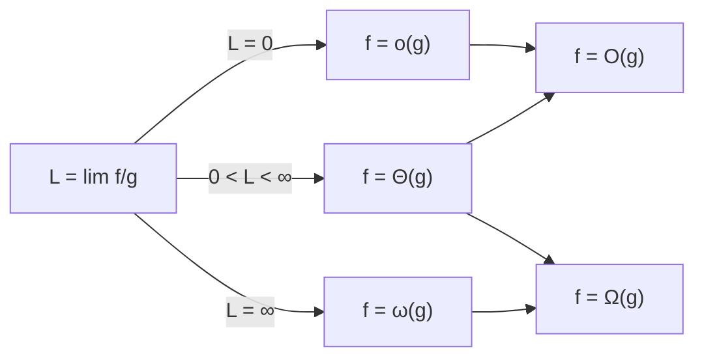



요약

알고리즘의 비용을 "입력이 커질 때 얼마나 빨리 커지는가"로만 비교하려고, 상수배와 작은 항을 버린 표기다. O는 "많아야 이 정도로", Ω는 "적어도 이 정도로", Θ는 "딱 이 정도로" 자란다는 뜻이다. 그래서 컴퓨터가 몇 배 빠른지와 상관없이 알고리즘끼리 비교할 수 있다. 다만 "입력이 충분히 클 때"의 이야기라서, 작은 입력이나 큰 상수가 중요한 실제 상황에서는 O가 작은 쪽이 더 느릴 수 있다.

## 예시로 보기

두 정렬 프로그램의 비교 횟수가 $$A(n) = 3n^2 + 5n + 7$$, $$B(n) = 50\,n\lg n$$이라 하자.

| $$n$$ | 10 | 100 | 1,000 | 10,000 |
|---|---|---|---|---|
| $$A(n)$$ | 357 | 30,507 | 3,005,007 | 300,050,007 |
| $$B(n)$$ | 1,661 | 33,219 | 498,289 | 6,643,856 |

작은 $$n$$에서는 $$A$$가 빠르지만 $$n$$이 커지면 $$B$$가 크게 앞선다. $$A$$에서 $$5n + 7$$은 $$n$$이 커지면 $$3n^2$$에 비해 무시할 만하고, 3이나 50 같은 상수는 컴퓨터를 바꾸면 달라진다. 그래서 $$A$$를 $$\Theta(n^2)$$, $$B$$를 $$\Theta(n\lg n)$$으로 요약한다. $$3n^2$$의 3이 아래 정의의 상수 $$c$$, "충분히 큰 $$n$$"의 경계가 $$n_0$$이다.

두 축이 모두 로그 눈금이라, 차수가 큰 $$A$$가 더 가파르게 오른다. 두 선은 $$n = 112$$에서 엇갈린다. $$c = 1$$로 잡으면 $$B(n) \le A(n)$$이 $$n_0 = 112$$부터 계속 맞는다[^s1].

## 정의

정의

음이 아닌 함수 $$f, g: \mathbb{N} \to \mathbb{R}$$($$\mathbb{R}$$은 실수 전체)에 대해[^1]
- $$f = O(g)$$: $$\exists c > 0\ \exists n_0\ \forall n \ge n_0\ \ f(n) \le c\,g(n)$$($$\forall$$은 "모든") — 위로 묶임
- $$f = \Omega(g)$$: $$\exists c > 0\ \exists n_0\ \forall n \ge n_0\ \ f(n) \ge c\,g(n)$$ — 아래로 묶임
- $$f = \Theta(g)$$: $$f = O(g)$$이고 $$f = \Omega(g)$$ — 같은 차수
- $$f = o(g)$$: $$\forall c > 0\ \exists n_0\ \forall n \ge n_0\ \ f(n) < c\,g(n)$$ — 확실히 느림. $$\lim f/g = 0$$($$\lim$$은 한없이 가까이 갈 때 다가가는 값(극한))과 같다.
- $$f = \omega(g)$$: $$g = o(f)$$ — 확실히 빠름

"$$f = O(g)$$"의 등호는 "$$f \in O(g)$$"(집합에 속함)를 관례로 쓴 것이다. 그래서 $$n = O(n^2)$$은 참이지만 $$n^2 = O(n)$$은 거짓이고, 좌우를 바꿔 읽지 않는다.

**설계 이유.** 상수 $$c$$를 허용하는 것은 기계의 속도, 언어, 컴파일러 같은 상수배 차이를 지우기 위해서다. $$n_0$$을 허용하는 것은 작은 입력의 사정을 무시하기 위해서다. 한정기호의 순서 $$\exists c\,\exists n_0\,\forall n$$은 "상수와 경계를 **먼저** 정해 두면 그 뒤로는 **모든** $$n$$에서 성립"이라는 뜻이다([술어와 한정기호](/Hongs_Blog/studies/discrete-math/predicate-logic/)).

**동치인 다른 정의.** 극한 $$L = \lim_{n \to \infty} f(n)/g(n)$$이 있으면 $$0 < L < \infty$$이면 $$\Theta$$, $$L = 0$$이면 $$o$$(따라서 $$O$$), $$L = \infty$$이면 $$\omega$$(따라서 $$\Omega$$)다. 극한은 [로피탈 정리](/Hongs_Blog/studies/calculus/lhopital-growth/)로 계산할 때가 많다. 단, 극한이 없어도 $$O$$, $$\Omega$$는 맞을 수 있다.

화살표는 '이면'이다. $$o$$와 $$\Theta$$는 모두 $$O$$에 들고, $$\omega$$와 $$\Theta$$는 모두 $$\Omega$$에 든다. 극한이 없는 함수 쌍은 맨 왼쪽 갈림길을 쓸 수 없어 정의로 직접 따진다[^s2].

**해당하는 예:** $$3n^2 + 5n + 7 = \Theta(n^2)$$, $$\lg n = O(\sqrt n)$$(사실 $$o$$), $$n! = \omega(2^n)$$. **해당하지 않는 예:** $$n^2 \ne O(n)$$(어떤 $$c$$도 $$n > c$$에서 깨짐), $$n$$과 "$$n$$이 짝수면 $$n^2$$, 홀수면 1"인 $$g$$는 $$O$$도 $$\Omega$$도 아니다(아래 카드 C4).

## 증명

증명 펼치기

1. *$$3n^2 + 5n + 7 = \Theta(n^2)$$:* $$n \ge 1$$이면 $$5n \le 5n^2$$, $$7 \le 7n^2$$이라 $$3n^2 + 5n + 7 \le 15n^2$$ ($$c = 15$$, $$n_0 = 1$$). 또 $$3n^2 + 5n + 7 \ge 3n^2$$ ($$c = 3$$). 
2. *로그의 밑은 상관없다:* $$\log_a n = \frac{\log_b n}{\log_b a}$$이고 $$\frac{1}{\log_b a}$$는 상수라 $$\log_a n = \Theta(\log_b n)$$. 그래서 $$O(\log n)$$에는 밑을 적지 않는다.
3. *다항식:* $$a_d > 0$$인 $$d$$차 다항식은 $$\Theta(n^d)$$. 1과 같은 방법으로 낮은 차수 항을 $$n^d$$으로 올려 묶는다.
4. *합과 곱:* $$f_1 = O(g_1)$$, $$f_2 = O(g_2)$$이면 $$f_1 + f_2 = O(\max(g_1, g_2))$$, $$f_1 f_2 = O(g_1 g_2)$$. 상수 $$c_1, c_2$$와 $$n_0$$을 각각 합치거나 곱하면 된다. ∎

### 스스로 설명해 보기

1. 증명 1에서 "5n ≤ 5n²"이 맞는 조건과, 그 조건이 n₀으로 들어가는 방식은?

$$n \ge 1$$이어야 한다($$n < 1$$이면 $$n^2 < n$$). 그래서 $$n_0 = 1$$로 두고 "그 뒤의 모든 $$n$$"만 약속한다.

2. 증명 2에서 1/log_b a가 "상수"라 정의의 c가 될 수 있는 이유는?

$$a$$, $$b$$는 고정된 밑이라 $$n$$에 따라 변하지 않는다. $$O$$의 정의는 $$n$$과 무관한 $$c$$ 하나만 요구한다.

이 정의의 핵심 아이디어는?

"모든 $$n$$에서 정확히 비교"를 포기하고 "상수배를 허용하고 충분히 큰 $$n$$에서만"으로 약하게 만들어, 기계와 구현의 차이를 지운 채 알고리즘의 본질적인 차이만 남긴다.

같은 아이디어를 쓰는 다른 상황은?

[극한](/Hongs_Blog/studies/calculus/limits/)의 $$\forall\varepsilon\,\exists\delta$$, 수치 해석의 "오차는 $$O(h^2)$$"(h가 0으로 갈 때)도 같은 모양이다.

## 예제

다음 함수를 느린 것부터 늘어놓는다: $$n\lg n$$, $$2^n$$, $$\sqrt n$$, $$n!$$, $$\lg n$$, $$n^{1.5}$$, $$n^2$$, $$n$$.

1. *로그와 거듭제곱:* $$\lg n = o(n^\varepsilon)$$이라 $$\lg n$$이 가장 느리고, 거듭제곱은 지수 순서대로 $$\sqrt n$$, $$n$$, $$n^{1.5}$$, $$n^2$$.
2. *로그가 곱해진 것:* $$n\lg n$$은 $$n$$보다 빠르고, $$\frac{n\lg n}{n^{1.5}} = \frac{\lg n}{\sqrt n} \to 0$$이라 $$n^{1.5}$$보다 느리다.
3. *지수와 계승:* $$n^2 = o(2^n)$$, $$2^n = o(n!)$$.
4. *결과:* $$\lg n \prec \sqrt n \prec n \prec n\lg n \prec n^{1.5} \prec n^2 \prec 2^n \prec n!$$.

두 축 모두 로그 눈금이다. 점선 $$n = 16$$ 왼쪽에서는 선들이 엉켜 있다. 예를 들어 $$4 < n < 16$$에서는 $$\lg n$$이 $$\sqrt n$$보다 크다. $$n$$이 커지면 여덟 선이 서열대로 갈라지고, $$2^n$$과 $$n!$$은 곧 그림 위로 빠져나간다[^s1].

검증: $$3n^2 \le 3n^2 + 5n + 7 \le 15n^2$$($$n \le 10^5$$), 밑이 다른 로그의 비가 일정, $$n = 64$$에서 서열, 카드 C4의 반례, 오해의 수치, 예시 표의 값 — [24_asymptotic-notation_verify.py](/Hongs_Blog/studies/discrete-math/code/24_asymptotic-notation_verify/)

## 활용

- **알고리즘의 비교.** 탐색 $$O(n)$$ 대 $$O(\log n)$$, 정렬 $$O(n^2)$$ 대 $$O(n\log n)$$처럼 한 줄로 성능을 말한다. 최악·평균·최선은 따로 적는다(예: 퀵정렬은 평균 $$\Theta(n\log n)$$, 최악 $$\Theta(n^2)$$).
- **입력 크기 어림.** 1초에 $$10^8$$번 연산한다고 치면, $$O(n^2)$$은 $$n \approx 10^4$$, $$O(n\log n)$$은 $$n \approx 5 \times 10^6$$까지 1초 안에 끝난다. 문제의 제한에서 필요한 복잡도를 거꾸로 짐작한다.
- **공간 복잡도.** 메모리 사용량에도 같은 표기를 쓴다.
- 알고리즘에서: 파이썬으로 풀 때는 위의 $$10^8$$보다 낮춰 1초에 대략 천만 번으로 잡는다. 실제로 잰 값과 제한별로 쓸 수 있는 복잡도 표는 [시간 복잡도로 방법 고르기](/Hongs_Blog/studies/algorithms/complexity-budget/)에 있다.

## 연결

- 선수: [합의 계산과 어림](/Hongs_Blog/studies/discrete-math/sums-asymptotics/), [술어와 한정기호](/Hongs_Blog/studies/discrete-math/predicate-logic/), [로그함수와 로그 스케일](/Hongs_Blog/studies/college-math/log-scale/)
- 증가 서열의 증명: [로피탈 정리와 증가 속도](/Hongs_Blog/studies/calculus/lhopital-growth/), [거듭제곱함수와 지수함수 비교](/Hongs_Blog/studies/college-math/power-vs-exponential/)
- 이어지는 개념: [분할 정복 점화식과 마스터 정리](/Hongs_Blog/studies/discrete-math/master-theorem/)

## 자주 하는 오해

"O가 작은 알고리즘이 늘 더 빠르다"

틀렸다. $$O$$는 성능의 순위표처럼 쓰여서 모든 입력에서 비교가 되는 것처럼 느껴진다. 하지만 $$O$$는 상수와 작은 입력을 일부러 버린 표기다. $$100n$$과 $$n^2$$은 $$n < 100$$에서 $$n^2$$이 더 작다($$n = 50$$이면 5,000 대 2,500). 그래서 실제 정렬 라이브러리는 작은 배열에서 $$O(n^2)$$인 삽입 정렬로 바꿔 쓰기도 한다. $$O$$로 큰 그림을 보고, 실제 크기에서는 재어 본다.

## 확인 문제

**C1** f = O(g)의 정의를 한정기호로 쓰라.

**답:** $$\exists c > 0\ \exists n_0\ \forall n \ge n_0:\ f(n) \le c\,g(n)$$.

**흔한 오답:** $$\forall c$$로 쓰는 것. 그것은 더 강한 $$o(g)$$의 정의다.

**C2** 3n² + 5n + 7 = Θ(n²)을 상수 c₁, c₂, n₀을 구체적으로 제시해 증명하라.

**답:** $$n \ge 1$$이면 $$3n^2 \le 3n^2 + 5n + 7 \le 3n^2 + 5n^2 + 7n^2 = 15n^2$$. $$c_1 = 3$$, $$c_2 = 15$$, $$n_0 = 1$$.

**C3** 다음 중 서로 Θ인 쌍을 고르라. (가) lg n과 log₁₀ n (나) 2ⁿ과 3ⁿ (다) n²과 n² + 1000n (라) n과 n lg n

**답:** (가), (다). (가)는 비가 상수 $$\lg 10$$, (다)는 비가 1로 간다. (나)는 $$(2/3)^n \to 0$$이라 $$2^n = o(3^n)$$, 지수의 **밑**은 상수배가 아니다. (라)는 비 $$\lg n$$이 한없이 커진다.

**C4** f = O(g)도 f = Ω(g)도 아닌 두 함수를 만들라.

**답:** $$f(n) = n$$, $$g(n) = n^2$$($$n$$ 짝수), $$1$$($$n$$ 홀수). 홀수 $$n$$에서 $$f/g = n$$이 한없이 커져 $$O$$가 아니고, 짝수 $$n$$에서 $$f/g = 1/n \to 0$$이라 $$\Omega$$도 아니다.

[^1]: Lehman·Leighton·Meyer, *Mathematics for Computer Science*, 14.7절 "Asymptotic Notation". Cormen, Leiserson, Rivest, Stein, *Introduction to Algorithms* 3판, 3.1절 "Asymptotic notation".
[^s1]: 에이전트 보충. 그림 두 장은 원본에 없다. [24_asymptotic-notation_plot.py](/Hongs_Blog/studies/discrete-math/code/24_asymptotic-notation_plot/)로 그렸고, 예시 표의 값, $$n \ge 112$$에서 $$A(n) > B(n)$$(그 아래에서는 $$A(n) \le B(n)$$), $$n = 40$$과 $$64$$에서 여덟 함수의 서열, $$\lg 8 > \sqrt 8$$을 같은 코드로 확인했다.
[^s2]: 에이전트 보충. 다이어그램 1개는 원본에 없다. 정의 섹션의 다섯 기호 정의와 '동치인 다른 정의'(극한으로 판정)를 그렸다.

