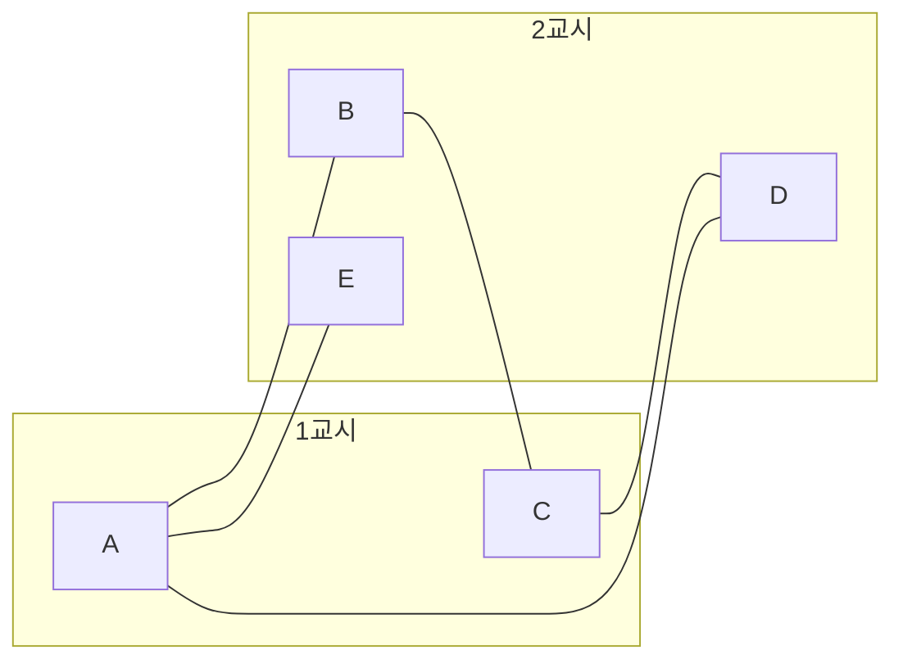



요약

이웃한 정점끼리는 다른 색이 되도록 정점에 색을 칠하는 문제다. 시험 시간표(같은 학생이 듣는 과목은 다른 시간), 레지스터 할당(동시에 살아 있는 변수는 다른 레지스터)이 모두 이 모양이다. 두 색으로 충분한지는 "홀수 길이 사이클이 있는가"만 보면 되고 빠르게 판정된다. 그런데 세 색부터는 판정이 어려운(NP-완전) 문제가 되어, 실제로는 빠른 탐욕 방법으로 적당히 적은 색을 쓴다.

## 예시로 보기

과목 A~E의 시험 시간을 정한다. 같은 학생이 듣는 두 과목을 간선으로 잇는다: A–B, B–C, C–D, D–A(네 과목이 고리), 그리고 A–E.

- A를 1교시로 두면 이웃 B, D, E는 2교시, B와 D의 이웃 C는 다시 1교시다. 두 교시로 충분하다.
- 여기에 A–C를 더하면 A, B, C가 서로 이웃한 삼각형이 된다. 셋이 모두 달라야 하므로 두 교시로는 부족하다.

첫 그래프는 사이클 A–B–C–D–A의 길이가 4(짝수)이고, 둘째에는 길이 3(홀수) 사이클이 생겼다. 교시가 아래 정의의 색, 과목이 정점이다.

첫 그래프의 간선은 모두 1교시 무리와 2교시 무리 사이를 건넌다. 같은 무리 안을 잇는 간선은 없다. 여기에 A–C를 더하면 1교시 안을 잇는 간선이 생긴다[^s2].

## 정의

정의

- **$$k$$-색칠**: 각 정점에 $$\{1, \dots, k\}$$ 중 하나를 주되, 간선으로 이어진 두 정점은 다른 색을 받게 하는 것.
- **채색수** $$\chi(G)$$: $$G$$를 칠할 수 있는 가장 작은 $$k$$.
- **이분 그래프**: 정점을 두 무리 $$L$$, $$R$$로 나눠 모든 간선이 $$L$$과 $$R$$ 사이에만 있게 할 수 있는 그래프. 곧 2-색칠이 되는 그래프다[^1].

이분 그래프 판정

그래프가 이분 그래프이다 $$\iff$$ 홀수 길이의 사이클이 없다.

증명

($$\Rightarrow$$) 사이클을 따라가면 $$L, R, L, R, \dots$$를 번갈아 지난다. 출발점으로 돌아오려면 짝수 번 건너야 하므로 사이클의 길이는 짝수다.

($$\Leftarrow$$) 연결 성분마다 따로 칠하면 되므로 연결 그래프라 하자. 한 정점 $$s$$에서의 거리 $$d(v)$$를 구해($$s$$에서 BFS) $$d(v)$$가 짝수면 색 1, 홀수면 색 2를 준다. 같은 색끼리 간선 $$\{u, v\}$$가 있다고 하자. $$s$$에서 $$u$$로 가는 최단 경로, 간선 $$u$$–$$v$$, $$v$$에서 $$s$$로 돌아오는 최단 경로를 이으면 길이가 $$d(u) + 1 + d(v)$$인 닫힌 보행이다. $$d(u)$$와 $$d(v)$$의 짝홀이 같아 이 길이는 홀수다. 홀수 길이 닫힌 보행에는 홀수 길이 사이클이 들어 있다(닫힌 보행을 겹치는 정점에서 두 개로 자르면 하나는 홀수 길이다. 이를 되풀이한다). 가정에 모순이다. ∎

그래서 [BFS](/Hongs_Blog/studies/discrete-math/connectivity/) 한 번으로 $$O(n + m)$$에 2-색칠을 찾거나, 홀수 사이클이 있음을 알 수 있다. [트리](/Hongs_Blog/studies/discrete-math/trees/)는 사이클이 없어 늘 이분 그래프다.

**세 색부터.** 3-색칠이 되는지 판정하는 문제는 NP-완전이다[^2]. 대신 쉬운 상한은 있다.

탐욕 색칠

정점을 아무 순서로 보며, 이미 칠한 이웃이 쓰지 않은 가장 작은 색을 준다. 그러면 많아야 $$\Delta + 1$$색을 쓴다($$\Delta$$는 최대 차수). 그래서 $$\chi(G) \le \Delta + 1$$.

정점을 칠할 때 이미 칠한 이웃이 많아야 $$\Delta$$개라, $$\Delta + 1$$색 중 하나는 늘 비어 있기 때문이다. 평면에 그릴 수 있는 그래프(지도)는 4색이면 충분하다는 4색 정리도 있다[^2].

## 예제

**탐욕 색칠은 순서에 따라 결과가 다르다.** 경로 $$a$$–$$b$$–$$c$$–$$d$$는 이분 그래프라 $$\chi = 2$$다.

1. *좋은 순서 $$a, b, c, d$$:* 1, 2, 1, 2. 두 색.
2. *나쁜 순서 $$a, d, b, c$$:* $$a = 1$$, $$d = 1$$(이웃 $$c$$가 아직 안 칠해짐), $$b = 2$$($$a$$가 1), $$c = 3$$($$b$$가 2, $$d$$가 1). 세 색.
3. *교훈:* 탐욕 색칠은 $$\Delta + 1 = 3$$을 넘지는 않지만 최적은 보장하지 않는다. 차수가 큰 정점부터 칠하는 등 순서를 잘 고르면 대개 결과가 좋아진다.

검증: 예시의 두 시간표 그래프, 무작위 그래프 수천 개에서 "이분 ⇔ 홀수 사이클 없음"(전수 2-색칠과 사이클 전수 비교), BFS 색칠이 올바른 2-색칠, 탐욕 색칠이 늘 $$\Delta + 1$$ 이하, 경로의 나쁜 순서가 3색, $$C_5$$와 $$C_6$$, $$K_{3,3}$$ — [36_bipartite-coloring_verify.py](/Hongs_Blog/studies/discrete-math/code/36_bipartite-coloring_verify/)

## 활용

- **레지스터 할당.** 컴파일러는 동시에 살아 있는 변수끼리 간선을 이은 간섭 그래프를 만들고, 레지스터 수만큼의 색으로 칠한다. 칠할 수 없으면 일부 변수를 메모리로 내보낸다[^s1].
- **시간표·주파수 배정.** 겹치는 시험, 서로 간섭하는 기지국에 다른 시간·주파수를 준다.
- **이분 그래프의 짝짓기.** 사람–일, 학생–과목처럼 두 무리 사이의 관계는 이분 그래프이고, 가장 많은 짝을 찾는 이분 매칭이 여러 배정 문제의 기본이다.
- 알고리즘에서: 증가 경로를 찾아 짝을 하나씩 늘리는 방법은 [이분 매칭](/Hongs_Blog/studies/algorithms/bipartite-matching/)에 있다. 거리를 층 순서대로 적는 BFS 코드와, 간선이 같은 층이나 이웃한 층만 잇는다는 증명은 [너비 우선 탐색(BFS)](/Hongs_Blog/studies/algorithms/bfs/)에 있다. 격자 칸을 (행 + 열)의 홀짝으로 칠하면 이분 그래프라서, 정해진 걸음 수로 두 칸 사이를 가려면 그 걸음 수와 가로·세로 거리 합의 홀짝이 같아야 한다([미로 탈출 명령어](/Hongs_Blog/studies/algorithms/pg150365/)).

## 연결

- 선수: [경로와 연결성](/Hongs_Blog/studies/discrete-math/connectivity/)(BFS 거리로 칠하기)
- 특수한 경우: [트리](/Hongs_Blog/studies/discrete-math/trees/)는 늘 이분 그래프다.
- 어려운 문제의 친척: [해밀턴 사이클](/Hongs_Blog/studies/discrete-math/euler-hamilton/)도 NP-완전이다.

## 확인 문제

**C1** 다음 중 이분 그래프를 고르라. (가) 사이클 $$C_5$$ (나) 사이클 $$C_6$$ (다) $$K_{3,3}$$ (한쪽 셋과 다른 쪽 셋이 모두 이어진 그래프) (라) 삼각형에 꼬리 하나를 붙인 그래프

**답:** (나)와 (다). (가)는 길이 5, (라)는 길이 3인 홀수 사이클이 있다. (다)는 정의부터 두 무리로 나뉜다.

**C2** 홀수 길이 사이클이 있으면 두 색으로 칠할 수 없는 이유는?

**답:** 사이클을 따라가면 색이 1, 2, 1, 2, …로 번갈아야 한다. 길이가 홀수면 한 바퀴 돌아 출발점에 닿을 때 출발점과 다른 색이 되어야 하는데, 같은 정점이라 모순이다.

**C3** 탐욕 색칠이 최적이 아닌 예를 들라.

**답:** 경로 $$a$$–$$b$$–$$c$$–$$d$$를 $$a, d, b, c$$ 순서로 칠하면 1, 1, 2, 3으로 세 색을 쓴다. 이분 그래프라 두 색이면 충분하다.

[^1]: Lehman·Leighton·Meyer, *Mathematics for Computer Science*, 12장 "Simple Graphs"(색칠, 이분 그래프와 홀수 사이클).
[^2]: Rosen, *Discrete Mathematics and Its Applications* 7판, 10장(그래프 색칠, 4색 정리의 역사, 색칠 문제의 어려움). 3-색칠의 NP-완전성은 Cormen et al., *Introduction to Algorithms* 3판, 34장 문제 34-3. 4색 정리는 Appel과 Haken(1976)이 컴퓨터를 써서 증명했다.
[^s1]: 보충 그래프 색칠로 레지스터를 배정하는 방법은 Chaitin의 연구(1982)에서 시작된 표준 기법으로, 컴파일러 교재의 레지스터 할당 장에서 다룬다.
[^s2]: 보충 다이어그램 1개는 원본에 없다. '예시로 보기'의 시험 시간표 그래프와 두 교시 배정을 그렸다.

