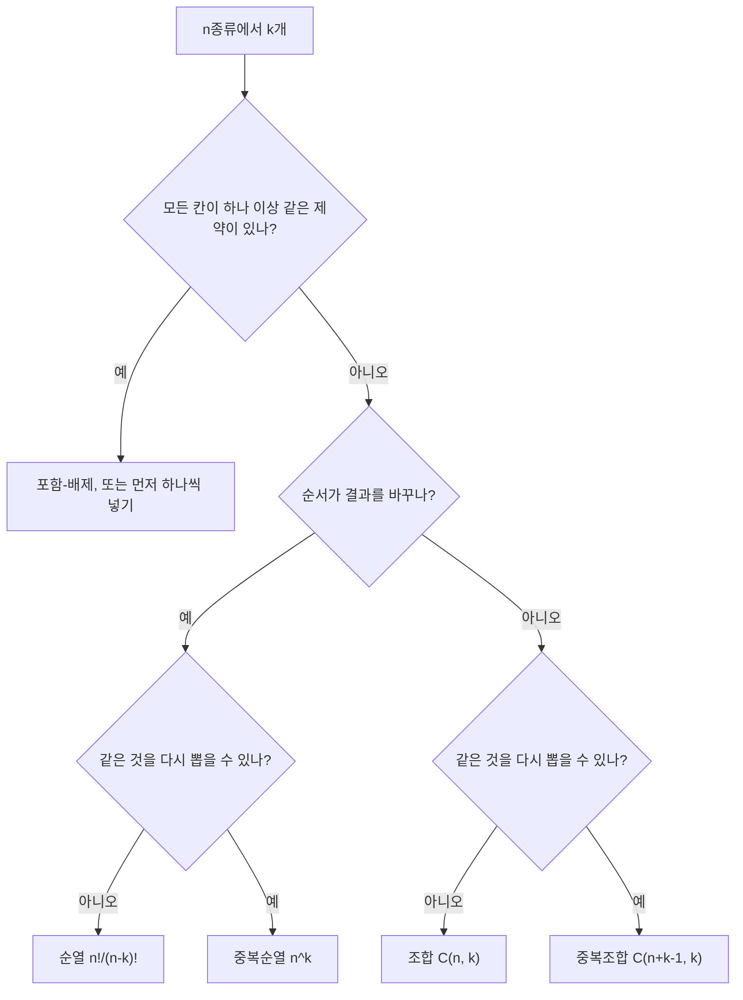


$$n$$종류에서 $$k$$개를 뽑는 문제는 공식이 넷이라 헷갈린다. 가르는 질문은 두 개다. **뽑은 순서가 결과를 바꾸는가**, **같은 것을 다시 뽑을 수 있는가**. 두 질문에 답하면 공식이 하나로 정해진다. 공식을 고르기 전에 가장 작은 경우를 손으로 세어 보면 틀린 공식을 걸러낸다[^1].

## 어느 쪽일까

**C1** (가) 동아리 10명 중 회장·부회장·총무를 뽑는 수 (나) 10명 중 대표 위원 3명을 뽑는 수. 각각 어느 공식이고 값은?

**답:** (가) 순열 $$P(10, 3) = 720$$. 직책이 있어 순서가 결과를 바꾸고, 한 사람이 두 직책을 맡지 않는다. (나) 조합 $$\binom{10}{3} = 120$$. 직책이 없어 같은 세 사람이면 같은 결과다.

**C2** (가) 숫자 0~9로 만드는 4자리 PIN의 수 (나) 도넛 5종류 중에서 12개를 사는 방법의 수. 각각 어느 공식이고 값은?

**답:** (가) 중복순열 $$10^4 = 10{,}000$$. 자리마다 순서가 있고 같은 숫자를 다시 써도 된다. (나) 중복조합 $$\binom{5 + 12 - 1}{12} = \binom{16}{12} = 1{,}820$$. 상자 안의 순서는 상관없고 같은 종류를 여러 개 살 수 있다.

**흔한 오답:** (나)를 $$5^{12}$$로 세는 것. 도넛을 고른 순서를 센 것이다.

**C3** (가) 로또 6/45에서 번호 6개를 고르는 방법 (나) 알파벳 26자로 만든 3자리 코드 중 같은 글자가 없는 것. 각각 어느 공식이고 값은?

**답:** (가) 조합 $$\binom{45}{6} = 8{,}145{,}060$$. 뽑힌 순서는 당첨과 무관하고 같은 번호는 두 번 나오지 않는다. (나) 순열 $$P(26, 3) = 15{,}600$$.

**C4** 서로 다른 작업 5개를 서버 3대에 나누되, 모든 서버가 적어도 하나를 받아야 한다. 네 공식 중 어느 것으로도 바로 안 되는 이유와 답을 쓰라.

**답:** "작업마다 서버를 고르는" 중복순열 $$3^5 = 243$$에서 빈 서버가 있는 경우를 빼야 한다. 빈 서버 조건은 겹치므로 [포함-배제](/Hongs_Blog/studies/discrete-math/inclusion-exclusion/)로 $$3^5 - 3 \cdot 2^5 + 3 \cdot 1^5 = 150$$.

검증: 네 칸 공식을 작은 $$n, k$$에서 전수 확인, 카드의 값, 전사 150을 전수로 확인 — [17_counting-formula-choice_verify.py](/Hongs_Blog/studies/discrete-math/code/17_counting-formula-choice_verify/)

## 결정적 차이

| | 같은 것 다시 뽑기 **불가** | 같은 것 다시 뽑기 **허용** |
|---|---|---|
| **순서가 결과를 바꿈** | 순열 $$P(n,k) = \dfrac{n!}{(n-k)!}$$ | 중복순열 $$n^k$$ |
| **순서 무관** | 조합 $$\dbinom{n}{k}$$ | 중복조합 $$\dbinom{n+k-1}{k}$$ |

판단을 돕는 질문은 이렇다.
- **순서:** 두 결과의 순서만 바꿨을 때 다른 결과로 치는가? (1등·2등, 자릿수, 줄 서기는 "예". 위원회, 손에 든 카드, 장바구니는 "아니오".)
- **중복:** 한 번 뽑은 것이 다시 후보가 되는가? (사람·번호 추첨은 "아니오". 숫자 자리·맛·종류는 "예".)
- **검산:** $$n = 3$$, $$k = 2$$처럼 작은 경우를 직접 늘어놓아 공식과 맞는지 본다.
- 알고리즘에서: 파이썬 `itertools`에서는 순열이 `permutations`, 중복순열이 `product(repeat=k)`, 조합이 `combinations`, 중복조합이 `combinations_with_replacement`라서, 작은 경우를 바로 늘어놓아 공식과 맞춰 볼 수 있다([완전탐색](/Hongs_Blog/studies/algorithms/brute-force/)). 백트래킹으로 직접 만들 때도 같은 두 질문이 다음 후보를 정한다. 방금 고른 수가 $$x$$일 때 다음 후보를 $$x + 1$$부터 보면 조합, $$x$$부터 보면 중복조합, 안 쓴 것 전부를 보면 순열, 전부를 보면 중복순열이다([재귀와 백트래킹 예제 사다리](/Hongs_Blog/studies/algorithms/backtracking-ladder/)).

## 둘 다 아닐 때

- **같은 것이 섞인 줄 세우기**는 네 칸 밖이다. 다항계수 $$\frac{k!}{k_1!\cdots k_r!}$$([중복을 허용하는 셈](/Hongs_Blog/studies/discrete-math/multiset-counting/)).
- **"모든 칸이 하나 이상"** 같은 제약은 포함-배제나 먼저 하나씩 넣고 나머지를 나누는 방법을 쓴다.
- **구별되지 않는 물건을 구별되지 않는 상자에** 나누는 수(정수의 분할)에는 간단한 닫힌 꼴이 없다. 점화식이나 [생성함수](/Hongs_Blog/studies/discrete-math/generating-functions/)로 센다.

위에서부터 질문에 하나씩 답하며 내려간다. 맨 아래 네 갈래가 '결정적 차이' 표의 네 칸이고, 맨 위 갈림길은 표 밖으로 나가는 경우다[^s1].

[^1]: Lehman·Leighton·Meyer, *Mathematics for Computer Science*, 15장 "Cardinality Rules". Rosen, *Discrete Mathematics and Its Applications* 7판, 6장(중복을 허용한 순열과 조합의 표).
[^s1]: 보충 다이어그램 1개는 원본에 없다. '결정적 차이' 표, 판단을 돕는 두 질문, '둘 다 아닐 때'의 제약 조건을 갈림길로 그렸다.

