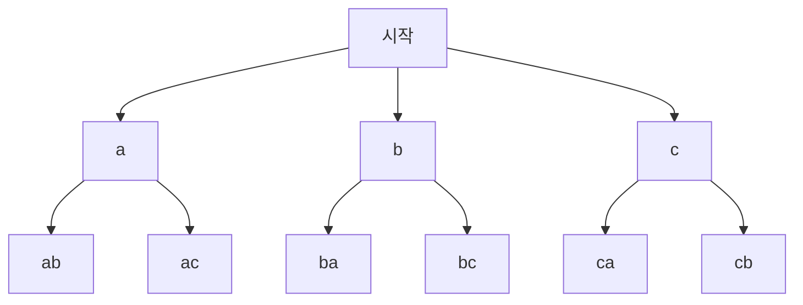



요약

경우의 수는 세 가지 도구로 거의 다 센다. 겹치지 않는 경우들은 더하고(합의 법칙), 차례로 고르는 선택은 곱하고(곱의 법칙), 세기 어려운 것은 세기 쉬운 것과 하나씩 짝지어 센다(전단사 법칙). 같은 것을 여러 번 세었다면 그 횟수로 나눈다(나눗셈 법칙). 합의 법칙은 경우들이 겹치지 않을 때만, 곱의 법칙은 각 단계의 선택지 수가 앞의 선택과 상관없이 일정할 때만 맞다.

## 예시로 보기

소문자 26자와 숫자 10자로 8자리 비밀번호를 만든다.

- *곱의 법칙:* 자리마다 36가지를 고르고 여덟 번 고르므로 $$36^8 \approx 2.82 \times 10^{12}$$가지.
- *여사건으로 세기:* "숫자가 하나 이상"은 직접 세기 번거롭다. 전체에서 "숫자가 하나도 없는" $$26^8$$가지를 빼면 $$36^8 - 26^8 \approx 2.61 \times 10^{12}$$가지다.
- *나눗셈 법칙:* 5명을 원탁에 앉힐 때 줄 세우기는 $$5! = 120$$가지인데, 한 자리씩 돌린 5가지 배치는 원탁에서 같은 것이다. 그래서 $$120 / 5 = 24$$가지다.

자리마다의 선택이 아래 정리의 "단계", 숫자가 없는 경우가 빼는 쪽 집합, 돌려서 같은 5가지가 나눗셈 법칙의 $$k$$다.

## 정의

셈의 기본 법칙

유한 집합 $$A$$, $$B$$에 대해[^1]
1. **합의 법칙:** $$A \cap B = \varnothing$$이면 $$\vert A \cup B\vert  = \vert A\vert  + \vert B\vert $$.
2. **곱의 법칙:** $$\vert A \times B\vert  = \vert A\vert  \cdot \vert B\vert $$.
3. **일반화된 곱의 법칙:** 길이 $$k$$인 나열을 만들 때, 앞의 선택이 무엇이든 $$i$$번째 자리의 선택지가 늘 $$n_i$$개면 나열은 $$n_1 n_2 \cdots n_k$$개다.
4. **전단사 법칙:** $$A$$에서 $$B$$로 가는 [전단사](/Hongs_Blog/studies/discrete-math/function-properties/)가 있으면 $$\vert A\vert  = \vert B\vert $$.
5. **나눗셈 법칙:** $$A$$에서 $$B$$로 가는 함수가 $$B$$의 모든 원소마다 정확히 $$k$$개의 원소를 보내면(k 대 1) $$\vert A\vert  = k\,\vert B\vert $$.

여사건: 전체 $$U$$ 안에서 $$\vert A\vert  = \vert U\vert  - \vert U - A\vert $$.

**이 기법을 알아보는 신호.** "그리고 나서 또"(차례로 고르기)는 곱, "또는"(겹치지 않는 경우 나누기)는 합, "적어도 하나"는 여사건, "돌려도 같은", "순서는 상관없는"은 나눗셈이다. 세기 어려운 대상은 비트열이나 경로처럼 세기 쉬운 것과 짝지을 수 있는지 먼저 생각한다.

증명

1. 겹치지 않는 두 모음을 합치면 원소를 하나씩 세는 과정이 이어질 뿐이다.
2. $$A \times B$$를 $$a$$마다 줄로 늘어놓으면 줄이 $$\vert A\vert $$개, 줄마다 $$\vert B\vert $$개다. 합의 법칙을 $$\vert A\vert $$번 쓴 것과 같다.
3. 앞의 $$i - 1$$자리가 정해진 나열마다 $$i$$번째 자리에서 $$n_i$$개로 늘어난다. 2를 $$k$$번 되풀이한다(수학적 귀납법).
5. $$B$$의 원소마다 그리로 가는 $$A$$의 원소 $$k$$개를 한 묶음으로 보면, $$A$$는 크기 $$k$$인 겹치지 않는 묶음 $$\vert B\vert $$개로 나뉜다. 합의 법칙으로 $$\vert A\vert  = k\vert B\vert $$. ∎

### 스스로 설명해 보기

1. 일반화된 곱의 법칙에서 "선택지가 앞의 선택과 상관없이 일정"하다는 조건은 어디에 쓰이나?

각 나열마다 다음 자리에서 늘어나는 수가 같아야 전체를 $$n_i$$배 할 수 있다. 서로 다른 세 글자 문자열은 둘째 자리가 첫째 글자에 따라 **무엇**이 가능한지는 달라도 **개수**는 늘 25개라 조건을 만족한다.

2. 원탁 문제에서 "k 대 1"의 k가 n인 이유는?

원탁 배치 하나는 누구를 첫 자리로 보느냐에 따라 줄 세우기 $$n$$개에 대응한다. 한 자리씩 돌린 $$n$$가지가 모두 서로 다른 줄이고, 이 밖의 줄은 그 배치에 대응하지 않는다.

이 기법의 핵심 아이디어는?

세기 어려운 대상을 "단계로 나누거나, 겹치지 않게 쪼개거나, 세기 쉬운 것과 짝짓거나, 여러 번 센 뒤 나눈다". 모든 셈 공식이 이 네 가지의 조합이다.

같은 방법을 쓰는 다른 상황은?

이중 반복문의 실행 횟수는 곱의 법칙, 조건 분기가 있는 코드의 경로 수는 합의 법칙, [부분집합과 비트열](/Hongs_Blog/studies/discrete-math/function-properties/)의 짝짓기는 전단사 법칙이다.

## 예제

**서로 다른 글자 셋으로 된 문자열.** 알파벳 26자에서 같은 글자를 두 번 쓰지 않는 세 글자 문자열의 수.

1. *단계 나누기:* 첫째, 둘째, 셋째 자리를 차례로 고른다.
2. *자리별 선택지:* 26, 이미 쓴 하나를 뺀 25, 두 개를 뺀 24. 앞에서 무엇을 골랐든 개수는 같다.
3. *곱하기:* $$26 \times 25 \times 24 = 15{,}600$$.

글자 a, b, c만으로 서로 다른 두 글자 문자열을 만드는 작은 판이다. 둘째 자리에 올 수 있는 글자는 첫 글자마다 다르지만, 갈래 수는 늘 2개다. 그래서 $$3 \times 2 = 6$$이다[^s1].

연습: [경우의 수 예제 사다리](/Hongs_Blog/studies/discrete-math/counting-ladder/)

검증: 합·곱의 법칙, 작은 판의 비밀번호 여사건 전수, 원탁 $$(n-1)!$$을 $$n \le 7$$에서 전수, 15,600, 오해의 1,900 — [14_counting-rules_verify.py](/Hongs_Blog/studies/discrete-math/code/14_counting-rules_verify/)

## 활용

- **탐색 공간의 크기.** 브루트포스가 가능한지는 경우의 수로 판단한다. 8자리 36자 비밀번호 $$2.8 \times 10^{12}$$개를 초당 $$10^9$$개씩 시험하면 약 47분이다. 자리를 12로 늘리면 $$36^{12} \approx 4.7 \times 10^{18}$$으로 약 150년이다.
- **반복문 분석.** 독립적으로 도는 반복문 $$k$$겹은 곱의 법칙, `if-else`로 갈라지는 경로는 합의 법칙으로 센다.
- **확률.** 모든 결과가 같은 확률이면 확률은 (원하는 경우의 수) ÷ (전체 경우의 수)다([확률의 공리와 계산](/Hongs_Blog/studies/probability-statistics/probability-axioms/)).
- 알고리즘에서: 입력 제한을 넣어 반복 횟수를 세고 방법을 고르는 요령은 [시간 복잡도로 방법 고르기](/Hongs_Blog/studies/algorithms/complexity-budget/)에 있고, 연습은 [시간 복잡도 어림 예제 사다리](/Hongs_Blog/studies/algorithms/complexity-ladder/)에 있다. [올바른 괄호의 갯수](/Hongs_Blog/studies/algorithms/pg12929/)는 첫 `(`의 짝 자리로 경우를 겹치지 않게 나눠 더하고, 각 경우는 안쪽 수와 뒤쪽 수를 곱해 센다. [IU와 콘의 보드게임](/Hongs_Blog/studies/algorithms/pg1841/)은 도형을 직접 세지 않고, 도형과 하나씩 짝이 맞는 경계 순위 세 개의 묶음을 센다(전단사 법칙). 그 밖에 [네오의 귀걸이](/Hongs_Blog/studies/algorithms/pg1842/), [동적 계획법 예제 사다리](/Hongs_Blog/studies/algorithms/dp-ladder/), [완전탐색](/Hongs_Blog/studies/algorithms/brute-force/), [재귀와 백트래킹](/Hongs_Blog/studies/algorithms/recursion-backtracking/), [중요한 단어를 스포 방지](/Hongs_Blog/studies/algorithms/pg468370/), [양궁대회](/Hongs_Blog/studies/algorithms/pg92342/), [외벽 점검](/Hongs_Blog/studies/algorithms/pg60062/)에서도 쓴다.

## 연결

- 선수: [함수의 성질과 집합의 크기](/Hongs_Blog/studies/discrete-math/function-properties/)(전단사와 크기)
- 이어지는 개념: [순열과 조합](/Hongs_Blog/studies/discrete-math/permutations-combinations/), [포함-배제 원리](/Hongs_Blog/studies/discrete-math/inclusion-exclusion/)(겹칠 때의 합), [비둘기집 원리](/Hongs_Blog/studies/discrete-math/pigeonhole/)

## 자주 하는 오해

"'A 또는 B'인 경우의 수는 A의 수와 B의 수를 더하면 된다"

틀렸다. 합의 법칙을 "또는이면 더한다"로만 외우면 겹침 조건을 잊는다. 첫 자리가 0이거나 끝자리가 0인 네 자리 PIN(0~9)을 세면, 첫 자리가 0인 것 1,000개와 끝자리가 0인 것 1,000개를 더한 2,000개에는 양쪽 모두 0인 100개가 두 번 들어 있다. 실제는 1,900개다. 겹치면 [포함-배제 원리](/Hongs_Blog/studies/discrete-math/inclusion-exclusion/)로 겹친 만큼 뺀다.

## 확인 문제

**C1** 합의 법칙, 곱의 법칙, 전단사 법칙, 나눗셈 법칙을 각각 한 줄로 쓰고, 합과 곱의 법칙을 쓸 수 있는 조건을 밝혀라.

**답:** 합: 겹치지 않으면 $$\vert A \cup B\vert  = \vert A\vert  + \vert B\vert $$. 곱: $$\vert A \times B\vert  = \vert A\vert \vert B\vert $$(단계마다 선택지 수가 일정할 때 나열의 수는 곱). 전단사: 짝이 맞으면 크기가 같다. 나눗셈: $$k$$ 대 1이면 $$\vert A\vert  = k\vert B\vert $$. 합은 겹치지 않을 때, 일반화된 곱은 각 단계의 선택지 **개수**가 앞 선택과 무관할 때만 쓴다.

**C2** 소문자 26자와 숫자 10자로 된 8자리 비밀번호 중 숫자가 적어도 하나 들어간 것은 몇 개인가? 식으로 쓰라.

**답:** $$36^8 - 26^8 = 2{,}821{,}109{,}907{,}456 - 208{,}827{,}064{,}576 = 2{,}612{,}282{,}842{,}880$$.

**흔한 오답:** "숫자 자리를 하나 고르고($$8$$) 숫자를 고르고($$10$$) 나머지는 아무거나($$36^7$$)"로 $$8 \cdot 10 \cdot 36^7$$을 계산하는 것. 숫자가 여러 개인 비밀번호를 여러 번 센다.

**C3** n명을 원탁에 앉히는 방법(돌려서 같으면 같은 것)이 (n − 1)!인 이유를 나눗셈 법칙으로 설명하라.

**답:** 줄 세우기 $$n!$$개를 원탁 배치로 보내는 함수를 생각하면, 원탁 배치 하나에 한 칸씩 돌린 줄 $$n$$개가 간다($$n$$ 대 1). 그래서 $$n! / n = (n-1)!$$.

**C4** 식당에서 (가) 수프 3종 중 하나 또는 샐러드 4종 중 하나를 고르는 방법 (나) 수프 3종 중 하나와 샐러드 4종 중 하나를 고르는 방법은 각각 몇 가지이고, 어느 법칙인가?

**답:** (가) $$3 + 4 = 7$$, 합의 법칙(수프를 고르는 경우와 샐러드를 고르는 경우는 겹치지 않는다). (나) $$3 \times 4 = 12$$, 곱의 법칙(차례로 두 번 고른다).

[^1]: Lehman·Leighton·Meyer, *Mathematics for Computer Science*, 15장 "Cardinality Rules"(전단사 법칙, 합·곱의 법칙, 일반화된 곱의 법칙, 나눗셈 법칙). OpenStax, *Precalculus 2e*, 11.5절 "Counting Principles".
[^s1]: 에이전트 보충. 다이어그램 1개는 원본에 없다. '예제'의 서로 다른 글자 문자열 셈을 글자 3개, 두 자리로 줄여 그렸다.

