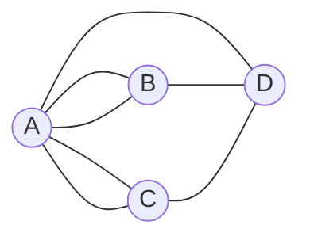



요약

모든 **간선**을 한 번씩 지나는 길(오일러)과 모든 **정점**을 한 번씩 지나는 길(해밀턴)은 말은 비슷하지만 난이도가 전혀 다르다. 오일러 쪽은 "모든 정점의 차수가 짝수인가"만 보면 판정되고 빠르게 찾을 수 있다. 해밀턴 쪽은 이런 간단한 판정법이 알려져 있지 않고, 사실상 경우를 다 따져야 하는 어려운(NP-완전) 문제다. 한 글자 차이가 쉬운 문제와 어려운 문제를 가르는 대표적인 예다.

## 예시로 보기

1736년 쾨니히스베르크에는 강으로 나뉜 네 땅(A, B, C, D)이 일곱 다리로 이어져 있었다. 모든 다리를 한 번씩만 건너는 산책이 가능한가? 땅을 정점, 다리를 간선으로 두면(같은 두 땅 사이에 다리가 둘인 곳이 있어 다중 그래프다) 차수는 A 5, B 3, C 3, D 3이다.

선 하나가 다리 하나다. A–B 사이와 A–C 사이에는 다리가 둘씩 있다. 점마다 닿은 선을 세면 A 5, B 3, C 3, D 3이다[^s2].

산책 중에 지나가기만 하는 땅은 들어온 다리와 나간 다리가 짝을 이루므로 차수가 짝수여야 한다. 차수가 홀수일 수 있는 것은 출발점과 도착점 둘뿐이다. 홀수 차수인 땅이 넷이라 불가능하다. 다리가 아래 정리의 간선, 땅의 차수가 $$\deg(v)$$다[^1].

## 정의

- **오일러 트레일(경로)**: 모든 간선을 정확히 한 번씩 지나는 트레일. 시작과 끝이 같으면 **오일러 회로**.
- **해밀턴 경로**: 모든 정점을 정확히 한 번씩 지나는 경로. 시작으로 돌아오면 **해밀턴 사이클**.

오일러 정리

간선이 있는 정점들이 모두 한 연결 성분에 있는 (다중) 그래프에서
1. 오일러 회로가 있다 $$\iff$$ 모든 정점의 차수가 짝수다.
2. 오일러 트레일(회로 아님)이 있다 $$\iff$$ 차수가 홀수인 정점이 정확히 2개다. 이때 트레일은 그 두 정점에서 시작하고 끝난다.

증명

*필요성 ($$\Rightarrow$$):* 회로를 따라가면 어느 정점이든 들어올 때 한 간선, 나갈 때 한 간선을 쓴다. 출발점도 처음 나감과 마지막 들어옴이 짝을 이룬다. 그래서 차수가 짝수다. 트레일이면 양 끝점만 짝이 하나 모자라 홀수다.

*충분성 ($$\Leftarrow$$, 히어홀처의 방법):*
1. *한 바퀴:* 아무 정점에서 쓰지 않은 간선을 따라 걷는다. 모든 차수가 짝수라, 출발점이 아닌 정점에 들어가면 늘 나갈 간선이 남는다. 그래서 출발점으로 돌아와서야 멈춘다. 닫힌 트레일 $$C$$를 얻는다.
2. *끼워 넣기:* $$C$$가 모든 간선을 쓰지 않았다면, 연결되어 있으므로 $$C$$ 위의 어떤 정점 $$v$$에 안 쓴 간선이 남아 있다. 남은 그래프도 모든 차수가 짝수라 $$v$$에서 1단계를 되풀이해 닫힌 트레일을 얻고, $$C$$의 $$v$$ 자리에 끼워 넣는다.
3. *끝:* 간선 수가 유한하므로 반복이 끝나고 오일러 회로가 된다.

트레일의 경우: 두 홀수 정점을 잇는 간선을 임시로 더하면 모든 차수가 짝수다. 회로를 만든 뒤 그 간선을 빼면 된다. ∎

히어홀처 알고리즘은 각 간선을 상수 번 다뤄 $$O(m)$$에 오일러 회로를 찾는다[^2].

**해밀턴 경로.** "모든 정점을 한 번씩"에는 오일러 정리 같은 간단한 필요충분조건이 알려져 있지 않다. 해밀턴 사이클이 있는지 판정하는 문제는 NP-완전이라, 다항식 시간 알고리즘이 있는지 모른다. 충분조건은 있다. 정점이 $$n \ge 3$$개이고 모든 정점의 차수가 $$\frac n2$$ 이상이면 해밀턴 사이클이 있다(디랙 정리)[^2]. 필요조건은 아니다. 사이클 $$C_n$$은 차수가 모두 2인데 그 자체가 해밀턴 사이클이다.

## 예제

**나비넥타이 그래프.** 삼각형 둘이 한 정점 $$c$$를 공유한다: $$a$$–$$b$$–$$c$$–$$a$$, $$c$$–$$d$$–$$e$$–$$c$$.

1. *오일러:* 차수는 $$c$$가 4, 나머지 넷이 2라 모두 짝수다. 오일러 회로가 있다: $$a, b, c, d, e, c, a$$.
2. *해밀턴:* 한 삼각형에서 다른 삼각형으로 넘어가는 길은 $$c$$뿐이다. 해밀턴 사이클은 두 삼각형을 모두 돌고 돌아와야 해서 $$c$$를 두 번 지나야 한다. 없다.
3. *교훈:* 간선을 다 도는 것과 정점을 다 도는 것은 서로 다른 문제다.

검증: 쾨니히스베르크의 차수와 오일러 트레일 없음(전수 탐색), 무작위 (다중) 그래프 300개에서 "짝수 차수 ⇔ 오일러 회로"를 전수 탐색과 비교, 히어홀처 구현의 결과가 모든 간선을 한 번씩 씀, 나비넥타이의 회로와 해밀턴 사이클 없음, 디랙 정리(작은 그래프 전수), $$C_n$$ — [34_euler-hamilton_verify.py](/Hongs_Blog/studies/discrete-math/code/34_euler-hamilton_verify/)

## 활용

- **오일러 쪽(빠름).** 제설차·청소차·우편배달부처럼 모든 **길**을 한 번씩 지나야 하는 경로. 유전체 조각을 이어 붙일 때 겹치는 부분을 간선으로 둔 드 브루인 그래프에서 오일러 경로를 찾는다[^s1].
- **해밀턴 쪽(어려움).** 모든 **도시**를 한 번씩 들르는 외판원 문제(TSP), 회로 기판의 드릴 순서. 정확한 해는 작은 크기에서만, 큰 크기에서는 근사·휴리스틱을 쓴다.
- **문제를 알아보는 요령.** "모든 연결(간선)을 한 번씩"이면 차수의 짝홀부터 본다. "모든 장소(정점)를 한 번씩"이면 어려운 문제라는 신호다.

## 연결

- 선수: [경로와 연결성](/Hongs_Blog/studies/discrete-math/connectivity/)(트레일, 경로, 연결)
- 차수의 도구: [악수 정리](/Hongs_Blog/studies/discrete-math/graph-basics/). 홀수 차수 정점이 늘 짝수 개라 "홀수 정점 1개"인 경우는 처음부터 없다.
- 또 다른 NP-완전 문제: [그래프 3색칠](/Hongs_Blog/studies/discrete-math/bipartite-coloring/)

## 확인 문제

**C1** 쾨니히스베르크의 네 땅의 차수가 5, 3, 3, 3일 때 모든 다리를 한 번씩 건너는 산책이 불가능한 이유를 쓰라. 다리 하나를 없애면 가능해질 수 있는가?

**답:** 홀수 차수 정점이 4개인데, 오일러 트레일은 홀수 차수 정점이 0개 또는 2개여야 한다. 홀수 차수 두 땅을 잇는 다리를 하나 없애면 두 차수가 짝수가 되어 홀수가 2개만 남으므로 가능해진다(나머지가 여전히 연결되어 있을 때).

**C2** 두 삼각형이 한 정점을 공유하는 나비넥타이 그래프에 오일러 회로와 해밀턴 사이클이 각각 있는가?

**답:** 오일러 회로는 있다(모든 차수 짝수: 가운데 4, 나머지 2). 해밀턴 사이클은 없다. 두 삼각형을 모두 돌려면 가운데 정점을 두 번 지나야 한다.

**C3** 오일러 회로가 있으면 모든 정점의 차수가 짝수여야 하는 이유는?

**답:** 회로가 정점을 지날 때마다 들어오는 간선과 나가는 간선을 하나씩 쓴다. 모든 간선이 정확히 한 번 쓰이므로 각 정점의 간선이 들어옴·나감 짝으로 나뉘어 짝수 개다. 출발점도 처음 나감과 마지막 들어옴이 짝을 이룬다.

[^1]: Rosen, *Discrete Mathematics and Its Applications* 7판, 10장(쾨니히스베르크 다리 문제, 오일러 회로와 트레일의 필요충분조건).
[^2]: Rosen 7판, 10장(해밀턴 경로, 디랙 정리와 오레 정리, 오일러 회로를 찾는 알고리즘). 해밀턴 사이클 문제의 NP-완전성은 Cormen et al., *Introduction to Algorithms* 3판, 34.5.3절.
[^s1]: 에이전트 보충. 드 브루인 그래프로 유전체를 조립하는 방법은 Compeau, Pevzner, Tesler, "How to apply de Bruijn graphs to genome assembly", *Nature Biotechnology* 29 (2011)에 해설되어 있다.
[^s2]: 에이전트 보충. 다이어그램 1개는 원본에 없다. 다리 배치는 오일러(1736)가 다룬 쾨니히스베르크의 일곱 다리(섬 A에서 양쪽 강변으로 둘씩, 동쪽 땅으로 하나, 동쪽 땅에서 두 강변으로 하나씩)이고, 문서의 차수 5, 3, 3, 3과 맞는다.

