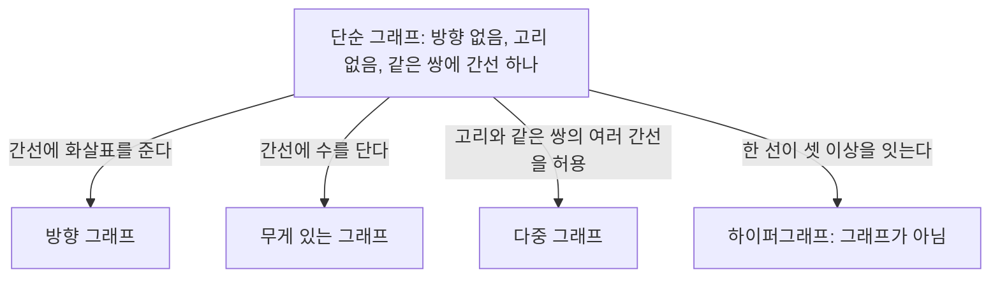


<div class="callout callout-summary" markdown="1">
<div class="callout-title callout-title--default" markdown="span">요약</div>

지하철 노선도는 실제 거리와 모양을 버리고 "어느 역이 어느 역과 이어져 있나"만 남긴다. 그래프도 이렇게 대상은 점(정점)으로, 관계는 선(간선)으로만 그린 그림이다. 친구 관계, 웹 링크, 도로망, 회로, 의존성처럼 모양이 전혀 다른 문제를 같은 언어와 같은 알고리즘으로 다룬다. 대신 방향, 무게, 같은 쌍 사이의 여러 선처럼 무엇을 버리고 남길지는 모델을 만드는 사람이 정해야 하고, 그 선택이 답을 바꾼다.

</div>


## 예시로 보기

다섯 사람 A~E 중 친구인 쌍이 A–B, A–C, B–C, C–D, D–E라 하자. 사람이 정점, 친구 관계가 간선이다.

```
A ─── B
 \   /
  \ /
   C ─── D ─── E
```

친구 수(차수)는 A 2, B 2, C 3, D 2, E 1이고 합은 10이다. 간선은 5개다. 간선 하나가 양 끝의 두 사람에게 한 번씩 세어지므로 차수의 합은 늘 간선 수의 두 배다. 사람 집합이 아래 정의의 $$V$$, 친구 쌍의 집합이 $$E$$다.

## 정의

<div class="callout callout-definition" markdown="1">
<div class="callout-title callout-title--default" markdown="span">정의</div>

- **(단순) 그래프** $$G = (V, E)$$: 정점의 유한 집합 $$V$$와, 서로 다른 두 정점으로 이루어진 쌍 $$\{u, v\}$$들의 집합 $$E$$. $$\{u, v\} \in E$$($$\in$$은 "~에 속한다")이면 $$u$$와 $$v$$가 **인접**한다고 한다.
- **방향 그래프**: $$E \subseteq V \times V$$로, 간선이 순서쌍 $$(u, v)$$(화살표 $$u \to v$$)다.
- **차수** $$\deg(v)$$: $$v$$에 닿은 간선의 수. 방향 그래프에서는 들어오는 간선 수(진입 차수)와 나가는 간선 수(진출 차수)를 따로 센다.
- 정점 수 $$n = \vert V\vert $$, 간선 수 $$m = \vert E\vert $$로 쓴다[^1].

</div>


**동치인 다른 정의.** 단순 그래프는 $$V$$ 위의 [관계](/Hongs_Blog/studies/discrete-math/relations/) $$R$$ 중 대칭적이고 비반사적인 것과 같다. $$\{u, v\} \in E \iff (u, v) \in R$$로 대응시키면, 대칭성은 "간선에 방향이 없음", 비반사성은 "자기 자신으로 가는 고리가 없음"이다. 방향 그래프는 그냥 $$V$$ 위의 관계다.

**설계 이유.** 간선을 "두 원소의 집합"으로 정의하면 방향이 없고, 같은 쌍 사이에 간선이 둘일 수 없고, 고리도 없다. 가장 단순한 모델에서 정리를 세운 뒤, 필요할 때 방향·무게·중복 간선(다중 그래프)을 더한다.



단순 그래프에서 출발해 무엇을 더 허용하느냐로 모델이 갈린다. 마지막 갈래의 하이퍼그래프는 간선이 두 점을 잇는다는 약속 자체를 깨서 그래프 밖에 있다[^s1].

**해당하는 예:** 위의 친구 그래프, 모든 쌍이 이어진 완전 그래프 $$K_4$$(간선 $$\binom42 = 6$$개), 웹 페이지와 링크의 방향 그래프. **해당하지 않는 예:** 자기 자신으로 가는 고리가 있는 그림은 단순 그래프가 아니다(다중 그래프로 다룬다). 세 사람의 단체 대화방처럼 한 "선"이 세 점을 잇는 것은 그래프가 아니라 하이퍼그래프다.

**간선 수의 범위.** 단순 그래프는 $$0 \le m \le \binom n2 = \frac{n(n-1)}{2}$$이다. 모든 쌍이 이어진 $$K_n$$이 최대다. 그래서 $$m = O(n^2)$$이다. $$n$$대의 기기를 모두 직접 잇는 [점대점 링크](/Hongs_Blog/studies/computer-communication/point-to-point-link/)의 선 수가 이것이다.

<div class="callout callout-theorem" markdown="1">
<div class="callout-title" markdown="span">악수 정리</div>

모든 그래프에서 $$\sum_{v \in V}\deg(v) = 2m$$($$\sum$$은 차례로 모두 더한다는 기호). 그래서 차수가 홀수인 정점의 수는 짝수다. 방향 그래프에서는 진입 차수의 합 = 진출 차수의 합 = $$m$$.

</div>


## 증명

"정점–간선이 닿은 쌍"을 두 방법으로 센다.

<details class="callout callout-proof" markdown="1">
<summary class="callout-title" markdown="span">증명 펼치기</summary>

1. *세는 대상:* $$v \in e$$인 쌍 $$(v, e)$$의 집합 $$P$$.
2. *정점 쪽에서:* 정점 $$v$$마다 $$\deg(v)$$개의 쌍이 있어 $$\vert P\vert  = \sum_v \deg(v)$$.
3. *간선 쪽에서:* 간선 $$e = \{u, v\}$$마다 끝점이 정확히 둘이라 $$\vert P\vert  = 2m$$.
4. *따름:* 짝수 차수들의 합은 짝수이므로, 홀수 차수들의 합도 짝수여야 한다. 홀수를 홀수 개 더하면 홀수이므로 홀수 차수 정점은 짝수 개다. ∎

</details>


### 스스로 설명해 보기

<details class="callout callout-question" markdown="1">
<summary class="callout-title" markdown="span">1. 3단계에서 "끝점이 정확히 둘"이 맞으려면 정의의 어느 부분이 필요한가?</summary>

간선이 서로 다른 두 정점의 집합이라는 부분이다. 고리(자기 자신과 이어진 간선)를 허용하면 그 간선은 차수를 2 올리는 것으로 약속해야 정리가 유지된다.

</details>


<details class="callout callout-question" markdown="1">
<summary class="callout-title" markdown="span">2. 4단계의 "홀수를 홀수 개 더하면 홀수"를 식으로 쓰면?</summary>

홀수 $$2a_i + 1$$을 $$k$$개 더하면 $$2\sum a_i + k$$이다. 이것이 짝수이려면 $$k$$가 짝수여야 한다.

</details>


<details class="callout callout-question" markdown="1">
<summary class="callout-title" markdown="span">이 증명의 핵심 아이디어는?</summary>

같은 집합을 두 방법으로 세면 두 값이 같다(이중 계산). 행 합과 열 합이 같은 표를 생각하면 된다.

</details>


<details class="callout callout-question" markdown="1">
<summary class="callout-title" markdown="span">같은 방법을 쓸 수 있는 다른 상황은?</summary>

[조합적 증명](/Hongs_Blog/studies/discrete-math/permutations-combinations/), 트리의 간선 수 증명, 행렬 원소의 합을 행 순서와 열 순서로 더하는 것.

</details>


## 예제

**표현 고르기.** 위 친구 그래프를 두 가지로 저장한다.

| | A | B | C | D | E |
|---|---|---|---|---|---|
| A | 0 | 1 | 1 | 0 | 0 |
| B | 1 | 0 | 1 | 0 | 0 |
| C | 1 | 1 | 0 | 1 | 0 |
| D | 0 | 0 | 1 | 0 | 1 |
| E | 0 | 0 | 0 | 1 | 0 |

인접 리스트로는 A: [B, C], B: [A, C], C: [A, B, D], D: [C, E], E: [D]이다.

1. *행렬의 성질:* 대칭이고 대각선이 0이다(대칭·비반사 관계). 행의 합이 차수다.
2. *리스트의 크기:* 목록 길이의 합이 $$2m = 10$$이다(악수 정리).
3. *비교:*

| 연산 | 인접 행렬 | 인접 리스트 |
|---|---|---|
| 공간 | $$\Theta(n^2)$$ | $$\Theta(n + m)$$ |
| $$u$$–$$v$$ 간선이 있나 | $$O(1)$$ | $$O(\deg u)$$ |
| $$u$$의 이웃 모두 보기 | $$O(n)$$ | $$O(\deg u)$$ |

<div class="callout callout-check" markdown="1">
<div class="callout-title" markdown="span">검증: 예시의 차수와 합 10, 무작위 그래프 1,000개에서 악수 정리와 홀수 차수 정점의 짝수성, 방향 그래프의 진입·진출 합, 관계와의 대응(대칭·비반사), $$K_n$$의 간선 수, 행렬과 리스트의 일치, 카드의 차수열 판정(전수), 오해의 메모리 계산 — [32_graph-basics_verify.py](/Hongs_Blog/studies/discrete-math/code/32_graph-basics_verify/)</div>

</div>


## 활용

- **모델링.** SNS(무방향: 친구, 방향: 팔로우), 웹(방향 링크), 도로(무게가 있는 간선), 빌드 의존성(방향 비순환 그래프, [위상 정렬](/Hongs_Blog/studies/discrete-math/partial-orders/)).
- **표현 선택.** 간선이 적은 그래프(대부분의 실제 네트워크)는 인접 리스트, 빽빽하거나 "간선이 있나"를 자주 묻는 작은 그래프는 인접 행렬을 쓴다. 인접 행렬은 선형대수의 도구(거듭제곱, 고윳값)를 쓸 수 있다는 장점도 있다.
- **흔한 실수.** 무방향 그래프를 리스트로 저장하면서 간선을 한쪽 목록에만 넣는 것. $$u$$의 목록과 $$v$$의 목록 둘 다에 넣어야 한다.
- 알고리즘에서: 인접 리스트·인접 행렬·간선 목록을 파이썬으로 만드는 코드는 [그래프 표현](/Hongs_Blog/studies/algorithms/graph-representation/)에 있고, 격자의 칸이나 문제의 상태를 정점으로 보는 법도 거기서 다룬다. 같은 쌍 사이의 신고를 하나로 합친 뒤 진입 차수가 기준 이상인 사람을 고르는 [신고 결과 받기](/Hongs_Blog/studies/algorithms/pg92334/)가 차수를 그대로 쓰는 예다.

## 연결

- 선수: [관계와 그 성질](/Hongs_Blog/studies/discrete-math/relations/)
- 이어지는 개념: [경로와 연결성](/Hongs_Blog/studies/discrete-math/connectivity/), [트리](/Hongs_Blog/studies/discrete-math/trees/), [이분 그래프와 그래프 색칠](/Hongs_Blog/studies/discrete-math/bipartite-coloring/)
- 방향 비순환 그래프: [부분순서와 위상 정렬](/Hongs_Blog/studies/discrete-math/partial-orders/)

## 자주 하는 오해

<div class="callout callout-misconception" markdown="1">
<div class="callout-title" markdown="span">"인접 행렬이 인접 리스트보다 늘 빠르다"</div>

틀렸다. "간선이 있나"를 $$O(1)$$에 답하니 무조건 낫다고 느끼기 쉽다. 하지만 공간이 $$n^2$$이고, 이웃을 훑을 때도 $$n$$칸을 다 봐야 한다. 정점 $$10^6$$개, 평균 차수 10인 그래프를 행렬로 저장하면 칸이 $$10^{12}$$개라 칸당 1비트여도 125 GB다. 인접 리스트는 $$n + 2m = 1.1 \times 10^7$$칸이다. 그래프 탐색처럼 이웃을 훑는 알고리즘은 리스트에서 $$O(n + m)$$, 행렬에서 $$O(n^2)$$이 걸린다.

</div>


## 확인 문제

<details class="callout callout-question" markdown="1">
<summary class="callout-title" markdown="span">**C1** 악수 정리를 쓰고, 그 따름정리를 하나 쓰라.</summary>

**답:** $$\sum_{v}\deg(v) = 2\vert E\vert $$. 따름정리: 차수가 홀수인 정점은 짝수 개다.

</details>


<details class="callout callout-question" markdown="1">
<summary class="callout-title" markdown="span">**C2** 차수가 3, 3, 2, 2, 1인 단순 그래프가 있을 수 있는가?</summary>

**답:** 없다. 차수의 합이 11로 홀수인데, 악수 정리로 합은 $$2m$$이라 짝수여야 한다.

</details>


<details class="callout callout-question" markdown="1">
<summary class="callout-title" markdown="span">**C3** 정점 1, 2, 3, 4에서 인접 행렬의 윗부분이 (1,2)=1, (1,3)=0, (1,4)=1, (2,3)=1, (2,4)=0, (3,4)=1이다. 간선 목록과 각 정점의 차수를 쓰라.</summary>

**답:** 간선 $$\{1,2\}, \{1,4\}, \{2,3\}, \{3,4\}$$. 네 정점이 사각형(사이클)을 이루고 차수는 모두 2다. 합 8 = $$2 \times 4$$.

</details>


<details class="callout callout-question" markdown="1">
<summary class="callout-title" markdown="span">**C4** 정점 100만 개, 간선 500만 개인 도로망에서 한 교차로의 이웃을 자주 훑는다. 인접 행렬과 인접 리스트 중 무엇을 쓰고, 다른 쪽은 왜 아닌가?</summary>

**답:** 인접 리스트. 공간 $$n + 2m \approx 1.1 \times 10^7$$이고 이웃을 차수만큼만 본다. 인접 행렬은 $$10^{12}$$칸이 필요하고, 이웃을 볼 때마다 100만 칸을 훑는다.

</details>


[^1]: Lehman·Leighton·Meyer, *Mathematics for Computer Science*, 10장 "Directed graphs & Partial Orders", 12장 "Simple Graphs"(차수, 악수 정리). Rosen, *Discrete Mathematics and Its Applications* 7판, 10장(그래프의 종류, 인접 행렬과 인접 리스트).
[^s1]: 에이전트 보충. 다이어그램 1개는 원본에 없다. 정의 섹션의 '설계 이유'와 '해당하지 않는 예', '활용'의 무게 있는 간선을 갈래로 그렸다.

