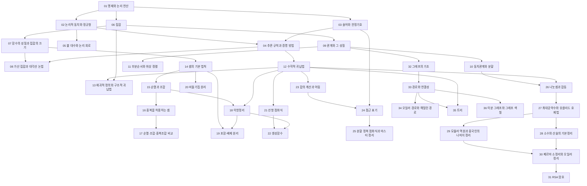


> 교재: Lehman·Leighton·Meyer *Mathematics for Computer Science* (MIT, 공개 교재)

## 먼저 알아야 할 것
- [역함수](/Hongs_Blog/studies/college-math/inverse-function/) (대학수학) → 함수의 성질과 집합의 크기
- [다항식과 방정식](/Hongs_Blog/studies/college-math/polynomial/) (대학수학) → 선형 점화식
- [로그](/Hongs_Blog/studies/college-math/logarithm/) (대학수학) → 합의 계산과 어림
- [로그함수와 로그 스케일](/Hongs_Blog/studies/college-math/log-scale/) (대학수학) → 점근 표기
- [수열과 합의 기호](/Hongs_Blog/studies/college-math/sequences-sigma/) (대학수학) → 수학적 귀납법
- [등비급수](/Hongs_Blog/studies/college-math/geometric-series/) (대학수학) → 선형 점화식, 합의 계산과 어림

## 1단원 · 논리와 증명

읽기 전에

1. "1 = 2이면 달은 치즈다"는 참일까, 거짓일까? → [명제와 논리 연산](/Hongs_Blog/studies/discrete-math/propositional-logic/)
2. "비가 오면 땅이 젖는다"가 참이면 "땅이 젖었으면 비가 왔다"도 참일까? → [논리적 동치와 정규형](/Hongs_Blog/studies/discrete-math/logical-equivalence/)
3. "모든 테스트가 통과한 것은 아니다"는 "모든 테스트가 실패했다"와 같은 뜻일까? → [술어와 한정기호](/Hongs_Blog/studies/discrete-math/predicate-logic/)

| 번호 | 개념 | 한 줄 | 개념 코드 | 연습 |
|---|---|---|---|---|
| 01 | [명제와 논리 연산](/Hongs_Blog/studies/discrete-math/propositional-logic/) | 참·거짓이 정해진 문장과 그리고·또는·아니다·이면 | [검증](/Hongs_Blog/studies/discrete-math/code/01_propositional-logic_verify/) | — |
| 02 | [논리적 동치와 정규형](/Hongs_Blog/studies/discrete-math/logical-equivalence/) | 진리표가 같은 두 식. 드모르간, 대우, CNF·DNF (무거움) | [검증](/Hongs_Blog/studies/discrete-math/code/02_logical-equivalence_verify/) | — |
| 03 | [술어와 한정기호](/Hongs_Blog/studies/discrete-math/predicate-logic/) | 모든·어떤으로 변수를 묶는 논리. 부정하면 ∀와 ∃가 바뀐다 (무거움) | [검증](/Hongs_Blog/studies/discrete-math/code/03_predicate-logic_verify/) | — |
| 04 | [추론 규칙과 증명 방법](/Hongs_Blog/studies/discrete-math/proof-methods/) | 직접·대우·귀류·경우 나누기, 반례 (무거움) | [검증](/Hongs_Blog/studies/discrete-math/code/04_proof-methods_verify/) | — |
| 05 | [불 대수와 논리 회로](/Hongs_Blog/studies/discrete-math/boolean-algebra/) | 논리식을 0/1 대수로 계산하고 게이트로 만든다 | [검증](/Hongs_Blog/studies/discrete-math/code/05_boolean-algebra_verify/) | — |

떠올려 보기: 노트를 닫고 증명 방법 다섯 가지의 틀을 쓰고, 각각 어떤 모양의 결론에서 떠올리는지 예를 하나씩 단다.

## 2단원 · 집합, 함수, 관계

읽기 전에

1. 자연수와 정수 중 어느 쪽이 더 많을까? → [가산 집합과 대각선 논법](/Hongs_Blog/studies/discrete-math/countability/)
2. 해시 함수를 아무리 잘 만들어도 충돌이 생기는 이유는? → [함수의 성질과 집합의 크기](/Hongs_Blog/studies/discrete-math/function-properties/)
3. 의존성이 있는 작업 여섯 개를 한 줄로 세우는 방법은 늘 하나뿐일까? → [부분순서와 위상 정렬](/Hongs_Blog/studies/discrete-math/partial-orders/)

| 번호 | 개념 | 한 줄 | 개념 코드 | 연습 |
|---|---|---|---|---|
| 06 | [집합](/Hongs_Blog/studies/discrete-math/sets/) | 원소 모음과 합·교·차, 멱집합, 곱집합 | [검증](/Hongs_Blog/studies/discrete-math/code/06_sets_verify/) | — |
| 07 | [함수의 성질과 집합의 크기](/Hongs_Blog/studies/discrete-math/function-properties/) | 단사·전사·전단사. 전단사가 있으면 크기가 같다 | [검증](/Hongs_Blog/studies/discrete-math/code/07_function-properties_verify/) | — |
| 08 | [가산 집합과 대각선 논법](/Hongs_Blog/studies/discrete-math/countability/) | 정수·유리수는 셀 수 있고 실수는 셀 수 없다 | [검증](/Hongs_Blog/studies/discrete-math/code/08_countability_verify/) | — |
| 09 | [관계와 그 성질](/Hongs_Blog/studies/discrete-math/relations/) | 원소 쌍의 집합. 반사·대칭·반대칭·추이 | [검증](/Hongs_Blog/studies/discrete-math/code/09_relations_verify/) | — |
| 10 | [동치관계와 분할](/Hongs_Blog/studies/discrete-math/equivalence-relations/) | 반사·대칭·추이면 집합을 겹치지 않는 묶음으로 나눈다 | [검증](/Hongs_Blog/studies/discrete-math/code/10_equivalence-relations_verify/) | — |
| 11 | [부분순서와 위상 정렬](/Hongs_Blog/studies/discrete-math/partial-orders/) | 모두 비교되지는 않는 순서. DAG와 위상 정렬 | [검증](/Hongs_Blog/studies/discrete-math/code/11_partial-orders_verify/) | — |

떠올려 보기: 관계의 네 성질을 쓰고, 동치관계(무리 짓기)와 부분순서(줄 세우기)가 어느 성질에서 갈리는지 예와 함께 적어 본다.

## 3단원 · 귀납과 재귀

읽기 전에

1. 1 + 3 + 5 + … + (2n − 1)은 늘 n²일까? 몇 개를 확인하면 "늘"이라고 말할 수 있을까? → [수학적 귀납법](/Hongs_Blog/studies/discrete-math/induction/)
2. 길이 6인 올바른 괄호 문자열은 몇 개일까? → [재귀적 정의와 구조적 귀납법](/Hongs_Blog/studies/discrete-math/recursive-definitions/)

| 번호 | 개념 | 한 줄 | 개념 코드 | 연습 |
|---|---|---|---|---|
| 12 | [수학적 귀납법](/Hongs_Blog/studies/discrete-math/induction/) | 첫 칸과 다음 칸으로 넘어감을 보이면 전부 성립. 강한 귀납 (무거움) | [검증](/Hongs_Blog/studies/discrete-math/code/12_induction_verify/) | [귀납법 증명 예제 사다리](/Hongs_Blog/studies/discrete-math/induction-ladder/) |
| 13 | [재귀적 정의와 구조적 귀납법](/Hongs_Blog/studies/discrete-math/recursive-definitions/) | 기본 원소와 만드는 규칙으로 정의하고 같은 모양으로 증명 | [검증](/Hongs_Blog/studies/discrete-math/code/13_recursive-definitions_verify/) | — |

떠올려 보기: 노트를 닫고 귀납법의 두 단계를 도미노 그림과 함께 쓰고, 강한 귀납법이 필요한 예와 기저가 여러 개 필요한 이유를 적어 본다.

## 4단원 · 셈

읽기 전에

1. 10명 중 회장·부회장을 뽑는 수와 대표 2명을 뽑는 수는 몇 배 차이일까? → [순열과 조합](/Hongs_Blog/studies/discrete-math/permutations-combinations/)
2. 맛 3가지 아이스크림을 5스쿱 담는 방법은 3⁵가지일까? → [중복을 허용하는 셈](/Hongs_Blog/studies/discrete-math/multiset-counting/)
3. 모든 파일을 조금씩이라도 줄여 주는 무손실 압축 프로그램이 있을까? → [비둘기집 원리](/Hongs_Blog/studies/discrete-math/pigeonhole/)

| 번호 | 개념 | 한 줄 | 개념 코드 | 연습 |
|---|---|---|---|---|
| 14 | [셈의 기본 법칙](/Hongs_Blog/studies/discrete-math/counting-rules/) | 합의 법칙, 곱의 법칙, 전단사로 세기, 나눗셈 법칙 (무거움) | [검증](/Hongs_Blog/studies/discrete-math/code/14_counting-rules_verify/) | — |
| 15 | [순열과 조합](/Hongs_Blog/studies/discrete-math/permutations-combinations/) | 순서가 중요하면 순열, 아니면 조합 (무거움) | [검증](/Hongs_Blog/studies/discrete-math/code/15_permutations-combinations_verify/) | — |
| 16 | [중복을 허용하는 셈](/Hongs_Blog/studies/discrete-math/multiset-counting/) | 별과 막대로 중복조합. 같은 것이 있는 순열 | [검증](/Hongs_Blog/studies/discrete-math/code/16_multiset-counting_verify/) | — |
| 17 | [순열·조합·중복조합 비교](/Hongs_Blog/studies/discrete-math/counting-formula-choice/) | 가르는 질문: 순서가 중요한가, 중복을 허용하는가 | [검증](/Hongs_Blog/studies/discrete-math/code/17_counting-formula-choice_verify/) | [경우의 수 예제 사다리](/Hongs_Blog/studies/discrete-math/counting-ladder/) |
| 18 | [이항정리](/Hongs_Blog/studies/discrete-math/binomial-theorem/) | (x + y)^n의 계수가 조합. 파스칼 항등식 | [검증](/Hongs_Blog/studies/discrete-math/code/18_binomial-theorem_verify/) | — |
| 19 | [포함-배제 원리](/Hongs_Blog/studies/discrete-math/inclusion-exclusion/) | 겹친 부분을 빼고 다시 더하며 합집합을 센다 | [검증](/Hongs_Blog/studies/discrete-math/code/19_inclusion-exclusion_verify/) | — |
| 20 | [비둘기집 원리](/Hongs_Blog/studies/discrete-math/pigeonhole/) | 칸보다 물건이 많으면 어떤 칸에는 둘 이상 | [검증](/Hongs_Blog/studies/discrete-math/code/20_pigeonhole_verify/) | — |

떠올려 보기: 순서 × 중복 네 칸 표를 빈 종이에 그리고 칸마다 공식과 예를 채운 뒤, 겹침이 있을 때(포함-배제)와 반드시 겹칠 때(비둘기집)를 한 줄씩 덧붙인다.

## 5단원 · 점화식과 점근

읽기 전에

1. 피보나치 수는 대략 몇 배씩 커질까? 2배일까? → [선형 점화식](/Hongs_Blog/studies/discrete-math/linear-recurrences/)
2. 1 + 1/2 + 1/3 + ⋯ + 1/n은 n이 커지면 어떤 속도로 커질까? → [합의 계산과 어림](/Hongs_Blog/studies/discrete-math/sums-asymptotics/)
3. n²이 걸리는 알고리즘이 100n이 걸리는 알고리즘보다 늘 느릴까? → [점근 표기](/Hongs_Blog/studies/discrete-math/asymptotic-notation/)
4. 병합 정렬의 T(n) = 2T(n/2) + n에서 n lg n의 lg n은 어디서 올까? → [분할 정복 점화식과 마스터 정리](/Hongs_Blog/studies/discrete-math/master-theorem/)

| 번호 | 개념 | 한 줄 | 개념 코드 | 연습 |
|---|---|---|---|---|
| 21 | [선형 점화식](/Hongs_Blog/studies/discrete-math/linear-recurrences/) | 특성방정식의 근으로 닫힌 꼴을 찾는다. 피보나치 (무거움) | [검증](/Hongs_Blog/studies/discrete-math/code/21_linear-recurrences_verify/) | [점화식 풀이 예제 사다리](/Hongs_Blog/studies/discrete-math/recurrence-ladder/) |
| 22 | [생성함수](/Hongs_Blog/studies/discrete-math/generating-functions/) | 수열을 멱급수의 계수로 싣고 대수로 푼다 | [검증](/Hongs_Blog/studies/discrete-math/code/22_generating-functions_verify/) | — |
| 23 | [합의 계산과 어림](/Hongs_Blog/studies/discrete-math/sums-asymptotics/) | 망원합, 거듭제곱 합, 조화수 H_n ≈ ln n | [검증](/Hongs_Blog/studies/discrete-math/code/23_sums-asymptotics_verify/) | — |
| 24 | [점근 표기](/Hongs_Blog/studies/discrete-math/asymptotic-notation/) | 상수배와 작은 항을 버린 성장 속도 비교: O, Ω, Θ (무거움) | [검증](/Hongs_Blog/studies/discrete-math/code/24_asymptotic-notation_verify/) | — |
| 25 | [분할 정복 점화식과 마스터 정리](/Hongs_Blog/studies/discrete-math/master-theorem/) | T(n) = aT(n/b) + f(n)을 세 경우로 푼다 (무거움) | [검증](/Hongs_Blog/studies/discrete-math/code/25_master-theorem_verify/) | [마스터 정리 예제 사다리](/Hongs_Blog/studies/discrete-math/master-theorem-ladder/) |

떠올려 보기: 노트를 닫고 특성방정식으로 점화식을 푸는 다섯 단계, O·Ω·Θ의 한정기호 정의, 마스터 정리의 세 경우를 재귀 트리 그림과 함께 적어 본다.

## 6단원 · 정수론

읽기 전에

1. C에서 -7 % 3은 -1인데 Python에서는 2다. 어느 쪽이 수학의 나머지일까? → [나눗셈과 합동](/Hongs_Blog/studies/discrete-math/modular-arithmetic/)
2. 소인수분해 없이 두 수의 최대공약수를 구할 수 있을까? → [최대공약수와 유클리드 호제법](/Hongs_Blog/studies/discrete-math/gcd-euclid/)
3. 누구나 잠글 수 있지만 나만 열 수 있는 자물쇠를 수로 만들 수 있을까? → [RSA 암호](/Hongs_Blog/studies/discrete-math/rsa/)

| 번호 | 개념 | 한 줄 | 개념 코드 | 연습 |
|---|---|---|---|---|
| 26 | [나눗셈과 합동](/Hongs_Blog/studies/discrete-math/modular-arithmetic/) | 나머지만 보는 산술. 시계 산술 (무거움) | [검증](/Hongs_Blog/studies/discrete-math/code/26_modular-arithmetic_verify/) | — |
| 27 | [최대공약수와 유클리드 호제법](/Hongs_Blog/studies/discrete-math/gcd-euclid/) | gcd(a, b) = gcd(b, a mod b). 확장 유클리드 (무거움) | [구현](/Hongs_Blog/studies/discrete-math/code/27_gcd-euclid_impl/) · [검증](/Hongs_Blog/studies/discrete-math/code/27_gcd-euclid_verify/) | [유클리드 호제법 예제 사다리](/Hongs_Blog/studies/discrete-math/gcd-ladder/) |
| 28 | [소수와 산술의 기본정리](/Hongs_Blog/studies/discrete-math/primes/) | 소인수분해는 한 가지뿐. 에라토스테네스의 체 | [구현](/Hongs_Blog/studies/discrete-math/code/28_primes_impl/) · [검증](/Hongs_Blog/studies/discrete-math/code/28_primes_verify/) | — |
| 29 | [모듈러 역원과 중국인의 나머지 정리](/Hongs_Blog/studies/discrete-math/modular-inverse-crt/) | 서로소일 때만 역원이 있다. 나머지들로 수를 복원 | [검증](/Hongs_Blog/studies/discrete-math/code/29_modular-inverse-crt_verify/) | — |
| 30 | [페르마 소정리와 오일러 정리](/Hongs_Blog/studies/discrete-math/fermat-euler/) | a^{φ(n)} ≡ 1 (mod n). 빠른 거듭제곱 | [검증](/Hongs_Blog/studies/discrete-math/code/30_fermat-euler_verify/) | — |
| 31 | [RSA 암호](/Hongs_Blog/studies/discrete-math/rsa/) | 곱하기는 쉽고 인수분해는 어려운 비대칭으로 만든 공개키 암호 | [구현](/Hongs_Blog/studies/discrete-math/code/31_rsa_impl/) · [검증](/Hongs_Blog/studies/discrete-math/code/31_rsa_verify/) | — |

떠올려 보기: 노트를 닫고 나눗셈 정리, 호제법의 원리와 베주 항등식, 역원이 있을 조건, 오일러 정리, RSA 키 생성의 네 줄을 순서대로 적고 서로 어떻게 기대는지 화살표로 잇는다.

## 7단원 · 그래프

읽기 전에

1. 친구 수를 모두 더하면 왜 늘 짝수일까? → [그래프의 기초](/Hongs_Blog/studies/discrete-math/graph-basics/)
2. 모든 다리를 한 번씩 건너는 산책과 모든 섬을 한 번씩 들르는 산책 중 어느 쪽이 판정하기 쉬울까? → [오일러 경로와 해밀턴 경로](/Hongs_Blog/studies/discrete-math/euler-hamilton/)
3. 정점 n개, 간선 n − 1개면 늘 트리일까? → [트리](/Hongs_Blog/studies/discrete-math/trees/)

| 번호 | 개념 | 한 줄 | 개념 코드 | 연습 |
|---|---|---|---|---|
| 32 | [그래프의 기초](/Hongs_Blog/studies/discrete-math/graph-basics/) | 정점과 간선. 차수 합 = 2\|E\|. 인접행렬과 인접리스트 (무거움) | [검증](/Hongs_Blog/studies/discrete-math/code/32_graph-basics_verify/) | — |
| 33 | [경로와 연결성](/Hongs_Blog/studies/discrete-math/connectivity/) | 보행·경로·사이클, 연결 성분, BFS·DFS | [구현](/Hongs_Blog/studies/discrete-math/code/33_connectivity_impl/) · [검증](/Hongs_Blog/studies/discrete-math/code/33_connectivity_verify/) | — |
| 34 | [오일러 경로와 해밀턴 경로](/Hongs_Blog/studies/discrete-math/euler-hamilton/) | 모든 간선을 한 번씩(쉬움) vs 모든 정점을 한 번씩(어려움) | [검증](/Hongs_Blog/studies/discrete-math/code/34_euler-hamilton_verify/) | — |
| 35 | [트리](/Hongs_Blog/studies/discrete-math/trees/) | 사이클 없는 연결 그래프. 간선 n − 1개, 경로가 유일 (무거움) | [검증](/Hongs_Blog/studies/discrete-math/code/35_trees_verify/) | — |
| 36 | [이분 그래프와 그래프 색칠](/Hongs_Blog/studies/discrete-math/bipartite-coloring/) | 홀수 사이클이 없으면 두 색으로 칠할 수 있다 | [검증](/Hongs_Blog/studies/discrete-math/code/36_bipartite-coloring_verify/) | — |

떠올려 보기: 악수 정리, BFS와 DFS의 차이, 오일러 회로의 조건, 트리의 동치 조건 셋, 이분 그래프 판정을 빈 종이에 쓰고 각각의 증명 아이디어를 한 줄로 붙인다.

## 다른 과목과의 연결
- [합 ↔ 적분](/Hongs_Blog/studies/calculus/sum-integral-bounds/) (미분적분학): 넓이로 합을 위아래에서 끼운다. H_n ≈ ln n, ln n! ≈ n ln n − n
- [선형 점화식 ↔ 행렬 거듭제곱](/Hongs_Blog/studies/linear-algebra/recurrence-matrix-bridge/) (선형대수학): 특성방정식의 근 = 동반 행렬의 고윳값
- [인접행렬 거듭제곱 ↔ 마르코프 전이](/Hongs_Blog/studies/probability-statistics/walks-markov-bridge/) (확률과 통계): (A^k)_ij는 보행 수, (P^k)_ij는 k단계 확률
- [순열과 조합](/Hongs_Blog/studies/discrete-math/permutations-combinations/) ↔ [점대점 링크](/Hongs_Blog/studies/computer-communication/point-to-point-link/) (4-1학기 컴퓨터 통신): 링크 수 = C(n, 2)
- [수학적 귀납법](/Hongs_Blog/studies/discrete-math/induction/) ↔ [수학적 귀납법 ↔ 루프 불변식](/Hongs_Blog/studies/algorithms/induction-loop-invariant/) (알고리즘 3.개념집): 루프 불변식의 초기화·유지·종료는 기저·귀납 단계·결론
- [관계와 그 성질](/Hongs_Blog/studies/discrete-math/relations/) ↔ [추이 폐포 ↔ 플로이드–워셜](/Hongs_Blog/studies/algorithms/warshall-floyd/) (알고리즘 3.개념집): 와셜 알고리즘의 또는·그리고를 min·+로 바꾸면 플로이드–워셜
- [부분순서와 위상 정렬](/Hongs_Blog/studies/discrete-math/partial-orders/) ↔ [위상 정렬 ↔ 동적 계획법의 계산 순서](/Hongs_Blog/studies/algorithms/toposort-dp-order/) (알고리즘 3.개념집): DP 표를 채우는 순서는 의존 관계의 위상 정렬

## 흐름
점선 테두리는 아직 작성하지 않은 개념이다.

## 시험 대비
- 아직 없다.

