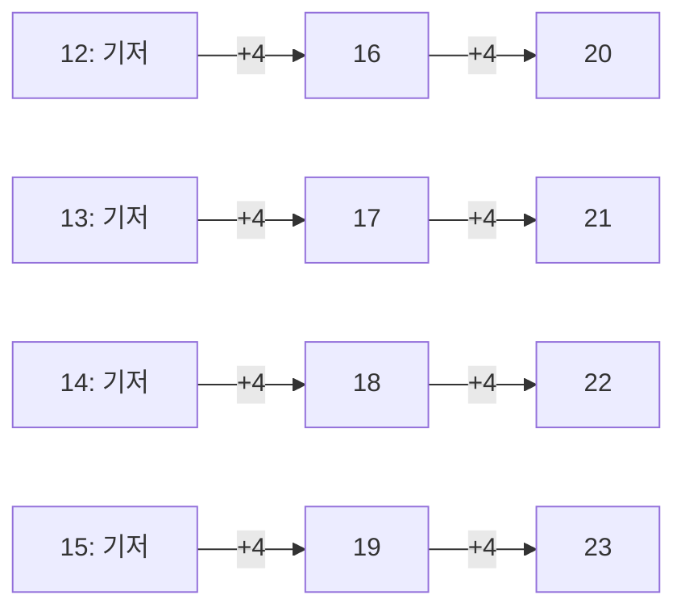



요약

줄지어 선 도미노를 떠올린다. 첫 도미노가 넘어지고, 어떤 도미노든 넘어지면 바로 다음 것도 넘어진다는 것만 보이면 모든 도미노가 넘어진다. 이 두 단계로 "모든 자연수에서 맞는다"를 끝없는 확인 없이 증명한다. 앞의 모든 경우를 가정해도 되는 강한 귀납법은 재귀 알고리즘의 정확성을 증명하는 기본 도구다. 다만 첫 단계를 빠뜨리거나, "다음으로 넘어간다"가 모든 경우에 맞지 않으면 틀린 결론도 그럴듯하게 증명된다.

## 예시로 보기

$$1 + 3 + 5 + \cdots + (2n - 1) = n^2$$을 증명한다. 처음 몇 개는 $$1 = 1$$, $$1 + 3 = 4$$, $$1 + 3 + 5 = 9$$로 맞는다. 하지만 몇 개 확인한 것으로는 모든 $$n$$을 보인 것이 아니다([추론 규칙과 증명 방법](/Hongs_Blog/studies/discrete-math/proof-methods/)의 오해).

1. *첫 도미노:* $$n = 1$$이면 $$1 = 1^2$$.
2. *다음으로 넘어감:* 어떤 $$n$$에서 $$1 + \cdots + (2n - 1) = n^2$$이라고 하자. 여기에 다음 홀수 $$2n + 1$$을 더하면 $$n^2 + 2n + 1 = (n + 1)^2$$이다. 그러니 $$n$$에서 맞으면 $$n + 1$$에서도 맞다.
3. *결론:* 1에서 맞고, 1이면 2, 2이면 3, …이므로 모든 $$n \ge 1$$에서 맞다.

첫 도미노가 아래 정의의 기저 단계, 도미노가 다음 것을 넘어뜨리는 것이 귀납 단계, "어떤 $$n$$에서 맞다고 하자"가 귀납 가정이다.

## 정의

정의

**수학적 귀납법.** 정수 $$b$$와 술어 $$P(n)$$에 대해[^1]
1. (기저) $$P(b)$$가 참이고
2. (귀납 단계) 모든 $$n \ge b$$에서 $$P(n) \to P(n + 1)$$이 참이면

모든 $$n \ge b$$에서 $$P(n)$$이 참이다.

**강한 귀납법.** 귀납 단계를 "$$P(b), P(b+1), \dots, P(n)$$이 모두 참이면 $$P(n + 1)$$도 참"으로 바꾼 것. 앞의 **모든** 경우를 가정으로 쓸 수 있다. 기저는 귀납 단계가 쓰는 만큼 여러 개가 필요할 수 있다.

정렬 원리와의 관계

자연수의 공집합이 아닌 부분집합에는 가장 작은 원소가 있다(정렬 원리). 이 원리로부터 귀납법이 맞는다[^2].

증명

기저와 귀납 단계가 참인데 $$P$$가 거짓인 $$n \ge b$$가 있다고 하자(귀류법). 그런 $$n$$들의 집합에 정렬 원리로 가장 작은 원소 $$m$$이 있다. 기저가 참이라 $$m > b$$다. $$m$$이 가장 작으므로 $$P(m - 1)$$은 참이고, 귀납 단계로 $$P(m)$$도 참이다. $$m$$이 반례라는 것과 모순이다. ∎

**이 기법을 알아보는 신호.** "모든 자연수 $$n$$에 대해", 합의 공식 $$\sum_{k=1}^{n}$$($$\sum$$은 차례로 모두 더한다는 기호), 부등식 "$$n \ge n_0$$이면", 점화식으로 정의된 수열, 재귀 함수나 반복문의 정확성, 크기가 줄어드는 구조(리스트·트리)가 나오면 귀납법을 떠올린다. 강한 귀납법은 $$n + 1$$을 바로 앞의 $$n$$이 아니라 더 작은 여러 경우로 쪼갤 때 쓴다.

## 예제

**부등식: $$n \ge 5$$이면 $$2^n > n^2$$.** ([거듭제곱함수와 지수함수 비교](/Hongs_Blog/studies/college-math/power-vs-exponential/)의 카드 C3를 증명한다.)

1. *명제와 시작점:* $$P(n)$$: $$2^n > n^2$$, $$b = 5$$.
2. *기저:* $$2^5 = 32 > 25$$.
3. *귀납 가정:* 어떤 $$n \ge 5$$에서 $$2^n > n^2$$이라 하자.
4. *귀납 단계:* $$2^{n+1} = 2 \cdot 2^n > 2n^2$$(가정). 그리고 $$2n^2 - (n+1)^2 = n^2 - 2n - 1 = (n - 1)^2 - 2 \ge 0$$($$n \ge 3$$이면 성립)이므로 $$2n^2 \ge (n + 1)^2$$. 합치면 $$2^{n+1} > (n + 1)^2$$.
5. *결론:* 모든 $$n \ge 5$$에서 맞는다.

**강한 귀납법: 12원 이상은 4원과 5원 우표로 만들 수 있다.**

1. *기저 넷:* $$12 = 4 + 4 + 4$$, $$13 = 4 + 4 + 5$$, $$14 = 4 + 5 + 5$$, $$15 = 5 + 5 + 5$$.
2. *귀납 단계:* $$n \ge 15$$에서 $$12, \dots, n$$을 모두 만들 수 있다고 하자. $$n + 1 - 4 = n - 3 \ge 12$$도 만들 수 있으므로 거기에 4원 한 장을 더한다.
3. *기저가 넷인 이유:* 귀납 단계가 네 칸 앞($$n - 3$$)을 쓰기 때문이다. 기저가 12 하나뿐이면 13, 14, 15는 가정할 칸이 없다.

줄마다 4원 한 장씩 더하며 오른쪽으로 간다. 네 줄은 서로 섞이지 않아서, 줄마다 출발점이 되는 기저가 하나씩 있어야 한다[^s1].

연습: [귀납법 증명 예제 사다리](/Hongs_Blog/studies/discrete-math/induction-ladder/)

검증: $$2^n > n^2$$($$5 \le n < 2000$$)과 단계의 부등식이 $$n \ge 3$$에서만 성립, 우표 구성을 12~4999에서 실행, 말 논증의 끊긴 지점, 사다리의 명제들(실험으로 확인됨. 증명은 문서) — [12_induction_verify.py](/Hongs_Blog/studies/discrete-math/code/12_induction_verify/)

### 스스로 설명해 보기

1. 예제 4단계에서 "n ≥ 3이면 성립"이 왜 필요하고, 왜 n ≥ 5 가정으로 충분한가?

$$(n - 1)^2 - 2 \ge 0$$은 $$n \ge 3$$에서만 참이다($$n = 2$$이면 $$-1$$). 귀납 가정이 $$n \ge 5$$라서 $$n \ge 3$$은 저절로 만족한다. 기저를 5로 잡은 것도 $$n = 2, 3, 4$$에서는 명제가 거짓이기 때문이다.

2. 정렬 원리 증명에서 "P(m − 1)은 참"인 근거는?

$$m$$이 반례 중 가장 작은 수이고 $$m - 1 \ge b$$이므로, $$m - 1$$은 반례가 아니다.

귀납법의 핵심 아이디어는?

무한히 많은 경우를 "하나에서 다음 하나로 넘어가는 규칙" 하나로 묶는다. 증명할 것은 규칙 하나와 출발점 하나뿐이다.

같은 방법을 쓰는 다른 상황은?

반복문의 루프 불변식(매 반복 뒤에 참인 성질)이 곧 귀납 가정이다. 재귀 함수의 정확성은 "더 작은 입력에서는 맞다"를 가정하는 강한 귀납법이다.

## 활용

- **반복문의 정확성.** `s = 0; for k in range(1, n+1): s += 2*k - 1`이 끝나면 `s == n*n`이다. 불변식 "$$k$$번째 반복 뒤 `s` $$= k^2$$"을 귀납법으로 보인다.
- **재귀 알고리즘.** 병합 정렬이 옳다는 증명은 "길이가 $$n$$보다 짧은 배열은 옳게 정렬한다"는 강한 귀납 가정에서 출발한다.
- **점화식의 닫힌 꼴.** 추측한 공식이 맞는지 귀납법으로 확인한다([선형 점화식](/Hongs_Blog/studies/discrete-math/linear-recurrences/)).
- 알고리즘에서: 재귀 함수가 끝나고 맞는 답을 낸다는 일반 정리와 그 강한 귀납법 증명은 [재귀와 백트래킹](/Hongs_Blog/studies/algorithms/recursion-backtracking/)에 있다. [너비 우선 탐색(BFS)](/Hongs_Blog/studies/algorithms/bfs/)가 점마다 정확한 거리를 적는다는 증명은, 거리 $$0$$부터 $$k$$까지의 층이 모두 맞다고 가정하고 거리 $$k + 1$$인 층을 보이는 강한 귀납법이다. [다익스트라](/Hongs_Blog/studies/algorithms/dijkstra/)의 정확성 증명이 '처음으로 틀리게 확정된 점'을 잡는 것은 정렬 원리로 가장 작은 반례를 잡는 방법이다. 그 밖에 [이분 탐색](/Hongs_Blog/studies/algorithms/binary-search/), [동적 계획법](/Hongs_Blog/studies/algorithms/dynamic-programming/), [그리디](/Hongs_Blog/studies/algorithms/greedy/), [정렬과 정렬 기준](/Hongs_Blog/studies/algorithms/sorting/), [스택](/Hongs_Blog/studies/algorithms/stack/)에서도 쓴다.
- 브리지: [수학적 귀납법 ↔ 루프 불변식](/Hongs_Blog/studies/algorithms/induction-loop-invariant/)

## 연결

- 선수: [추론 규칙과 증명 방법](/Hongs_Blog/studies/discrete-math/proof-methods/), [수열과 합의 기호](/Hongs_Blog/studies/college-math/sequences-sigma/)
- 이어지는 개념: [재귀적 정의와 구조적 귀납법](/Hongs_Blog/studies/discrete-math/recursive-definitions/), [이항정리](/Hongs_Blog/studies/discrete-math/binomial-theorem/)·[선형 점화식](/Hongs_Blog/studies/discrete-math/linear-recurrences/)·[트리](/Hongs_Blog/studies/discrete-math/trees/)

## 자주 하는 오해

"귀납 가정은 증명하려는 것을 미리 가정하는 순환 논증이다"

틀렸다. "$$P(n)$$을 가정한다"가 결론을 가정하는 것처럼 들려서 그럴듯하다. 하지만 귀납 단계가 증명하는 것은 "$$P(n)$$**이면** $$P(n+1)$$"이라는 조건문이다. 모든 $$n$$에서 $$P(n)$$이 참이라고 가정하는 것이 아니다. 조건문만으로는 아무것도 참이 되지 않고, 기저에서 출발해야 비로소 도미노가 넘어간다. 기저를 빼면 거짓 명제도 "증명"된다. 예: "$$n = n + 1$$"은 귀납 단계($$n = n + 1$$이면 양변에 1을 더해 $$n + 1 = n + 2$$)는 맞지만 기저가 없어 거짓이다.

## 확인 문제

**C1** 수학적 귀납법의 두 단계와 결론을 쓰고, 강한 귀납법은 어디가 다른지 쓰라.

**답:** 기저 $$P(b)$$, 귀납 단계 $$\forall n \ge b\,(P(n) \to P(n+1))$$, 결론 $$\forall n \ge b\ P(n)$$. 강한 귀납법은 귀납 단계에서 $$P(b), \dots, P(n)$$을 모두 가정할 수 있다.

**C2** 2ⁿ > n²(n ≥ 5)의 귀납 단계에서 2n² ≥ (n + 1)²은 어떻게 보이고, 어느 조건을 쓰는가?

**답:** $$2n^2 - (n+1)^2 = (n - 1)^2 - 2 \ge 0$$은 $$n \ge 3$$일 때 맞는다. 귀납 가정의 $$n \ge 5$$가 이를 보장한다.

**C3** "말 n마리 무리는 모두 같은 색이다. 기저: 한 마리는 같은 색. 단계: n+1마리에서 앞 n마리와 뒤 n마리가 각각 같은 색이고, 둘이 겹치므로 전체가 같은 색." 어디가 틀렸는가?

**답:** $$n = 1$$에서 $$n + 1 = 2$$로 갈 때 앞 1마리와 뒤 1마리는 겹치지 않는다. 겹치는 말이 있어야 두 무리의 색이 같다는 결론이 나오는데, 그 전제가 $$n = 1$$에서 깨진다. 귀납 단계가 **모든** $$n \ge 1$$에서 맞아야 하는데 하나에서 실패했다.

**C4** 12원 이상은 4원·5원 우표로 만들 수 있다를 강한 귀납법으로 증명하라. 기저가 몇 개 필요하고 왜 그런가?

**답:** 기저 12, 13, 14, 15(각각 4+4+4, 4+4+5, 4+5+5, 5+5+5). $$n \ge 15$$이면 $$n + 1 = (n - 3) + 4$$이고 $$n - 3 \ge 12$$는 가정으로 만들 수 있다. 단계가 네 칸 앞을 쓰므로 연속한 기저 네 개가 필요하다.

[^1]: Lehman·Leighton·Meyer, *Mathematics for Computer Science*, 5장 "Induction"(보통 귀납법, 강한 귀납법, 우표 문제). Rosen, *Discrete Mathematics and Its Applications* 7판, 5장.
[^2]: Lehman·Leighton·Meyer, *Mathematics for Computer Science*, 2장 "The Well Ordering Principle"
[^s1]: 에이전트 보충. 다이어그램 1개는 원본에 없다. '예제'의 우표 강한 귀납법(귀납 단계가 네 칸 앞을 쓴다)을 그렸다.

