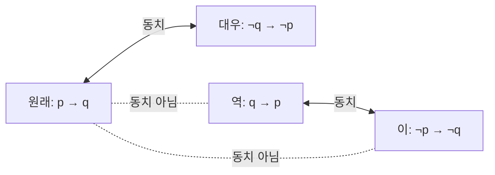


<div class="callout callout-summary" markdown="1">
<div class="callout-title callout-title--default" markdown="span">요약</div>

모양은 달라도 모든 경우에 참·거짓이 같은 두 식은 사실상 같은 조건이다. 드모르간 법칙, "이면"을 "아니거나"로 바꾸기, 대우 같은 규칙으로 조건문을 단순하게 바꾸거나 부정을 정확히 쓸 수 있다. 모든 식은 "그리고들의 또는"이나 "또는들의 그리고"라는 표준 모양으로 바꿀 수 있어 기계가 다루기 좋다. 단, "p이면 q"의 앞뒤를 뒤집은 역은 원래 명제와 같은 뜻이 아니다.

</div>


## 예시로 보기

다음 두 코드는 같은 일을 한다.

```python
if not (is_member and not is_banned): deny()
if (not is_member) or is_banned:     deny()
```

$$a$$ = 회원, $$b$$ = 정지로 두면 첫째는 $$\neg(a \wedge \neg b)$$, 둘째는 $$\neg a \vee b$$다. 네 경우 모두에서 두 식의 값이 같다. 부정을 괄호 안으로 밀어 넣을 때 "그리고"가 "또는"으로 바뀌고 각 항이 부정된다. 이것이 드모르간 법칙이다. 식 $$\neg a \vee b$$는 다시 $$a \to b$$("회원이면 정지된 경우에만 거부")로 읽을 수도 있다.

## 정의

<div class="callout callout-definition" markdown="1">
<div class="callout-title callout-title--default" markdown="span">정의</div>

두 식 $$P$$, $$Q$$가 변수의 **모든** 참·거짓 조합에서 같은 값을 가지면 논리적으로 동치라 하고 $$P \equiv Q$$(여기서 $$\equiv$$는 "논리적으로 동치")로 쓴다. $$P \leftrightarrow Q$$가 항진식인 것과 같다[^1].

</div>


<div class="callout callout-theorem" markdown="1">
<div class="callout-title" markdown="span">대표적인 동치 법칙</div>

| 이름 | 식 |
|---|---|
| 이중 부정 | $$\neg\neg p \equiv p$$ |
| 드모르간 | $$\neg(p \wedge q) \equiv \neg p \vee \neg q$$, $$\ \neg(p \vee q) \equiv \neg p \wedge \neg q$$ |
| 분배 | $$p \wedge (q \vee r) \equiv (p \wedge q) \vee (p \wedge r)$$, $$\ p \vee (q \wedge r) \equiv (p \vee q) \wedge (p \vee r)$$ |
| 흡수 | $$p \vee (p \wedge q) \equiv p$$, $$\ p \wedge (p \vee q) \equiv p$$ |
| 부정 | $$p \vee \neg p \equiv T$$, $$\ p \wedge \neg p \equiv F$$ |
| 조건문 | $$p \to q \equiv \neg p \vee q$$, $$\ \neg(p \to q) \equiv p \wedge \neg q$$ |
| 대우 | $$p \to q \equiv \neg q \to \neg p$$ |
| 쌍조건문 | $$p \leftrightarrow q \equiv (p \to q) \wedge (q \to p)$$ |

교환·결합 법칙도 $$\wedge$$, $$\vee$$ 각각에서 맞는다.

</div>


<div class="callout callout-theorem" markdown="1">
<div class="callout-title" markdown="span">정규형</div>

모든 명제 논리 식은 다음 두 꼴과 각각 동치인 식을 갖는다[^1].
- **논리합 표준형(DNF):** 리터럴(변수나 그 부정)의 $$\wedge$$들을 $$\vee$$로 이은 것. 예: $$(p \wedge \neg q) \vee (\neg p \wedge q)$$
- **논리곱 표준형(CNF):** 리터럴의 $$\vee$$들을 $$\wedge$$로 이은 것. 예: $$(p \vee q) \wedge (\neg p \vee \neg q)$$

</div>


**역·이·대우.** $$p \to q$$와 동치인 것은 대우 $$\neg q \to \neg p$$뿐이다. 역 $$q \to p$$와 이 $$\neg p \to \neg q$$는 원래 명제와 동치가 아니다($$p$$ = F, $$q$$ = T에서 원래는 참, 역은 거짓). 역과 이는 서로 대우 관계라 서로 동치다.



실선으로 이어진 짝만 늘 같은 값을 갖는다. 원래 명제와 대우는 앞뒤를 바꾸고 둘 다 부정한 사이이고, 역과 이도 같은 사이다[^s2].

## 증명

명제 논리의 동치는 유한한 경우를 모두 보는 것으로 **증명**된다. 변수가 $$n$$개면 $$2^n$$행이다.

<details class="callout callout-proof" markdown="1">
<summary class="callout-title" markdown="span">증명 펼치기</summary>

1. *대우:* $$p \to q$$가 F인 행은 ($$p$$ = T, $$q$$ = F) 하나다. $$\neg q \to \neg p$$가 F인 행은 $$\neg q$$ = T, $$\neg p$$ = F, 즉 같은 ($$p$$ = T, $$q$$ = F) 하나다. 나머지 행은 둘 다 T이므로 동치다.
2. *드모르간:* $$\neg(p \wedge q)$$는 $$p$$, $$q$$가 모두 T인 행에서만 F다. $$\neg p \vee \neg q$$도 $$\neg p$$, $$\neg q$$가 모두 F인, 즉 같은 행에서만 F다.
3. *DNF 존재:* 식 $$P$$의 진리표에서 값이 T인 행마다, 그 행에서만 T가 되는 리터럴의 $$\wedge$$를 만든다(변수가 T면 그대로, F면 부정). 이것들을 $$\vee$$로 이으면 정확히 T인 행들에서 T다. $$P$$가 한 번도 T가 아니면 $$p \wedge \neg p$$로 쓴다.
4. *CNF 존재:* $$\neg P$$의 DNF를 만들고 전체를 부정해 드모르간을 적용하면 CNF가 된다. 같은 말로, 값이 F인 행마다 "그 행이 아니다"를 뜻하는 리터럴의 $$\vee$$를 만들어 $$\wedge$$로 잇는다. ∎

</details>


### 스스로 설명해 보기

<details class="callout callout-question" markdown="1">
<summary class="callout-title" markdown="span">1. 3단계에서 "그 행에서만 T가 되는 ∧"는 왜 다른 행에서 F인가?</summary>

다른 행은 적어도 한 변수의 값이 다르다. 그 변수의 리터럴이 F가 되므로 $$\wedge$$ 전체가 F다.

</details>


<details class="callout callout-question" markdown="1">
<summary class="callout-title" markdown="span">2. 역 q → p가 원래 명제와 동치가 아님을 보이는 데 행 하나면 충분한 이유는?</summary>

동치는 "모든 행에서 같다"는 주장이다. 모든 것을 부정하려면 다른 행 하나(반례)만 있으면 된다. $$p$$ = F, $$q$$ = T 행에서 $$p \to q$$는 T, $$q \to p$$는 F다.

</details>


<details class="callout callout-question" markdown="1">
<summary class="callout-title" markdown="span">이 증명의 핵심 아이디어는?</summary>

경우가 유한하면 모두 따져 보는 것이 곧 증명이다. 그리고 진리표의 한 행을 식 하나($$\wedge$$ 묶음)로 "주소 지정"하면 어떤 진리표든 식으로 옮길 수 있다.

</details>


<details class="callout callout-question" markdown="1">
<summary class="callout-title" markdown="span">같은 방법을 쓸 수 있는 다른 상황은?</summary>

조합 회로의 설계([불 대수와 논리 회로](/Hongs_Blog/studies/discrete-math/boolean-algebra/))는 진리표에서 DNF를 만들어 게이트로 옮긴다. 집합의 항등식도 원소가 각 집합에 속하는지를 T/F로 보면 같은 진리표로 증명된다([집합](/Hongs_Blog/studies/discrete-math/sets/)).

</details>


## 예제

**식 줄이기.** $$\neg(p \vee (\neg p \wedge q))$$를 간단히 한다.

1. *드모르간:* $$\neg p \wedge \neg(\neg p \wedge q)$$
2. *드모르간, 이중 부정:* $$\neg p \wedge (p \vee \neg q)$$
3. *분배:* $$(\neg p \wedge p) \vee (\neg p \wedge \neg q)$$
4. *부정 법칙:* $$F \vee (\neg p \wedge \neg q) \equiv \neg p \wedge \neg q$$

**진리표에서 식 만들기.** 입력 셋 중 둘 이상이 1이면 1인 다수결 함수는 값이 T인 행 4개로 DNF를 만든 뒤 흡수로 줄이면 $$(p \wedge q) \vee (p \wedge r) \vee (q \wedge r)$$이다.

<div class="callout callout-check" markdown="1">
<div class="callout-title" markdown="span">검증: 동치 법칙 12개 진리표 전수, 역·이·대우, 예제, 무작위 불 함수 2,000개에서 DNF·CNF 구성법, 다수결 함수 — [02_logical-equivalence_verify.py](/Hongs_Blog/studies/discrete-math/code/02_logical-equivalence_verify/)</div>

</div>


## 활용

- **코드 리팩터링.** 부정이 겹친 조건을 드모르간으로 풀면 읽기 쉬워진다. `if not (x > 0 and y > 0)`은 `if x <= 0 or y <= 0`이다.
- **SAT 솔버.** CNF는 충족 가능성 문제(SAT)의 표준 입력이다. 하드웨어 검증, 일정 계획, 패키지 의존성 해결이 SAT로 바뀌어 풀린다. 일반적인 SAT는 NP-완전이라 모든 경우에 빠른 알고리즘은 알려져 있지 않다[^s1].
- **테스트.** 변수가 적으면 모든 조합을 돌려 보는 것이 곧 증명이다. 두 조건식이 같은지 의심스러우면 진리표를 코드로 만들어 비교하면 된다.
- 알고리즘에서: [매개변수 탐색](/Hongs_Blog/studies/algorithms/parametric-search/)은 '참이면 더 큰 값도 참'의 대우 '거짓이면 더 작은 값도 거짓'을 써서, 거짓이 나온 자리 아래를 한 번에 버린다.

## 연결

- 선수: [명제와 논리 연산](/Hongs_Blog/studies/discrete-math/propositional-logic/)
- 이어지는 개념: [추론 규칙과 증명 방법](/Hongs_Blog/studies/discrete-math/proof-methods/)(대우 증명), [불 대수와 논리 회로](/Hongs_Blog/studies/discrete-math/boolean-algebra/), [집합](/Hongs_Blog/studies/discrete-math/sets/)의 드모르간 법칙

## 자주 하는 오해

<div class="callout callout-misconception" markdown="1">
<div class="callout-title" markdown="span">"p이면 q가 참이면, q이면 p도 참이다"</div>

틀렸다. 일상 대화에서 "시험을 잘 보면 합격한다"를 들으면 "합격했으니 시험을 잘 봤다"고 거꾸로 읽기 쉽다. 역 $$q \to p$$는 원래 명제와 동치가 아니다. "비가 오면 땅이 젖는다"가 참이어도 "땅이 젖었으면 비가 왔다"는 거짓일 수 있다. 스프링클러가 있다. 원래 명제와 늘 같은 것은 대우 "땅이 젖지 않았으면 비가 오지 않았다"다. 진리표의 ($$p$$ = F, $$q$$ = T) 행이 역의 반례다.

</div>


## 확인 문제

<details class="callout callout-question" markdown="1">
<summary class="callout-title" markdown="span">**C1** 드모르간 법칙 두 개를 쓰라.</summary>

**답:** $$\neg(p \wedge q) \equiv \neg p \vee \neg q$$, $$\ \neg(p \vee q) \equiv \neg p \wedge \neg q$$.

</details>


<details class="callout callout-question" markdown="1">
<summary class="callout-title" markdown="span">**C2** p → q ≡ ¬q → ¬p를 동치 법칙만으로 증명하라.</summary>

**답:** $$p \to q \equiv \neg p \vee q$$(조건문) $$\equiv q \vee \neg p$$(교환) $$\equiv \neg\neg q \vee \neg p$$(이중 부정) $$\equiv \neg q \to \neg p$$(조건문을 거꾸로).

</details>


<details class="callout callout-question" markdown="1">
<summary class="callout-title" markdown="span">**C3** ¬(p ∨ (¬p ∧ q))를 가장 간단한 꼴로 줄이고, 각 단계에 쓴 법칙을 적어라.</summary>

**답:** 드모르간 → $$\neg p \wedge \neg(\neg p \wedge q)$$, 드모르간·이중 부정 → $$\neg p \wedge (p \vee \neg q)$$, 분배 → $$(\neg p \wedge p) \vee (\neg p \wedge \neg q)$$, 부정 법칙 → $$\neg p \wedge \neg q$$.

</details>


<details class="callout callout-question" markdown="1">
<summary class="callout-title" markdown="span">**C4** 다음 중 p → q와 동치인 것을 모두 고르고, 아닌 것에는 반례를 들라. (가) q → p (나) ¬p → ¬q (다) ¬q → ¬p (라) ¬p ∨ q</summary>

**답:** (다)와 (라). (가)와 (나)는 $$p$$ = F, $$q$$ = T에서 거짓이지만 $$p \to q$$는 참이다.

**흔한 오답:** (나)의 "이"를 대우와 헷갈리는 것. 대우는 부정하면서 **순서도 바꾼다**.

</details>


[^1]: Lehman·Leighton·Meyer, *Mathematics for Computer Science*, 3장 "Logical Formulas"(동치와 타당성, 명제의 대수, 정규형, SAT). Rosen, *Discrete Mathematics and Its Applications* 7판, 1장.
[^s1]: 에이전트 보충. SAT가 NP-완전이라는 것은 쿡-레빈 정리다(Cook 1971). 실제 SAT 솔버는 최악의 경우 지수 시간이지만 산업 문제의 많은 사례를 빠르게 푼다.
[^s2]: 에이전트 보충. 다이어그램 1개는 원본에 없다. 정의 섹션의 '역·이·대우' 문단과 동치 법칙 표의 대우 줄을 그렸다.

