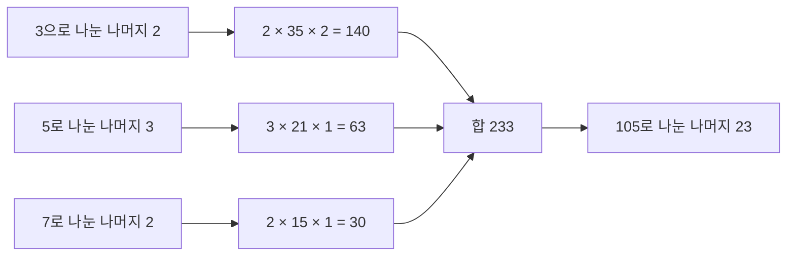



요약

나머지 산술에서 "나누기"는 역원을 곱하는 것이다. 26으로 나눈 나머지만 보는 세계에서 7에 곱해 1이 되는 수(15)를 찾아 두면, 7로 나누는 대신 15를 곱하면 된다. 이런 역원은 두 수의 공약수가 1뿐(서로소)일 때만 있고, 확장 유클리드 호제법으로 바로 구한다. 또 서로소인 여러 수로 나눈 나머지들을 알면 원래 수를 (그 수들의 곱을 법으로) 하나로 되살릴 수 있다. 법들이 서로소가 아니면 해가 없거나 하나로 정해지지 않는다.

## 예시로 보기

아핀 암호는 알파벳을 0~25로 보고 $$y = 7x + 3 \pmod{26}$$으로 바꾼다. 풀려면 $$x = 7^{-1}(y - 3)$$이 필요하다. $$7 \times 15 = 105 = 4 \times 26 + 1$$이라 $$7^{-1} \equiv 15 \pmod{26}$$이다. 그래서 $$x \equiv 15(y - 3) \pmod{26}$$로 복호한다. 한편 $$y = 2x \pmod{26}$$은 풀 수 없다. $$2 \cdot 0 \equiv 2 \cdot 13 \equiv 0$$이라 두 글자가 같은 암호문이 된다. 7이 아래 정리의 $$a$$, 26이 $$m$$이다.

## 정의

모듈러 역원

$$a x \equiv 1 \pmod m$$인 $$x$$를 $$a$$의 법 $$m$$에 대한 **역원** $$a^{-1}$$이라 한다. 역원은 $$\gcd(a, m) = 1$$일 때 **그리고 그때만** 있고, 있으면 법 $$m$$에 대해 하나뿐이다[^1].

증명

($$\Leftarrow$$) [베주 항등식](/Hongs_Blog/studies/discrete-math/gcd-euclid/)으로 $$as + mt = 1$$이라 $$as \equiv 1 \pmod m$$. $$s$$가 역원이다. 
($$\Rightarrow$$) $$ax \equiv 1$$이면 $$ax - 1 = mk$$, 즉 $$ax - mk = 1$$. $$\gcd(a, m)$$이 좌변을 나누므로 1을 나눠 1이다. 
유일성: $$ax \equiv ay \equiv 1$$이면 $$x \equiv x(ay) = (xa)y \equiv y$$. ∎

$$p$$가 소수면 $$1, \dots, p - 1$$이 모두 $$p$$와 서로소라 0이 아닌 모든 수에 역원이 있다. 그래서 $$\mathbb{Z}_p$$에서는 사칙연산이 모두 된다(유한체).

중국인의 나머지 정리

$$m_1, \dots, m_k$$가 **쌍마다 서로소**이고 $$M = m_1 \cdots m_k$$이면, 연립 합동식 $$x \equiv a_i \pmod{m_i}$$($$i = 1, \dots, k$$)의 해가 법 $$M$$에 대해 정확히 하나 있다.

증명

*존재:* $$M_i = M/m_i$$로 두면 $$\gcd(M_i, m_i) = 1$$이라 역원 $$y_i = M_i^{-1} \bmod m_i$$가 있다. $$x = \sum_i a_i M_i y_i$$로 두자. $$j \ne i$$이면 $$m_i \mid M_j$$라 법 $$m_i$$에서 $$i$$번째 항만 남고, $$a_i M_i y_i \equiv a_i$$이다. 
*유일성:* 두 해 $$x, x'$$는 모든 $$m_i$$에 대해 $$m_i \mid (x - x')$$이다. $$m_i$$들이 쌍마다 서로소라 곱 $$M$$도 $$x - x'$$을 나눈다(산술의 기본정리). ∎

칸 하나는 '3으로 나눈 나머지, 5로 나눈 나머지'의 짝이다. 왼쪽에서는 0부터 14까지가 15칸을 하나씩 빠짐없이 채운다. 그래서 어떤 나머지 짝을 골라도 15보다 작은 답이 딱 하나 있다. 오른쪽처럼 4와 6이 공약수 2를 가지면 0부터 23까지가 절반의 칸에 두 개씩 몰리고 나머지 칸은 빈다. 빈 칸의 짝은 해가 없고, 찬 칸의 짝은 24보다 작은 해가 둘이라 하나로 정해지지 않는다[^s2].

## 예제

"3으로 나누면 2가 남고, 5로 나누면 3이 남고, 7로 나누면 2가 남는 수"(손자산경의 문제)[^2].

1. *곱과 몫:* $$M = 105$$, $$M_1 = 35$$, $$M_2 = 21$$, $$M_3 = 15$$.
2. *역원:* $$35 \equiv 2 \pmod 3$$이라 $$y_1 = 2$$. $$21 \equiv 1 \pmod 5$$라 $$y_2 = 1$$. $$15 \equiv 1 \pmod 7$$이라 $$y_3 = 1$$.
3. *조립:* $$x = 2 \cdot 35 \cdot 2 + 3 \cdot 21 \cdot 1 + 2 \cdot 15 \cdot 1 = 140 + 63 + 30 = 233 \equiv 23 \pmod{105}$$.
4. *검산:* $$23 = 7 \cdot 3 + 2 = 4 \cdot 5 + 3 = 3 \cdot 7 + 2$$.

나머지 하나가 항 하나를 만들고, 세 항을 더한 뒤 105로 나눈다. 각 항은 자기 법에서만 $$a_i$$를 남기고, 다른 두 법에서는 0이 되도록 만든 것이다[^s3].

검증: 역원의 존재 조건과 유일성($$m \le 60$$ 전수), $$7^{-1} \equiv 15 \pmod{26}$$과 아핀 암호의 왕복, $$y = 2x$$의 충돌, CRT 해의 존재·유일성(작은 법 전수)과 손자산경 23, 서로소가 아닐 때의 예, RSA-CRT 복호의 일치 — [29_modular-inverse-crt_verify.py](/Hongs_Blog/studies/discrete-math/code/29_modular-inverse-crt_verify/)

## 활용

- **나눗셈이 필요한 모듈러 계산.** 조합 수 $$\binom{n}{k} \bmod p$$($$\binom{\ }{\ }$$은 위의 수만큼 있는 것에서 아래의 수만큼 고르는 경우의 수)를 계산할 때 $$k!$$로 나누는 대신 역원을 곱한다. 경진 프로그래밍에서 자주 쓰는 법 $$10^9 + 7$$은 소수라 모든 0 아닌 수에 역원이 있다.
- **RSA 복호 가속.** $$n = pq$$에서 $$c^d \bmod n$$을 직접 계산하는 대신, $$\bmod p$$와 $$\bmod q$$에서 따로 계산해 CRT로 합친다. 지수와 법이 모두 절반 크기라 두 번 계산해도 더 빠르다[^s1]. [RSA 암호](/Hongs_Blog/studies/discrete-math/rsa/)의 구현에 들어 있다.
- **큰 정수 연산.** 큰 수를 여러 작은 소수로 나눈 나머지들로 들고 다니며 덧셈·곱셈을 따로 하고, 마지막에 CRT로 되살린다(잉여 수 체계)[^s1].
- 알고리즘에서: [노란불 신호등](/Hongs_Blog/studies/algorithms/pg468371/)에서 모든 신호등이 동시에 노란불인 때는, 신호등마다 노란불인 위치를 하나씩 골라 세운 연립 합동식의 해다. 주기들이 쌍마다 서로소면 답이 늘 있고, 1보다 큰 공약수를 가진 쌍이 있으면 답이 없을 수 있다. 주기가 서로소인 두 반복은 두 주기를 곱한 시간 동안 모든 상태 짝을 한 번씩 거친 뒤 되풀이되고, 주기 5초·6초인 신호등 두 개를 30초까지만 확인하면 되는 예가 [완전탐색](/Hongs_Blog/studies/algorithms/brute-force/)에 있다.

## 연결

- 선수: [최대공약수와 유클리드 호제법](/Hongs_Blog/studies/discrete-math/gcd-euclid/)
- 이어지는 개념: [페르마 소정리와 오일러 정리](/Hongs_Blog/studies/discrete-math/fermat-euler/)(역원을 거듭제곱으로 구하기), [RSA 암호](/Hongs_Blog/studies/discrete-math/rsa/)

## 확인 문제

**C1** 7의 법 26에 대한 역원을 확장 유클리드 호제법으로 구하라.

**답:** $$26 = 3 \cdot 7 + 5$$, $$7 = 1 \cdot 5 + 2$$, $$5 = 2 \cdot 2 + 1$$. 거꾸로 대입하면 $$1 = 5 - 2 \cdot 2 = 5 - 2(7 - 5) = 3 \cdot 5 - 2 \cdot 7 = 3(26 - 3 \cdot 7) - 2 \cdot 7 = 3 \cdot 26 - 11 \cdot 7$$. 그래서 $$7^{-1} \equiv -11 \equiv 15$$.

**C2** 4에는 법 6에 대한 역원이 없는 이유를 두 가지 방법으로 설명하라.

**답:** (1) $$\gcd(4, 6) = 2 \ne 1$$이다. $$4x - 6k$$는 늘 짝수라 1이 될 수 없다. (2) $$4x \bmod 6$$을 $$x = 0, \dots, 5$$에서 계산하면 $$0, 4, 2, 0, 4, 2$$라 1이 나오지 않는다.

**C3** x ≡ 1 (mod 4), x ≡ 2 (mod 9)를 푸라.

**답:** $$M = 36$$. $$M_1 = 9 \equiv 1 \pmod 4$$라 $$y_1 = 1$$. $$M_2 = 4$$, $$4 \cdot 7 = 28 \equiv 1 \pmod 9$$라 $$y_2 = 7$$. $$x = 1 \cdot 9 \cdot 1 + 2 \cdot 4 \cdot 7 = 65 \equiv 29 \pmod{36}$$. 검산: $$29 = 7 \cdot 4 + 1 = 3 \cdot 9 + 2$$.

[^1]: Lehman·Leighton·Meyer, *Mathematics for Computer Science*, 9장. Rosen, *Discrete Mathematics and Its Applications* 7판, 4장(역원, 중국인의 나머지 정리). Cormen et al., *Introduction to Algorithms* 3판, 31.4절 "Solving modular linear equations", 31.5절 "The Chinese remainder theorem".
[^2]: 손자산경의 문제는 Rosen 7판 4장의 중국인의 나머지 정리 절에 역사적 예로 실려 있다.
[^s1]: 보충 RSA-CRT 복호는 실제 RSA 구현이 쓰는 표준 기법이다. 잉여 수 체계는 큰 정수·다항식 곱셈 알고리즘에서 쓰는 표준 기법이다. 여러 소수로 나눈 나머지로 곱셈을 하고 되살리는 과정과 RSA-CRT 복호 결과가 직접 복호와 같음은 29_modular-inverse-crt_verify.py에서 확인했다.
[^s2]: 보충 그림 한 장은 원본에 없다. [29_modular-inverse-crt_plot.py](/Hongs_Blog/studies/discrete-math/code/29_modular-inverse-crt_plot/)로 그렸고, 법 3, 5에서 15칸이 하나씩 차는 것, 법 4, 6에서 12칸에 두 개씩 몰리는 것, $$x \equiv 1 \pmod 4$$, $$x \equiv 0 \pmod 6$$의 해가 없는 것을 같은 코드로 확인했다.
[^s3]: 보충 다이어그램 1개는 원본에 없다. '예제'의 손자산경 문제 풀이(1~4단계)와 정리 증명의 존재 부분을 그렸다.

