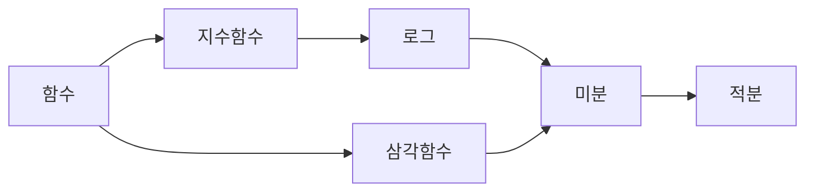



요약

부분순서는 "무엇이 먼저 와야 하는가"를 나타내되, 모든 쌍을 비교하지는 않는 순서다. 과목의 선수관계, 작업의 의존성, 버전의 포함 관계가 그렇다. 의존 관계에 사이클이 없으면 늘 한 줄로 세울 수 있고(위상 정렬), 그 줄은 보통 여러 가지다. 사이클이 있으면 어떤 순서로도 세울 수 없다.

## 예시로 보기

이 볼트의 공학수학 문서 번호가 바로 위상 정렬이다. 몇 개념을 줄이면 선수관계가 이렇다: 함수 → 지수함수 → 로그, 함수 → 삼각함수, 로그와 삼각함수 → 미분, 미분 → 적분.

로그와 삼각함수는 서로 기대지 않아 비교할 수 없다. 그래서 줄을 세우는 방법이 여럿이다. "함수, 지수, 로그, 삼각함수, 미분, 적분"도 되고 "함수, 삼각함수, 지수, 로그, 미분, 적분"도 된다. 모두 세 가지다. 화살표가 아래 정의의 순서 관계, 한 줄로 세운 결과가 선형 확장이다.

## 정의

정의

집합 $$A$$ 위의 관계 $$\preceq$$가 반사적·반대칭적·추이적이면 **부분순서**, $$(A, \preceq)$$를 부분순서 집합(poset)이라 한다. 모든 두 원소가 비교 가능하면($$a \preceq b$$ 또는 $$b \preceq a$$) **전순서**다[^1].
- 비반사적·추이적인 관계 $$\prec$$는 엄격한 부분순서다. 사이클이 없는 유향 그래프(DAG)의 도달 관계가 엄격한 부분순서다.
- $$a$$보다 작은 원소가 없으면 $$a$$는 극소 원소, 큰 원소가 없으면 극대 원소다.
- **선형 확장**(위상 정렬): 모든 $$a \prec b$$에서 $$a$$가 $$b$$보다 앞에 오도록 원소를 한 줄로 세운 것.

그림으로는 하세 도표를 쓴다. 반사 고리와 추이로 따라 나오는 화살표를 빼고, 바로 위의 관계만 선으로 긋는다.

정리

유한한 부분순서 집합은 선형 확장을 가진다. 유향 그래프가 위상 정렬을 가질 필요충분조건은 사이클이 없는 것이다[^1].

증명

1. *극소 원소가 있다:* 비어 있지 않은 유한 집합에서 아무 원소에서 출발해 더 작은 원소로 계속 내려간다. 추이성과 비반사성으로 같은 원소를 두 번 만날 수 없어(다시 만나면 $$a \prec a$$) 유한 번 안에 멈춘다. 멈춘 곳이 극소 원소다.
2. *줄 세우기:* 극소 원소를 맨 앞에 두고 지운다. 남은 집합도 부분순서라 1을 되풀이한다. 앞에 둔 원소는 뒤의 어떤 원소보다도 크지 않으므로 순서가 지켜진다.
3. *사이클이면 불가능:* $$a_1 \to a_2 \to \cdots \to a_k \to a_1$$이면 한 줄에서 $$a_1$$이 $$a_2$$보다 앞, …, $$a_k$$가 $$a_1$$보다 앞이어야 해 $$a_1$$이 자기보다 앞이라는 모순이 된다. ∎

증명 2가 곧 **칸 알고리즘**이다. 들어오는 화살표가 없는 정점을 하나 꺼내 출력하고, 그 정점의 화살표를 지우는 일을 되풀이한다. 정점 $$n$$개, 간선 $$m$$개에 $$O(n + m)$$이다. 끝났는데 남은 정점이 있으면 사이클이 있다는 뜻이다.

## 예제

위 그래프에서 칸 알고리즘을 돌린다. 쓸 수 있는 것이 여럿이면 번호가 작은 것(함수 0, 지수 1, 로그 2, 삼각함수 3, 미분 4, 적분 5)부터 꺼낸다.

| 단계 | 꺼낸 것 | 꺼낸 뒤 쓸 수 있는 것 |
|---|---|---|
| 1 | 함수 | 지수, 삼각함수 |
| 2 | 지수 | 로그, 삼각함수 |
| 3 | 로그 | 삼각함수 |
| 4 | 삼각함수 | 미분 |
| 5 | 미분 | 적분 |
| 6 | 적분 | 없음 |

결과는 "함수, 지수, 로그, 삼각함수, 미분, 적분"이다. 모든 화살표가 앞에서 뒤로 향한다.

검증: 무작위 유향 그래프 2,000개에서 칸 알고리즘의 결과가 전수로 구한 선형 확장 중 하나이고 사이클이면 정점이 남음, 예제의 순서와 선형 확장 3가지, $$\{1..12\}$$의 나누어떨어짐의 극소·극대 원소 — [11_partial-orders_verify.py](/Hongs_Blog/studies/discrete-math/code/11_partial-orders_verify/)

## 활용

- **빌드와 패키지.** `make`, 패키지 관리자, 스프레드시트의 재계산은 의존 관계를 위상 정렬해 순서를 정한다. 순환 의존이 있으면 "cycle detected" 오류를 낸다.
- **작업 일정.** 선후 관계가 있는 작업을 여러 사람에게 나눌 때, 극소 원소들(지금 당장 할 수 있는 일)을 동시에 진행한다.
- **학습 순서.** 이 볼트의 번호 규칙이 "선수 개념은 늘 앞 번호"라는 위상 정렬이다. 로드맵의 "다음에 배울 수 있는 것"은 익히지 않은 개념 가운데 극소 원소들이다.
- 알고리즘에서: 사이클이 없을 때 깊이 우선 탐색이 끝나는 순서를 거꾸로 해도 위상 정렬이 나온다([깊이 우선 탐색(DFS)](/Hongs_Blog/studies/algorithms/dfs/)). [동굴 탐험](/Hongs_Blog/studies/algorithms/pg67260/)은 "부모 방을 지나야 자식 방에 간다"는 조건과 주어진 순서 쌍을 모두 화살표로 그린 뒤, 칸 알고리즘으로 사이클이 있는지 본다. [후보키](/Hongs_Blog/studies/algorithms/pg42890/)의 후보 키는 유일한 열 집합 가운데 극소 원소라서, 크기 순으로 훑으면 이미 찾은 키를 품은 집합만 건너뛰어도 최소성이 지켜진다. 그 밖에 [동적 계획법](/Hongs_Blog/studies/algorithms/dynamic-programming/), [양과 늑대](/Hongs_Blog/studies/algorithms/pg92343/), [코딩 테스트 공부](/Hongs_Blog/studies/algorithms/pg118668/), [튜브의 소개팅](/Hongs_Blog/studies/algorithms/pg1839/), [네오의 귀걸이](/Hongs_Blog/studies/algorithms/pg1842/)에서도 쓴다.
- 브리지: [위상 정렬 ↔ 동적 계획법의 계산 순서](/Hongs_Blog/studies/algorithms/toposort-dp-order/)

## 연결

- 선수: [관계와 그 성질](/Hongs_Blog/studies/discrete-math/relations/)
- 대조: [동치관계](/Hongs_Blog/studies/discrete-math/equivalence-relations/)는 대칭(무리 짓기), 부분순서는 반대칭(줄 세우기)
- 이어지는 개념: [그래프의 기초](/Hongs_Blog/studies/discrete-math/graph-basics/)와 [경로](/Hongs_Blog/studies/discrete-math/connectivity/)

## 확인 문제

**C1** 부분순서의 세 조건을 쓰고, 전순서와의 차이를 예로 설명하라.

**답:** 반사, 반대칭, 추이. 전순서는 모든 두 원소가 비교 가능해야 한다. 정수의 $$\le$$는 전순서, 나누어떨어짐은 2와 3을 비교할 수 없어 전순서가 아닌 부분순서다.

**C2** 정점 0~5와 간선 0→1, 1→2, 0→3, 2→4, 3→4, 4→5에서 칸 알고리즘을 돌린다(쓸 수 있는 것 중 번호가 작은 것부터). 출력 순서는?

**답:** 0, 1, 2, 3, 4, 5. 0을 꺼내면 1과 3이 가능하고, 1 → 2를 꺼낸 뒤 3, 그다음 4가 풀리고 5가 마지막이다.

**흔한 오답:** 0 다음에 3을 꺼내는 것. 규칙상 가능한 것 중 번호가 작은 1이 먼저다(규칙이 다르면 다른 올바른 답도 있다).

**C3** 순환 의존이 있으면 왜 위상 정렬이 불가능한가? 칸 알고리즘은 이것을 어떻게 알아차리는가?

**답:** 사이클 $$a_1 \to \cdots \to a_k \to a_1$$이 있으면 $$a_1$$이 자기 자신보다 앞에 와야 해 모순이다. 칸 알고리즘에서는 사이클의 정점들은 들어오는 화살표가 끝내 0이 되지 않아 꺼내지지 못하고, 끝났을 때 남은 정점이 생긴다.

[^1]: Lehman·Leighton·Meyer, *Mathematics for Computer Science*, 10장 "Directed graphs & Partial Orders"(DAG, 부분순서, 위상 정렬). Rosen, *Discrete Mathematics and Its Applications* 7판, 9장(부분순서, 하세 도표, 위상 정렬).

