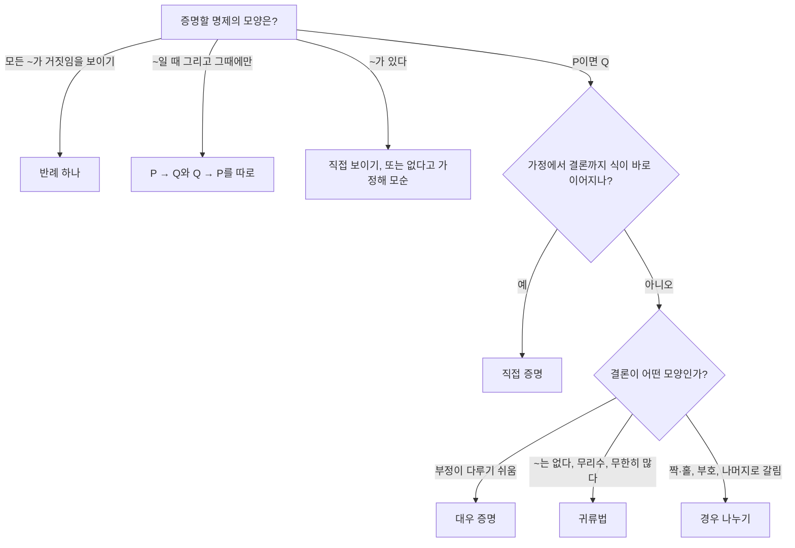



요약

증명은 이미 참이라고 인정된 것에서 출발해, 한 걸음마다 정당한 규칙만 써서 결론까지 가는 글이다. 직접 증명, 대우 증명, 귀류법, 경우 나누기, 반례 들기 다섯 가지면 대부분의 명제를 다룬다. 어떤 방법을 쓸지는 결론의 모양이 알려 준다. 다만 예를 아무리 많이 확인해도 "모든 경우"를 증명한 것은 아니다.

## 예시로 보기

"$$n^2$$이 짝수이면 $$n$$도 짝수다"를 증명하려 한다. 가정에서 바로 가면 $$n^2 = 2k$$에서 $$n = \sqrt{2k}$$가 되어 막힌다. 대우 "$$n$$이 홀수이면 $$n^2$$도 홀수다"는 쉽다. $$n = 2k + 1$$이면 $$n^2 = 4k^2 + 4k + 1 = 2(2k^2 + 2k) + 1$$로 홀수다. 대우는 원래 명제와 [논리적으로 동치](/Hongs_Blog/studies/discrete-math/logical-equivalence/)이므로 원래 명제도 증명되었다.

방법을 바꾸는 것만으로 막힌 길이 열렸다. 가정 "$$n^2$$이 짝수"가 아래의 $$P$$, 결론 "$$n$$이 짝수"가 $$Q$$이고, 대우 증명은 $$\neg Q$$에서 $$\neg P$$로 가는 길이다.

## 정의

타당한 추론 규칙

전제가 모두 참이면 결론도 반드시 참인 추론을 **타당하다**고 한다. (전제들의 $$\wedge$$) $$\to$$ 결론이 항진식인 것과 같다[^1].

| 규칙 | 전제 | 결론 |
|---|---|---|
| 전건 긍정 (modus ponens) | $$p \to q$$, $$p$$ | $$q$$ |
| 후건 부정 (modus tollens) | $$p \to q$$, $$\neg q$$ | $$\neg p$$ |
| 가언 삼단논법 | $$p \to q$$, $$q \to r$$ | $$p \to r$$ |
| 선언 삼단논법 | $$p \vee q$$, $$\neg p$$ | $$q$$ |
| 전칭 예화 / 일반화 | $$\forall x\,P(x)$$ / 임의의 $$c$$에서 $$P(c)$$ | $$P(c)$$ / $$\forall x\,P(x)$$ |

흔한 **오류**: 후건 긍정($$p \to q$$, $$q$$ ⊢ $$p$$)과 전건 부정($$p \to q$$, $$\neg p$$ ⊢ $$\neg q$$)은 타당하지 않다.

증명 방법은 "$$P$$이면 $$Q$$"꼴의 명제에 대해 다음과 같다[^2].

| 방법 | 틀 | 이럴 때 떠올린다 |
|---|---|---|
| 직접 증명 | $$P$$를 가정하고 정의·정리로 $$Q$$까지 간다 | 가정에서 결론으로 식이 바로 이어질 때 |
| 대우 증명 | $$\neg Q$$를 가정하고 $$\neg P$$를 보인다 | 결론의 부정이 다루기 쉬울 때("~가 아니다", 제곱근이 나올 때) |
| 귀류법 | $$P$$와 $$\neg Q$$를 함께 가정해 모순을 끌어낸다 | 결론이 "~는 없다", "무리수다", "무한히 많다"일 때 |
| 경우 나누기 | 경우를 빠짐없이 나눠 각각 증명한다 | 짝·홀, 부호, 나머지처럼 성질이 갈릴 때 |
| 반례 | $$P$$는 참이고 $$Q$$는 거짓인 예 하나를 보인다 | "모든 ~"가 **거짓**임을 보일 때 |
| 필요충분 | $$P \to Q$$와 $$Q \to P$$를 따로 증명한다 | "~일 때 그리고 그때에만" |

존재 명제 $$\exists x\,P(x)$$는 그런 $$x$$를 직접 보이거나(구성적), 없다고 가정해 모순을 끌어낸다(비구성적).

맨 위에서 명제의 모양을 보고 갈래를 고른다. 갈래는 표의 '이럴 때 떠올린다' 열과 같다. 한 갈래에서 막히면 다른 갈래로 옮긴다. 예시의 $$n^2$$ 명제가 직접 증명에서 대우 증명으로 옮겨 간 경우다[^s1].

## 예제

**귀류법: $$\sqrt2$$는 무리수다.**

1. *부정을 가정:* $$\sqrt2 = p/q$$($$p, q$$는 서로소인 양의 정수)라 하자.
2. *제곱:* $$p^2 = 2q^2$$이므로 $$p^2$$은 짝수다.
3. *보조정리 사용:* 예시의 명제로 $$p$$는 짝수, $$p = 2k$$다.
4. *다시 대입:* $$4k^2 = 2q^2$$, 즉 $$q^2 = 2k^2$$이라 $$q$$도 짝수다.
5. *모순:* $$p$$, $$q$$가 모두 짝수라 서로소라는 가정과 모순이다. 따라서 $$\sqrt2$$는 유리수가 아니다.

**경우 나누기: $$n^2 + n$$은 늘 짝수다.** $$n$$이 짝수면 $$n^2 + n = n(n + 1)$$에서 $$n$$이 짝수라 곱이 짝수. $$n$$이 홀수면 $$n + 1$$이 짝수라 곱이 짝수. 두 경우가 모든 정수를 덮는다.

**반례: "$$n^2 + n + 41$$은 모든 자연수 $$n$$에서 소수다"는 거짓이다.** $$n = 0, 1, \dots, 39$$에서는 모두 소수지만 $$n = 40$$이면 $$1681 = 41^2$$이다. 반례 하나로 "모든"은 무너진다.

**비구성적 존재: 무리수 $$a$$, $$b$$로 $$a^b$$가 유리수인 것이 있다.** $$\sqrt2^{\sqrt2}$$가 유리수면 $$a = b = \sqrt2$$로 끝이다. 무리수면 $$a = \sqrt2^{\sqrt2}$$, $$b = \sqrt2$$로 두면 $$a^b = \sqrt2^{2} = 2$$다. 어느 경우인지 몰라도 존재는 증명된다.

검증: 규칙 4개의 타당성과 오류 2개를 진리표로 확인, 짝·홀 명제를 $$\vert n\vert  \le 10^5$$에서 확인(실험. 증명은 위), $$n^2 + n + 41$$의 소수 40개와 $$n = 40$$의 반례, $$q \le 10^5$$에서 $$p^2 = 2q^2$$의 해가 없음(실험), $$(\sqrt2^{\sqrt2})^{\sqrt2} = 2$$ — [04_proof-methods_verify.py](/Hongs_Blog/studies/discrete-math/code/04_proof-methods_verify/)

### 스스로 설명해 보기

1. √2 증명의 3단계 "p는 짝수"는 어디서 나오나?

"$$n^2$$이 짝수이면 $$n$$도 짝수다"(예시에서 대우로 증명한 보조정리)에 $$n = p$$를 넣었다. 2단계에서 $$p^2$$이 짝수임을 보였기 때문에 쓸 수 있다.

2. 1단계에서 "서로소"를 가정해도 되는 이유는?

모든 양의 유리수는 약분해서 기약분수로 쓸 수 있다. 그래서 $$\sqrt2$$가 유리수라면 서로소인 $$p$$, $$q$$로 쓸 수 있다는 것은 추가 가정이 아니다.

귀류법의 핵심 아이디어는?

결론의 부정을 가정에 더해 모순을 끌어내면, 그 부정이 불가능하므로 결론이 참이다. $$(\neg Q \to F) \equiv Q$$다.

같은 방법을 쓸 수 있는 다른 상황은?

소수가 무한히 많다는 증명, 실수가 셀 수 없다는 [대각선 논법](/Hongs_Blog/studies/discrete-math/countability/), 정지 문제가 풀리지 않는다는 증명이 모두 귀류법이다.

## 활용

- **알고리즘 정확성.** "이 반복문이 끝나면 배열이 정렬되어 있다"는 직접 증명과 [귀납법](/Hongs_Blog/studies/discrete-math/induction/)으로 보인다. 최적성은 "더 나은 해가 있다고 가정하면 모순"인 귀류법으로 자주 보인다(교환 논증).
- **디버깅.** 반례 하나가 버그를 증명한다. 반대로 테스트 통과는 증명이 아니다. 테스트가 "몇 개의 예"라는 것을 기억한다.
- **코드 리뷰.** "이 조건이면 저 값은 null이 아니다"를 한 줄씩 정당화하는 것이 직접 증명이다.
- 알고리즘에서: 회의실 배정에서 "가장 짧은 회의부터" 고르는 [그리디](/Hongs_Blog/studies/algorithms/greedy/) 기준은 회의 (0 ~ 5), (4 ~ 6), (5 ~ 10)이라는 반례 하나로 무너진다. [매개변수 탐색](/Hongs_Blog/studies/algorithms/parametric-search/)은 후건 부정으로 범위의 절반을 버린다. "x에서 되면 더 큰 값에서도 된다"가 참일 때, mid에서 안 되면 mid 이하에서도 모두 안 된다. 그 밖에 [다익스트라](/Hongs_Blog/studies/algorithms/dijkstra/)의 정확성 증명(귀류법)에서도 쓴다.

## 연결

- 선수: [논리적 동치와 정규형](/Hongs_Blog/studies/discrete-math/logical-equivalence/)(대우), [술어와 한정기호](/Hongs_Blog/studies/discrete-math/predicate-logic/)(모든·어떤의 증명과 부정)
- 이어지는 개념: [수학적 귀납법](/Hongs_Blog/studies/discrete-math/induction/), [가산 집합과 대각선 논법](/Hongs_Blog/studies/discrete-math/countability/)

## 자주 하는 오해

"예를 충분히 많이 확인하면 증명이 된다"

틀렸다. 실험에서는 많은 사례가 확신을 주기 때문에 수학에서도 그럴 것 같다. 하지만 "모든 $$n$$"은 무한히 많은 주장이라 유한 개의 확인으로 덮을 수 없다. $$n^2 + n + 41$$은 $$n = 0$$부터 39까지 40개가 모두 소수라서 규칙처럼 보이지만 $$n = 40$$에서 $$41^2$$이 된다. 사례 확인은 추측을 세우고 반례를 찾는 데 쓰고, "모든"은 증명으로 보인다.

## 확인 문제

**C1** "P이면 Q"를 증명하는 방법 네 가지(직접, 대우, 귀류, 경우 나누기)의 틀을 각각 한 줄로 쓰고, "모든 ~는 ~다"가 거짓임을 보이는 방법을 쓰라.

**답:** 직접: $$P$$ 가정 → $$Q$$. 대우: $$\neg Q$$ 가정 → $$\neg P$$. 귀류: $$P \wedge \neg Q$$ 가정 → 모순. 경우 나누기: 모든 경우를 덮게 나누고 각각 증명. 거짓임을 보이려면 반례 하나.

**C2** √2가 무리수라는 귀류법 증명에서 "p²이 짝수이면 p도 짝수"는 어떻게 증명하는가? 왜 직접 증명보다 대우가 쉬운가?

**답:** 대우 "$$p$$가 홀수이면 $$p^2$$도 홀수"를 보인다: $$p = 2k + 1$$이면 $$p^2 = 2(2k^2 + 2k) + 1$$. 직접 가면 $$p^2 = 2m$$에서 $$p$$를 $$m$$으로 나타내려면 제곱근이 나와 막힌다. 대우는 $$p$$의 모양을 먼저 정하고 제곱하면 되어 곱셈만으로 끝난다.

**C3** "모든 자연수 n에 대해 n² + n + 41은 소수다"가 거짓임을 보여라.

**답:** $$n = 40$$이면 $$1600 + 40 + 41 = 1681 = 41^2$$로 소수가 아니다. ($$n = 41$$도 $$41 \cdot 43$$으로 반례다.)

**C4** 두 추론 중 타당한 것은? (가) 비가 오면 땅이 젖는다. 땅이 젖었다. 그러므로 비가 왔다. (나) 비가 오면 땅이 젖는다. 땅이 젖지 않았다. 그러므로 비가 오지 않았다.

**답:** (나)만 타당하다(후건 부정). (가)는 후건 긍정의 오류다. 전제 $$p \to q$$와 $$q$$가 참이어도 $$p$$가 거짓인 경우(스프링클러)가 진리표에 있다.

[^1]: Rosen, *Discrete Mathematics and Its Applications* 7판, 1장(추론 규칙, 증명 방법과 전략)
[^2]: Lehman·Leighton·Meyer, *Mathematics for Computer Science*, 1장 "What is a Proof?"(직접 증명, 대우, 필요충분, 경우 나누기, 귀류법, $$\sqrt2$$의 무리수성)
[^s1]: 에이전트 보충. 다이어그램 1개는 원본에 없다. 정의 섹션의 증명 방법 표('이럴 때 떠올린다' 열)와 존재 명제 문단을 갈림길로 그렸다.

