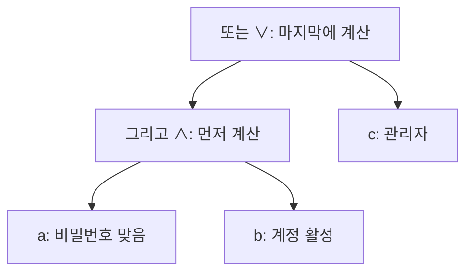



요약

명제는 참인지 거짓인지 딱 정해지는 문장이다. "그리고·또는·아니다·이면" 같은 연결어로 짧은 명제를 이어 복잡한 조건을 만들고, 그 참·거짓은 모든 경우를 표로 늘어놓아(진리표) 기계적으로 따진다. 프로그램의 if 조건이 곧 명제 논리다. 가장 헷갈리는 곳은 "p이면 q"로, p가 거짓이면 q와 상관없이 전체가 참이 된다.

## 예시로 보기

어떤 서비스의 로그인 규칙이 "비밀번호가 맞고 계정이 활성이거나, 관리자이면 들어갈 수 있다"라고 하자. 세 명제를 $$a$$(비밀번호 맞음), $$b$$(계정 활성), $$c$$(관리자)로 두면 규칙은 $$(a \wedge b) \vee c$$다. 경우는 $$2^3 = 8$$가지이고, 그중 참인 것은 5가지다.

| $$a$$ | $$b$$ | $$c$$ | $$a \wedge b$$ | $$(a \wedge b) \vee c$$ |
|---|---|---|---|---|
| T | T | T | T | T |
| T | T | F | T | T |
| T | F | T | F | T |
| T | F | F | F | F |
| F | T | T | F | T |
| F | T | F | F | F |
| F | F | T | F | T |
| F | F | F | F | F |

코드로는 `if (pw_ok and active) or admin:`이다. 진리표의 한 행이 입력 한 가지, 마지막 열이 그 입력에 대한 판정이다.

식을 나무 모양으로 그리면 아래쪽 연결어부터 값을 정해 위로 올라간다. 진리표의 $$a \wedge b$$ 열이 가운데 마디의 값이고, 마지막 열이 맨 위 마디의 값이다[^s1].

## 정의

정의

**명제**(proposition)는 참(T) 또는 거짓(F) 중 정확히 하나의 값을 갖는 문장이다[^1]. 명제 $$p$$, $$q$$에 대해 다음 연결사(connective)를 정한다.

| $$p$$ | $$q$$ | $$\neg p$$ (아니다) | $$p \wedge q$$ (그리고) | $$p \vee q$$ (또는) | $$p \oplus q$$ (배타적 또는) | $$p \to q$$ (이면) | $$p \leftrightarrow q$$ (필요충분) |
|---|---|---|---|---|---|---|---|
| T | T | F | T | T | F | T | T |
| T | F | F | F | T | T | F | F |
| F | T | T | F | T | T | T | F |
| F | F | T | F | F | F | T | T |

연산 순서는 $$\neg$$, $$\wedge$$, $$\vee$$, $$\to$$, $$\leftrightarrow$$ 순으로 먼저 묶는다.

- **"또는"은 둘 다여도 참이다.** 일상어의 "A 또는 B 중 하나"처럼 둘 중 딱 하나만을 뜻하려면 $$\oplus$$를 쓴다.
- **$$p \to q$$는 약속으로 읽는다.** "시험에 붙으면 밥을 산다"는 붙었는데 안 샀을 때만 어긴 것이다. 떨어졌다면 샀든 안 샀든 약속을 어긴 것이 아니다. 그래서 $$p$$가 거짓이면 $$p \to q$$는 참이다(공허한 참).
- $$p \to q$$에서 $$p$$를 전제(가정), $$q$$를 결론이라 한다. $$q \to p$$는 역, $$\neg p \to \neg q$$는 이, $$\neg q \to \neg p$$는 대우다. 어느 것이 원래 명제와 같은 뜻인지는 [논리적 동치](/Hongs_Blog/studies/discrete-math/logical-equivalence/)에서 다룬다.

늘 참인 식을 항진식(tautology), 늘 거짓인 식을 모순식(contradiction), 참이 되는 경우가 하나라도 있는 식을 충족 가능(satisfiable)이라 한다.

## 예제

$$(p \to q) \wedge (q \to p)$$의 진리표를 만든다.

1. *경우 늘어놓기:* $$p, q$$의 네 가지 조합을 행으로 쓴다.
2. *안쪽부터 계산:* $$p \to q$$는 (T,F) 행만 F, $$q \to p$$는 (F,T) 행만 F다.
3. *바깥 연산:* 둘 다 T인 행은 (T,T)와 (F,F)뿐이다.
4. *해석:* 이것은 $$p \leftrightarrow q$$의 진리표와 같다. "$$p$$이면 $$q$$이고 $$q$$이면 $$p$$"가 "$$p$$와 $$q$$는 참·거짓이 같다"는 뜻이다.

검증: 연결사 진리표, 예제, 로그인 규칙의 참인 행 5개, 파이썬의 단락 평가, $$\oplus$$와 $$\vee$$의 차이, 카드 C2 — [01_propositional-logic_verify.py](/Hongs_Blog/studies/discrete-math/code/01_propositional-logic_verify/)

## 활용

- **조건문.** `if`, `while`의 조건과 SQL의 `WHERE`가 명제 논리 식이다.
- **단락 평가.** 파이썬 `a and b`는 `a`가 거짓이면 `b`를 계산하지 않는다. $$F \wedge b = F$$이기 때문이다. `x is not None and x.value > 0`처럼 앞 조건으로 뒤 조건의 오류를 막는 데 쓴다.
- **비트 연산.** 정수의 비트마다 `&`(그리고), <code>&#124;</code>(또는), `^`(배타적 또는), `~`(아니다)를 적용한다. 논리 회로는 [불 대수와 논리 회로](/Hongs_Blog/studies/discrete-math/boolean-algebra/)에서 다룬다.
- 알고리즘에서: 격자 문제의 `0 <= nr < n and 0 <= nc < n and grid[nr][nc] == 1`처럼 범위를 먼저 보는 것도 위 단락 평가와 같은 쓰임이다([구현과 시뮬레이션](/Hongs_Blog/studies/algorithms/simulation/)). 순서를 바꾸면 범위 밖 칸을 읽어 오류가 나거나, −1번 줄이 끝 줄로 읽혀 조용히 틀린다. 파이썬의 `if`·`elif`와 `and`·`or`·`not` 쓰는 법은 [파이썬 기본 문법](/Hongs_Blog/studies/algorithms/python-basics/)에 있다.

## 연결

- 이어지는 개념: [논리적 동치와 정규형](/Hongs_Blog/studies/discrete-math/logical-equivalence/), [술어와 한정기호](/Hongs_Blog/studies/discrete-math/predicate-logic/), [집합](/Hongs_Blog/studies/discrete-math/sets/)(그리고·또는·아니다가 교집합·합집합·여집합이 된다)

## 자주 하는 오해

"p가 거짓이면 'p이면 q'도 거짓이다"

틀렸다. 일상어의 "이면"은 원인과 결과처럼 들려서, 전제가 틀리면 문장 전체가 틀린 것 같다. 논리의 $$p \to q$$는 "$$p$$가 참인데 $$q$$가 거짓인 일은 없다"는 뜻일 뿐이다. 그래서 $$p$$가 거짓이면 늘 참이다. "1 = 2이면 달은 치즈다"도 논리적으로는 참이다. 진리표에서 $$p \to q$$가 F인 행은 $$p$$가 T, $$q$$가 F인 한 행뿐인 것으로 확인된다.

## 확인 문제

**C1** p → q의 진리표를 쓰고, 거짓이 되는 경우가 언제인지 한 문장으로 말하라.

**답:** (T,T) T, (T,F) F, (F,T) T, (F,F) T. $$p$$가 참인데 $$q$$가 거짓일 때만 거짓이다.

**C2** p = "비가 온다", q = "소풍을 간다"로 두고 "비가 오지 않으면 소풍을 간다"를 식으로 쓰라. 이 문장이 거짓이 되는 날씨와 행동은?

**답:** $$\neg p \to q$$. 비가 오지 않았는데 소풍을 가지 않은 경우에만 거짓이다. 비가 온 날에는 소풍을 가든 안 가든 참이다.

**흔한 오답:** $$p \to \neg q$$("비가 오면 소풍을 안 간다")로 옮기는 것. 이것은 다른 문장이다.

**C3** 식당 메뉴 (가) "수프 또는 샐러드 중 하나를 고르세요" (나) "커피 또는 차가 포함됩니다(둘 다 드려도 됩니다)"를 각각 ∨와 ⊕ 중 무엇으로 옮기는가? 둘이 다른 행은 어디인가?

**답:** (가)는 $$\oplus$$, (나)는 $$\vee$$. 두 연산은 두 명제가 **모두 참**인 행에서만 다르다($$\vee$$는 T, $$\oplus$$는 F).

[^1]: Lehman·Leighton·Meyer, *Mathematics for Computer Science*, 3장 "Logical Formulas". Rosen, *Discrete Mathematics and Its Applications* 7판, 1장 "The Foundations: Logic and Proofs".
[^s1]: 보충 다이어그램 1개는 원본에 없다. '예시로 보기'의 로그인 규칙 $$(a \wedge b) \vee c$$와 정의의 연산 순서를 식의 나무 모양으로 그렸다.

