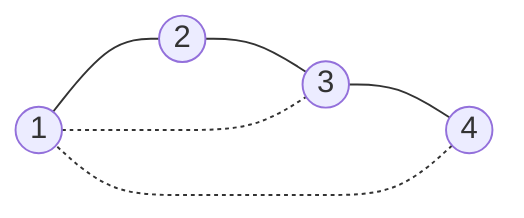


<div class="callout callout-summary" markdown="1">
<div class="callout-title callout-title--default" markdown="span">요약</div>

트리는 모두 이어져 있으면서 빙 돌아오는 고리(사이클)가 하나도 없는 그래프다. 이어져 있기에 딱 필요한 만큼의 간선만 있어, 간선은 늘 정점보다 하나 적고 두 정점 사이의 길은 하나뿐이다. 그래서 폴더 구조, 조직도, 탐색 트리처럼 "어디서 어디로 가는 길이 하나"인 구조를 모두 이것으로 다룬다. 대신 간선을 하나만 빼도 끊어지고 하나만 더해도 사이클이 생겨, 여유(중복 경로)가 전혀 없다. 또 간선이 정점보다 하나 적다는 것만으로는 트리가 아니다.

</div>


## 예시로 보기

컴퓨터의 폴더 구조를 본다. `/`(루트) 아래에 `home`, `usr`가 있고, `home` 아래에 `alice`, `bob`, `usr` 아래에 `bin`이 있다.

```
        /
      /   \
   home    usr
   /  \      \
alice  bob   bin
```

폴더 6개, 부모–자식 연결 5개다. 어느 폴더에서 어느 폴더로 가는 길도 하나뿐이다(`bob`에서 `bin`은 bob → home → / → usr → bin). 연결을 하나 끊으면(예: home–/) 두 덩어리로 갈라지고, `bob`–`bin`을 새로 이으면 bob → home → / → usr → bin → bob이라는 사이클이 생긴다. 폴더가 아래 정의의 정점, 부모–자식 연결이 간선이다.

## 정의

<div class="callout callout-definition" markdown="1">
<div class="callout-title callout-title--default" markdown="span">정의</div>

**트리**는 연결되어 있고 사이클이 없는 (단순, 무방향) 그래프다. 사이클이 없는 그래프는 **포리스트**(여러 트리의 모임)다. 차수가 1인 정점을 **잎**이라 한다[^1].

</div>


<div class="callout callout-theorem" markdown="1">
<div class="callout-title" markdown="span">트리의 동치 조건</div>

정점이 $$n \ge 1$$개인 그래프 $$G$$에 대해 다음은 모두 동치다.
1. $$G$$는 연결되어 있고 사이클이 없다(트리).
2. 임의의 두 정점 사이의 경로가 정확히 하나다.
3. $$G$$는 연결되어 있고, 어느 간선을 빼도 연결이 끊긴다(최소 연결).
4. $$G$$는 사이클이 없고, 없던 간선을 하나라도 더하면 사이클이 생긴다(최대 비순환).
5. $$G$$는 연결되어 있고 간선이 $$n - 1$$개다.
6. $$G$$는 사이클이 없고 간선이 $$n - 1$$개다.

</div>


**설계 이유.** "연결"은 모든 곳에 갈 수 있다는 보장이고, "사이클 없음"은 가는 길이 하나라는 보장이다. 둘을 함께 요구하면 연결에 꼭 필요한 간선만 남는다. 위 동치 조건들은 같은 대상을 "경로의 유일성", "최소성", "개수"라는 서로 다른 눈으로 본 것이다.

**해당하는 예:** 폴더 구조, 경로 그래프 1–2–3–4, 별 모양(한 정점에 나머지가 모두 붙은 그래프). **해당하지 않는 예:** 삼각형(사이클이 있다), 삼각형과 떨어진 점 하나(정점 4개, 간선 3개지만 연결되지 않고 사이클도 있다).

**루트 트리.** 한 정점을 루트로 정하면 방향이 생긴다. 루트에서 멀어지는 쪽이 자식, 가까워지는 쪽이 부모다. 깊이는 루트에서의 거리(간선 수), **높이**는 루트에서 가장 먼 잎까지의 간선 수다. 노드 하나짜리 트리의 높이는 0이다(이 문서 모음의 표기 규칙). 자식이 많아야 둘인 루트 트리가 **이진 트리**다. 높이 $$h$$인 이진 트리의 노드는 많아야 $$2^{h+1} - 1$$개라, 노드가 $$n$$개이면 높이가 적어도 $$\lceil\lg(n + 1)\rceil - 1$$($$\lceil\ \rceil$$는 소수점 아래를 올린 정수)이다.

## 증명

핵심은 "정점이 2개 이상인 트리에는 잎이 둘 이상 있다"와 잎 떼기 귀납법이다.

<details class="callout callout-proof" markdown="1">
<summary class="callout-title" markdown="span">증명 펼치기</summary>

**잎 보조정리.** $$n \ge 2$$인 트리에서 가장 긴 경로 $$v_0, \dots, v_k$$를 잡는다. $$v_0$$의 이웃이 $$v_1$$ 말고 $$w$$도 있다고 하자. $$w$$가 경로 위에 있으면 사이클이 생기고, 경로 밖에 있으면 $$w, v_0, \dots, v_k$$가 더 긴 경로다. 모두 모순이라 $$v_0$$은 잎이다. 같은 이유로 $$v_k$$도 잎이다.

**(1 ⇒ 5) 간선 $$n - 1$$개.** $$n$$에 대한 [귀납법](/Hongs_Blog/studies/discrete-math/induction/). $$n = 1$$이면 간선 0개다. $$n \ge 2$$면 잎 $$v$$를 떼어낸다. 남은 그래프는 여전히 연결되어 있고(잎을 지나가는 경로는 없다) 사이클이 없으므로 정점 $$n - 1$$개인 트리다. 귀납 가정으로 간선이 $$n - 2$$개이고, 뗀 간선 하나를 더하면 $$n - 1$$개다.

**(1 ⇒ 2) 경로의 유일성.** 연결이라 경로가 있다. 서로 다른 두 경로가 있으면, 처음 갈라지는 곳과 다시 만나는 곳 사이의 두 조각이 사이클을 이룬다. 모순이다.

**(2 ⇒ 3), (2 ⇒ 4).** 간선 $$\{u, v\}$$를 빼면 $$u$$와 $$v$$ 사이의 유일한 경로(그 간선 자체)가 사라져 끊긴다. 없던 간선 $$\{u, v\}$$를 더하면 원래의 $$u$$–$$v$$ 경로와 새 간선이 사이클을 이룬다.

나머지 방향(3, 4, 5, 6 ⇒ 1)도 같은 도구로 보인다. 예를 들어 (5 ⇒ 1): 연결 그래프에 사이클이 있으면 사이클 위의 간선 하나를 빼도 연결이 유지된다. 사이클이 없어질 때까지 빼면 트리가 되고 그 간선 수가 $$n - 1$$이다. 처음부터 $$n - 1$$개였으므로 뺀 간선이 없었고, 원래 그래프가 트리다[증명 스케치]. ∎

</details>


### 스스로 설명해 보기

<details class="callout callout-question" markdown="1">
<summary class="callout-title" markdown="span">1. 잎 보조정리에서 "가장 긴 경로"를 잡는 이유는?</summary>

끝점에 다른 이웃이 있다면 경로를 늘릴 수 있거나(경로 밖의 이웃) 사이클이 생긴다(경로 위의 이웃). "더 늘릴 수 없다"는 성질을 모순의 근거로 쓰려고 가장 긴 것을 잡는다.

</details>


<details class="callout callout-question" markdown="1">
<summary class="callout-title" markdown="span">2. 잎을 떼어도 남은 그래프가 연결된 이유는?</summary>

두 정점 $$x, y$$(둘 다 잎이 아님) 사이의 경로가 잎 $$v$$를 지난다면, $$v$$가 경로 중간에 있어 차수가 2 이상이어야 한다. 잎은 차수가 1이라 경로의 중간에 올 수 없다.

</details>


<details class="callout callout-question" markdown="1">
<summary class="callout-title" markdown="span">이 증명들의 핵심 아이디어는?</summary>

트리를 잎부터 한 장씩 벗겨 내면 여전히 트리다. 그래서 크기에 대한 귀납법이 자연스럽게 들어맞는다.

</details>


<details class="callout callout-question" markdown="1">
<summary class="callout-title" markdown="span">같은 방법을 쓸 수 있는 다른 상황은?</summary>

[위상 정렬](/Hongs_Blog/studies/discrete-math/partial-orders/)에서 들어오는 간선이 없는 정점을 하나씩 떼는 것, [정 이진 트리의 잎 수 증명](/Hongs_Blog/studies/discrete-math/recursive-definitions/).

</details>


## 예제

**신장 트리.** 연결 그래프에서 모든 정점을 포함하는 트리 모양의 부분 그래프를 **신장 트리**라 한다.

1. *존재:* 연결 그래프에 사이클이 있으면 그 사이클의 간선 하나를 빼도 연결이 유지된다. 사이클이 없어질 때까지 반복하면 신장 트리가 남는다.
2. *크기:* 정점이 $$n$$개면 신장 트리의 간선은 $$n - 1$$개다. 간선 $$m$$개인 연결 그래프에서 $$m - n + 1$$개를 빼야 한다.
3. *개수:* 완전 그래프 $$K_n$$의 신장 트리(번호 붙은 정점 $$n$$개 위의 트리)는 $$n^{n-2}$$개다(케일리 공식)[^2]. $$n = 4$$면 16개, $$n = 6$$이면 1296개다.



정점 4개, 간선 5개인 연결 그래프다. 점선 두 개를 빼면 실선 3개가 신장 트리로 남는다. 뺀 간선 수가 $$m - n + 1 = 5 - 4 + 1 = 2$$다[^s2].

<div class="callout callout-check" markdown="1">
<div class="callout-title" markdown="span">검증: $$n \le 7$$의 무작위 그래프 수천 개에서 여섯 동치 조건이 모두 같은 판정, 잎이 둘 이상, 폴더 예시, 해당하지 않는 예(삼각형 + 점), 이진 트리 높이 한계, 케일리 공식($$n \le 6$$, 부분 그래프 전수), 신장 트리의 간선 수, 카드의 값 — [35_trees_verify.py](/Hongs_Blog/studies/discrete-math/code/35_trees_verify/)</div>

</div>


## 활용

- **자료구조.** 파일 시스템, HTML 문서(DOM), 이진 탐색 트리, 힙, 트라이. 높이가 연산 비용을 정하므로 균형(높이 $$O(\log n)$$)을 유지하는 것이 핵심이다.
- **네트워크.** 이더넷 스위치는 신장 트리 프로토콜(STP)로 고리를 막아 패킷이 끝없이 도는 것을 막는다[^s1]. 도로·전선을 가장 싸게 잇는 문제는 최소 신장 트리다(알고리즘 과목).
- **흔한 실수.** 트리의 높이를 노드 수로 세는 교재와 간선 수로 세는 교재가 있다. 이 문서 모음은 간선 수(노드 하나 = 높이 0)를 쓴다. 공식을 가져올 때 $$\pm 1$$ 차이를 확인한다.
- 알고리즘에서: [최소 신장 트리](/Hongs_Blog/studies/algorithms/mst/)가 옳다는 증명은 동치 조건 4(없던 간선을 더하면 사이클이 생긴다)와 5(간선이 $$n - 1$$개인 연결 그래프는 트리다)를 쓴다. [힙](/Hongs_Blog/studies/algorithms/heap/)은 위층부터 빈틈없이 채워 높이를 가장 낮은 $$\lfloor \lg n \rfloor$$($$\lfloor\ \rfloor$$는 소수점 아래를 버린 정수)로 지키고, [이진 탐색 트리](/Hongs_Blog/studies/algorithms/tree-traversal-bst/)는 값을 정렬된 순서로 넣으면 한 줄로 늘어져 높이가 $$n - 1$$이 된다. 선이 모두 이어진 평면 그림에서 엇갈리는 곳마다 점을 두면, 신장 트리 밖의 간선 수 $$m - n + 1$$이 막힌 방의 수다([방의 개수](/Hongs_Blog/studies/algorithms/pg49190/)). 그 밖에 [시험장 나누기](/Hongs_Blog/studies/algorithms/pg81305/), [동굴 탐험](/Hongs_Blog/studies/algorithms/pg67260/), [트리 DP](/Hongs_Blog/studies/algorithms/tree-dp/), [트라이](/Hongs_Blog/studies/algorithms/trie/)에서도 쓴다.

## 연결

- 선수: [경로와 연결성](/Hongs_Blog/studies/discrete-math/connectivity/), [수학적 귀납법](/Hongs_Blog/studies/discrete-math/induction/)
- 재귀로 본 트리: [재귀적 정의와 구조적 귀납법](/Hongs_Blog/studies/discrete-math/recursive-definitions/)
- 이어지는 개념: [이분 그래프](/Hongs_Blog/studies/discrete-math/bipartite-coloring/)(트리는 늘 이분 그래프다)

## 자주 하는 오해

<div class="callout callout-misconception" markdown="1">
<div class="callout-title" markdown="span">"정점 n개에 간선 n − 1개면 트리다"</div>

틀렸다. 트리는 늘 간선이 $$n - 1$$개라 거꾸로도 맞을 것 같다. 하지만 개수만으로는 부족하고 "연결" 또는 "사이클 없음" 중 하나가 더 필요하다(동치 조건 5, 6). 정점 4개에 간선 3개인 "삼각형 + 떨어진 점"은 사이클이 있고 연결도 안 되어 트리가 아니다. 간선이 한 사이클에 몰리면 다른 곳을 이을 간선이 모자란다.

</div>


## 확인 문제

<details class="callout callout-question" markdown="1">
<summary class="callout-title" markdown="span">**C1** 트리의 동치 조건을 셋 이상 쓰라.</summary>

**답:** 연결되어 있고 사이클이 없다. 두 정점 사이의 경로가 유일하다. 연결되어 있고 간선이 $$n - 1$$개다. 사이클이 없고 간선이 $$n - 1$$개다. 연결되어 있고 어느 간선을 빼도 끊긴다. 사이클이 없고 어느 간선을 더해도 사이클이 생긴다.

</details>


<details class="callout callout-question" markdown="1">
<summary class="callout-title" markdown="span">**C2** 정점 $$n$$개, 간선 $$n - 1$$개인데 트리가 아닌 그래프를 들라.</summary>

**답:** 삼각형과 떨어진 점 하나($$n = 4$$, 간선 3개). 사이클이 있고 연결되지 않는다.

</details>


<details class="callout callout-question" markdown="1">
<summary class="callout-title" markdown="span">**C3** 노드 1000개인 이진 트리의 높이는 적어도 얼마인가? (높이는 간선 수로 센다)</summary>

**답:** 높이 $$h$$면 노드가 많아야 $$2^{h+1} - 1$$개다. $$2^{h+1} - 1 \ge 1000$$에서 $$2^{h+1} \ge 1001$$, $$h + 1 \ge 10$$, 즉 $$h \ge 9$$.

</details>


<details class="callout callout-question" markdown="1">
<summary class="callout-title" markdown="span">**C4** 트리에 없던 간선 하나를 더하면 사이클이 정확히 하나 생기는 이유는?</summary>

**답:** 새 간선 $$\{u, v\}$$와 트리 안의 $$u$$–$$v$$ 경로가 사이클을 이룬다. 그 경로는 유일하므로, 새 간선을 포함하는 사이클도 하나뿐이다. 새 간선을 포함하지 않는 사이클은 원래 트리에 없었다.

</details>


[^1]: Lehman·Leighton·Meyer, *Mathematics for Computer Science*, 12장 "Simple Graphs"(트리의 성질, 신장 트리). Rosen, *Discrete Mathematics and Its Applications* 7판, 11장(트리, 루트 트리, $$m$$진 트리의 높이).
[^2]: 케일리 공식의 증명은 Aigner·Ziegler, *Proofs from THE BOOK*, "Cayley's formula for the number of trees" 장에 네 가지가 실려 있다. 이 문서에서는 $$n \le 6$$에서 전수로 확인만 했다.
[^s1]: <span class="fn-tag" title="수업 자료에 없고 따로 보탠 내용">보충</span> 신장 트리 프로토콜은 IEEE 802.1D 표준의 내용이다.
[^s2]: <span class="fn-tag" title="수업 자료에 없고 따로 보탠 내용">보충</span> 다이어그램 1개는 원본에 없다. '예제' 1·2단계의 신장 트리 만들기(사이클의 간선을 빼기)를 작은 그래프로 그렸다.

