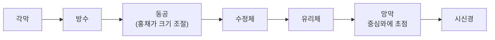
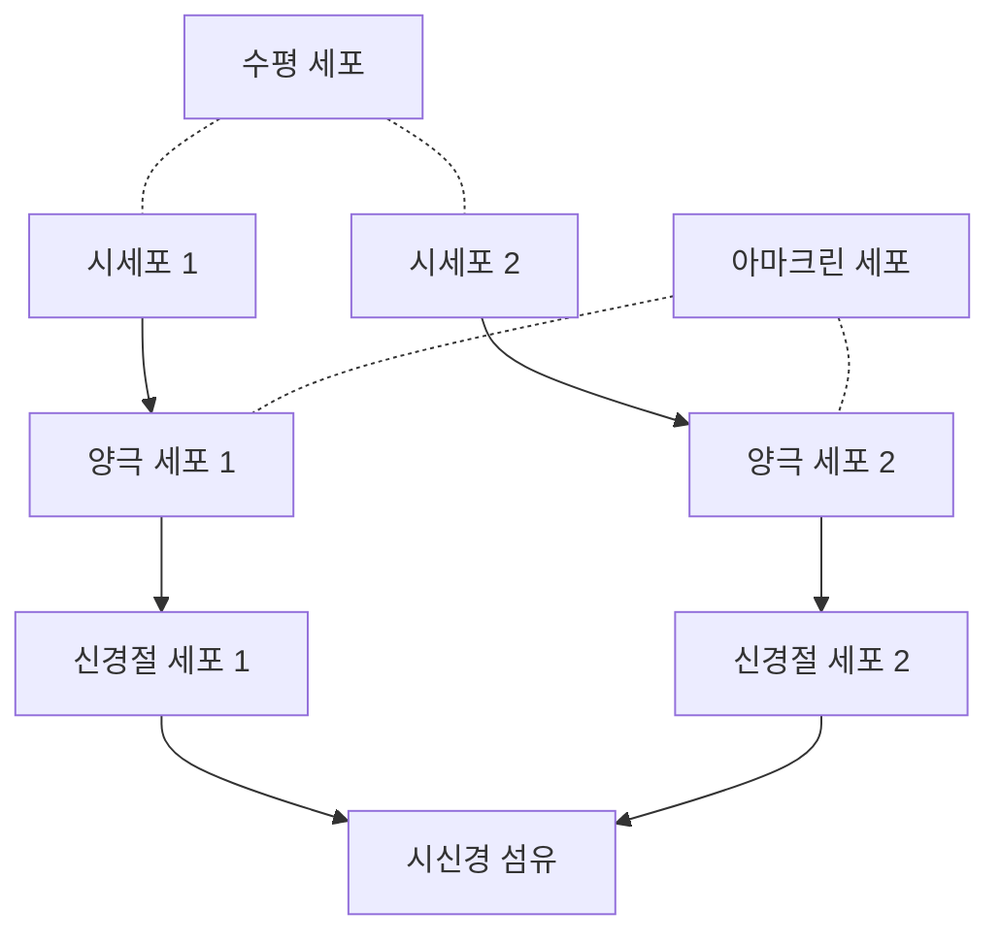


<div class="callout callout-summary" markdown="1">
<div class="callout-title callout-title--default" markdown="span">요약</div>

눈은 카메라와 닮았다. 각막과 수정체가 렌즈, 홍채가 조리개, 망막이 이미지 센서다. 하지만 센서인 망막은 고르지 않다. 가운데(중심와)만 선명하고, 시신경이 빠져나가는 자리(맹점)에는 센서가 아예 없다. 또 망막은 빛을 받자마자 신호를 가공까지 한다는 점에서 단순한 센서와 다르다.

</div>


## 예시로 보기

찻잔을 볼 때 빛은 이 순서로 들어간다[^1].



망막에 맺힌 찻잔의 상은 위아래가 뒤집혀 있다. 시선이 향한 곳의 상은 중심와(fovea)에 맺힌다[^1].

카메라와의 대응과 한계는 이렇다[^s1].

| 눈 | 카메라 | 다른 점 |
|---|---|---|
| 각막, 수정체 | 렌즈 | 수정체는 두께를 바꿔 초점을 맞춘다(모양체근). 카메라는 렌즈를 앞뒤로 옮긴다 |
| 홍채와 동공 | 조리개 | 비슷하다 |
| 망막 | 이미지 센서 | 센서가 고르지 않다. 중심와에 촘촘하고 둘레로 갈수록 성기다. 맹점에는 없다 |
| 망막의 신경 세포층 | 이미지 처리 칩 | 센서 바로 앞에서 신호를 가공한다(수렴, 측면 억제) |

## 정의

<div class="callout callout-definition" markdown="1">
<div class="callout-title callout-title--default" markdown="span">정의</div>

눈의 주요 부위와 하는 일은 다음과 같다[^1][^s2].
- **각막**(cornea): 앞쪽의 투명한 막. 들어오는 빛을 크게 굴절시킨다.
- **방수**(aqueous humor): 각막과 수정체 사이를 채운 액체.
- **홍채**(iris)와 **동공**(pupil): 홍채가 가운데 구멍인 동공의 크기를 바꿔 들어오는 빛의 양을 조절한다.
- **수정체**(lens): 모양체근(ciliary muscles)이 두께를 바꿔 초점을 맞춘다.
- **유리체**(vitreous humor): 눈 안을 채운 투명한 젤.
- **망막**(retina): 시세포(간상체, 추상체)와 신경 세포층이 있는 눈 안쪽 막.
- **중심와**(fovea): 시선의 중심이 맺히는 곳. 가장 선명하다.
- **시신경**(optic nerve)과 **맹점**(blind spot): 망막의 신호가 시신경으로 모여 눈을 빠져나가는 자리. 시세포가 없어서 맹점이라 한다[^2].
- **공막**(sclera): 눈을 싸는 흰 바깥막.

</div>


망막의 층 구조는 빛이 들어오는 방향과 신호가 나가는 방향이 반대다[^1][^3].

```
빛 →  [시신경 섬유층] [신경절 세포] [아마크린·양극·수평 세포] [간상체·추상체] [색소 상피]  (눈 뒤쪽)
신호 ←        ←               ←                    ←                  시작
```

빛은 신경 세포층을 먼저 지나 맨 안쪽의 시세포에 닿는다. 신호는 시세포 → 양극 세포 → 신경절 세포 → 시신경 섬유 순으로 거꾸로 나온다. 수평 세포와 아마크린 세포는 옆으로 이어져 이웃한 신호를 섞는다. 이 옆 연결이 [측면 억제](/Hongs_Blog/studies/human-interface-media/lateral-inhibition/)의 배선이다[^s3].



실선은 신호가 뇌 쪽으로 나가는 세로 길이다. 점선은 옆 연결이다. 수평 세포는 시세포와 양극 세포 사이에서, 아마크린 세포는 양극 세포와 신경절 세포 사이에서 이웃한 줄을 잇는다[^s5].

신경 섬유가 망막 안쪽 면을 지나 한곳으로 모여 눈 밖으로 나가야 하므로, 그 자리에는 시세포를 둘 수 없다. 맹점이 생기는 구조적 이유다.

## 연결

- 선수: [파동과 빛](/Hongs_Blog/studies/human-interface-media/wave-and-light/) (들어오는 것은 빛)
- 망막의 시세포: [간상체와 추상체](/Hongs_Blog/studies/human-interface-media/rods-and-cones/)
- 시신경 다음: [시각 경로](/Hongs_Blog/studies/human-interface-media/visual-pathway/)
- 두 눈의 배치: [양안 시차](/Hongs_Blog/studies/human-interface-media/binocular-disparity/)

## 자주 하는 오해

<div class="callout callout-misconception" markdown="1">
<div class="callout-title" markdown="span">"맹점이 있으니 시야에 늘 구멍이 보여야 한다"</div>

틀렸다. 센서가 없으면 사진에 검은 구멍이 생기듯 시야에도 구멍이 보일 것 같다. 실제로는 두 가지가 구멍을 가린다. 두 눈의 맹점은 시야에서 서로 다른 곳에 있어서 한 눈이 다른 눈의 맹점을 채운다. 한 눈만 떠도 뇌가 주변 무늬로 빈 곳을 메워 지각한다[^s4]. 확인 방법: 왼눈을 감고 오른눈으로 앞의 한 점을 보면서, 종이에 찍은 다른 점을 시선에서 오른쪽(귀 쪽)으로 약 15° 옆에 두고 거리를 조절하면 점이 사라지는 자리가 있다. 사라진 자리에는 구멍 대신 종이 바탕이 보인다.

</div>


## 확인 문제

<details markdown="1"><summary markdown="span"><b>C1</b> 빛이 각막에서 시신경까지 지나는 부위를 순서대로 쓰고, 초점과 빛의 양은 각각 어느 부위가 조절하는지 쓰라.</summary>


**답:** 각막 → 방수 → 동공 → 수정체 → 유리체 → 망막(중심와) → 시신경. 초점은 수정체(모양체근이 두께 조절), 빛의 양은 홍채(동공 크기 조절).

</details>

<details markdown="1"><summary markdown="span"><b>C2</b> 눈을 카메라에 빗대 렌즈, 조리개, 이미지 센서에 해당하는 부위를 쓰고, 이 비유가 맞지 않는 점을 둘 쓰라.</summary>


**답:** 렌즈: 각막·수정체. 조리개: 홍채(동공). 센서: 망막. 맞지 않는 점: (1) 망막의 시세포 밀도가 고르지 않아 중심와만 선명하고 맹점에는 시세포가 없다. (2) 망막이 신호를 바로 가공한다(수렴, 측면 억제). 그 밖에 초점을 렌즈 이동이 아니라 수정체 두께로 맞춘다.

</details>

<details markdown="1"><summary markdown="span"><b>C3</b> 맹점이 생기는 구조적 이유를 망막의 층 순서로 설명하라.</summary>


**답:** 망막에서 시세포는 맨 안쪽(눈 뒤쪽)에 있고, 신경 섬유는 빛이 들어오는 쪽 면을 지나 한곳에 모여 눈 밖으로 나간다. 섬유가 빠져나가는 그 자리에는 시세포를 둘 수 없어서 빛을 받지 못한다.

</details>

[^1]: 4-1학기/휴먼 인터페이스 미디어/1.수업자료/03.HIM_강의03_사람의시각.pdf, p.5 (눈)
[^2]: 4-1학기/휴먼 인터페이스 미디어/1.수업자료/03.HIM_강의03_사람의시각.pdf, p.7 (그래프의 "Blind spot (no receptors)")
[^3]: 4-1학기/휴먼 인터페이스 미디어/1.수업자료/03.HIM_강의03_사람의시각.pdf, p.6 (오른쪽 그림: Simple diagram of the organization of the retina)
[^s1]: 에이전트 보충. 카메라 비유와 대응표는 원본에 없다. 비유가 틀어지는 지점을 표의 셋째 열에 적었다.
[^s2]: 에이전트 보충. 슬라이드 그림은 부위 이름만 붙인다. 각 부위의 역할 설명은 표준 해부학·지각 교재의 내용이다.
[^s3]: 에이전트 보충. 층 순서 개략도와 신호 방향, 수평·아마크린 세포의 역할은 슬라이드 p.6 그림의 층 이름을 표준 설명으로 풀어 쓴 것이다.
[^s4]: 에이전트 보충. 두 눈의 맹점이 서로를 가리는 것과 채워 넣기(filling-in)는 지각 교재의 표준 설명이다. 맹점은 망막에서는 중심와의 코 쪽 약 15~20°에 있고(슬라이드 p.7 그래프), 상이 뒤집혀 맺히므로 시야에서는 귀 쪽 약 15°에 해당한다.
[^s5]: 에이전트 보충. 다이어그램 1개는 원본에 없다. 이 문서의 망막 층 순서와 신호 방향, 강의 3 p.6의 망막 구조 그림, [측면 억제](/Hongs_Blog/studies/human-interface-media/lateral-inhibition/)에 적은 수평·아마크린 세포의 자리를 근거로 그렸다.

