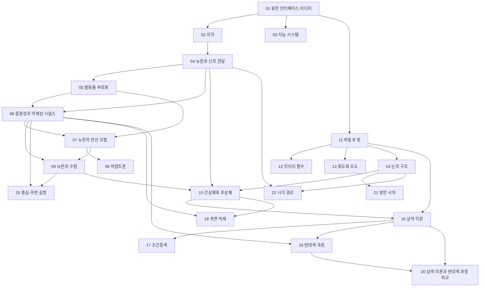


## 먼저 알아야 할 것
- 강의 소개가 밝힌 사전 지식: 초월 함수의 미분·적분, 기초 확률통계, 푸리에 급수·변환, C/C++ 프로그래밍[^1]. 수업에서 따로 가르치지 않는다고 못 박았다. 이 저장소에는 아직 해당 과목 문서가 없다.
- 뉴런의 연산 모형, 퍼셉트론, 삼색 이론, 조건등색에는 선형대수(행렬 곱, 역행렬, 영공간)를 쓴다.

## 0·1회 · 과목 소개와 들어가기

읽기 전에

1. 사람과 컴퓨터가 "대화"하려면 가운데에 무엇이 있어야 할까? 그것이 하는 일을 한 문장으로 추측해 보라. → [휴먼 인터페이스 미디어](/Hongs_Blog/studies/human-interface-media/human-interface-media/)
2. 사람 눈과 귀가 못 느끼는 부분을 데이터에서 버려도 될까? 어떤 기술이 그렇게 할까? → [휴먼 인터페이스 미디어](/Hongs_Blog/studies/human-interface-media/human-interface-media/)

| 번호 | 개념 | 한 줄 | 개념 코드 | 연습 |
|---|---|---|---|---|
| 01 | [휴먼 인터페이스 미디어](/Hongs_Blog/studies/human-interface-media/human-interface-media/) | 사람의 자극과 컴퓨터의 수치·코드를 서로 바꾸는 매체 (강조)[^2] | — | — |

자료: 강의 소개 · 강의 계획서 · 강의 1 들어가기
필기: 아직 없다.
떠올려 보기: 노트를 닫고 휴먼 인터페이스 미디어의 그림을 그린 뒤, 이 과목이 다루는 두 갈래(사람 감각의 특성, 자극을 데이터로 바꾸기)와 다루지 않는 것을 써 본다.

## 2회 · 사람의 지각

읽기 전에

1. 센 자극을 받으면 뉴런은 신호를 "크게" 보낼까, "자주" 보낼까? → [발화율 부호화](/Hongs_Blog/studies/human-interface-media/rate-coding/)
2. 여러 수용기의 신호를 뉴런 하나로 모으면 무엇을 얻고 무엇을 잃을까? → [뉴런의 수렴](/Hongs_Blog/studies/human-interface-media/neuron-convergence/)
3. "입력에 무게를 곱해 더하고 문턱을 넘으면 1"인 기계는 XOR을 배울 수 있을까? → [퍼셉트론](/Hongs_Blog/studies/human-interface-media/perceptron/)

| 번호 | 개념 | 한 줄 | 개념 코드 | 연습 |
|---|---|---|---|---|
| 02 | [지각](/Hongs_Blog/studies/human-interface-media/perception/) | 감각은 수용, 지각은 신호를 골라 정리하고 해석하는 능동적 처리 (강조)[^3] | — | — |
| 03 | [지능 시스템](/Hongs_Blog/studies/human-interface-media/intelligent-system/) | 사람처럼/이성적으로 × 생각/행동의 네 관점. 기호주의와 연결주의 | — | — |
| 04 | [뉴런과 신호 전달](/Hongs_Blog/studies/human-interface-media/neuron-signaling/) | 수용기가 자극을 전기로, 시냅스가 화학으로 넘김. 휴지 전위 −70 mV | — | — |
| 05 | [발화율 부호화](/Hongs_Blog/studies/human-interface-media/rate-coding/) | 세기는 스파이크 크기가 아니라 빈도. 불응기 1 ms로 상한 | [검증](/Hongs_Blog/studies/human-interface-media/code/05_rate-coding_verify/) | — |
| 06 | [흥분성과 억제성 시냅스](/Hongs_Blog/studies/human-interface-media/excitatory-inhibitory/) | 문턱 쪽으로 올리는 흥분, 멀어지게 내리는 억제 | — | — |
| 07 | [뉴런의 연산 모형](/Hongs_Blog/studies/human-interface-media/neuron-computational-model/) | $$a(A\mathbf{x} + \mathbf{b})$$. 활성 함수가 없으면 층을 쌓아도 한 층 | [검증](/Hongs_Blog/studies/human-interface-media/code/07_neuron-computational-model_verify/) | — |
| 08 | [퍼셉트론](/Hongs_Blog/studies/human-interface-media/perceptron/) | 가중 합 + 문턱, 틀리면 가중치 수정. 선형 분리만 가능, XOR 불가[^4] | [구현](/Hongs_Blog/studies/human-interface-media/code/08_perceptron_impl/) | — |
| 09 | [뉴런의 수렴](/Hongs_Blog/studies/human-interface-media/neuron-convergence/) | 모으면 약한 신호에 민감해지고 위치를 잃음 (강조)[^5] | [검증](/Hongs_Blog/studies/human-interface-media/code/09_neuron-convergence_verify/) | [뉴런 수렴 모델링 연습](/Hongs_Blog/studies/human-interface-media/neuron-convergence-modeling/) |
| 10 | [중심-주변 길항](/Hongs_Blog/studies/human-interface-media/center-surround/) | 가운데 흥분·둘레 억제. 고른 빛보다 경계에 반응하는 대역 통과 필터 | [검증](/Hongs_Blog/studies/human-interface-media/code/10_center-surround_verify/) | — |

퍼셉트론은 슬라이드에 없고, 강의에서 연산 모형과 함께 설명되었다(사용자 전달)[^4].

자료: 강의 2 사람의 지각
필기: 아직 없다.
떠올려 보기: 노트를 닫고 자극 → 수용기 → 뉴런 → 시냅스의 흐름, 세기를 싣는 방법, 수렴 세 회로의 반응 그래프를 그린 뒤, 이 셋이 연산 모형 $$a(A\mathbf{x} + \mathbf{b})$$의 어느 부분이 되는지 이어 본다.

## 3회 · 사람의 시각

읽기 전에

1. 모니터 속 노란 꽃에서 오는 빛에 노란 파장(약 580 nm)이 들어 있을까? → [삼색 이론](/Hongs_Blog/studies/human-interface-media/trichromatic-theory/)
2. 밝기가 계단처럼 바뀌는 경계를 보면, 경계 양옆은 실제 밝기대로 보일까? → [측면 억제](/Hongs_Blog/studies/human-interface-media/lateral-inhibition/)
3. 가까운 손가락과 먼 산 중, 두 눈에 비친 상의 어긋남이 큰 것은? → [양안 시차](/Hongs_Blog/studies/human-interface-media/binocular-disparity/)

| 번호 | 개념 | 한 줄 | 개념 코드 | 연습 |
|---|---|---|---|---|
| 11 | [파동과 빛](/Hongs_Blog/studies/human-interface-media/wave-and-light/) | 진폭·주파수·위상. 청각은 1차원 시간, 시각은 2차원 평면 (강조)[^6] | [검증](/Hongs_Blog/studies/human-interface-media/code/11_wave-and-light_verify/) | — |
| 12 | [이미지 함수](/Hongs_Blog/studies/human-interface-media/image-function/) | $$i(x, y)$$, 컬러는 세 채널 벡터, 윤곽선은 $$\nabla i$$ (강조)[^6] | [검증](/Hongs_Blog/studies/human-interface-media/code/12_image-function_verify/) | — |
| 13 | [휘도와 조도](/Hongs_Blog/studies/human-interface-media/luminance-and-illuminance/) | 조도는 떨어지는 빛, 휘도는 되돌아오는 빛. 대비는 조명과 무관 | [검증](/Hongs_Blog/studies/human-interface-media/code/13_luminance-and-illuminance_verify/) | — |
| 14 | [눈의 구조](/Hongs_Blog/studies/human-interface-media/eye-anatomy/) | 카메라와 닮았지만 센서가 고르지 않고 스스로 가공함 | — | — |
| 15 | [간상체와 추상체](/Hongs_Blog/studies/human-interface-media/rods-and-cones/) | 간상체는 어둠·흑백, 추상체는 밝음·색. 중심와에는 추상체만 | [검증](/Hongs_Blog/studies/human-interface-media/code/15_rods-and-cones_verify/) | — |
| 16 | [삼색 이론](/Hongs_Blog/studies/human-interface-media/trichromatic-theory/) | 색은 세 추상체 반응의 조합. 원색 셋으로 맞추되 못 만드는 색이 있음 (강조)[^7] | [검증](/Hongs_Blog/studies/human-interface-media/code/16_trichromatic-theory_verify/) | — |
| 17 | [조건등색](/Hongs_Blog/studies/human-interface-media/metamerism/) | 스펙트럼이 달라도 세 반응이 같으면 같은 색. 영공간 (강조)[^7] | [검증](/Hongs_Blog/studies/human-interface-media/code/17_metamerism_verify/) | [조건등색 예제 사다리](/Hongs_Blog/studies/human-interface-media/metamerism-ladder/) |
| 18 | [측면 억제](/Hongs_Blog/studies/human-interface-media/lateral-inhibition/) | 이웃을 빼서 경계를 강조. 마하 띠 80·88·8·16, 헤르만 격자 60 대 76 | [검증](/Hongs_Blog/studies/human-interface-media/code/18_lateral-inhibition_verify/) | [측면 억제 예제 사다리](/Hongs_Blog/studies/human-interface-media/lateral-inhibition-ladder/) |
| 19 | [반대색 과정](/Hongs_Blog/studies/human-interface-media/opponent-process/) | 빨강-초록, 파랑-노랑, 흰-검 짝을 +와 −로. 잔상 | [검증](/Hongs_Blog/studies/human-interface-media/code/19_opponent-process_verify/) | — |
| 20 | [삼색 이론과 반대색 과정 비교](/Hongs_Blog/studies/human-interface-media/contrast--trichromatic--opponent-process/) | 가르는 질문: 세 반응의 크기만으로 정해지는가, 짝의 차이가 필요한가 | — | — |
| 21 | [양안 시차](/Hongs_Blog/studies/human-interface-media/binocular-disparity/) | 두 눈 상의 차이로 깊이. 가까울수록 크고 멀면 급히 줄어듦 (강조)[^8] | [검증](/Hongs_Blog/studies/human-interface-media/code/21_binocular-disparity_verify/) | — |
| 22 | [시각 경로](/Hongs_Blog/studies/human-interface-media/visual-pathway/) | 망막 → LGN → 시각 피질. LGN은 피드백을 받아 조절 (강조)[^9] | — | — |

강의 순서와 다른 점: 점묘법(p.9)은 삼색 이론(p.10)이 먼저 필요해 조건등색(17)에서 다룬다.

자료: 강의 3 사람의 시각
필기: 아직 없다.
떠올려 보기: 노트를 닫고 빛이 눈에 들어와 시각 피질에 닿기까지를 한 줄로 그린 뒤, 그 길 위에서 색(삼색 → 반대색), 밝기(측면 억제), 깊이(양안 시차)가 각각 어디서 처리되는지 표시해 본다.

## 다른 과목과의 연결
- 아직 없다. 이 저장소에 같은 구조를 가진 다른 과목 개념이 들어오면 만든다. 후보는 `_시스템/작업 기록.md`에 있다.

## 흐름

## 시험 대비
- 시험 대비 세트는 아직 없다. `시험대비 휴먼 인터페이스 미디어`로 만든다.
- 강의 계획표와 이 지식베이스의 대응[^10]:

| 주 | 주제 | 날짜 | 문서 |
|---|---|---|---|
| 1 | Course Introduction & Human Perception System | 9/1, 3 | 01~10 |
| 2 | Human Visual System | 9/8, 10 | 11~22 |
| 3 | Light, Electromagnetic Wave & Signal Representation | 9/15, 17 | 11 일부. 자료 없음 |
| 4 | Color Perception & Representation Parameters | 9/22, (9/24 추석) | 16~20 일부. 자료 없음 |
| 5 | Color Space - CIE XYZ, CIE Lab | 9/29, 10/1 | — |
| 6 | Image Representation & Spatial Frequency | 10/6, 8 | — |
| 7 | Convolution & Pattern Detection | 10/13, 15 | — |
| 8 | **중간고사** | 10/22 | 1~7주 |
| 9 | Sound & Human Auditory Perception | 10/27, 29 | — |
| 10 | Representation of Audio Signal | 11/3, 5 | — |
| 11 | Spectral Decomposition – Fourier Series | 11/10, 12 | — |
| 12 | Spectral Decomposition – Fourier Transform | 11/17, 19 | — |
| 13 | Spectral Decomposition – Discrete Fourier Transform | 11/24, 26 | — |
| 14 | Spectral Decomposition of 2-D signal – Discrete Cosine Transform | 12/1, 3 | — |
| 15 | Review and Summary | 12/8, 10 | — |
| 16 | **기말고사** | 12/17 | 9~15주 |

- 평가: 중간 50%, 기말 50%. 시험에 빠지거나 강의의 1/4 이상 결석하면 F다. 두 번째 결석부터 1시간당 1점 감점[^10].

