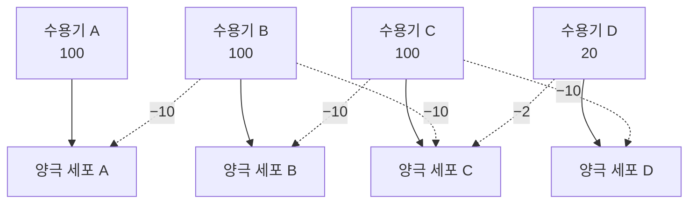


<div class="callout callout-summary" markdown="1">
<div class="callout-title callout-title--default" markdown="span">요약</div>

옆 사람이 크게 부를수록 내 목소리를 줄이는 합창단과 같다. 망막의 각 세포는 이웃 세포가 받은 빛에 비례해 자기 신호를 줄인다. 고른 영역에서는 모두가 비슷하게 줄어 차이가 그대로지만, 밝은 곳과 어두운 곳의 경계에서는 차이가 부풀려진다. 그래서 윤곽이 또렷해지는 대신, 헤르만 격자의 회색 점이나 마하 띠처럼 실제로 없는 밝기가 보인다.

</div>


## 예시로 보기

**마하 띠.** 밝기 100인 영역과 20인 영역이 맞닿은 계단이 있다. 수용기 A·B·C는 밝은 쪽, D·E·F는 어두운 쪽이다. 각 수용기는 좌우 이웃에게 자기 반응의 10%만큼 억제를 보낸다(100 → 10, 20 → 2)[^1].

| 세포 | 수용기 반응 | 왼쪽 이웃이 보내는 억제 | 오른쪽 이웃이 보내는 억제 | 최종 반응 |
|---|---|---|---|---|
| A | 100 | 10 | 10 | 80 |
| B | 100 | 10 | 10 | 80 |
| C | 100 | 10 | 2 | 88 |
| D | 20 | 10 | 2 | 8 |
| E | 20 | 2 | 2 | 16 |
| F | 20 | 2 | 2 | 16 |

경계 바로 앞의 C는 어두운 이웃 D에게서 억제를 적게 받아 고른 영역(80)보다 밝다(88). 경계 바로 뒤의 D는 밝은 이웃 C에게서 억제를 많이 받아 고른 영역(16)보다 어둡다(8). 실제 빛은 계단인데, 경계 양쪽에 밝은 띠와 어두운 띠가 보인다[^1][^s1].

```
최종 반응
 88 ┤    ▄
 80 ┤▄▄▄▄█
    │     │
 16 ┤     │  ▄▄▄▄
  8 ┤     ▀
    └─A─B─C─D─E─F─→ 위치
```

**헤르만 격자.** 검은 정사각형 사이에 흰 길이 가로세로로 난 격자다. 교차점에서는 흰 길의 교차점이 회색으로 흐릿하게 보인다[^2].

| 위치 | 수용기 반응 | 이웃 넷에서 받는 억제 | 최종 반응 |
|---|---|---|---|
| A: 교차점 | 100 | 흰 길 넷: 10 + 10 + 10 + 10 | 60 |
| D: 두 검은 칸 사이 길 | 100 | 흰 길 둘 10 + 10, 검은 칸 둘 2 + 2 | 76 |

A가 D보다 약하게 반응하므로 교차점이 길보다 어둡게 보인다. 교차점의 회색 점은 이 차이다[^2].

## 정의

<div class="callout callout-definition" markdown="1">
<div class="callout-title callout-title--default" markdown="span">정의</div>

**측면 억제**: 이웃한 수용기(또는 세포)끼리 서로의 신호를 억제하는 연결. 각 세포의 최종 반응은 자기 반응에서 이웃의 반응에 비례한 억제를 뺀 값이다[^1][^2].

1차원(좌우 이웃)에서 $$x_n$$을 수용기 반응, $$0 < k < \tfrac{1}{2}$$(0보다 크고 절반보다 작은 수)을 억제 비율이라 하면

$$ y_n = x_n - k\,(x_{n-1} + x_{n+1}) $$

예를 들어 $$k = 0.1$$이고 세 수용기 반응이 모두 10이면 가운데 세포는 $$10 - 0.1 \times (10 + 10) = 8$$이다. 이웃이 0이면 억제가 없어 10 그대로다[^s8].

2차원(상하좌우 이웃)에서는 $$y_{m,n} = x_{m,n} - k\,(x_{m-1,n} + x_{m+1,n} + x_{m,n-1} + x_{m,n+1})$$이다. 슬라이드는 $$k = 0.1$$이다.

</div>


망막에서는 시세포와 양극 세포 사이를 옆으로 잇는 수평 세포, 양극 세포와 신경절 세포 사이의 아마크린 세포가 이 억제를 맡는다([눈의 구조](/Hongs_Blog/studies/human-interface-media/eye-anatomy/))[^1][^s2].



점선이 측면 억제다. 각 수용기는 자기 양극 세포에는 그대로, 이웃 양극 세포에는 억제로 신호를 보낸다.

| 설명한다 | 설명하지 못한다 |
|---|---|
| 마하 띠: 경계 양쪽의 밝은 띠·어두운 띠 | 헤르만 격자의 길을 물결 모양으로 바꾸면 회색 점이 사라진다. 측면 억제 계산은 같은 점을 예측한다[^s3] |
| 헤르만 격자의 회색 점(교과서의 고전적 설명) | 교차점을 똑바로 보면 회색 점이 사라진다. 중심와의 수용장 크기 차이까지 더해야 설명된다[^s3] |
| 경계와 대비가 강조되는 이유 | 넓은 영역 전체의 밝기가 어떻게 보이는가(밝기 항등성)는 뇌의 더 높은 단계가 관여한다 |

## 증명

**계단의 높이가 어떻든($$H > D_0$$), $$k > 0$$이면 경계 양쪽에 띠가 생긴다.** 고른 영역의 반응과 경계 세포의 반응을 비교한다[^s4].

<details markdown="1"><summary markdown="span">증명 펼치기</summary>


밝은 쪽 밝기를 $$H$$, 어두운 쪽을 $$D_0$$라 하자($$H > D_0 \ge 0$$).

1. 밝은 고른 영역: $$y = H - k(H + H) = (1 - 2k)H$$ — 이웃 둘 다 $$H$$
2. 경계 바로 앞(밝은 쪽 마지막 세포): $$y_C = H - k(H + D_0) = (1-2k)H + k(H - D_0)$$ — 오른쪽 이웃이 $$D_0$$
3. $$k > 0$$, $$H > D_0$$이므로 $$y_C > (1-2k)H$$: 밝은 띠 — 2에서 더한 항 $$k(H - D_0)$$가 양수
4. 어두운 고른 영역: $$y = (1-2k)D_0$$
5. 경계 바로 뒤(어두운 쪽 첫 세포): $$y_D = D_0 - k(H + D_0) = (1-2k)D_0 - k(H - D_0)$$
6. 같은 이유로 $$y_D < (1-2k)D_0$$: 어두운 띠
7. 띠의 높이는 둘 다 $$k(H - D_0)$$로, 억제 비율과 계단 높이에 비례한다.

슬라이드 값($$H = 100$$, $$D_0 = 20$$, $$k = 0.1$$)이면 $$k(H - D_0) = 8$$이다. 80 + 8 = 88, 16 − 8 = 8과 맞는다.

</details>

### 스스로 설명해 보기

1. "C의 최종 반응은 $$100 - 10 - 2 = 88$$이다."
   <details class="inline-fold" markdown="1"><summary markdown="span">근거</summary>
   C의 이웃은 B(밝기 100 → 억제 10)와 D(밝기 20 → 억제 2)다. 억제량은 이웃 수용기 반응의 10%다.
   </details>
2. "고른 영역의 반응은 $$(1 - 2k)x$$다."
   <details class="inline-fold" markdown="1"><summary markdown="span">근거</summary>
   이웃 둘이 모두 자기와 같은 밝기 $$x$$라서 억제가 $$2kx$$다.
   </details>
3. "경계 세포의 반응은 고른 영역보다 $$k(H - D_0)$$만큼 크거나 작다."
   <details class="inline-fold" markdown="1"><summary markdown="span">근거</summary>
   경계 세포는 이웃 하나가 다른 쪽 밝기라서, 억제가 고른 영역보다 $$k(H - D_0)$$만큼 적거나(밝은 쪽) 많다(어두운 쪽).
   </details>
- 이 논증의 핵심 아이디어는?
  <details class="inline-fold" markdown="1"><summary markdown="span">답</summary>
  억제가 "이웃의 밝기"에 달려 있어서, 이웃이 다른 영역에 속한 경계 세포만 고른 영역과 다른 대접을 받는다.
  </details>
- 이 방법을 쓸 수 있는 다른 상황은?
  <details class="inline-fold" markdown="1"><summary markdown="span">답</summary>
  이미지 선명화(가운데 +, 이웃 −인 커널), 중심-주변 수용장, 합성곱 신경망의 정규화 층. 모두 "자기 − 이웃의 가중 합" 구조다.
  </details>

<div class="callout callout-check" markdown="1">
<div class="callout-title" markdown="span">검증: 마하 띠 (80, 80, 88, 8, 16, 16), 커널 (−0.1, 1, −0.1) 합성곱과 일치, 실제 격자 영상에서 교차점 60·길 76, 고른 영역의 비 100:20 = 80:16 유지 (증명 + 실험으로 확인됨) — [18_lateral-inhibition_verify.py](/Hongs_Blog/studies/human-interface-media/code/18_lateral-inhibition_verify/)</div>


계산 연습: [측면 억제 예제 사다리](/Hongs_Blog/studies/human-interface-media/lateral-inhibition-ladder/)

</div>


## 신호·머신러닝 관점

**신호.** 측면 억제는 커널 $$(-k,\ 1,\ -k)$$와의 합성곱이다. 강의 계획표 7주차 "Convolution & Pattern Detection"의 합성곱과 같은 계산이다[^3]. 주파수로 보면 효과가 더 분명하다. 입력이 $$\cos(\omega n)$$이면 출력은 $$(1 - 2k\cos\omega)\cos(\omega n)$$이다[^s5].

| 입력 | $$\omega$$ | 이득 ($$k = 0.1$$) |
|---|---|---|
| 고른 빛 | 0 | 0.8 |
| 중간 줄무늬 | $$\pi/2$$ | 1.0 |
| 가장 촘촘한 줄무늬 | $$\pi$$ | 1.2 |

낮은 주파수를 줄이고 높은 주파수를 살리는 고주파 강조 필터다. 식을 다시 쓰면

$$
y_n = (1 - 2k)\Bigl[\,x_n + \tfrac{k}{1 - 2k}\,(2x_n - x_{n-1} - x_{n+1})\Bigr]
$$


이다. 전체를 $$(1-2k)$$배로 낮춘 것 말고는, 원래 신호에 이차 차분의 음수 $$2x_n - x_{n-1} - x_{n+1}$$을 조금 더한 꼴이다. 사진 편집의 "선명하게(unsharp masking)"가 바로 이 연산이다. [이미지 함수](/Hongs_Blog/studies/human-interface-media/image-function/)의 $$\nabla i$$가 1차 미분으로 경계를 찾는다면, 측면 억제는 2차 미분(라플라시안)으로 경계를 강조한다[^s5].

<div class="callout callout-check" markdown="1">
<div class="callout-title" markdown="span">검증: $$\cos(\omega n)$$ 입력에서 이득 0.8 / 0.9 / 1.0 / 1.2 ($$\omega = 0, \pi/3, \pi/2, \pi$$), 선명화 꼴 항등식(정수 입력 100개, 분수로 정확 계산) — [18_lateral-inhibition_verify.py](/Hongs_Blog/studies/human-interface-media/code/18_lateral-inhibition_verify/)</div>

</div>


**머신러닝.** 합성곱 신경망의 한 층은 "같은 커널을 모든 위치에 적용한 [퍼셉트론](/Hongs_Blog/studies/human-interface-media/perceptron/) 무리"이고, 측면 억제는 커널을 사람이 정해 둔 그런 층이다. 딥러닝 초기의 이미지 인식 신경망(AlexNet, 2012)은 이웃한 채널의 활동으로 각 뉴런의 출력을 나누는 "국소 반응 정규화" 층을 넣으면서 이를 실제 뉴런의 측면 억제에서 착안했다고 밝혔다. 신경과학에서는 이런 나눗셈 꼴의 억제를 분할 정규화(divisive normalization)라 부르며 뇌 곳곳의 기본 연산으로 본다[^s6].

## 활용

- 시각계가 절대 밝기보다 대비를 전하는 이유가 여기에 있다. 고른 영역은 비(100:20 = 80:16)만 남기고 경계를 부풀리므로, 조명이 바뀌어도 물체의 윤곽이 또렷하다([휘도와 조도](/Hongs_Blog/studies/human-interface-media/luminance-and-illuminance/)).
- 영상 매체 설계에서 주의할 점: 경계 근처에 사람 눈이 만들어 내는 띠가 있으므로, 단계가 거친 그라데이션은 계단마다 띠가 보인다(색 띠, banding)[^s7].

## 연결

- 선수: [흥분성과 억제성 시냅스](/Hongs_Blog/studies/human-interface-media/excitatory-inhibitory/), [간상체와 추상체](/Hongs_Blog/studies/human-interface-media/rods-and-cones/) (망막의 수용기)
- 이 배선이 만드는 수용장: [중심-주변 길항](/Hongs_Blog/studies/human-interface-media/center-surround/)
- 1차 미분으로 경계 찾기: [이미지 함수](/Hongs_Blog/studies/human-interface-media/image-function/)

## 자주 하는 오해

<div class="callout callout-misconception" markdown="1">
<div class="callout-title" markdown="span">"마하 띠는 그림에 실제로 그려진 밝고 어두운 띠다"</div>

틀렸다. 띠가 너무 또렷해서 그림에 있는 것처럼 보인다. 실제 빛의 세기는 계단 모양(슬라이드 p.12 왼쪽 위 그래프)이고 경계 근처에 따로 밝거나 어두운 부분이 없다. 띠는 측면 억제가 경계에서 차이를 부풀려 만든 것이다. 확인 방법: 종이로 이웃 줄무늬를 가려 한 줄만 보이게 하면 띠가 사라진다. 광도계로 재도 한 줄 안의 밝기는 고르다.

</div>


## 확인 문제

<details markdown="1"><summary markdown="span"><b>C1</b> 측면 억제를 한 문장으로 정의하고, 이것으로 설명하는 착시 두 가지와 각각 무엇이 보이는지 쓰라.</summary>


**답:** 이웃한 세포끼리 이웃이 받은 빛에 비례해 서로의 신호를 억제하는 연결이다. 헤르만 격자: 흰 길의 교차점에 회색 점이 보인다. 마하 띠: 밝기 계단의 경계 양쪽에 더 밝은 띠와 더 어두운 띠가 보인다.

</details>

<details markdown="1"><summary markdown="span"><b>C2</b> 수용기 반응이 (100, 100, 100, 20, 20, 20)이고 각 수용기가 좌우 이웃에 자기 반응의 10%만큼 억제를 보낸다. 여섯 세포의 최종 반응을 구하라(줄 끝 바깥은 끝 세포와 같은 밝기로 본다).</summary>


**답:** (80, 80, 88, 8, 16, 16).<br>
**흔한 오답:** 억제량을 자기 반응의 10%로 계산한다. 억제는 이웃의 반응에서 온다. 그래서 C는 $$100 - 10 - 2 = 88$$, D는 $$20 - 10 - 2 = 8$$이다.

</details>

<details markdown="1"><summary markdown="span"><b>C3</b> 헤르만 격자에서 교차점 A와 두 검은 칸 사이의 길 D의 최종 반응을 구하고(흰 곳 100, 검은 곳 20, 억제 10%, 상하좌우 이웃), 교차점이 어둡게 보이는 이유를 쓰라.</summary>


**답:** A: $$100 - 4 \times 10 = 60$$. D: $$100 - 10 - 2 - 10 - 2 = 76$$. A의 이웃 넷은 모두 흰 길이라 억제를 많이 받고, D는 이웃 둘이 검은 칸이라 억제를 적게 받는다. A < D라서 교차점이 더 어둡게 보인다.

</details>

<details markdown="1"><summary markdown="span"><b>C4</b> 측면 억제 $$y_n = x_n - 0.1(x_{n-1} + x_{n+1})$$을 합성곱 커널로 쓰고, 고른 빛과 가장 촘촘한 줄무늬(+1, −1, +1, …)에 대한 이득을 각각 구하라.</summary>


**답:** 커널 $$(-0.1,\ 1,\ -0.1)$$. 고른 빛: $$1 - 0.2 = 0.8$$배. 촘촘한 줄무늬: 이웃이 부호가 반대라 $$1 + 0.2 = 1.2$$배. 고주파를 강조하는 필터다.

</details>

<details markdown="1"><summary markdown="span"><b>C5</b> 밝기 $$H$$와 $$D_0$$($$H > D_0$$)의 계단에서, 밝은 쪽 마지막 세포의 반응이 밝은 고른 영역의 반응 $$(1-2k)H$$보다 큰 근거를 식으로 보이라.</summary>


**답:** 마지막 세포의 반응은 $$H - k(H + D_0) = (1-2k)H + k(H - D_0)$$다. $$k > 0$$, $$H > D_0$$이므로 더해진 $$k(H - D_0)$$가 양수다. 이웃 하나가 어두워서 받는 억제가 그만큼 적기 때문이다.

</details>

[^1]: 4-1학기/휴먼 인터페이스 미디어/1.수업자료/03.HIM_강의03_사람의시각.pdf, p.12 (Mach Band)
[^2]: 4-1학기/휴먼 인터페이스 미디어/1.수업자료/03.HIM_강의03_사람의시각.pdf, p.11 (Hermann Grid)
[^3]: 4-1학기/휴먼 인터페이스 미디어/1.수업자료/00. HIM_2026_Syllabus.pdf, Lecture Calendar 7주차
[^s1]: 에이전트 보충. 슬라이드 p.12에는 그림 두 개가 함께 있다. 계산 그림(오른쪽)의 세포 A~F와, 지각 그래프(왼쪽 아래)의 A~D는 같은 글자가 서로 다른 위치를 가리킨다. 계산 그림에서 밝은 띠는 C, 어두운 띠는 D이고, 지각 그래프에서는 봉우리가 B, 골이 C로 적혀 있다. 이 문서의 글자는 계산 그림을 따른다.
[^s2]: 에이전트 보충. 수평 세포·아마크린 세포의 역할과 배선 그림은 표준 지각 교재의 설명을 슬라이드 p.11 (b)의 "Lateral inhibition" 배선에 맞춰 그린 것이다.
[^s3]: 에이전트 보충. 헤르만 격자의 측면 억제 설명은 교과서의 고전적 설명이지만, 격자선을 물결 모양으로 바꾸면 착시가 사라진다는 반례가 보고되었다(Schiller & Carvey 2005, *Perception*; Geier et al. 2008). 착시에 망막보다 높은 단계가 관여한다는 뜻이다.
[^s4]: 에이전트 보충. 일반 계단에 대한 증명은 원본에 없다. 슬라이드의 수치 예를 문자로 일반화했다.
[^s5]: 에이전트 보충. 주파수 응답 $$1 - 2k\cos\omega$$는 $$\cos(\omega(n \pm 1)) = \cos\omega n\cos\omega \mp \sin\omega n\sin\omega$$에서 사인 항이 상쇄되어 나온다. unsharp masking과의 대응은 영상 처리의 표준 내용이다.
[^s6]: 에이전트 보충. Krizhevsky, Sutskever & Hinton(2012)의 "local response normalization" 설명과, Carandini & Heeger(2012, *Nature Reviews Neuroscience*)의 분할 정규화 개관에 근거한다.
[^s7]: 에이전트 보충. 그라데이션의 색 띠가 마하 띠 때문에 더 눈에 띈다는 것은 영상 공학에서 흔히 드는 설명이다.
[^s8]: 에이전트 보충. 숫자 예(10 → 8)는 위 식에 $$k = 0.1$$을 넣은 계산이다.

