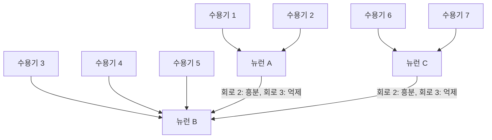



요약

여러 수용기의 신호를 뉴런 하나로 모으는 배선이다. 깔때기로 빗물을 모으듯 약한 신호도 합쳐지면 발화 문턱을 넘기 쉬워진다. 대신 어느 수용기에서 온 신호인지 섞여 버려서 위치를 구별하는 힘(해상도)을 잃는다. 억제성 연결을 섞으면 단순한 합이 아니라 "가운데만 자극받은 모양"처럼 특정한 모양에 반응하게 만들 수 있다.

## 예시로 보기

수용기 1~7이 한 줄로 있고, 가운데 수용기 4를 중심으로 자극 범위를 넓혀 간다: 4 하나 → 3~5 → 2~6 → 1~7. 세 가지 배선에서 뉴런 B의 발화율을 본다[^1].

| 배선 | 연결 | 4 | 3~5 | 2~6 | 1~7 |
|---|---|---|---|---|---|
| 회로 1: 수렴 없음 | 수용기마다 뉴런 하나. B는 수용기 4만 받음 | 1 | 1 | 1 | 1 |
| 회로 2: 흥분성 수렴 | 1·2 → A, 6·7 → C, 3·4·5와 A·C → B (모두 흥분성) | 1 | 3 | 5 | 7 |
| 회로 3: 억제성 수렴 | 회로 2와 같되 A·C → B가 억제성 | 1 | 3 | 1 | 0에 가까움 |

회로 1은 자극이 넓어져도 모른다. 회로 2는 자극받은 수용기 수만큼 반응한다. 회로 3은 자극이 3~5를 딱 채울 때 가장 세고, 더 넓어지면 오히려 약해진다. 회로 3의 1~7 값은 그래프에서 약 0.4다. 연산 모형은 이 자리에 0을 준다. 실제 뉴런은 자극이 없어도 조금씩 저절로 발화하므로(자발 발화), 억제가 흥분보다 세도 발화율이 0까지 떨어지지 않을 수 있다[^s4].

회로 2와 회로 3의 배선은 같다. 다른 곳은 A와 C에서 B로 가는 두 선의 종류뿐이다. 수용기 3~5는 B에 바로, 바깥 넷은 A나 C를 한 번 거쳐 B에 닿는다[^s6].

## 정의

정의

**수렴**은 여러 뉴런(또는 수용기)이 한 뉴런에 시냅스로 연결되는 구조다[^2]. 받는 뉴런은 들어온 신호를 흥분성은 더하고 억제성은 빼서 합친다.

[뉴런의 연산 모형](/Hongs_Blog/studies/human-interface-media/neuron-computational-model/)으로 쓰면 세 회로는 가중치 벡터만 다르다. 자극받은 수용기는 $$x_i = 1$$, 아니면 0이다[^s1].

$$
B = a(\mathbf{w}\cdot\mathbf{x}), \qquad a(o) = \max(0, o)
$$

| 회로 | $$\mathbf{w} = (w_1, \dots, w_7)$$ |
|---|---|
| 1 | $$(0, 0, 0, 1, 0, 0, 0)$$ |
| 2 | $$(1, 1, 1, 1, 1, 1, 1)$$ |
| 3 | $$(-1, -1, 1, 1, 1, -1, -1)$$ |

회로 3에서 1~7을 모두 자극하면 $$3 - 4 = -1$$이다. 발화율은 음수가 될 수 없으므로 $$a$$가 0으로 올린다. 활성 함수가 없으면 모형이 불가능한 값을 내놓는다. 풀이 과정은 [뉴런 수렴 모델링 연습](/Hongs_Blog/studies/human-interface-media/neuron-convergence-modeling/)에 있다.

수렴이 주는 것과 빼앗는 것은 이렇다[^s2].

| | 수렴이 많을 때 (회로 2) | 수렴이 없을 때 (회로 1) |
|---|---|---|
| 약한 자극 | 수용기마다 0.3이어도 7개를 모으면 2.1로 문턱 1을 넘는다 | 0.3이라 문턱을 못 넘는다 |
| 위치 | 수용기 1만, 4만, 7만 자극해도 B는 모두 1. 어디인지 모른다 | 수용기 4에만 반응해 위치를 안다 |

검증: 세 회로의 네 자극 값(1,1,1,1 / 1,3,5,7 / 1,3,1,0), 가중치 벡터 형태가 128가지 모든 자극에서 회로와 일치, 회로 3의 최대 반응이 자극 {3,4,5}에서만 나옴, 위치 정보 손실, 약한 자극의 문턱 통과 (실험으로 확인됨) — [09_neuron-convergence_verify.py](/Hongs_Blog/studies/human-interface-media/code/09_neuron-convergence_verify/)

## 신호·머신러닝 관점

**신호.** 수렴은 공간에서 이웃한 값을 더하는 필터다. 회로 2처럼 모두 같은 무게로 더하면 평균(박스) 필터, 곧 저역 통과 필터다. 수용기마다 서로 독립인 잡음이 섞여 있으면, $$N$$개를 평균한 값의 잡음은 $$1/\sqrt{N}$$로 줄어든다. 신호는 그대로이므로 신호 대 잡음비가 $$\sqrt{N}$$배 좋아진다. $$N = 7$$이면 약 2.65배다. 어두운 곳에서 수렴이 유리한 수학적 이유다. 회로 3처럼 둘레를 빼면 고른 부분은 지워지고 특정 크기의 무늬만 남는 대역 통과 필터가 된다([중심-주변 길항](/Hongs_Blog/studies/human-interface-media/center-surround/))[^s3].

두 분포의 가운데는 똑같이 1이다. 7개를 평균한 쪽(파랑)만 폭이 약 $$1/\sqrt{7}$$로 좁아져서, 참 신호에서 크게 벗어난 값이 드물다[^s5].

검증: 독립 잡음 7개 평균의 잡음 감소 2.61배, 이론값 $$\sqrt{7} = 2.65$$ (몬테카를로 20,000회, 실험으로 확인됨) — [09_neuron-convergence_verify.py](/Hongs_Blog/studies/human-interface-media/code/09_neuron-convergence_verify/)

**머신러닝.** 합성곱 신경망의 풀링(pooling)이 같은 거래를 한다. 이웃한 값 여러 개를 하나로 모아(평균 풀링·합 풀링) 작은 흔들림과 잡음에 강해지는 대신 정확한 위치 정보를 잃는다. 뉴런 하나에 들어오는 입력의 수를 머신러닝에서는 팬인(fan-in)이라 부른다. 회로 3은 가중치 일부가 음수인 [퍼셉트론](/Hongs_Blog/studies/human-interface-media/perceptron/) 하나와 같은 식이다[^s3].

## 연결

- 선수: [흥분성과 억제성 시냅스](/Hongs_Blog/studies/human-interface-media/excitatory-inhibitory/), [뉴런의 연산 모형](/Hongs_Blog/studies/human-interface-media/neuron-computational-model/)
- 회로 3을 2차원으로 넓힌 것: [중심-주변 길항](/Hongs_Blog/studies/human-interface-media/center-surround/)
- 눈에서의 실제 예: 간상체는 많이 수렴해 어두운 곳에 강하고, 중심와 추상체는 적게 수렴해 선명하다 → [간상체와 추상체](/Hongs_Blog/studies/human-interface-media/rods-and-cones/)

## 자주 하는 오해

"여러 수용기의 신호를 모으면 정보가 늘어나니 더 자세히 알 수 있다"

틀렸다. "많이 모은다 = 많이 안다"로 느껴져서 그럴듯하다. 실제로 수렴은 여러 값을 합 하나로 줄이는 일이라, 합이 같은 서로 다른 자극을 구별하지 못한다. 얻는 것은 민감도와 잡음에 대한 강함이고, 잃는 것은 위치 정보다. 확인 방법: 회로 2에서 수용기 1만, 4만, 7만 자극하면 B는 세 경우 모두 1이다.

## 확인 문제

<b>C1</b> 뉴런의 수렴을 정의하고, 수렴이 많을 때 얻는 것 하나와 잃는 것 하나를 쓰라.

**답:** 여러 뉴런(수용기)의 신호가 한 뉴런으로 모이는 구조다. 약한 신호를 합쳐 문턱을 넘기 쉬워진다(민감도, 잡음 감소). 대신 어느 수용기가 자극받았는지 구별하지 못한다(해상도 손실).

<b>C2</b> 수용기 2~6을 자극했다. 회로 2(흥분성 수렴)와 회로 3(억제성 수렴)에서 B의 발화율은 각각 얼마이고, 왜 그런가?

**답:** 회로 2: 3·4·5에서 3, A는 수용기 2에서 1, C는 수용기 6에서 1을 받아 모두 더하면 5. 회로 3: 3·4·5에서 3을 더하고 A·C의 1씩을 빼서 1.

<b>C3</b> 회로 2에서 수용기 1만 자극한 경우와 7만 자극한 경우를 B만 보고 구별할 수 있는가? 회로 1은 어떤가? 이 차이가 눈의 어떤 성질과 이어지는가?

**답:** 회로 2는 두 경우 모두 B = 1이라 구별하지 못한다. 합은 어디서 왔는지를 기억하지 않기 때문이다. 회로 1의 B는 수용기 4에만 반응하므로, 수용기마다 뉴런이 따로 있으면 위치를 안다. 그래서 수렴이 많은 간상체 쪽은 어두운 곳에 강하지만 흐릿하고, 수렴이 적은 중심와 추상체 쪽은 선명하다.

[^1]: 휴먼 인터페이스 미디어 2회 강의 자료 「HIM_강의02_사람의지각」, p.12 (그래프는 p.13~14에 모델링용으로 다시 나온다)
[^2]: 휴먼 인터페이스 미디어 2회 강의 자료 「HIM_강의02_사람의지각」, p.16 (요약: "뉴런, 뉴런의 수렴구조")
[^s1]: 보충 가중치 벡터 표현은 슬라이드 p.13~14(Neuron Convergence (modeling))의 빈 오른쪽을 연산 모형으로 채운 것이다. 강의에서 교수님이 쓴 모형과 표기가 다를 수 있다.
[^s2]: 보충 약한 자극 0.3과 문턱 1은 설명용 가상 수치다. 민감도와 해상도의 거래는 표준 지각 교재(예: Goldstein, *Sensation and Perception*)의 설명이다.
[^s3]: 보충 필터·신호 대 잡음비·풀링과의 대응은 원본 밖의 연결이다. $$1/\sqrt{N}$$은 독립이고 분산이 같은 잡음의 평균에 대한 표준 결과(분산이 $$1/N$$로 줄어듦)다.
[^s4]: 보충 강의 2 p.12를 확대해 눈금(1과 2 사이 간격)으로 잰 값은 약 0.41이다. 0이 아닌 까닭을 자발 발화로 설명한 것은 해석이다. 그래프 자체가 개략도라 정확한 값에는 의미를 두지 않는다.
[^s5]: 보충 그림 1장은 원본에 없다. [09_neuron-convergence_plot.py](/Hongs_Blog/studies/human-interface-media/code/09_neuron-convergence_plot/)로 그렸고, 그림에 쓴 값(신호 1에 표준편차 1인 독립 잡음, 20,000회, 폭의 비 2.65(이론값 $$\sqrt{7} \approx 2.65$$))을 같은 코드로 확인했다.
[^s6]: 보충 다이어그램 1개는 원본에 없다. 이 문서 예시 표의 회로 2·3 연결과 강의 2 p.12의 회로 그림을 근거로 그렸다.

