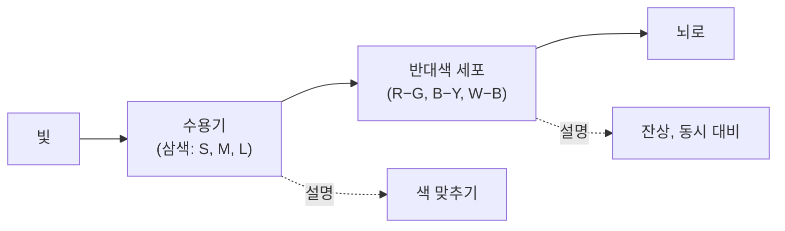



요약

색 신호를 뇌로 보내기 전에 한 번 더 번역하는 단계다. 추상체 뒤의 세포들은 "빨강 대 초록", "파랑 대 노랑", "흰색 대 검정"처럼 짝을 지어, 한쪽 색이면 발화를 늘리고 반대쪽 색이면 줄인다. 그래서 "붉은 초록"은 한 번에 느낄 수 없고, 빨강을 오래 보면 초록 잔상이 남는다. 추상체 세 개(삼색 이론)를 부정하는 이론이 아니라 그 뒤를 잇는 단계다.

## 예시로 보기

슬라이드 p.13의 표는 두 종류의 반대색 세포가 파장에 따라 어떻게 발화하는지 보여 준다[^1][판독불확실: 스파이크 밀도로 많다·적다를 읽음].

| 빛 | B+Y− 세포 | R+G− 세포 |
|---|---|---|
| 자극 없음 | 보통(자발 발화) | 보통(자발 발화) |
| 450 nm (파랑) | 크게 늘어남 | 줄어듦 |
| 510 nm (초록) | 늘어남 | 크게 줄어듦 |
| 580 nm (노랑) | 크게 줄어듦 | 조금 늘어남 |
| 660 nm (빨강) | 줄어듦 | 크게 늘어남 |

B+Y− 세포는 파랑에 흥분(+), 노랑에 억제(−)된다. 한 세포가 두 색을 "반대 방향의 발화"로 나눠 담는다.

같은 쪽 오른쪽 그림은 M과 L 추상체 반응의 차이로 이를 보인다[^1]. 빛 1은 M 봉우리 근처라 M > L, 빛 2는 L 봉우리 근처라 L > M이다. 차이 $$L - M$$을 내는 세포는 빛 1에 음수(초록 쪽), 빛 2에 양수(빨강 쪽)를 낸다. 슬라이드는 이를 "R+ G−"로 적는다.

## 정의

정의

**반대색 과정**: 추상체 신호가 뇌로 가기 전에, 서로 반대인 색의 짝(빨강-초록, 파랑-노랑, 흰색-검정)을 한 세포가 흥분과 억제로 나눠 표현하는 단계[^1].

슬라이드의 회로 두 개가 배선을 보여 준다[^1].

| 회로 | 흥분(+) 입력 | 억제(−) 입력 | 출력 |
|---|---|---|---|
| 회로 1 | S 추상체 | M과 L을 합친 세포 | B+Y− |
| 회로 2 | M 추상체 | L 추상체 | G+R− |

M과 L이 함께 크면 노랑이므로, 회로 1은 "파랑 − 노랑"이다. 회로 2는 "초록 − 빨강"이다. 슬라이드의 세 짝 그림에는 B−W+, R+G−, B−Y+처럼 부호가 반대인 것도 있다[^1]. 같은 짝에 대해 두 극성의 세포가 모두 있다.

단순화한 식으로 쓰면 이렇다[^s1].

$$
\text{RG} = r_L - r_M, \qquad \text{BY} = r_S - \tfrac{1}{2}(r_M + r_L), \qquad \text{밝기} \approx r_M + r_L
$$

세 추상체 반응을 세 개의 "차이 신호"로 바꾸는 것이다. 흥분과 억제를 조합해 빼기를 만드는 구조는 [흥분성과 억제성 시냅스](/Hongs_Blog/studies/human-interface-media/excitatory-inhibitory/), [측면 억제](/Hongs_Blog/studies/human-interface-media/lateral-inhibition/)와 같다.

주황 선(RG)은 555 nm에서 0을 지나, 그보다 짧은 파장에는 음수(초록 쪽), 긴 파장에는 양수(빨강 쪽)를 낸다. 파랑 선(BY)은 약 488 nm에서 부호가 바뀐다. 두 선이 0을 지나는 자리가 달라서, 두 부호의 조합만으로도 파장대를 셋(약 488 nm 아래, 488~555 nm, 555 nm 위)으로 가를 수 있다[^s4].

검증: 가우스 추상체 모형에서 빛 1(535 nm)의 $$L - M = -0.326$$, 빛 2(575 nm)는 $$+0.326$$. 회로 1은 450 nm에 $$+0.892$$, 580 nm에 $$-0.800$$ (실험으로 확인됨) — [19_opponent-process_verify.py](/Hongs_Blog/studies/human-interface-media/code/19_opponent-process_verify/)

## 활용

- **잔상.** 빨간 사각형을 30초쯤 보다가 흰 벽을 보면 초록빛 사각형이 보인다. 빨강을 오래 보는 동안 R+G− 세포가 지쳐(적응해) 반응이 약해진다. 흰 벽을 보면 균형이 초록 쪽으로 기울어 초록이 보인다. 슬라이드 오른쪽 위의 초록·빨강·파랑·노랑 네 칸 그림이 이 실험용이다[^s2].
- **색 공간.** 강의 계획표 5주차의 CIE Lab은 밝기 $$L^*$$와 반대색 두 축 $$a^*$$(초록-빨강), $$b^*$$(파랑-노랑)로 색을 나타낸다. 반대색 과정을 좌표계로 옮긴 셈이다. 영상 압축에서 밝기와 색차를 나누는 YCbCr도 같은 발상이다[^2][^s3].

## 연결

- 선수: [삼색 이론](/Hongs_Blog/studies/human-interface-media/trichromatic-theory/) (앞 단계), [흥분성과 억제성 시냅스](/Hongs_Blog/studies/human-interface-media/excitatory-inhibitory/) (+와 −)
- 두 이론의 역할 나누기: [삼색 이론과 반대색 과정 비교](/Hongs_Blog/studies/human-interface-media/contrast--trichromatic--opponent-process/)

## 자주 하는 오해

"반대색 과정은 삼색 이론을 뒤집은 경쟁 이론이다"

틀렸다. 역사적으로 두 이론이 따로 주장되며 서로 다투었기 때문에 그렇게 배우기 쉽다. 지금은 두 단계로 본다. 추상체는 삼색 이론대로 세 종류이고, 그 신호를 추상체 뒤의 세포가 반대색 짝으로 바꾼다. 확인 방법: 슬라이드 p.13 가운데 그림이 "Trichromatic(수용기) → Opponent-process(반대색 세포)"를 한 줄로 이어 놓았다.

## 확인 문제

<b>C1</b> 반대색 과정의 세 짝을 쓰고, 두 단계 모형(수용기 → 반대색 세포)에서 각 단계가 설명하는 현상을 쓰라.

**답:** 빨강-초록, 파랑-노랑, 흰색-검정. 수용기 단계(삼색)는 색 맞추기를, 반대색 세포 단계는 잔상과 동시 대비를 설명한다.

<b>C2</b> 빛 1은 M 추상체 봉우리 근처(M > L), 빛 2는 L 추상체 봉우리 근처(L > M)다. $$L - M$$을 내는 반대색 세포의 출력 부호는 각각 무엇이고, 어떤 색 쪽 신호인가?

**답:** 빛 1: $$L - M < 0$$, 초록 쪽. 빛 2: $$L - M > 0$$, 빨강 쪽. 슬라이드 표기로 R+ G−다.

<b>C3</b> 빨간 사각형을 오래 본 뒤 흰 벽을 보면 초록 잔상이 보이는 이유를 반대색 세포로 설명하라. 왜 "붉은 초록"이라는 색은 떠올릴 수 없는가?

**답:** 빨강을 오래 보는 동안 빨강-초록 세포의 빨강 쪽 반응이 적응해 약해진다. 흰 벽(빨강과 초록이 균형인 빛)을 보면 약해진 빨강 쪽 대신 초록 쪽으로 기운 신호가 나와 초록이 보인다. 한 세포가 빨강이면 발화를 늘리고 초록이면 줄이므로, 두 색을 동시에 "많이"로 표현할 방법이 없다.

[^1]: 4-1학기/휴먼 인터페이스 미디어/1.수업자료/03.HIM_강의03_사람의시각.pdf, p.13 (보색). 슬라이드 제목은 "보색"이다. 반대색 짝(빨강-초록, 파랑-노랑)은 물리적 보색(섞으면 흰색이 되는 짝, 예: 빨강-청록)과 파랑-노랑에서는 같고 빨강-초록에서는 조금 다르다.
[^2]: 4-1학기/휴먼 인터페이스 미디어/1.수업자료/00. HIM_2026_Syllabus.pdf, Lecture Calendar 5주차
[^s1]: 에이전트 보충. 반대색 신호의 식은 여러 교재가 쓰는 단순화이며 실제 가중치는 연구마다 다르다. 슬라이드에는 식이 없다.
[^s2]: 에이전트 보충. 잔상의 적응 설명과 네 칸 그림의 용도는 표준 지각 교재의 설명에 따른 해석이다.
[^s3]: 에이전트 보충. CIELAB의 $$a^*$$, $$b^*$$ 축과 YCbCr의 밝기·색차 분리는 색채·영상 공학의 표준 내용이다.
[^s4]: 에이전트 보충. 그림 1장은 원본에 없다. [19_opponent-process_plot.py](/Hongs_Blog/studies/human-interface-media/code/19_opponent-process_plot/)로 그렸고, 그림에 쓴 값(가우스 추상체 모형에서 535 nm $$-0.326$$, 575 nm $$+0.326$$, 450 nm $$+0.892$$, 580 nm $$-0.800$$, 0을 지나는 곳 RG 555 nm·BY 약 488 nm)을 같은 코드로 확인했다.

