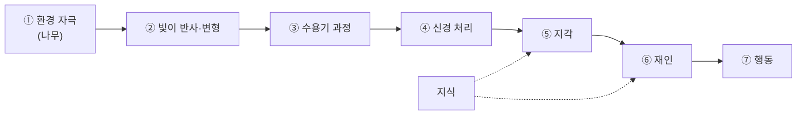



요약

감각이 카메라 센서가 빛을 받는 일이라면, 지각은 그 신호를 "저기 나무가 있다"처럼 쓸 수 있는 그림으로 조립하는 일이다. 지각은 들어온 신호를 그대로 기록하지 않는다. 골라내고, 정리하고, 해석한다. 그래서 빠르고 쓸모 있지만, 같은 자극을 다르게 보거나 없는 것을 보는 착시도 생긴다.

## 예시로 보기

강의 2의 첫 사진을 보고 "무엇을 보고 있나요?"라고 물으면, 답은 처리 수준마다 다르다[^1][^s1].

| 수준 | 사진에 대한 답 |
|---|---|
| 감각 (Sensation) | 위치마다 다른 밝기와 색의 빛이 망막에 닿는다 |
| 지각 (Perception) | 빛의 분포를 얼굴, 머리카락, 책이라는 덩어리로 나누고 배경과 떼어 낸다 |
| 인식 (Cognition) | 아는 것을 동원해 장면을 이해한다: 사람이 책을 안고 서 있다 |
| 재인 (Recognition) | 본 것을 기억 속 범주에 맞춘다: 이 얼굴은 아는 사람이다 |
| 추론 (Inference) | 보이지 않는 것까지 끌어낸다: 책 표지의 "J.S. BACH"를 보고 음악을 공부하는 사람이라 짐작한다 |
| 감정 (Emotion) | 장면에 대한 느낌: 따뜻하다, 호감이 간다 |

지각에서 행동까지의 흐름은 강의 2 p.6의 왼쪽 그림이 일곱 단계로 보여 준다[^2].

①~④가 감각 쪽, ⑤부터가 지각 쪽이다. 지식은 지각과 재인에 영향을 준다. 같은 그림의 ⑤⑥⑦ 사이 화살표는 양방향이다. 행동과 재인이 다시 지각에 영향을 준다는 뜻이다.

오른쪽 그림은 이 흐름이 뇌에서 얼마나 걸리는지 보여 준다[^2][^s2].

| 영역 | 도착 시간 (ms) | 하는 일 |
|---|---|---|
| 망막 | 20~40 | |
| LGN | 30~50 | |
| V1 | 40~60 | 모서리, 꼭짓점 같은 단순한 모양 |
| V2 | 50~70 | |
| V4 | 60~80 | 중간 수준의 모양, 특징 묶음 |
| PIT | 70~90 | |
| AIT | 80~100 | 얼굴, 물체 같은 높은 수준의 묘사 |
| PFC (전전두 피질) | 100~130 | 범주 판단, 결정 |
| PMC (전운동 피질) | 120~160 | |
| MC (운동 피질) | 140~190 | 운동 명령 |
| 척수 | 160~220 | |
| 손가락 근육 | 180~260 | |

보고 나서 얼굴·물체 수준의 묘사가 생기기까지 약 0.1초, 손가락이 움직이기까지 약 0.2초다. 단계가 올라갈수록 다루는 내용이 모서리 → 특징 묶음 → 물체로 복잡해진다.

## 정의

정의

**감각**은 자극 신호를 받아들이는 일(수용)이다. **지각**은 받아들인 자극 정보를 처리하는 일이다[^3]. 지각은 들어온 것을 그대로 받아 적지 않는다. 주변을 이해하고 그 안에서 움직이려고, 정보를 스스로 고르고(선택), 정리하고, 해석한다[^4].

슬라이드는 교재 네 곳의 정의를 나란히 놓는다[^4]. 모두 "해석"과 "능동성"을 공통으로 강조한다.

| 출처 (슬라이드 표기) | 지각의 정의 (요지) |
|---|---|
| Hayes & Orrell, 1987 | 감각 정보의 해석 |
| Gregory, 1966 | 가진 데이터에 대한 최선의 해석을 찾아가는 동적인 탐색 |
| Coon, 1983 | 감각을 세계에 대한 쓸모 있는 마음속 표상으로 조립하는 과정 |
| Solomon, 2006 | 자극을 선택하고, 조직하고, 해석하는 과정 |

사람의 정보 처리 수준은 감각 → 지각 → 인식 → 재인 → 추론 순으로 쌓이고, 감정은 따로 놓인다[^1]. 슬라이드는 수준의 이름만 나열한다. 표의 설명 열은 일반적인 뜻이다[^s1].

## 활용

- 이 과목이 다루는 층은 주로 감각과 초기 지각이다. 인식·재인·추론 같은 높은 수준의 처리 방법은 다루지 않는다고 과목 소개에서 밝힌다[^5].
- 망막 → V1(모서리) → V4(특징 묶음) → IT(물체)로 표현이 단계마다 복잡해지는 계층은 합성곱 신경망의 층 구조가 닮은 원리다. 비교와 차이점은 [시각 경로](/Hongs_Blog/studies/human-interface-media/visual-pathway/)의 머신러닝 관점에 있다[^s4].
- 매체 설계에서 중요한 점은 사람이 최종적으로 쓰는 것이 감각 신호가 아니라 지각 결과라는 것이다. 지각이 버리는 정보는 매체도 버릴 수 있다. 이것이 사람 지각의 한계를 이용한 압축의 출발점이다[^s3].

## 연결

- 선수: [휴먼 인터페이스 미디어](/Hongs_Blog/studies/human-interface-media/human-interface-media/)
- 감각 단계의 실제 부품: [뉴런과 신호 전달](/Hongs_Blog/studies/human-interface-media/neuron-signaling/)
- 시각에서의 경로(망막 → LGN → V1): [시각 경로](/Hongs_Blog/studies/human-interface-media/visual-pathway/)
- 지각이 능동적이라는 증거: [측면 억제](/Hongs_Blog/studies/human-interface-media/lateral-inhibition/)의 헤르만 격자와 마하 띠

## 자주 하는 오해

"눈은 카메라처럼 본 것을 그대로 기록하고, 뇌는 그 사진을 본다"

틀렸다. 망막에 맺힌 상이 사진처럼 느껴져서 그럴듯하다. 실제로는 망막에서부터 신호를 고르고 가공하며, 뇌는 가공된 결과를 해석해 지각을 만든다. 슬라이드의 정의도 지각이 수동적 기록이 아니라고 못 박는다[^4]. 확인 방법: 3회의 헤르만 격자를 보면, 그림에는 없는 회색 점이 교차점에 보인다. 기록이라면 없는 것이 보일 수 없다.

## 확인 문제

<b>C1</b> 감각과 지각을 각각 한 구절로 정의하고, 사람의 정보 처리 수준 다섯 개를 낮은 것부터 쓰라. 따로 놓인 하나도 쓰라.

**답:** 감각은 자극 신호의 수용, 지각은 자극 정보의 처리(선택·정리·해석)다. 수준은 감각 → 지각 → 인식 → 재인 → 추론이고, 감정이 따로 놓인다. 
**흔한 오답:** 지각을 "감각을 느끼는 것"으로 써서 감각과 구별하지 못한다. 차이는 해석이 들어가느냐다.

<b>C2</b> 다음은 어느 수준인가? (a) 빛이 망막에 닿아 전기 신호가 생긴다 (b) 흩어진 점과 선을 하나의 얼굴 윤곽으로 묶어 본다 (c) 그 얼굴이 친구의 얼굴임을 알아본다 (d) 친구가 우산을 들고 있으니 밖에 비가 온다고 판단한다

**답:** (a) 감각 (b) 지각 (c) 재인 (d) 추론 
**이유:** (a)는 해석 없는 수용이다. (b)는 신호를 조직해 덩어리를 만든다. (c)는 기억 속 범주와 맞춘다. (d)는 보이지 않는 사실(비)을 끌어낸다.

<b>C3</b> 원숭이가 사진을 보고 손가락으로 버튼을 누르기까지 신호가 거치는 곳을 순서대로 쓰고, 대략 몇 ms가 걸리는지 쓰라. 얼굴·물체 같은 높은 수준의 묘사가 생기는 곳은 어디이고 몇 ms쯤인가?

**답:** 망막 → LGN → V1 → V2 → V4 → PIT → AIT → PFC → PMC → MC → 척수 → 손가락 근육. 손가락까지 약 180~260 ms. 높은 수준의 묘사는 AIT에서 약 80~100 ms에 생긴다. 
**이유:** 단계마다 수십 ms씩 쌓인다. 시각 처리는 약 0.1초, 결정과 운동이 약 0.1초를 더한다.

[^1]: 4-1학기/휴먼 인터페이스 미디어/1.수업자료/02.HIM_강의02_사람의지각.pdf, p.2
[^2]: 4-1학기/휴먼 인터페이스 미디어/1.수업자료/02.HIM_강의02_사람의지각.pdf, p.6
[^3]: 4-1학기/휴먼 인터페이스 미디어/1.수업자료/02.HIM_강의02_사람의지각.pdf, p.16 (요약)
[^4]: 4-1학기/휴먼 인터페이스 미디어/1.수업자료/02.HIM_강의02_사람의지각.pdf, p.5. 영어 원문을 우리말로 옮겨 요지만 적었다.
[^5]: 4-1학기/휴먼 인터페이스 미디어/1.수업자료/00. HIM_강의00-강의소개.pdf, p.7
[^s1]: 에이전트 보충. 슬라이드는 수준의 이름과 사진만 보여 준다. 수준별 설명과 사진에 대한 답은 일반적인 뜻을 사진에 맞춰 쓴 예시다.
[^s2]: 에이전트 보충. 그림의 뇌는 원숭이 뇌이고, 빠른 시각 범주화 실험의 시간 추정치를 그린 그림으로 알려져 있다(Thorpe & Fabre-Thorpe, 2001, Science). 영역 이름의 풀이(PFC 전전두 피질, PMC 전운동 피질, MC 운동 피질)도 보충이다. 빈칸은 그림에 기능 설명이 없는 영역이다.
[^s4]: 에이전트 보충. 시각 경로의 계층과 합성곱 신경망의 대응은 원본 밖의 연결이다.
[^s3]: 에이전트 보충. 강의 계획서의 "사람 지각 시스템의 한계를 이용한 데이터 압축"(00. HIM_2026_Syllabus.pdf, Course Description)을 지각 개념과 이은 해석이다.

