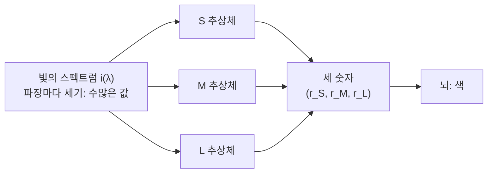



요약

색은 세 개의 음량계가 가리키는 눈금의 조합이다. 눈에는 짧은·중간·긴 파장에 각각 잘 반응하는 세 종류의 추상체가 있고, 뇌는 빛의 스펙트럼 전체가 아니라 세 반응의 크기만 받는다. 그래서 빨강·초록·파랑 세 빛만 섞어도 대부분의 색을 흉내 낼 수 있다. 대신 서로 다른 빛이 똑같아 보이는 일이 생기고, 잔상이나 "붉은 초록은 없다" 같은 현상은 이 이론만으로 설명하지 못한다.

## 예시로 보기

슬라이드는 색마다 S, M, L 추상체의 반응 크기가 어떻게 다른지 화살표 크기로 보여 준다[^1][판독불확실: 화살표 크기를 크다·중간·작다로 읽음].

| 보이는 색 | S | M | L |
|---|---|---|---|
| 파랑 | 크다 | 중간 | 작다 |
| 초록 | 작다 | 크다 | 중간 |
| 빨강 | 작다 | 중간 | 크다 |
| 노랑 | 작다 | 크다 | 크다 |
| 흰색 | 크다 | 크다 | 크다 |

뇌가 받는 것은 이 세 숫자다. 노랑은 "노랑 감지기"가 켜진 것이 아니라 M과 L이 함께 크고 S가 작은 조합이다.

추상체가 한 종류뿐이면 어떻게 될까. 추상체 하나는 빛을 받으면 "얼마나 반응했나" 숫자 하나만 낸다. 파장이 달라서 약하게 반응한 것인지, 빛이 약해서 약하게 반응한 것인지 구별할 수 없다(단일 변수 원리, principle of univariance)[^s1]. 예를 들어 M 추상체에게 500 nm 빛을 약 1.35배 세게 비추면 535 nm 빛과 반응이 똑같다. 종류가 하나면 색을 볼 수 없고, 적어도 둘이 있어야 반응의 비율로 파장을 가를 수 있다.

## 정의

정의

**삼색 이론**: 색 시각은 서로 다른 세 가지 수용기 메커니즘의 활동에 달려 있다[^2].

수식으로 옮기면 이렇다[^s2]. 빛의 스펙트럼 $$i(\lambda)$$와 추상체 $$k$$의 민감도 곡선 $$\sigma_k(\lambda)$$에 대해 반응은

$$
r_k = \int i(\lambda)\,\sigma_k(\lambda)\,d\lambda, \qquad k \in \{S, M, L\}
$$

이고, 보이는 색은 세 값 $$\mathbf{r} = (r_S, r_M, r_L)$$로만 정해진다. 빛을 섞으면 반응이 더해지고, 빛을 $$c$$배 세게 하면 반응도 $$c$$배가 된다(선형성).

세 값으로 줄이면서 스펙트럼의 모양 자체는 잃는다. 파장마다 하나씩 있던 수많은 값이 세 값으로 줄어든다.

| 설명한다 | 설명하지 못한다 |
|---|---|
| 세 원색으로 거의 모든 색을 맞출 수 있다(색 맞추기) | 빨강을 오래 보면 초록 잔상이 남는다 |
| 서로 다른 빛이 같은 색으로 보인다([조건등색](/Hongs_Blog/studies/human-interface-media/metamerism/)) | 주변 색에 따라 같은 색이 달라 보인다(동시 대비) |
| 추상체가 하나 없으면 두 원색으로 모든 색을 맞춘다(색각 이상) | "붉은 초록", "노란 파랑"이라는 색은 떠올릴 수 없다 |

오른쪽 열은 추상체 뒤의 단계인 [반대색 과정](/Hongs_Blog/studies/human-interface-media/opponent-process/)이 설명한다. 슬라이드 p.13도 두 단계를 차례로 놓는다: 수용기(삼색, 색 맞추기) → 반대색 세포(잔상, 동시 대비)[^3].

## 증명

**원색 셋이면 반응 $$\mathbf{r}$$ 을 정확히 맞출 수 있다(행렬이 가역일 때).** 선형성으로 색 맞추기를 연립일차방정식으로 바꾼다[^s2].

증명 펼치기

원색 빛 $$p_1, p_2, p_3$$가 세 추상체에 만드는 반응을 열로 세운 $$3 \times 3$$ 행렬을 $$P$$라 하자. $$P_{kj}$$는 원색 $$j$$를 세기 1로 비출 때 추상체 $$k$$의 반응이다.

1. 원색을 세기 $$\mathbf{w} = (w_1, w_2, w_3)$$로 섞은 빛의 반응은 $$P\mathbf{w}$$다. — 선형성: 섞으면 더해지고 세기에 비례한다
2. 목표 빛의 반응이 $$\mathbf{r}$$이면, 똑같아 보이려면 $$P\mathbf{w} = \mathbf{r}$$이어야 한다. — 삼색 이론: 색은 $$\mathbf{r}$$로만 정해진다
3. $$P$$가 가역이면 $$\mathbf{w} = P^{-1}\mathbf{r}$$이 유일한 해다. — 선형대수
4. $$\mathbf{w}$$의 성분이 모두 0 이상이면 실제로 섞을 수 있다. 음수인 성분 $$w_j < 0$$이 있으면 그 원색을 목표 쪽에 $$\vert w_j\vert $$만큼 더해서 맞춘다. 원색만 섞어서는 그 색을 만들 수 없다는 뜻이다.

원색이 둘이면 방정식 셋에 미지수 둘이라 일반적으로 해가 없다.

### 스스로 설명해 보기

1. "섞은 빛의 반응은 $$P\mathbf{w}$$다."
   

근거

   추상체 반응의 선형성. 두 빛을 섞으면 각 추상체의 반응이 더해지고, 세기를 $$c$$배 하면 반응도 $$c$$배다. 그래서 반응은 원색 반응의 가중 합, 곧 행렬과 벡터의 곱이다.
   

2. "$$P\mathbf{w} = \mathbf{r}$$이면 똑같아 보인다."
   

근거

   삼색 이론 자체. 뇌가 받는 것은 세 반응뿐이므로, 세 반응이 같으면 스펙트럼이 달라도 구별할 길이 없다.
   

- 이 증명의 핵심 아이디어는?
  

답

  색을 3차원 벡터로 보면 색 맞추기는 연립일차방정식이 된다. 원색의 수 = 방정식의 수 = 추상체의 종류 수.
  

- 이 방법을 쓸 수 있는 다른 상황은?
  

답

  모니터의 RGB 값을 계산할 때, 다른 원색을 쓰는 두 기기 사이에서 색을 옮길 때(색 공간 변환), 카메라 센서 값을 사람 눈 기준 색으로 바꿀 때. 모두 $$3 \times 3$$ 행렬 곱이다. 강의 계획표 5주차의 CIE XYZ가 그 기준 좌표계다.
  

## 예제

추상체 민감도를 봉우리 1인 가우스 곡선으로 두고(봉우리 S 445, M 535, L 575 nm, 폭 30·45·45 nm로 가정), 색 맞추기를 계산했다[^s3].

L과 M 곡선은 대부분 겹치고, S 곡선만 짧은 파장 쪽에 따로 떨어져 있다[^s5].

| 목표 | 원색 | 결과 | 뜻 |
|---|---|---|---|
| 580 nm 노랑 | 530, 620 nm 둘 | M·L은 딱 맞지만 S가 0.007 어긋남 | 원색 둘로는 세 반응을 다 못 맞춘다. 이 경우 S가 거의 0이라 차이가 작을 뿐이다 |
| 480~510 nm 청록 | 450, 530, 620 nm 셋 | 620 nm(빨강)의 양이 −0.28 ~ −0.37 | 원색 셋을 양수로 섞어서는 만들 수 없다. 모니터로 못 내는 색이다 |
| 535 nm 초록 (M이 없는 사람) | 450, 620 nm 둘 | 450 × 0.011 + 620 × 1.11로 S·L이 딱 맞음 | 이 사람에게 초록과 빨강+약간의 파랑이 같아 보인다. 세 추상체를 가진 사람에게는 M 반응이 1.00 대 0.19로 다르다 |

400~700 nm를 5 nm 간격으로 본 61개 단색광 가운데 58개가 이 모형에서 어느 한 원색을 음수로 요구했다. 실제 원색 셋이 만드는 색의 범위(색역, gamut)는 사람이 볼 수 있는 모든 색을 덮지 못한다[^s4].

0 아래 회색 구역으로 내려간 선은 그 원색을 섞는 게 아니라 목표 쪽에 더해야 맞는다는 뜻이다. 청록(480~510 nm)에서 빨강 선이 가장 깊이 내려간다[^s5].

검증: 단일 변수(500 nm × 1.353 = 535 nm × 1의 M 반응), 원색 둘의 S 어긋남 0.0072, 청록 480~510 nm의 음수 빨강, 61개 중 58개 음수, M 없는 경우의 초록 = 파랑 0.0113 + 빨강 1.110 (가우스 모형에서 실험으로 확인됨) — [16_trichromatic-theory_verify.py](/Hongs_Blog/studies/human-interface-media/code/16_trichromatic-theory_verify/)

손으로 풀어 보는 연습: [조건등색 예제 사다리](/Hongs_Blog/studies/human-interface-media/metamerism-ladder/)

## 활용

- 모니터, 휴대폰 화면, 카메라가 모두 R·G·B 세 채널인 이유다. 파장마다 값을 다 저장할 필요 없이 세 값이면 사람 눈에는 충분하다. 이것이 [이미지 함수](/Hongs_Blog/studies/human-interface-media/image-function/)의 $$\mathbf{i} = (i_R, i_G, i_B)$$가 세 성분인 이유다.
- 음수 원색 문제를 피하려고, 국제조명위원회(CIE)는 실제로 만들 수 없는 가상의 원색으로 좌표계 XYZ를 정했다. 그러면 모든 색이 양수 좌표를 가진다. 강의 계획표 5주차 "Color Space - CIE XYZ, CIE Lab"의 출발점이다[^4][^s4].
- 색각 이상 검사와 색각 이상 사용자를 위한 화면 설계도 이 이론에 기댄다. 추상체 하나가 없으면 조건등색이 훨씬 많아져, 세 추상체를 가진 사람에게 다른 두 색이 같아 보인다.

## 연결

- 선수: [간상체와 추상체](/Hongs_Blog/studies/human-interface-media/rods-and-cones/) (L, M, S 추상체), [파동과 빛](/Hongs_Blog/studies/human-interface-media/wave-and-light/) (스펙트럼 $$i(\lambda)$$)
- 결과: [조건등색](/Hongs_Blog/studies/human-interface-media/metamerism/)
- 다음 단계와 비교: [반대색 과정](/Hongs_Blog/studies/human-interface-media/opponent-process/), [삼색 이론과 반대색 과정 비교](/Hongs_Blog/studies/human-interface-media/contrast--trichromatic--opponent-process/)
- 반응 = 가중치와 입력의 곱의 합이라는 구조는 [뉴런의 연산 모형](/Hongs_Blog/studies/human-interface-media/neuron-computational-model/)의 $$A\mathbf{x}$$와 같다. 민감도 곡선이 가중치, 스펙트럼이 입력이다.

## 자주 하는 오해

"모니터의 노란색은 노란 빛(약 580 nm)을 낸다"

틀렸다. 화면에 노랑이 보이니 노란 파장이 나온다고 생각하기 쉽다. 실제로 화면에는 빨강·초록·파랑 부화소만 있고, 노랑은 빨강과 초록을 함께 켠 것이다. 이 빛은 580 nm 빛과 스펙트럼이 전혀 다르지만, M과 L을 함께 크게, S를 작게 자극해 같은 반응을 만든다. 확인 방법: 돋보기로 화면의 노란 부분을 보면 빨강과 초록 점만 보인다.

## 확인 문제

<b>C1</b> 삼색 이론을 한 문장으로 쓰고, 세 추상체와 슬라이드의 봉우리 파장을 쓰라.

**답:** 색 시각은 서로 다른 세 수용기 메커니즘(추상체)의 활동에 달려 있다. 색은 세 반응의 크기(조합)로 정해진다. S 445 nm, M 535 nm, L 575 nm.

<b>C2</b> 추상체가 한 종류뿐이라면 색을 볼 수 없는 이유를 "단일 변수 원리"로 설명하라.

**답:** 추상체 하나는 반응의 크기라는 숫자 하나만 낸다. 반응이 작은 것이 파장이 봉우리에서 멀어서인지 빛이 약해서인지 구별할 수 없다. 세기를 조절하면 어떤 두 파장도 같은 반응을 만든다. 종류가 둘 이상이면 반응의 비율이 파장에 따라 달라져 색을 가를 수 있다.

<b>C3</b> 세 원색을 섞어 목표 색을 맞추는 세기가 $$\mathbf{w} = P^{-1}\mathbf{r}$$인 근거를 두 단계로 쓰라. 원색이 둘이면 왜 일반적으로 안 되는가?

**답:** (1) 선형성: 섞은 빛의 반응은 원색 반응의 가중 합 $$P\mathbf{w}$$다. (2) 삼색 이론: 반응 세 값이 같으면 같은 색으로 보이므로 $$P\mathbf{w} = \mathbf{r}$$을 풀면 된다. $$P$$가 가역이면 해가 $$P^{-1}\mathbf{r}$$이다. 원색이 둘이면 방정식 셋에 미지수 둘이라 일반적으로 해가 없다.

<b>C4</b> 모니터가 R, G, B 세 빛만으로 대부분의 색을 보여 줄 수 있는 이유와, 그래도 보여 주지 못하는 색이 있는 이유를 쓰라.

**답:** 사람 눈은 세 추상체 반응만 받으므로, 세 원색의 세기를 조절해 같은 반응을 만들면 같은 색으로 보인다. 그러나 스펙트럼 청록 같은 색은 맞추는 해에서 한 원색의 세기가 음수가 된다. 빛의 세기는 음수가 될 수 없으므로 실제 원색 세 개로는 만들 수 없다.

<b>C5</b> M 추상체가 없는 사람(S와 L만 있음)에게 535 nm 초록빛과 똑같아 보이는, 스펙트럼이 전혀 다른 빛의 예를 들고, 세 추상체를 가진 사람은 둘을 구별하는 이유를 쓰라.

**답:** 450 nm 파랑을 조금(약 0.011)과 620 nm 빨강을 약 1.11 섞은 빛(설명용 가우스 모형 기준). S와 L 반응이 초록빛과 똑같다. 세 추상체를 가진 사람에게는 M 반응이 초록빛 1.00, 섞은 빛 약 0.19로 크게 달라 구별된다. 
**이유:** 추상체가 둘이면 반응이 두 숫자뿐이라, 원색 둘로 모든 빛을 맞출 수 있고 조건등색이 훨씬 많아진다.

[^1]: 휴먼 인터페이스 미디어 3회 강의 자료 「HIM_강의03_사람의시각」, p.10 (왼쪽 그림)
[^2]: 휴먼 인터페이스 미디어 3회 강의 자료 「HIM_강의03_사람의시각」, p.10 ("Trichromatic Theory"가 굵은 글씨). 영어 정의를 우리말로 옮겼다.
[^3]: 휴먼 인터페이스 미디어 3회 강의 자료 「HIM_강의03_사람의시각」, p.13 (Trichromatic → Opponent-process 그림)
[^4]: 휴먼 인터페이스 미디어 0회 강의 자료 「 HIM_2026_Syllabus」, Lecture Calendar 4~5주차
[^s1]: 보충 단일 변수 원리는 지각 교재(예: Goldstein, *Sensation and Perception*)의 표준 용어다. 1.35배 수치는 아래 가우스 모형의 계산값이다.
[^s2]: 보충 반응 적분식, 선형성(그라스만 법칙), 행렬식 색 맞추기와 증명은 색채학의 표준 내용이며 슬라이드에는 없다.
[^s3]: 보충 가우스 민감도 모형은 설명용 가정이다. 봉우리는 슬라이드 p.8 값, 폭은 슬라이드 그래프의 모양에 맞춰 가정했다. 실제 민감도 곡선은 가우스가 아니므로 수치는 경향만 보여 준다.
[^s4]: 보충 실제 색 맞추기 실험(CIE 1931 RGB 등색 함수)에서도 약 440~550 nm 구간에서 빨강 원색이 음수가 된다. XYZ가 가상 원색으로 이를 피한다는 것은 색채학의 표준 내용이다.
[^s5]: 보충 그림 두 장은 원본에 없다. [16_trichromatic-theory_plot.py](/Hongs_Blog/studies/human-interface-media/code/16_trichromatic-theory_plot/)로 그렸고, 그림에 쓴 값(480~510 nm의 빨강 세기 −0.37 ~ −0.28, 5 nm 간격 61개 중 58개가 음수 원색을 요구)을 같은 코드로 확인했다.

