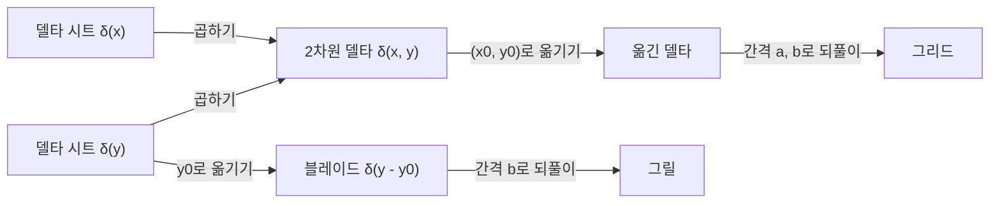



요약

영상 처리에서 자주 쓰는 평면 위의 기본 모양들이다. 네모난 판, 둥근 판, 칼날처럼 얇은 선, 바늘 하나, 바늘을 일정 간격으로 꽂은 바늘 판이 있다. 네모난 판처럼 "가로 모양 × 세로 모양"으로 쪼개지는 함수(분리 가능)는 1차원 계산 두 번으로 처리할 수 있어 빠르다. 하지만 둥근 판처럼 쪼개지지 않는 모양도 있고, 이런 모양은 극좌표로 쓰면 오히려 간단해진다.

## 예시로 보기

1차원 함수는 $$x$$ 하나를 넣으면 값 하나가 나온다. 사진처럼 평면에 펼쳐진 것을 다루려면 변수가 둘인 함수 $$z = f(x, y)$$가 필요하다. $$x$$와 $$y$$가 서로 아무 관계 없이 따로 움직일 수 있으면(독립 변수) 진짜 2차원 함수다. $$y = 2x$$처럼 한쪽이 다른 쪽에 묶여 있으면 사실은 $$x$$ 하나의 1차원 함수로 바꿔 쓸 수 있다[^1].

가로 $$a$$, 세로 $$b$$인 네모난 판을 생각하자. 가로로 잘라 보면 폭 $$a$$인 1차원 사각 펄스, 세로로 잘라 보면 폭 $$b$$인 사각 펄스다. 그리고 판 전체는 이 둘을 곱한 것이다[^2].

$$ \mathrm{rect}\!\left(\frac{x}{a}, \frac{y}{b}\right) = \mathrm{rect}\!\left(\frac{x}{a}\right)\mathrm{rect}\!\left(\frac{y}{b}\right) $$

$$x$$가 판 안($$\vert x\vert  < a/2$$)이고 $$y$$도 판 안이면 $$1 \times 1 = 1$$, 어느 하나라도 밖이면 0이다. 경계에서는 1차원 사각 펄스의 경계값 1/2이 곱해져, 변 위에서는 1/2, 모서리에서는 $$1/2 \times 1/2 = 1/4$$이다[^2].

둥근 판(원판)은 다르다. 반지름 1인 원판에서 $$(0.8, 0)$$과 $$(0, 0.8)$$은 안이라 값이 1이다. 원판이 "가로 모양 × 세로 모양"이라면 $$(0.8, 0.8)$$도 1이어야 하는데, 이 점은 중심에서 약 1.13 떨어져 원판 밖이다. 그래서 원판은 $$x$$, $$y$$로 쪼갤 수 없다[^s1].

## 정의

정의

**분리 가능**: $$f(x, y)$$가 $$x$$만의 함수와 $$y$$만의 함수의 곱 $$f(x, y) = f_1(x)f_2(y)$$이면 분리 가능하다[^2].

강의에 나오는 기본 함수[^3][^4][^5]:

| 이름 | 식 | 모양 |
|---|---|---|
| 사각 함수 | $$f(x, y) = 1$$ ($$\lvert x \rvert \le a$$이고 $$\lvert y \rvert \le b$$), 그 밖은 0 | 네모난 판 |
| 원판 함수 | $$f(x, y) = 1$$ ($$\sqrt{x^2 + y^2} \le R$$), 그 밖은 0 | 둥근 판 |
| 델타 시트 | $$f(x, y) = \delta(x)$$ 또는 $$\delta(y)$$ | 한 축을 따라 선 칼날 |
| 2차원 델타 함수 | $$f(x, y) = \delta(x)\delta(y) = \delta(x, y)$$ | 원점의 바늘 하나 |
| 옮긴 델타 | $$\delta(x - x_0, y - y_0)$$ | $$(x_0, y_0)$$의 바늘 하나 |
| 블레이드 | $$\delta(y - y_0)$$ | $$y = y_0$$를 따라 선 칼날 |
| 그릴 | $$\mathrm{comb}(y/b)$$ | 간격 $$b$$로 늘어선 칼날들 |
| 그리드 | $$\mathrm{comb}\!\left(\frac{x}{a}, \frac{y}{b}\right) = \lvert a\rvert\lvert b\rvert\sum_{n=-\infty}^{\infty}\sum_{m=-\infty}^{\infty}\delta(x - na, y - mb)$$ | 간격 $$a$$, $$b$$로 꽂은 바늘 판 |

여기서 $$\delta$$는 [단위 임펄스](/Hongs_Blog/studies/signals-and-systems/unit-impulse-step/)다. 넓이가 1이고 한 점에 몰린 바늘로 생각하면 된다. 2차원 델타 $$\delta(x)\delta(y)$$는 두 칼날 $$\delta(x)$$와 $$\delta(y)$$가 겹치는 원점에만 남은 바늘이다. 그리드의 앞에 붙은 $$\vert a\vert \vert b\vert $$는 $$\delta(x/a) = \vert a\vert \delta(x)$$라는 성질에서 나온다[^s2].

위 줄은 바늘 하나에서 바늘 판으로, 아래 줄은 칼날 하나에서 칼날 여러 개로 간다. 두 줄 모두 옮기기와 되풀이만으로 만들어진다[^s5].

사각 함수의 경계 부등호는 슬라이드마다 다르다. 강의 5는 $$\vert x\vert  \le a$$로 반폭을 $$a$$로 쓰고, 강의 6은 $$\mathrm{rect}(x/a)$$로 전체 폭을 $$a$$로 쓰며 경계값을 1/2로 정한다[^2][^3]. 같은 기호라도 $$a$$가 반폭인지 전체 폭인지 먼저 확인한다.

**극좌표.** 평면의 점을 원점에서의 거리 $$r$$과 각도 $$\theta$$로 적을 수도 있다[^5].

$$ f_p(\theta, r) \equiv f(x, y), \qquad r = \sqrt{x^2 + y^2}, \qquad \theta = \arctan\frac{y}{x} $$

원판 함수는 극좌표로 쓰면 $$r$$ 하나만의 함수 $$f_p(\theta, r) = 1$$ ($$r \le \vert R\vert $$)이 된다[^5]. 각도와 상관없으니 직교 좌표에서 쪼갤 수 없던 모양이 극좌표에서는 변수 하나로 줄어든다. 단, $$\arctan(y/x)$$는 $$(1, 1)$$과 $$(-1, -1)$$을 같은 각으로 보낸다. 사분면까지 가리려면 프로그램에서는 `atan2(y, x)`를 쓴다[^s3].

**두 변수의 관계.** 강의는 $$x$$와 $$y$$의 관계를 나타내는 값으로 내적과 상관관계를 들고, 내적이 0이면 직교, 상관관계가 0이면 독립이라고 적는다[^1]. 내적과 직교는 [내적과 노름](/Hongs_Blog/studies/linear-algebra/dot-product/), 상관은 [공분산과 상관계수](/Hongs_Blog/studies/probability-statistics/covariance/)에 있다. 다만 뒤의 주장은 고쳐 읽어야 한다.

원본 오류 의심

원문: "상관관계가 0: 독립 independent"(강의 5 p.13) / 문제점: 상관이 0인 것은 독립의 필요조건일 뿐 충분조건이 아니다. 상관은 직선 관계만 잰다 / 수정안: "독립이면 상관관계가 0이다. 거꾸로는 성립하지 않는다(상관 0은 '무상관')." / 근거: $$X$$가 $$-1, 0, 1$$을 같은 확률로 갖고 $$Y = X^2$$이면 공분산이 0이지만, $$Y$$는 $$X$$로 완전히 정해진다. $$\Pr[X = 0, Y = 0] = 1/3 \ne \Pr[X = 0]\Pr[Y = 0] = 1/9$$ — [27_two-dimensional-functions_verify.py](/Hongs_Blog/studies/human-interface-media/code/27_two-dimensional-functions_verify/)

검증: 사각 함수의 분리(경계값 1/2, 1/4 포함), 원판 함수가 분리되지 않음, arctan과 atan2의 차이, 상관 0이지만 종속인 예, 직교 예 (실험으로 확인됨) — [27_two-dimensional-functions_verify.py](/Hongs_Blog/studies/human-interface-media/code/27_two-dimensional-functions_verify/)

## 활용

- 분리 가능한 함수는 2차원 계산을 1차원 두 번으로 나눌 수 있다. $$k \times k$$ 창으로 영상을 처리할 때 픽셀마다 곱셈 $$k^2$$번 대신 $$2k$$번이면 된다: [2차원 합성곱](/Hongs_Blog/studies/human-interface-media/two-dimensional-convolution/)[^s4].
- 옮긴 델타 $$\delta(x - x_0, y - y_0)$$와 합성곱하면 영상이 $$(x_0, y_0)$$만큼 옮겨 간다. 그리드는 같은 무늬를 일정 간격으로 찍어 내는 도장 판이다.

## 연결

- 선수: [이미지 함수](/Hongs_Blog/studies/human-interface-media/image-function/), [단위 임펄스와 단위 계단](/Hongs_Blog/studies/signals-and-systems/unit-impulse-step/)
- 극좌표: [극좌표와 매개변수 곡선](/Hongs_Blog/studies/college-math/polar-parametric/)
- 이 함수들을 합성곱에 넣기: [2차원 합성곱](/Hongs_Blog/studies/human-interface-media/two-dimensional-convolution/)

## 자주 하는 오해

"둥근 판도 가로 단면 × 세로 단면으로 쓸 수 있다"

틀렸다. 가로 단면과 세로 단면을 곱하면 언제나 네모난 영역이 나온다. 가로로 안이고 세로로도 안인 점이 모두 안이 되기 때문이다. 원판은 모서리 쪽 $$(0.8, 0.8)$$이 밖이라 이 성질이 깨진다. 확인 방법: 분리 가능하다면 $$f(x, y)f(0, 0) = f(x, 0)f(0, y)$$가 모든 점에서 맞아야 한다. 원판에서 $$(0.8, 0.8)$$을 넣으면 왼쪽 0, 오른쪽 1이다.

## 확인 문제

<b>C1</b> 분리 가능한 2차원 함수의 정의를 쓰고, 2차원 사각 함수를 1차원 사각 함수로 나타내라.

**답:** $$f(x, y) = f_1(x)f_2(y)$$로 쓸 수 있으면 분리 가능하다. $$\mathrm{rect}(x/a, y/b) = \mathrm{rect}(x/a)\,\mathrm{rect}(y/b)$$.

<b>C2</b> "상관관계가 0이면 독립이다"의 반례를 만들라.

**답:** $$X$$가 $$-1, 0, 1$$을 각각 1/3 확률로 갖고 $$Y = X^2$$. $$\mathbb{E}[XY] = \mathbb{E}[X^3] = 0$$, $$\mathbb{E}[X] = 0$$이라 공분산 0. 그런데 $$X = 0$$이면 $$Y = 0$$으로 정해지므로 독립이 아니다($$1/3 \ne 1/9$$). 
**흔한 오답:** $$Y = 2X$$처럼 직선 관계를 고르는 것. 그러면 상관이 1이라 반례가 안 된다.

<b>C3</b> 반지름 2인 원판 함수를 직교 좌표 식과 극좌표 식으로 쓰고, 어느 쪽이 변수 하나로 줄어드는지 쓰라.

**답:** 직교 좌표: $$f(x, y) = 1$$ ($$\sqrt{x^2 + y^2} \le 2$$), 그 밖은 0. 극좌표: $$f_p(\theta, r) = 1$$ ($$r \le 2$$), 그 밖은 0. 극좌표 식은 $$\theta$$와 상관없어 $$r$$ 하나의 함수다.

[^1]: 휴먼 인터페이스 미디어 5회 강의 자료 「HIM_강의05_이미지의표현」, p.13 (2차원 함수: x와 y가 독립이면 2차원 함수, 종속이면 1차원 함수로 변환 가능, 관계를 나타내는 인자는 내적과 상관관계)
[^2]: 휴먼 인터페이스 미디어 6회 강의 자료 「HIM_강의06_모양맞추기」, p.17 (분리 가능한 2차원 함수, $$\mathrm{rect}(x/a, y/b) = \mathrm{rect}(x/a)\mathrm{rect}(y/b)$$, 경계값 1/2)
[^3]: 05.HIM_강의05_이미지의표현.pdf, p.14 (원판 함수, 사각 함수)와 p.15 (델타 시트, 2차원 델타 함수)
[^4]: 06.HIM_강의06_모양맞추기.pdf, p.18 (2차원 임펄스: delta, blade, grill, grid)
[^5]: 05.HIM_강의05_이미지의표현.pdf, p.16 (직교 좌표계와 극좌표계, 원판 함수의 두 표현)
[^s1]: 보충 원판이 분리되지 않는다는 반례 $$(0.8, 0.8)$$은 원본에 없다. 분리 가능하다면 $$f(0.8, 0.8) = f(0.8, 0)f(0, 0.8)/f(0, 0) = 1$$이어야 한다.
[^s2]: 보충 2차원 델타를 두 칼날이 겹친 바늘로 보는 설명과 $$\delta(x/a) = \vert a\vert \delta(x)$$는 원본에 없다. 신호 처리 교재의 표준 성질이다.
[^s3]: 보충 atan2 이야기는 원본에 없다. 검증 코드로 두 점의 각을 비교했다.
[^s4]: 보충 분리 가능한 커널의 계산량 $$k^2$$ 대 $$2k$$는 영상 처리의 표준 내용이다. 카드 C2·C3은 원본 범위를 넘는다.
[^s5]: 보충 다이어그램 1개는 원본에 없다. 이 문서 정의의 기본 함수 표와 강의 5 p.15, 강의 6 p.18의 2차원 임펄스(delta, blade, grill, grid)를 근거로 그렸다.

