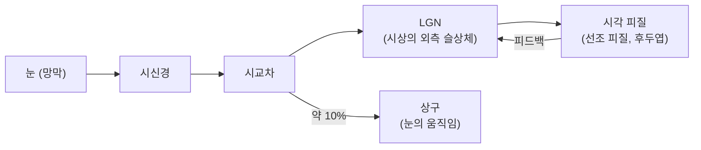
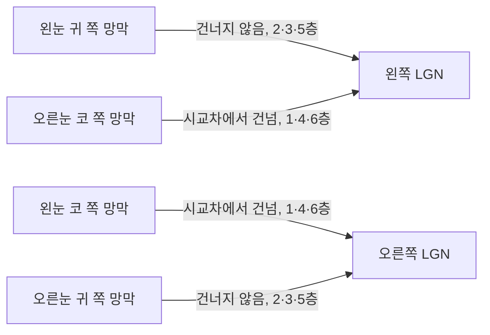



요약

눈에서 뇌까지 가는 길은 택배 물류망과 같다. 망막에서 모인 신호는 시신경을 타고 가다 시교차에서 반쯤 갈라지고, 시상의 외측 슬상체(LGN)라는 분류 센터를 거쳐 뒤통수의 시각 피질에 닿는다. LGN은 그냥 넘겨주는 창고가 아니다. 피질에서 거꾸로 오는 지시를 받아 무엇을 얼마나 보낼지 조절한다.

## 예시로 보기

찻잔을 볼 때 신호가 가는 길이다[^1].

망막에서 이웃한 자리는 LGN에서도 이웃한 자리로 이어진다[^2]. 찻잔의 세 점 A, B, C가 망막에 A, B, C 순서로 맺히면, LGN의 한 층에서도 A, B, C가 차례로 이웃해 반응한다. 망막의 공간 배치가 뇌 안에 지도처럼 옮겨지는 것이다(망막 위상 지도, retinotopic map)[^s1].

[지각](/Hongs_Blog/studies/human-interface-media/perception/)의 시간표에서 망막 20~40 ms, LGN 30~50 ms, V1 40~60 ms가 이 경로의 앞부분이다.

## 정의

정의

시각 자극의 흐름은 눈 → LGN → 선조 피질(시각 피질)이다[^1]. 요약하면 망막 → 시세포(추상체, 간상체) → 시신경 → LGN → 대뇌 후두엽이다[^3].

| 부위 | 하는 일 |
|---|---|
| 시교차 (optic chiasm) | 두 눈의 시신경이 만나 일부가 반대편으로 건너가는 곳 |
| LGN (외측 슬상체) | 망막에서 시각 피질로 가는 정보를 조절한다[^4] |
| 선조 피질 (시각 피질, V1) | 대뇌 후두엽의 첫 시각 영역 |
| 상구 (superior colliculus) | 눈의 움직임 등에 관여. 시신경의 약 10%가 여기로 간다[^1] |

**LGN은 중계기가 아니라 조절기다.** 슬라이드가 드는 근거는 셋이다[^4].

1. 흥분-억제로 연결된 구조다. 망막 입력 말고도 뇌간과 시각 피질에서 입력을 받고, 억제성 세포가 끼어 있다.
2. 시각 정보를 뇌로 보낼 뿐 아니라 뇌에서 오는 정보를 다시 받는다(피드백 루프). LGN이 뇌에서 받는 정보가 망막에서 받는 정보보다 많다.
3. 망막에서 받은 신호 10개 중 4개 정도만 피질로 보낸다. 시각 정보를 조절·요약·정리한다[^s2].

**두 눈의 신호 배치.** 양 눈에서 각각 절반씩의 시신경이 양쪽 LGN으로 들어간다[^2]. 시교차에서 코 쪽 망막의 섬유가 반대편으로 건너가므로, 한쪽 LGN은 두 눈 모두에서 반대쪽 시야의 신호를 받는다[^s3]. LGN은 6개 층으로 되어 있고, 1·4·6층은 반대편 눈의 정보를 받는다[^2]. 나머지 2·3·5층은 같은 쪽 눈의 정보를 받는다[^s3].

한쪽 LGN으로 들어오는 두 선은 서로 다른 눈에서 온다. 건너온 선은 1·4·6층으로, 같은 쪽에서 온 선은 2·3·5층으로 따로 들어간다[^s6].

## 신호·머신러닝·인공지능 관점

**신호.** LGN은 들어온 신호의 약 40%만 보내면서 피질의 지시에 따라 무엇을 보낼지 고른다. 압축과 선택을 함께 하는 전처리 단계다. 사람 지각의 한계를 이용해 데이터를 줄인다는 이 과목의 압축 주제와 같은 방향이다[^5][^s4].

**머신러닝.** 망막 → LGN → V1 → V2 → V4 → IT로 올라가며 모서리 → 특징 묶음 → 물체로 표현이 복잡해지는 계층([지각](/Hongs_Blog/studies/human-interface-media/perception/)의 시간표)은 합성곱 신경망의 층 구조와 닮았다. 이미지 분류로 학습한 깊은 합성곱 신경망의 층별 반응이 원숭이 시각 경로의 영역별 반응을 잘 예측한다는 연구도 있다. 다르게 볼 점도 있다. 보통의 합성곱 신경망은 아래에서 위로만 신호가 가지만(순방향), 실제 시각 경로는 LGN이 피질에서 받는 입력이 망막에서 받는 것보다 많을 만큼 위에서 아래로 가는 피드백이 크다[^s5].

**인공지능.** 망막 위상 지도처럼 "이웃한 입력은 이웃한 단위가 맡는다"는 원리가 합성곱 신경망의 국소 연결(각 단위가 입력의 작은 구역만 봄)로 이어졌다. Hubel과 Wiesel의 시각 피질 연구가 Fukushima의 네오코그니트론(1980)을 거쳐 합성곱 신경망에 이른 경로는 [중심-주변 길항](/Hongs_Blog/studies/human-interface-media/center-surround/)에 있다[^s5].

## 연결

- 선수: [눈의 구조](/Hongs_Blog/studies/human-interface-media/eye-anatomy/) (시신경), [뉴런과 신호 전달](/Hongs_Blog/studies/human-interface-media/neuron-signaling/)
- 경로 전체의 시간표: [지각](/Hongs_Blog/studies/human-interface-media/perception/)
- 두 눈의 신호를 쓰는 깊이 지각: [양안 시차](/Hongs_Blog/studies/human-interface-media/binocular-disparity/)

## 자주 하는 오해

"LGN의 한 뉴런에서 두 눈의 신호가 합쳐진다"

틀렸다. 슬라이드가 "두 눈의 정보를 결합"한다고 적어서 그렇게 읽기 쉽다. 한쪽 LGN이 두 눈 모두에서 신호를 받는 것은 맞다. 하지만 두 눈의 신호는 서로 다른 층(1·4·6층과 2·3·5층)에 따로 들어가, LGN 뉴런 하나는 대부분 한 눈의 신호만 받는다. 두 눈의 신호를 함께 받는 뉴런은 시각 피질(V1)에서 처음 나타난다[^s3]. 확인 방법: 슬라이드 p.18의 층 그림에서 빨강과 파랑 층이 번갈아 쌓여 있다. 층별로 눈이 나뉘어 있다는 뜻이다.

## 확인 문제

<b>C1</b> 망막에서 시각 피질까지 신호가 거치는 곳을 순서대로 쓰라. 시신경의 약 10%가 가는 곳과 그곳이 하는 일은?

**답:** 망막(시세포) → 시신경 → 시교차 → LGN(외측 슬상체) → 시각 피질(선조 피질, 대뇌 후두엽). 약 10%는 상구로 가며, 눈의 움직임 등에 관여한다.

<b>C2</b> LGN이 망막 신호를 그대로 넘기는 중계기가 아니라고 보는 근거를 두 가지 이상 쓰라.

**답:** (1) 뇌(시각 피질)에서 받는 입력이 망막에서 받는 입력보다 많다. 피드백 루프 구조다. (2) 망막에서 받은 신호 10개 중 4개 정도만 피질로 보낸다. (3) 흥분-억제로 연결되어 있어 신호를 조절·요약한다.

<b>C3</b> "한쪽 LGN은 두 눈의 신호를 모두 받는다"와 "LGN 뉴런 하나가 두 눈의 신호를 합친다" 중 맞는 것은? 두 눈의 신호가 한 뉴런에서 처음 만나는 곳은 어디인가?

**답:** 앞의 것이 맞다. 한쪽 LGN은 두 눈에서 반대쪽 시야의 신호를 받지만, 눈마다 다른 층(1·4·6층은 반대편 눈, 2·3·5층은 같은 쪽 눈)으로 들어가 뉴런 수준에서는 섞이지 않는다. 두 눈의 신호는 시각 피질(V1)에서 처음 한 뉴런에 모인다.

[^1]: 4-1학기/휴먼 인터페이스 미디어/1.수업자료/03.HIM_강의03_사람의시각.pdf, p.16 (시지각 흐름)
[^2]: 4-1학기/휴먼 인터페이스 미디어/1.수업자료/03.HIM_강의03_사람의시각.pdf, p.18 (망막 → LGN)
[^3]: 4-1학기/휴먼 인터페이스 미디어/1.수업자료/03.HIM_강의03_사람의시각.pdf, p.19 (요약)
[^4]: 4-1학기/휴먼 인터페이스 미디어/1.수업자료/03.HIM_강의03_사람의시각.pdf, p.17 (LGN). 그림 (a)의 "90% of fibers from eye"는 시신경의 약 90%가 LGN으로 간다는 뜻이고, p.16의 상구 10%와 합이 맞는다.
[^5]: 4-1학기/휴먼 인터페이스 미디어/1.수업자료/00. HIM_2026_Syllabus.pdf, Course Description
[^s1]: 에이전트 보충. "망막 위상 지도"라는 이름은 슬라이드 그림의 "Retinotopic map on LGN"을 옮긴 표준 용어다.
[^s2]: 에이전트 보충. 슬라이드는 "시신경 10개 중 4개 정도만 뇌로 전달"이라고 적는다. 표준 지각 교재(예: Goldstein, *Sensation and Perception*)는 이를 LGN이 망막에서 받는 신경 신호(충격) 10개당 피질로 보내는 것이 약 4개라는 뜻으로 설명한다. 고양이·원숭이 LGN의 동시 기록 연구도 LGN 세포가 망막에서 받은 스파이크의 평균 약 40%만 내보낸다고 보고한다(Casti 외, *Frontiers in Systems Neuroscience*, 2009). 섬유 수가 아니라 신호(스파이크) 수다.
[^s3]: 에이전트 보충. 시교차에서 코 쪽 망막 섬유가 건너간다는 것, 2·3·5층이 같은 쪽 눈을 받는다는 것, 두 눈을 함께 받는 뉴런이 V1에서 처음 나타난다는 것(Hubel & Wiesel)은 표준 신경과학 내용이다.
[^s4]: 에이전트 보충. LGN을 압축·선택 전처리로 보는 것은 해석이다.
[^s5]: 에이전트 보충. 깊은 합성곱 신경망과 원숭이 시각 경로의 반응 비교는 Yamins et al.(2014, *PNAS*) 등의 연구가 대표적이다. 피드백의 비중은 슬라이드 p.17의 내용이다.
[^s6]: 에이전트 보충. 다이어그램 1개는 원본에 없다. 이 문서의 "두 눈의 신호 배치" 문단(코 쪽 섬유가 시교차에서 건너감, LGN 층과 눈의 대응)과 강의 3 p.18의 LGN 층 그림을 근거로 그렸다.

