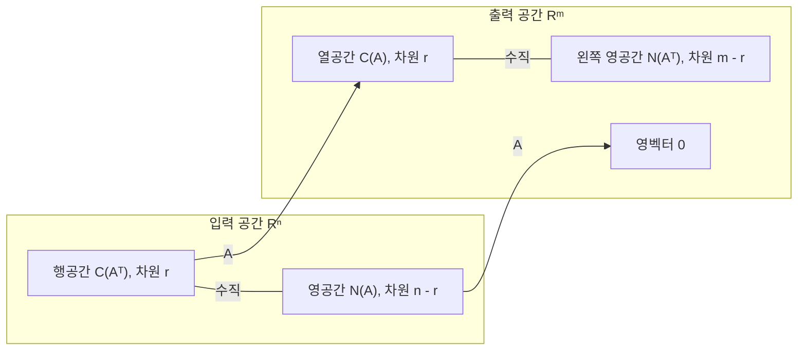



요약

행렬이 할 수 있는 일과 할 수 없는 일을 네 개의 부분공간이 나눠 담는다. 도달할 수 있는 출력(열공간), 0으로 뭉개지는 입력(영공간), 그리고 전치 쪽의 두 공간이다. 이 공간들의 크기는 모두 랭크(피벗의 개수) 하나로 정해지고, "살아남는 차원 + 뭉개지는 차원 = 입력 차원"이라는 보존 법칙을 따른다. 그래서 연립방정식에 해가 있는지, 몇 개인지를 소거 한 번으로 답한다. 다만 랭크는 소거하기 전의 0이 아닌 행 개수와 다르다.

## 예시로 보기

$$A = \begin{pmatrix}1 & 2 & 3\\ 2 & 4 & 6\end{pmatrix}$$을 본다. 둘째 행이 첫째 행의 두 배라, 소거하면 피벗이 하나뿐이다. 랭크 $$r = 1$$.

| 부분공간 | 사는 곳 | 이 행렬에서 | 차원 |
|---|---|---|---|
| 열공간 $$C(A)$$: 가능한 출력 $$A\mathbf{x}$$ | $$\mathbb{R}^2$$ | $$(1, 2)$$ 방향의 직선 | $$r = 1$$ |
| 영공간 $$N(A)$$: $$A\mathbf{x} = \mathbf{0}$$인 입력 | $$\mathbb{R}^3$$ | 평면 $$x + 2y + 3z = 0$$ | $$n - r = 2$$ |
| 행공간 $$C(A^\top)$$ | $$\mathbb{R}^3$$ | $$(1, 2, 3)$$ 방향의 직선 | $$r = 1$$ |
| 왼쪽 영공간 $$N(A^\top)$$ | $$\mathbb{R}^2$$ | $$(2, -1)$$ 방향의 직선 | $$m - r = 1$$ |

입력 공간 $$\mathbb{R}^3$$은 행공간(1차원)과 영공간(2차원)으로 나뉘고, 둘은 서로 수직이다($$(1, 2, 3)\cdot(-2, 1, 0) = 0$$). 출력 공간 $$\mathbb{R}^2$$도 열공간과 왼쪽 영공간으로 나뉘어 수직이다($$(1, 2)\cdot(2, -1) = 0$$). $$\mathbf{b} = (1, 0)$$은 열공간 밖이라 $$A\mathbf{x} = (1, 0)$$은 해가 없다.

왼쪽 입력 공간에서는 행공간(직선)이 영공간(평면)을 수직으로 꿰뚫는다. 오른쪽 출력 공간에서는 아무 입력이나 넣은 출력 $$A\mathbf{x}$$(점들)가 모두 열공간 직선 위에 떨어지고, 그 밖의 $$\mathbf{b} = (1, 0)$$에는 닿지 않는다[^s2].

## 정의

정의

$$A \in \mathbb{R}^{m \times n}$$($$\in$$은 "~에 속한다")에 대해
- **열공간** $$C(A) = \{A\mathbf{x} : \mathbf{x} \in \mathbb{R}^n\} \subseteq \mathbb{R}^m$$(열들의 생성).
- **영공간** $$N(A) = \{\mathbf{x} : A\mathbf{x} = \mathbf{0}\} \subseteq \mathbb{R}^n$$.
- **행공간** $$C(A^\top) \subseteq \mathbb{R}^n$$, **왼쪽 영공간** $$N(A^\top) \subseteq \mathbb{R}^m$$.
- **랭크** $$r$$: 소거로 얻는 피벗의 개수[^1].

선형대수의 기본정리 (앞부분)

1. $$\dim C(A) = \dim C(A^\top) = r$$. 즉 열 랭크 = 행 랭크.
2. $$\dim N(A) = n - r$$, $$\dim N(A^\top) = m - r$$. 특히 $$r + \dim N(A) = n$$(차원 정리).
3. $$N(A)$$의 모든 벡터는 $$C(A^\top)$$의 모든 벡터와 수직이다. $$N(A^\top)$$와 $$C(A)$$도 마찬가지다.
4. $$A\mathbf{x} = \mathbf{b}$$에 해가 있다 $$\iff$$ $$\mathbf{b} \in C(A)$$. 해가 있으면 모든 해는 $$\mathbf{x}_p + \mathbf{x}_n$$($$\mathbf{x}_p$$는 해 하나, $$\mathbf{x}_n \in N(A)$$) 꼴이다.

왼쪽 상자의 두 공간은 서로 수직이고, 차원을 더하면 n이다. 오른쪽 상자도 같아서 차원을 더하면 m이다. A는 영공간을 0 한 점으로 보내고, 무엇을 넣든 출력은 열공간 안에 떨어진다[^s3].

**가정과 역.** 정리는 모든 실수 행렬에 맞고 따로 가정이 없다. 4번은 양쪽 방향이 모두 맞는다. $$\mathbf{b} \in C(A)$$이면 $$\mathbf{b} = A\mathbf{x}$$인 $$\mathbf{x}$$가 있다는 것이 열공간의 정의 자체이기 때문이다. 차원 정리의 $$n$$은 **열**(입력)의 개수다. 행의 개수 $$m$$을 쓰면 틀린다.

## 증명

소거가 무엇을 보존하는지 따진다. 행 연산은 행공간과 영공간을 바꾸지 않고, 열들 사이의 일차 관계도 바꾸지 않는다.

증명 펼치기

행 사다리꼴을 $$R$$이라 하자($$R = EA$$, $$E$$는 기본 행렬들의 곱으로 가역).
1. *영공간:* $$A\mathbf{x} = \mathbf{0} \iff EA\mathbf{x} = \mathbf{0}$$($$E$$가 가역)이라 $$N(A) = N(R)$$. $$R$$에서 자유변수가 $$n - r$$개이고, 자유변수 하나만 1, 나머지를 0으로 둔 해(특수해) $$n - r$$개가 $$N(A)$$의 기저다. 자유변수 자리에서 각자 하나만 1이라 독립이고, 모든 해는 자유변수 값으로 이 특수해들을 섞은 것이라 생성한다.
2. *행공간:* $$R$$의 행은 $$A$$의 행의 선형결합이고 $$A = E^{-1}R$$이라 거꾸로도 그렇다. 그래서 $$C(A^\top) = C(R^\top)$$. $$R$$의 0이 아닌 행 $$r$$개는 피벗 위치가 계단처럼 달라 독립이다. $$\dim C(A^\top) = r$$.
3. *열공간:* $$A\mathbf{c} = \mathbf{0} \iff R\mathbf{c} = \mathbf{0}$$이라, $$A$$의 열들 사이의 일차 관계는 $$R$$의 열들 사이의 관계와 같다. $$R$$의 피벗 열 $$r$$개는 독립이고 나머지 열은 그것들의 결합이므로, $$A$$에서도 같은 위치의 열 $$r$$개가 $$C(A)$$의 기저다. $$\dim C(A) = r$$.
4. *왼쪽 영공간:* $$A^\top$$에 1을 적용하면 $$\dim N(A^\top) = m - \operatorname{rank}(A^\top) = m - r$$(3에서 두 랭크가 같다).
5. *수직:* $$A\mathbf{x} = \mathbf{0}$$은 "모든 행과 $$\mathbf{x}$$의 내적이 0"이라는 말이다. 그래서 행들의 모든 결합과도 내적이 0이다. $$A^\top$$에 같은 논리를 쓰면 둘째 쌍도 수직이다.
6. *해의 꼴:* $$A\mathbf{x} = \mathbf{b}$$와 $$A\mathbf{x}_p = \mathbf{b}$$를 빼면 $$A(\mathbf{x} - \mathbf{x}_p) = \mathbf{0}$$. ∎

### 스스로 설명해 보기

1. 3단계의 "열들 사이의 일차 관계가 같다"는 왜 행 연산 뒤에도 유지되는가?

일차 관계 $$\sum c_j\mathbf{a}_j = \mathbf{0}$$은 $$A\mathbf{c} = \mathbf{0}$$이다. 1단계에서 본 것처럼 $$A\mathbf{c} = \mathbf{0}$$과 $$R\mathbf{c} = \mathbf{0}$$은 해가 같다. 그래서 같은 계수 $$\mathbf{c}$$가 양쪽에서 관계를 이룬다. 행 연산은 열**공간** 자체는 바꿀 수 있지만 열들의 관계는 바꾸지 않는다.

2. 5단계에서 "행들의 모든 결합과도 내적이 0"인 이유는?

내적은 선형이다. $$\mathbf{x}$$가 각 행과 수직이면 $$(\sum c_i\mathbf{r}_i)\cdot\mathbf{x} = \sum c_i(\mathbf{r}_i\cdot\mathbf{x}) = 0$$이다.

이 정리의 핵심 아이디어는?

피벗 하나하나가 "살아남는 방향" 하나이고, 피벗이 없는 열이 "뭉개지는 방향" 하나다. 입력 차원 $$n$$이 둘로 정확히 나뉜다.

같은 생각을 쓰는 다른 상황은?

이산수학의 [트리](/Hongs_Blog/studies/discrete-math/trees/)에서 "간선 = 정점 − 1", 그래프의 사이클 공간의 차원 $$m - n + (\text{성분 수})$$도 같은 종류의 차원 세기다. 그래프의 근접 행렬에 차원 정리를 쓰면 나온다[^s1].

## 예제

$$A = \begin{pmatrix}1 & 2 & 0\\ 0 & 0 & 1\\ 1 & 2 & 1\end{pmatrix}$$의 네 부분공간.

1. *소거:* 3행 $$-$$ 1행 $$= (0, 0, 1)$$, 이어서 3행 $$-$$ 2행 $$= (0, 0, 0)$$. 피벗은 1열과 3열, $$r = 2$$.
2. *영공간:* 자유변수 $$y = 1$$로 두면 $$x = -2$$, $$z = 0$$. $$N(A) = \operatorname{span}\{(-2, 1, 0)\}$$, 차원 $$3 - 2 = 1$$.
3. *열공간:* 피벗 열인 $$A$$의 1열 $$(1, 0, 1)$$과 3열 $$(0, 1, 1)$$이 기저. 차원 2.
4. *왼쪽 영공간:* 3행 = 1행 + 2행이라 $$(1, 1, -1)^\top A = \mathbf{0}$$. $$N(A^\top) = \operatorname{span}\{(1, 1, -1)\}$$, 차원 $$3 - 2 = 1$$. 실제로 $$(1, 1, -1)$$은 두 열 $$(1, 0, 1)$$, $$(0, 1, 1)$$과 수직이다.

검증: 예시 표의 네 공간과 수직 관계, 예제의 기저, 무작위 유리수 행렬 500개에서 행 랭크 = 열 랭크, 특수해 $$n - r$$개가 독립이고 $$A\mathbf{x} = \mathbf{0}$$을 만족, 영공간 ⊥ 행공간, "$$\mathbf{b} \in C(A)$$ ⇔ 해 있음 ⇔ $$\mathbf{b} \perp N(A^\top)$$", 해의 꼴, 조건등색 모형(무작위 $$3 \times 31$$ 행렬의 영공간 28차원, 서로 다른 스펙트럼이 같은 반응) — [11_four-subspaces_verify.py](/Hongs_Blog/studies/linear-algebra/code/11_four-subspaces_verify/)

## 활용

- **해의 존재와 개수 한눈에.** $$r = m$$이면 모든 $$\mathbf{b}$$에 해가 있고, $$r = n$$이면 해가 있을 때 하나뿐이다. $$r = m = n$$이면 [가역](/Hongs_Blog/studies/linear-algebra/inverse-matrix/)이다.
- **조건등색.** [조건등색](/Hongs_Blog/studies/human-interface-media/metamerism/)에서 스펙트럼 $$\mathbf{i} \in \mathbb{R}^{31}$$을 추상체 반응 $$C\mathbf{i} \in \mathbb{R}^3$$으로 보내는 $$3 \times 31$$ 행렬 $$C$$는 랭크가 3이라 영공간이 $$31 - 3 = 28$$차원이다. 서로 다른 두 빛의 차이 $$\mathbf{i}_1 - \mathbf{i}_2$$가 영공간에 있으면 눈에는 같은 색이다. 그런 쌍이 무수히 많다.
- **데이터 압축과 추천.** 사용자 × 상품 평점 행렬의 랭크가 낮다고 보고 적은 수의 "취향 방향"으로 설명하는 것이 저랭크 근사다([특잇값 분해](/Hongs_Blog/studies/linear-algebra/svd/)).
- 알고리즘에서: 선이 모두 이어져 있고 선끼리 만나는 곳마다 점이 있는 평면 그림에서, 닫힌 방의 수는 $$m - n + 1$$(선 $$m$$개, 점 $$n$$개)이다. 근접 행렬(선 × 점)에 차원 정리를 써서 얻는 사이클 공간의 차원과 같은 값이다. 코딩 테스트 문제 [방의 개수](/Hongs_Blog/studies/algorithms/pg49190/)가 이 셈을 쓴다.

## 연결

- 선수: [부분공간, 기저와 차원](/Hongs_Blog/studies/linear-algebra/basis-dimension/), [역행렬](/Hongs_Blog/studies/linear-algebra/inverse-matrix/)
- 이어지는 개념: [직교성과 직교 사영](/Hongs_Blog/studies/linear-algebra/orthogonal-projection/)(수직 관계를 완성한다), 최소제곱(해가 없을 때 가장 가까운 해)
- 다른 과목: [조건등색](/Hongs_Blog/studies/human-interface-media/metamerism/)의 $$C(\mathbf{i}_1 - \mathbf{i}_2) = \mathbf{0}$$

## 자주 하는 오해

"$$A\mathbf{x} = \mathbf{b}$$의 해가 무한히 많은 행렬이면 어떤 $$\mathbf{b}$$에도 해가 있다"

틀렸다. "해가 많다"와 "해가 늘 있다"는 서로 다른 공간이 정한다. 해가 많은 것은 영공간이 크기 때문이고, 해가 있는지는 $$\mathbf{b}$$가 열공간에 있는지로 정해진다. $$A = \begin{pmatrix}1 & 2\\ 2 & 4\end{pmatrix}$$이면 $$A\mathbf{x} = (1, 2)$$는 해가 무한히 많지만 $$A\mathbf{x} = (1, 0)$$은 해가 없다. $$(1, 0)$$이 열공간(직선 $$y = 2x$$) 밖이기 때문이다.

## 확인 문제

**C1** $$m \times n$$ 행렬의 네 부분공간을 이름, 사는 곳, 차원과 함께 쓰라.

**답:** 열공간 $$C(A) \subseteq \mathbb{R}^m$$, 차원 $$r$$. 영공간 $$N(A) \subseteq \mathbb{R}^n$$, 차원 $$n - r$$. 행공간 $$C(A^\top) \subseteq \mathbb{R}^n$$, 차원 $$r$$. 왼쪽 영공간 $$N(A^\top) \subseteq \mathbb{R}^m$$, 차원 $$m - r$$.

**C2** $$A = \begin{pmatrix}1 & 2 & 0\\ 0 & 0 & 1\\ 1 & 2 & 1\end{pmatrix}$$의 랭크와 영공간의 기저를 구하라.

**답:** 소거하면 피벗이 1열, 3열에 있어 $$r = 2$$. 자유변수 $$y = 1$$에서 $$(-2, 1, 0)$$이 영공간의 기저다(차원 1).

**C3** 영공간의 벡터가 행공간의 모든 벡터와 수직인 이유는?

**답:** $$A\mathbf{x} = \mathbf{0}$$의 각 성분은 "$$A$$의 한 행 · $$\mathbf{x}$$ = 0"이다. 모든 행과 수직이면, 내적의 선형성으로 행들의 모든 결합(행공간)과도 수직이다.

**C4** "랭크는 0이 아닌 행의 개수"가 틀리는 예를 들고 올바른 규칙을 쓰라.

**답:** $$\begin{pmatrix}1 & 2\\ 2 & 4\end{pmatrix}$$는 0이 아닌 행이 둘이지만 랭크 1이다. 랭크는 소거한 **뒤**의 피벗 개수(= 0이 아닌 행 개수)다.

[^1]: Strang, *Introduction to Linear Algebra* 5판, 3.2절 "The Nullspace of A"(특수해), 3.3절 "The Complete Solution to Ax = b", 3.5절 "Dimensions of the Four Subspaces", 4.1절 "Orthogonality of the Four Subspaces".
[^s1]: 보충 그래프의 근접 행렬(간선 × 정점)에 차원 정리를 쓰면 연결 그래프에서 랭크 $$n - 1$$, 사이클 공간의 차원 $$m - n + 1$$이 나온다. Strang 5판 10.1절 "Graphs and Networks"에 같은 내용이 있다.
[^s2]: 보충 그림은 원본에 없다. [11_four-subspaces_plot.py](/Hongs_Blog/studies/linear-algebra/code/11_four-subspaces_plot/)로 그렸고, 영공간 평면이 $$A\mathbf{x} = \mathbf{0}$$을 만족하는 것, 행공간과의 수직, 무작위 입력 60개의 출력이 모두 열공간 위에 있는 것을 같은 코드로 확인했다.
[^s3]: 보충 다이어그램 1개는 원본에 없다. 이 문서 `정의`의 네 부분공간 정의와 선형대수의 기본정리 1~3을 옮겼다(Strang 5판 3.5절, 4.1절).

