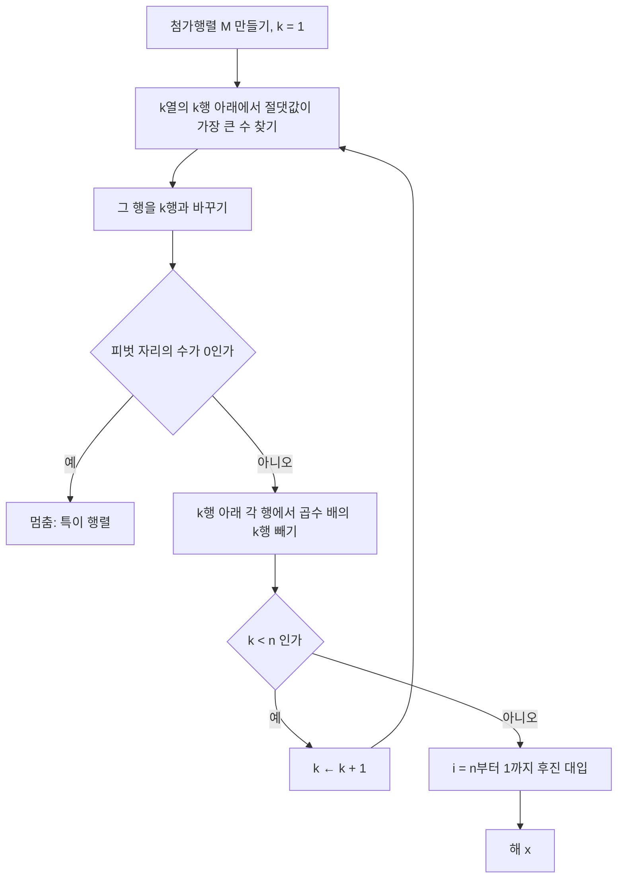


<div class="callout callout-summary" markdown="1">
<div class="callout-title callout-title--default" markdown="span">요약</div>

중학교 때 배운 가감법 그대로다. 한 식의 몇 배를 다른 식에서 빼서 $$x$$를 없애고, 그다음 $$y$$를 없앤다. 그러면 맨 아래 식에는 미지수가 하나만 남아 바로 풀리고, 위로 올라가며 하나씩 대입하면 답이 다 나온다. 식이 수천 개여도 똑같이 기계적으로 할 수 있어서 컴퓨터가 연립방정식을 푸는 기본 방법이 된다. 단, 컴퓨터로 할 때 0에 가까운 수로 나누면 오차가 크게 불어나므로, 나누는 수로는 되도록 큰 수를 골라야 한다.

</div>


## 예시로 보기

식이 두세 개면 아무렇게나 대입해도 풀린다. 식이 100개면 무엇을 어디에 대입했는지 금방 잃어버린다. 그래서 "맨 위 식으로 아래 식들의 $$x$$를 다 지우고, 그다음 둘째 식으로 그 아래의 $$y$$를 다 지운다"처럼 순서를 정해 둔다. 순서가 정해져 있으면 사람도 컴퓨터도 헷갈리지 않는다.

$$x + 2y + z = 2$$, $$3x + 8y + z = 12$$, $$4y + z = 2$$를 푼다. 매번 $$x, y, z$$를 적기 귀찮으니 계수와 우변의 숫자만 표로 적는다. 이 표를 첨가행렬이라 부른다.

| 단계 | 한 일 | 첨가행렬 $$[A \mid \mathbf{b}]$$ |
|---|---|---|
| 0 | 시작 | $$\left[\begin{smallmatrix}1 & 2 & 1 & \mid & 2\\ 3 & 8 & 1 & \mid & 12\\ 0 & 4 & 1 & \mid & 2\end{smallmatrix}\right]$$ |
| 1 | 2행 $$-$$ 3 × 1행: 2행에서 1행의 3배를 뺀다 ($$x$$ 없애기) | $$\left[\begin{smallmatrix}1 & 2 & 1 & \mid & 2\\ 0 & 2 & -2 & \mid & 6\\ 0 & 4 & 1 & \mid & 2\end{smallmatrix}\right]$$ |
| 2 | 3행 $$-$$ 2 × 2행: 3행에서 2행의 2배를 뺀다 ($$y$$ 없애기) | $$\left[\begin{smallmatrix}1 & 2 & 1 & \mid & 2\\ 0 & 2 & -2 & \mid & 6\\ 0 & 0 & 5 & \mid & -10\end{smallmatrix}\right]$$ |
| 3 | 아래에서부터 푼다 | $$5z = -10 \Rightarrow z = -2$$, $$2y - 2z = 6 \Rightarrow y = 1$$, $$x + 2y + z = 2 \Rightarrow x = 2$$ ($$\Rightarrow$$는 "그러므로") |

2단계가 끝난 표는 왼쪽 아래가 모두 0인 계단 모양이다. 계단 끝에 있는 1, 2, 5를 **피벗**이라 부른다. 각 단계에서 아래 행을 지울 때 나누는 수가 바로 피벗이다. 뺄 때 곱한 3과 2는 **곱수**라 부른다. 3단계처럼 아래에서 위로 거꾸로 대입하는 것을 후진 대입이라 한다[^1].

## 정의

**입력:** 계수를 늘어놓은 $$n \times n$$ 행렬 $$A$$와 우변 $$\mathbf{b} \in \mathbb{R}^n$$($$\mathbf{b}$$는 실수 $$n$$개짜리 목록이다). **출력:** $$A\mathbf{x} = \mathbf{b}$$의 해 $$\mathbf{x}$$(해가 하나일 때). 위 예시에서는 $$n = 3$$이고, $$\mathbf{b} = (2, 12, 2)$$다.

```
GAUSS(A, b)                      # 첨가행렬 M = [A | b], 인덱스는 1부터
  for k = 1 to n                  # 위에서부터 한 열씩 없애기
      p ← k..n 중 |M[i][k]|가 가장 큰 행 i     # 나눌 수로 큰 수를 고른다
      M의 k행과 p행을 바꾼다
      if M[k][k] = 0: 멈춘다 (특이 행렬: 해가 없거나 무한히 많다)
      for i = k+1 to n
          ℓ ← M[i][k] / M[k][k]                # 곱수
          M[i] ← M[i] − ℓ·M[k]                 # 피벗 아래를 0으로
  for i = n downto 1              # 아래에서부터 대입하기
      x[i] ← (M[i][n+1] − Σ_{j>i} M[i][j]·x[j]) / M[i][i]
  return x
```



위에서부터 한 열씩 피벗을 고르고 그 아래를 지우는 고리를 n번 돈다. 고리를 다 돈 뒤에야 아래에서 위로 대입한다[^s4].

소거법은 표를 고칠 때 아래 세 가지만 한다. 이 셋을 **기본 행 연산**이라 부른다.

1. 한 행에 다른 행의 몇 배를 더한다(빼기는 음수 배를 더하는 것).
2. 두 행의 자리를 바꾼다.
3. 한 행 전체에 0이 아닌 수를 곱한다.

**반복마다 계속 맞는 두 가지(루프 불변식).** $$k$$번째 반복이 끝날 때마다 다음이 맞다.

- (I1) 지금 표 $$M$$이 나타내는 연립방정식은 원래 연립방정식과 답이 똑같다.
- (I2) 1열부터 $$k$$열까지, 피벗 아래 칸은 모두 0이다.

이 두 가지를 굳이 적는 이유가 있다. (I1)이 계속 맞으니 표를 아무리 고쳐도 답이 달라지지 않는다. (I2)가 계속 맞으니 마지막에는 계단 모양이 남는다. 둘을 합치면 "계단 모양에서 구한 답 = 원래 문제의 답"이 된다.

**답이 몇 개인지 판정하기.** 식과 미지수 개수가 다르거나, 중간에 피벗 자리가 0이 되어도 소거는 끝까지 할 수 있다. 다 하고 나면 계단 모양(행 사다리꼴)이 남는데, 그 모양을 보고 판정한다.

| 계단 모양에서 보이는 것 | 답 |
|---|---|
| 왼쪽이 전부 0인데 오른쪽은 0이 아닌 줄 $$[0 \ \cdots \ 0 \mid c]$$ ($$c \ne 0$$)이 있다 | 없다. 그 줄은 $$0 = c$$라는 말이 안 되는 식이다 |
| 그런 줄이 없고, 모든 열에 피벗이 있다 | 하나다 |
| 그런 줄이 없고, 피벗이 없는 열이 있다 | 무한히 많다. 피벗이 없는 열의 미지수(자유변수)는 아무 값이나 정해도 된다 |

## 증명

<details class="callout callout-proof" markdown="1">
<summary class="callout-title" markdown="span">증명 펼치기</summary>

**기본 행 연산을 해도 답은 바뀌지 않는다.**
1. *원래 답은 새 식에서도 답이다:* $$\mathbf{x}$$가 $$i$$행과 $$k$$행의 식을 둘 다 만족하면 "$$i$$행 $$- \ell \times k$$행"의 식도 만족한다. 두 식의 양변에 똑같은 계산을 했기 때문이다. 행 바꾸기와 0 아닌 수 곱하기도 마찬가지다.
2. *되돌릴 수 있다:* "$$i$$행 $$- \ell \times k$$행"은 "$$i$$행 $$+ \ell \times k$$행"으로 되돌린다. 행 바꾸기는 한 번 더 바꾸면 되고, $$c$$배는 $$\frac1c$$배로 되돌린다. 그래서 1을 거꾸로 쓰면 새 식의 답도 원래 식의 답이다.

**두 가지가 계속 맞는 이유.** (I1)은 매 반복이 기본 행 연산만 쓰므로 위 결과로 계속 맞다. (I2)는 $$k$$번째 반복이 $$k$$열의 피벗 아래를 0으로 만들기 때문에 맞다. 앞 열들은 이미 0인 칸끼리 빼고 더하므로 0이 그대로다.

**끝나면 답이 맞다.** $$k = n$$까지 돌면 왼쪽 아래가 모두 0인 위삼각꼴 $$U\mathbf{x} = \mathbf{c}$$가 남는다. 피벗이 모두 0이 아니면 마지막 식에서 $$x_n$$이 하나로 정해진다. 위로 올라가며 $$x_{n-1}, \dots, x_1$$도 하나씩 정해진다. (I1) 덕분에 이것이 원래 식의 유일한 답이다.

**계산량.** $$k$$번째 반복에서 $$(n - k)$$개 행마다 $$(n - k + 1)$$개 칸을 고치므로 곱셈이 약 $$(n - k)^2$$번이다. 다 더하면 $$\sum_{k=1}^{n}(n - k)^2 \approx \frac{n^3}{3}$$번의 곱셈과 같은 수의 뺄셈, 합쳐서 약 $$\frac{2}{3}n^3$$번이다. 후진 대입은 $$O(n^2)$$이다. ∎

크기를 느껴 보면, $$n = 10$$이면 약 670번, $$n = 100$$이면 약 67만 번이다. $$n$$이 10배가 되면 계산은 1,000배가 된다.

</details>


### 스스로 설명해 보기

<details class="callout callout-question" markdown="1">
<summary class="callout-title" markdown="span">1. 증명 2단계의 "되돌릴 수 있다"가 없으면 무엇이 문제인가?</summary>

1단계만으로는 "원래 답은 새 식에서도 답이다"까지만 안다. 새 식에 답이 더 생길 수도 있다. 예를 들어 행에 0을 곱하면 식이 $$0 = 0$$이 되어 무엇이든 답이 된다. 그래서 0을 곱하는 것은 기본 행 연산에서 빠져 있다.

</details>


<details class="callout callout-question" markdown="1">
<summary class="callout-title" markdown="span">2. 계산량이 $$n^3$$에 비례하는 이유를 한 문장으로 설명하라.</summary>

피벗이 $$n$$개이고, 피벗마다 그 아래 약 $$n$$개 행의 약 $$n$$개 칸을 고치므로 $$n \times n \times n$$이다. 정확히 세면 $$\sum (n - k)^2 \approx \frac{n^3}{3}$$이다([거듭제곱의 합](/Hongs_Blog/studies/discrete-math/sums-asymptotics/)).

</details>


<details class="callout callout-question" markdown="1">
<summary class="callout-title" markdown="span">이 알고리즘의 핵심 아이디어는?</summary>

답을 바꾸지 않는 계산만 써서, 풀기 쉬운 모양(위삼각꼴)으로 바꾼다. 어려운 문제를 답이 같은 쉬운 문제로 바꿔 푸는 전략이다.

</details>


<details class="callout callout-question" markdown="1">
<summary class="callout-title" markdown="span">같은 아이디어를 쓰는 다른 상황은?</summary>

[유클리드 호제법](/Hongs_Blog/studies/discrete-math/gcd-euclid/)은 최대공약수를 바꾸지 않는 계산(큰 수에서 작은 수 빼기)으로 수를 줄인다. 두 알고리즘 모두 한 일을 기록해 두면 덤으로 얻는 것이 있다(베주 계수, LU 분해).

</details>


## 예제

**왜 큰 수를 골라 나누나.** 손으로 풀 때는 분수를 그대로 쓰니 아무 수로 나눠도 된다. 컴퓨터는 실수를 정해진 자릿수로 잘라 저장하니 사정이 다르다. $$10^{-20}x + y = 1$$, $$x + y = 2$$를 푼다. 참값은 $$x \approx 1$$, $$y \approx 1$$이다.

1. *그냥 위에서부터 하면:* 첫 식의 $$10^{-20}$$으로 나눠야 해서 곱수가 $$\ell = 10^{20}$$이다. 둘째 식은 $$(1 - 10^{20})y = 2 - 10^{20}$$이 된다. 컴퓨터의 실수(배정밀도)는 유효숫자가 16자리쯤이라[^s2] 둘 다 $$-10^{20}$$으로 반올림되고, $$y = 1$$이 나온다. 첫째 식에서 $$x = \frac{1 - y}{10^{-20}} = 0$$이다. 틀렸다.
2. *큰 수를 골라 나누면:* $$x$$ 열에서 더 큰 1이 있는 둘째 식을 위로 올린다. 곱수가 $$10^{-20}$$이라 오차가 불어나지 않는다. $$y = 1$$, $$x = 2 - y = 1$$로 맞게 나온다.
3. *원인:* 작은 수로 나누면 곱수가 엄청 커진다. 그러면 원래 계수가 반올림에 묻혀 지워진다. 매번 그 열에서 절댓값이 가장 큰 수를 피벗으로 골라 곱수를 1 이하로 묶는 방법을 부분 피벗팅이라 한다[^1].


같은 문제에서 첫 계수 $$\varepsilon$$을 $$10^{-1}$$부터 $$10^{-20}$$까지 줄여 가며 $$x$$의 오차를 쟀다. 그냥 위에서부터 하면 $$\varepsilon$$이 작을수록 오차가 커지고, $$10^{-16}$$부터는 오차가 1 정도라 답이 통째로 틀린다. 큰 수를 골라 나누면 오차가 늘 반올림 한 번 크기 이하다[^s3].

<div class="callout callout-check" markdown="1">
<div class="callout-title" markdown="span">검증: 예시의 각 단계 행렬과 해 $$(2, 1, -2)$$, 무작위 정수 행렬 500개에서 유리수 소거의 해를 대입해 확인, 부동소수점 해와 비교, 해의 종류 판정(무작위 특이·비특이 행렬), 행 연산이 해 집합을 보존함(작은 정수 범위 전수), 피벗팅 예제, 연산 수가 $$\frac23 n^3$$에 가까움 — [05_gaussian-elimination_impl.py](/Hongs_Blog/studies/linear-algebra/code/05_gaussian-elimination_impl/), [05_gaussian-elimination_verify.py](/Hongs_Blog/studies/linear-algebra/code/05_gaussian-elimination_verify/)</div>

</div>


## 활용

- **연립방정식 풀이 프로그램.** NumPy의 `numpy.linalg.solve`는 LAPACK의 부분 피벗팅 LU 분해를 쓴다. LU 분해는 가우스 소거에서 한 일을 기록해 둔 것이다[^s1]. 같은 $$A$$로 우변 $$\mathbf{b}$$만 바꿔 여러 번 풀 때는 [LU 분해](/Hongs_Blog/studies/linear-algebra/lu-decomposition/)를 한 번 해 두고 다시 쓴다.
- **얼마나 큰 문제까지 되나.** $$n = 1000$$이면 약 $$6.7 \times 10^8$$번 계산이라 요즘 CPU로 1초가 안 걸린다. $$n = 10^5$$이면 $$10^{15}$$번이 넘는다. 이때는 0이 대부분인 행렬에 맞춘 방법이나, 답에 조금씩 다가가는 반복법을 쓴다.
- **정확한 계산.** 정수나 분수로 된 행렬은 분수 그대로 계산해 오차 없이 풀 수 있다. 암호와 오류 정정 부호에서는 나머지 계산($$\bmod p$$)으로 같은 소거를 한다.
- 연습: [가우스 소거 예제 사다리](/Hongs_Blog/studies/linear-algebra/elimination-ladder/)
- 알고리즘에서: [플로이드–워셜](/Hongs_Blog/studies/algorithms/floyd-warshall/)도 생김새가 같다. 가장 바깥 반복에서 피벗 $$k$$를 하나 고르고, $$k$$행과 $$k$$열의 값으로 나머지 칸을 고치는 세 겹 반복이다. 다른 점은 칸을 고치는 식뿐이다. 빼기 대신 min을, 곱하기 대신 +를 써서 거리표 $$D$$를 $$D[i][j] \leftarrow \min(D[i][j],\ D[i][k] + D[k][j])$$로 고치면 모든 두 점 사이의 최단 거리가 나온다.

## 연결

- 선수: [행렬과 행렬-벡터 곱](/Hongs_Blog/studies/linear-algebra/matrix-vector/)
- 이어지는 개념: [역행렬](/Hongs_Blog/studies/linear-algebra/inverse-matrix/)(가우스–조르당), [LU 분해](/Hongs_Blog/studies/linear-algebra/lu-decomposition/), [선형독립](/Hongs_Blog/studies/linear-algebra/linear-independence/)과 [랭크](/Hongs_Blog/studies/linear-algebra/four-subspaces/)

## 자주 하는 오해

<div class="callout callout-misconception" markdown="1">
<div class="callout-title" markdown="span">"식의 개수와 미지수의 개수가 같으면 해가 하나다"</div>

틀렸다. "미지수 두 개엔 식 두 개"라는 요령 때문에 그렇게 믿기 쉽다. 하지만 두 식이 사실상 같은 말이면 정보가 모자란다. $$x + y = 1$$, $$2x + 2y = 3$$은 소거하면 $$0 = 1$$이라 해가 없다. $$x + y = 1$$, $$2x + 2y = 2$$는 $$0 = 0$$이라 해가 무한히 많다. 해가 하나인지는 식의 개수가 아니라, 소거한 뒤 피벗이 미지수 개수만큼 나오는지로 판정한다.

</div>


## 확인 문제

<details class="callout callout-question" markdown="1">
<summary class="callout-title" markdown="span">**C1** $$x + 2y = 5$$, $$3x + 4y = 6$$을 소거법으로 풀라. 곱수와 피벗을 밝혀라.</summary>

**답:** 곱수 3으로 2행에서 1행의 3배를 빼면 $$-2y = -9$$. 피벗은 1과 $$-2$$. $$y = 4.5$$, $$x = 5 - 9 = -4$$. 검산 $$3(-4) + 4(4.5) = 6$$.

</details>


<details class="callout callout-question" markdown="1">
<summary class="callout-title" markdown="span">**C2** 아래 코드가 하는 일을 한 문장으로 설명하라.</summary>

```python
for i in range(n - 1, -1, -1):
    s = sum(M[i][j] * x[j] for j in range(i + 1, n))
    x[i] = (M[i][n] - s) / M[i][i]
```
**답:** 계단 모양이 된 표에서 마지막 미지수부터 거꾸로 올라가며, 이미 구한 값을 대입하고 피벗으로 나눠 미지수를 하나씩 구한다(후진 대입).

</details>


<details class="callout callout-question" markdown="1">
<summary class="callout-title" markdown="span">**C3** "한 행에서 다른 행의 몇 배를 빼는" 계산이 연립방정식의 답을 바꾸지 않는 이유는?</summary>

**답:** 원래 답은 두 식을 모두 만족하므로, 두 식을 빼서 만든 식도 만족한다. 거꾸로 같은 몇 배를 다시 더하면 원래 식이 돌아오므로, 새 식의 답도 원래 식을 만족한다. 그래서 두 답의 모음이 똑같다.

</details>


<details class="callout callout-question" markdown="1">
<summary class="callout-title" markdown="span">**C4** 소거 뒤 계단 모양이 다음과 같을 때 해의 개수를 판정하라. (가) $$\left[\begin{smallmatrix}1 & 2 & \mid & 3\\ 0 & 0 & \mid & 1\end{smallmatrix}\right]$$ (나) $$\left[\begin{smallmatrix}1 & 2 & \mid & 3\\ 0 & 0 & \mid & 0\end{smallmatrix}\right]$$ (다) $$\left[\begin{smallmatrix}1 & 2 & \mid & 3\\ 0 & 5 & \mid & 1\end{smallmatrix}\right]$$</summary>

**답:** (가) 없음($$0 = 1$$). (나) 무한히 많음(둘째 열에 피벗이 없어 $$y$$가 자유변수). (다) 하나(두 열 모두 피벗).

</details>


[^1]: Strang, *Introduction to Linear Algebra* 5판, 2.2절 "The Idea of Elimination", 2.3절 "Elimination Using Matrices", 3.3절 "The Complete Solution to Ax = b"(해의 종류), 11.1절 "Gaussian Elimination in Practice"(피벗팅과 연산 수).
[^s1]: <span class="fn-tag" title="수업 자료에 없고 따로 보탠 내용">보충</span> NumPy 문서는 `numpy.linalg.solve`가 LAPACK의 `gesv`(부분 피벗팅 LU)를 부른다고 밝힌다. 연산 수와 피벗팅 예는 05_gaussian-elimination_verify.py에서 확인했다.
[^s2]: <span class="fn-tag" title="수업 자료에 없고 따로 보탠 내용">보충</span> IEEE 754 배정밀도의 유효숫자는 10진수로 약 15~17자리다(가수 53비트, $$2^{-53} \approx 1.1 \times 10^{-16}$$).
[^s3]: <span class="fn-tag" title="수업 자료에 없고 따로 보탠 내용">보충</span> 그림은 원본에 없다. [05_gaussian-elimination_plot.py](/Hongs_Blog/studies/linear-algebra/code/05_gaussian-elimination_plot/)로 그렸고, $$\varepsilon = 10^{-20}$$에서 그냥 풀면 $$x = 0$$, 행을 바꾸면 $$x = 1$$이 나오는 것, $$\varepsilon \le 10^{-16}$$에서 오차가 1 정도인 것, 행을 바꾼 풀이의 오차가 $$2.2 \times 10^{-16}$$ 이하인 것을 같은 코드로 확인했다.
[^s4]: <span class="fn-tag" title="수업 자료에 없고 따로 보탠 내용">보충</span> 다이어그램 1개는 원본에 없다. 이 문서 `정의`의 GAUSS 의사코드를 그대로 옮겼다(Strang 5판 2.2~2.3절, 11.1절).

