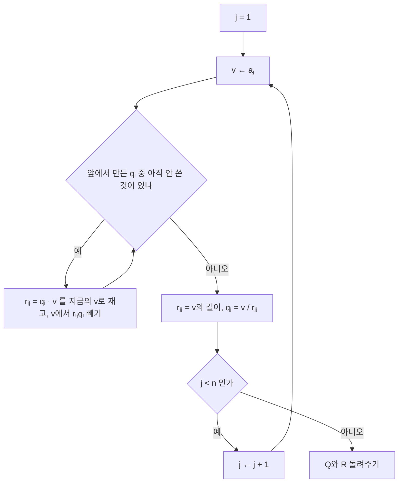


<div class="callout callout-summary" markdown="1">
<div class="callout-title callout-title--default" markdown="span">요약</div>

기울어진 기저를 서로 수직이고 길이가 1인 기저(정규직교 기저)로 바로 세우는 절차다. 벡터를 하나씩 보면서, 이미 세운 방향들로의 그림자(사영)를 빼고 남은 부분을 길이 1로 맞춘다. 정규직교 기저에서는 좌표가 내적 한 번으로 나오고 역행렬이 필요 없어서, 최소제곱을 정규방정식보다 정확하게 풀 수 있다. 과정을 기록하면 원래 행렬이 정규직교 행렬과 삼각행렬의 곱으로 나뉜다(QR 분해). 다만 교과서식(고전) 순서로 계산하면 반올림 오차 때문에 수직성이 무너질 수 있어, 실제로는 수정된 순서나 다른 방법을 쓴다.

</div>


## 예시로 보기

$$\mathbf{a}_1 = (1, 1, 0)$$, $$\mathbf{a}_2 = (1, 0, 1)$$은 서로 수직이 아니다($$\mathbf{a}_1 \cdot \mathbf{a}_2 = 1$$).

1. 첫째는 길이만 맞춘다. $$\mathbf{q}_1 = \frac{1}{\sqrt2}(1, 1, 0)$$.
2. 둘째에서 $$\mathbf{q}_1$$ 방향의 그림자를 뺀다. $$\mathbf{a}_2 - (\mathbf{q}_1\cdot\mathbf{a}_2)\mathbf{q}_1 = (1, 0, 1) - \frac{1}{\sqrt2}\cdot\frac{1}{\sqrt2}(1, 1, 0) = (\frac12, -\frac12, 1)$$.
3. 길이 $$\sqrt{\frac32}$$로 나눈다. $$\mathbf{q}_2 = \frac{1}{\sqrt6}(1, -1, 2)$$.

$$\mathbf{q}_1 \cdot \mathbf{q}_2 = \frac{1 - 1 + 0}{\sqrt{12}} = 0$$이고 둘 다 길이 1이다. 두 벡터가 만드는 평면은 그대로다. $$\mathbf{a}$$들이 아래 알고리즘의 입력 열, $$\mathbf{q}$$들이 $$Q$$의 열이다.


회색이 처음의 $$\mathbf{a}_1$$, $$\mathbf{a}_2$$이고, 연한 면이 둘이 만드는 평면이다. $$\mathbf{a}_2$$에서 $$\mathbf{q}_1$$ 방향의 그림자를 빼고 남은 $$\mathbf{v}$$는 $$\mathbf{q}_1$$과 수직이고, 그 길이를 1로 맞춘 것이 $$\mathbf{q}_2$$다[^s2].

## 정의

**입력:** 열 $$\mathbf{a}_1, \dots, \mathbf{a}_n$$이 독립인 $$m \times n$$ 행렬 $$A$$. **출력:** 열이 정규직교인 $$Q$$($$m \times n$$)와 대각이 양수인 위삼각 $$R$$($$n \times n$$)로 $$A = QR$$.

```
       A (m x n)            Q (m x n)          R (n x n)
     [ *  *  * ]          [ *  *  * ]
     [ *  *  * ]          [ *  *  * ]        [ *  *  * ]
     [ *  *  * ]    =     [ *  *  * ]   x    [ 0  *  * ]
     [ *  *  * ]          [ *  *  * ]        [ 0  0  * ]
     [ *  *  * ]          [ *  *  * ]
```

m = 5, n = 3인 모양이다. Q는 A와 크기가 같은 길쭉한 행렬이고, R은 작은 정사각 행렬이며 대각 아래 칸이 늘 0이다[^s3].

```
GRAM-SCHMIDT(A)                  # 수정(modified) 순서
  for j = 1 to n
      v ← a_j
      for i = 1 to j−1
          r[i][j] ← q_i · v        # 지금까지 줄인 v로 계산
          v ← v − r[i][j] q_i       # q_i 방향 그림자 빼기
      r[j][j] ← ‖v‖
      q_j ← v / r[j][j]
  return Q = [q_1 … q_n], R = (r[i][j])
```



안쪽 고리는 v에서 앞 방향들의 그림자를 하나씩 뺀다. 그림자를 모두 뺀 뒤에야 길이를 재고 1로 맞춘다[^s3].

**정규직교**란 $$\mathbf{q}_i\cdot\mathbf{q}_j = 0$$($$i \ne j$$), $$\Vert \mathbf{q}_i\Vert  = 1$$($$\lVert\cdot\rVert$$는 벡터의 길이)이라는 뜻이고, 곧 $$Q^\top Q = I$$다. 정사각이면 $$Q$$를 **직교 행렬**이라 하며 $$Q^{-1} = Q^\top$$이다[^1].

**불변식.** $$j$$번째 반복이 끝나면 $$\mathbf{q}_1, \dots, \mathbf{q}_j$$는 정규직교이고, $$\mathbf{a}_1, \dots, \mathbf{a}_j$$와 같은 공간을 생성한다.

**정확성.** 유지: $$\mathbf{v} = \mathbf{a}_j - \sum_{i<j} r_{ij}\mathbf{q}_i$$($$\sum$$은 차례로 모두 더한다는 기호)는 [사영](/Hongs_Blog/studies/linear-algebra/orthogonal-projection/)을 뺀 오차라 앞의 $$\mathbf{q}_i$$들과 모두 수직이다. $$\mathbf{a}_j$$가 앞의 $$\mathbf{a}$$들과 독립이라 $$\mathbf{v} \ne \mathbf{0}$$이고, 길이로 나눠도 된다. $$\mathbf{a}_j = \sum_{i \le j} r_{ij}\mathbf{q}_i$$이므로 생성하는 공간도 같다. 종료: $$n$$번 반복 뒤 $$A = QR$$이다. $$\mathbf{a}_j$$가 $$\mathbf{q}_1, \dots, \mathbf{q}_j$$만 쓰므로 $$R$$은 위삼각이다.

**비용.** 곱셈이 약 $$2mn^2$$번이다. **최소제곱:** $$A = QR$$을 정규방정식에 넣으면 $$R^\top Q^\top QR\hat{\mathbf{x}} = R^\top Q^\top\mathbf{b}$$, 곧 $$R\hat{\mathbf{x}} = Q^\top\mathbf{b}$$다. 삼각계라 후진 대입으로 풀고, $$A^\top A$$를 만들지 않아 조건수가 제곱되지 않는다.

## 예제

**고전 순서와 수정 순서.** 고전 그람–슈미트는 $$r_{ij}$$를 원래 열 $$\mathbf{a}_j$$로 계산한다($$\mathbf{q}_i\cdot\mathbf{a}_j$$). 수정 그람–슈미트는 이미 앞 사영을 뺀 $$\mathbf{v}$$로 계산한다. 정확한 산술에서는 같은 값이다($$\mathbf{q}_i$$가 앞의 $$\mathbf{q}$$들과 수직이라).

1. *입력:* $$\varepsilon = 10^{-8}$$일 때 $$A = \begin{pmatrix}1 & 1 & 1\\ \varepsilon & 0 & 0\\ 0 & \varepsilon & 0\\ 0 & 0 & \varepsilon\end{pmatrix}$$(열이 거의 같다).
2. *고전 순서:* 배정밀도에서 $$1 + \varepsilon^2$$이 1로 반올림되어, 결과의 $$\mathbf{q}_2\cdot\mathbf{q}_3 \approx 0.5$$가 된다. 수직이 크게 무너졌다.
3. *수정 순서:* $$\mathbf{q}_2\cdot\mathbf{q}_3$$의 크기가 $$10^{-16}$$ 수준이고, 전체 직교 오차도 $$10^{-8}$$ 수준이다[^s1].

<div class="callout callout-check" markdown="1">
<div class="callout-title" markdown="span">검증: 예시의 $$\mathbf{q}_1$$, $$\mathbf{q}_2$$, $$R$$, 무작위 행렬에서 $$Q^\top Q = I$$와 $$QR = A$$, $$R$$의 위삼각, QR 최소제곱 = 정규방정식 해(잘 조건화된 경우), 라우흘리 행렬에서 고전 0.5 대 수정 $$10^{-8}$$, 불량 조건 문제에서 QR이 정규방정식보다 정확함, 카드의 값 — [18_gram-schmidt-qr_impl.py](/Hongs_Blog/studies/linear-algebra/code/18_gram-schmidt-qr_impl/), [18_gram-schmidt-qr_verify.py](/Hongs_Blog/studies/linear-algebra/code/18_gram-schmidt-qr_verify/)</div>

</div>


## 활용

- **최소제곱 풀이.** 정규방정식은 $$A$$의 조건수를 제곱하므로, 열이 거의 종속인 문제(높은 차수의 다항식 맞추기 등)에서는 QR로 푼다. 라이브러리는 그람–슈미트보다 더 안정적인 하우스홀더 반사로 QR을 만든다(`numpy.linalg.qr`)[^s1].
- **고윳값 계산.** 실제 고윳값 알고리즘(QR 알고리즘)은 $$A = QR$$로 나눈 뒤 $$RQ$$로 다시 곱하기를 되풀이한다([고윳값](/Hongs_Blog/studies/linear-algebra/eigenvalues/)).
- **좌표가 쉬운 기저.** 정규직교 기저에서 $$\mathbf{b}$$의 좌표는 $$\mathbf{q}_i\cdot\mathbf{b}$$로 곧바로 나온다. 푸리에 계수가 이런 좌표다.

## 연결

- 선수: [직교성과 직교 사영](/Hongs_Blog/studies/linear-algebra/orthogonal-projection/)
- 쓰는 곳: [최소제곱법](/Hongs_Blog/studies/linear-algebra/least-squares/)
- 비교: [LU 분해](/Hongs_Blog/studies/linear-algebra/lu-decomposition/)는 소거를 기록하고, QR은 직교화를 기록한다. 연립방정식 풀이는 LU, 최소제곱은 QR이 기본이다.

## 확인 문제

<details class="callout callout-question" markdown="1">
<summary class="callout-title" markdown="span">**C1** $$\mathbf{a}_1 = (3, 4)$$, $$\mathbf{a}_2 = (1, 0)$$에 그람–슈미트를 적용해 $$\mathbf{q}_1$$, $$\mathbf{q}_2$$와 $$R$$을 구하라.</summary>

**답:** $$\mathbf{q}_1 = (0.6, 0.8)$$, $$r_{11} = 5$$. $$r_{12} = \mathbf{q}_1\cdot\mathbf{a}_2 = 0.6$$. $$\mathbf{v} = (1, 0) - 0.6(0.6, 0.8) = (0.64, -0.48)$$, $$r_{22} = 0.8$$, $$\mathbf{q}_2 = (0.8, -0.6)$$. $$R = \begin{pmatrix}5 & 0.6\\ 0 & 0.8\end{pmatrix}$$.

</details>


<details class="callout callout-question" markdown="1">
<summary class="callout-title" markdown="span">**C2** 아래 코드의 두 줄이 하는 일을 쉬운 말로 설명하라.</summary>

```python
r = sum(q[k] * v[k] for k in range(m))
v = [v[k] - r * q[k] for k in range(m)]
```
**답:** 첫 줄은 지금의 $$\mathbf{v}$$가 단위벡터 $$\mathbf{q}$$ 방향으로 얼마나 있는지(사영의 길이)를 내적으로 구한다. 둘째 줄은 그만큼을 빼서 $$\mathbf{v}$$를 $$\mathbf{q}$$와 수직으로 만든다. 지금의 $$\mathbf{v}$$로 계산하므로 수정 그람–슈미트다.

</details>


<details class="callout callout-question" markdown="1">
<summary class="callout-title" markdown="span">**C3** $$A = QR$$에서 $$R$$이 위삼각인 이유는?</summary>

**답:** $$j$$번째 열 $$\mathbf{a}_j$$는 $$\mathbf{q}_1, \dots, \mathbf{q}_j$$만으로 쓰인다($$\mathbf{a}_j = \sum_{i \le j} r_{ij}\mathbf{q}_i$$). 뒤에 만들어진 $$\mathbf{q}_{j+1}, \dots$$의 계수는 0이라, $$R$$의 $$j$$열은 $$j$$행 아래가 모두 0이다.

</details>


[^1]: Strang, *Introduction to Linear Algebra* 5판, 4.4절 "Orthonormal Bases and Gram-Schmidt"(정규직교 기저, 직교 행렬, 그람–슈미트, $$A = QR$$, QR로 푸는 최소제곱).
[^s1]: <span class="fn-tag" title="수업 자료에 없고 따로 보탠 내용">보충</span> 고전 그람–슈미트의 직교성 손실과 라우흘리 행렬 예, 하우스홀더 QR은 수치 선형대수 교재(Trefethen·Bau, *Numerical Linear Algebra*, 8장·10장)의 표준 내용이다. 18_gram-schmidt-qr_impl.py에서 두 순서의 차이를 확인했다.
[^s2]: <span class="fn-tag" title="수업 자료에 없고 따로 보탠 내용">보충</span> 그림은 원본에 없다. [18_gram-schmidt-qr_plot.py](/Hongs_Blog/studies/linear-algebra/code/18_gram-schmidt-qr_plot/)로 그렸고, $$\mathbf{v} = (\frac12, -\frac12, 1)$$, $$\mathbf{q}_2 = \frac{1}{\sqrt6}(1, -1, 2)$$, $$\mathbf{q}_1\cdot\mathbf{q}_2 = 0$$을 같은 코드로 확인했다.
[^s3]: <span class="fn-tag" title="수업 자료에 없고 따로 보탠 내용">보충</span> 다이어그램 2개는 원본에 없다. 이 문서 `정의`의 입출력(크기와 위삼각 $$R$$)과 GRAM-SCHMIDT 의사코드를 옮겼다(Strang 5판 4.4절).

