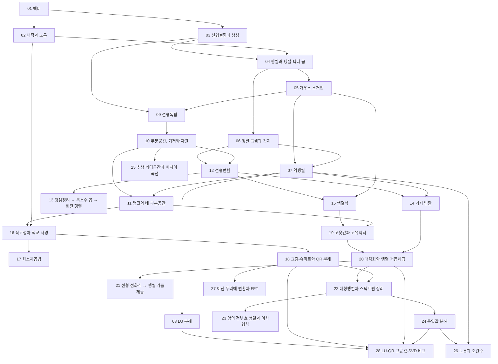


> 교재: Strang *Introduction to Linear Algebra*와 MIT 18.06, Axler *Linear Algebra Done Right* 4판 (공개)

## 먼저 알아야 할 것
- [다항식과 방정식](/Hongs_Blog/studies/college-math/polynomial/) (대학수학) → 고윳값과 고유벡터
- [삼각함수](/Hongs_Blog/studies/college-math/trig-functions/) (대학수학) → 벡터, 선형변환
- [삼각함수 항등식](/Hongs_Blog/studies/college-math/trig-identities/) (대학수학) → 덧셈정리 ↔ 복소수 곱 ↔ 회전 행렬
- [사인 법칙과 코사인 법칙](/Hongs_Blog/studies/college-math/triangle-laws/) (대학수학) → 내적과 노름
- [복소수의 극형식과 오일러 공식](/Hongs_Blog/studies/college-math/euler-formula/) (대학수학) → 덧셈정리 ↔ 복소수 곱 ↔ 회전 행렬, 이산 푸리에 변환과 FFT
- [선형 점화식](/Hongs_Blog/studies/discrete-math/linear-recurrences/) (이산수학) → 선형 점화식 ↔ 행렬 거듭제곱

## 1단원 · 벡터

읽기 전에

1. 두 사람의 평점 목록이 얼마나 비슷한지 숫자 하나로 잴 수 있을까? → [내적과 노름](/Hongs_Blog/studies/linear-algebra/dot-product/)
2. 버튼 (1, 2)와 (2, 4)만으로 평면의 모든 점에 갈 수 있을까? → [선형결합과 생성](/Hongs_Blog/studies/linear-algebra/span/)

| 번호 | 개념 | 한 줄 | 개념 코드 | 연습 |
|---|---|---|---|---|
| 01 | [벡터](/Hongs_Blog/studies/linear-algebra/vectors/) | 크기와 방향을 가진 화살표이자 숫자 목록 | [그림1](/Hongs_Blog/assets/notes/linear-algebra/01_vectors_fig1.svg) · [그림 코드](/Hongs_Blog/studies/linear-algebra/code/01_vectors_plot/) · [검증](/Hongs_Blog/studies/linear-algebra/code/01_vectors_verify/) | — |
| 02 | [내적과 노름](/Hongs_Blog/studies/linear-algebra/dot-product/) | 성분 곱의 합 = 길이 × 길이 × cos(사잇각). 수직이면 0 (무거움) | [그림1](/Hongs_Blog/assets/notes/linear-algebra/02_dot-product_fig1.svg) · [그림 코드](/Hongs_Blog/studies/linear-algebra/code/02_dot-product_plot/) · [검증](/Hongs_Blog/studies/linear-algebra/code/02_dot-product_verify/) | — |
| 03 | [선형결합과 생성](/Hongs_Blog/studies/linear-algebra/span/) | 벡터들을 늘여 더해 닿을 수 있는 모든 곳 | [그림1](/Hongs_Blog/assets/notes/linear-algebra/03_span_fig1.svg) · [그림 코드](/Hongs_Blog/studies/linear-algebra/code/03_span_plot/) · [검증](/Hongs_Blog/studies/linear-algebra/code/03_span_verify/) | — |

떠올려 보기: 노트를 닫고 벡터의 두 연산, 내적의 두 정의와 둘이 같은 이유(코사인 법칙), 코시–슈바르츠, 생성의 네 가지 모양을 적어 본다.

## 2단원 · 행렬과 연립방정식

읽기 전에

1. 행렬에 벡터를 곱하는 것을 '열들을 섞는 것'으로 볼 수 있을까? → [행렬과 행렬-벡터 곱](/Hongs_Blog/studies/linear-algebra/matrix-vector/)
2. 식이 셋, 미지수가 셋이면 해는 늘 하나일까? → [가우스 소거법](/Hongs_Blog/studies/linear-algebra/gaussian-elimination/)
3. 회전하고 늘이는 것과 늘이고 회전하는 것은 같을까? → [행렬 곱셈과 전치](/Hongs_Blog/studies/linear-algebra/matrix-multiplication/)

| 번호 | 개념 | 한 줄 | 개념 코드 | 연습 |
|---|---|---|---|---|
| 04 | [행렬과 행렬-벡터 곱](/Hongs_Blog/studies/linear-algebra/matrix-vector/) | Ax는 A의 열들의 선형결합. 연립방정식은 Ax = b (무거움) | [그림1](/Hongs_Blog/assets/notes/linear-algebra/04_matrix-vector_fig1.svg) · [그림 코드](/Hongs_Blog/studies/linear-algebra/code/04_matrix-vector_plot/) · [검증](/Hongs_Blog/studies/linear-algebra/code/04_matrix-vector_verify/) | — |
| 05 | [가우스 소거법](/Hongs_Blog/studies/linear-algebra/gaussian-elimination/) | 행 연산으로 위삼각꼴을 만들어 차례로 푼다. 해 없음·하나·무한 (무거움) | [그림1](/Hongs_Blog/assets/notes/linear-algebra/05_gaussian-elimination_fig1.svg) · [구현](/Hongs_Blog/studies/linear-algebra/code/05_gaussian-elimination_impl/) · [그림 코드](/Hongs_Blog/studies/linear-algebra/code/05_gaussian-elimination_plot/) · [검증](/Hongs_Blog/studies/linear-algebra/code/05_gaussian-elimination_verify/) | [가우스 소거 예제 사다리](/Hongs_Blog/studies/linear-algebra/elimination-ladder/) |
| 06 | [행렬 곱셈과 전치](/Hongs_Blog/studies/linear-algebra/matrix-multiplication/) | 곱은 변환의 합성. 순서를 바꾸면 결과가 다르다 | [그림1](/Hongs_Blog/assets/notes/linear-algebra/06_matrix-multiplication_fig1.svg) · [그림 코드](/Hongs_Blog/studies/linear-algebra/code/06_matrix-multiplication_plot/) · [검증](/Hongs_Blog/studies/linear-algebra/code/06_matrix-multiplication_verify/) | — |
| 07 | [역행렬](/Hongs_Blog/studies/linear-algebra/inverse-matrix/) | 변환을 되돌리는 행렬. 존재 조건과 가우스-조르당 | [그림1](/Hongs_Blog/assets/notes/linear-algebra/07_inverse-matrix_fig1.svg) · [그림 코드](/Hongs_Blog/studies/linear-algebra/code/07_inverse-matrix_plot/) · [검증](/Hongs_Blog/studies/linear-algebra/code/07_inverse-matrix_verify/) | — |
| 08 | [LU 분해](/Hongs_Blog/studies/linear-algebra/lu-decomposition/) | 소거 과정을 L과 U로 저장해 여러 b를 빨리 푼다 | [구현](/Hongs_Blog/studies/linear-algebra/code/08_lu-decomposition_impl/) · [검증](/Hongs_Blog/studies/linear-algebra/code/08_lu-decomposition_verify/) | — |

떠올려 보기: Ax의 두 관점, 소거의 네 하위목표와 해의 세 경우, AB ≠ BA의 예, 가역 행렬 정리의 네 조건, 곱수가 L에 놓이는 이유를 순서대로 적는다.

## 3단원 · 벡터공간과 선형변환

읽기 전에

1. 어느 두 벡터도 평행하지 않으면 셋은 늘 '겹침 없는' 모음일까? → [선형독립](/Hongs_Blog/studies/linear-algebra/linear-independence/)
2. 해가 무한히 많은 연립방정식은 어떤 우변에도 해가 있을까? → [랭크와 네 부분공간](/Hongs_Blog/studies/linear-algebra/four-subspaces/)
3. 덧셈정리를 외우지 않고 다시 만들 수 있을까? → [덧셈정리 ↔ 복소수 곱 ↔ 회전 행렬](/Hongs_Blog/studies/linear-algebra/rotation-bridge/)
4. 행렬식이 0이라는 것은 그림으로 무슨 뜻일까? → [행렬식](/Hongs_Blog/studies/linear-algebra/determinant/)

| 번호 | 개념 | 한 줄 | 개념 코드 | 연습 |
|---|---|---|---|---|
| 09 | [선형독립](/Hongs_Blog/studies/linear-algebra/linear-independence/) | 어느 벡터도 나머지로 만들 수 없다. 중복 정보가 없다 (무거움) | [그림1](/Hongs_Blog/assets/notes/linear-algebra/09_linear-independence_fig1.svg) · [그림 코드](/Hongs_Blog/studies/linear-algebra/code/09_linear-independence_plot/) · [검증](/Hongs_Blog/studies/linear-algebra/code/09_linear-independence_verify/) | — |
| 10 | [부분공간, 기저와 차원](/Hongs_Blog/studies/linear-algebra/basis-dimension/) | 공간을 빠짐없이, 중복 없이 표현하는 최소 벡터 모음 (무거움) | [그림1](/Hongs_Blog/assets/notes/linear-algebra/10_basis-dimension_fig1.svg) · [그림 코드](/Hongs_Blog/studies/linear-algebra/code/10_basis-dimension_plot/) · [검증](/Hongs_Blog/studies/linear-algebra/code/10_basis-dimension_verify/) | — |
| 11 | [랭크와 네 부분공간](/Hongs_Blog/studies/linear-algebra/four-subspaces/) | 열공간·영공간·행공간·왼쪽 영공간. 랭크 + 영공간 차원 = 열 수 (무거움) | [그림1](/Hongs_Blog/assets/notes/linear-algebra/11_four-subspaces_fig1.svg) · [그림 코드](/Hongs_Blog/studies/linear-algebra/code/11_four-subspaces_plot/) · [검증](/Hongs_Blog/studies/linear-algebra/code/11_four-subspaces_verify/) | — |
| 12 | [선형변환](/Hongs_Blog/studies/linear-algebra/linear-transformations/) | 격자를 평행·등간격으로 유지하는 변환. 회전·반사·사영·전단 (무거움) | [그림1](/Hongs_Blog/assets/notes/linear-algebra/12_linear-transformations_fig1.svg) · [그림 코드](/Hongs_Blog/studies/linear-algebra/code/12_linear-transformations_plot/) · [검증](/Hongs_Blog/studies/linear-algebra/code/12_linear-transformations_verify/) | — |
| 13 | [덧셈정리 ↔ 복소수 곱 ↔ 회전 행렬](/Hongs_Blog/studies/linear-algebra/rotation-bridge/) | 세 가지 모두 '각을 더하면 회전이 합성된다'를 다른 언어로 쓴 것 | [검증](/Hongs_Blog/studies/linear-algebra/code/13_rotation-bridge_verify/) | — |
| 14 | [기저 변환](/Hongs_Blog/studies/linear-algebra/change-of-basis/) | 같은 변환도 좌표계에 따라 행렬이 달라진다. P⁻¹AP | [그림1](/Hongs_Blog/assets/notes/linear-algebra/14_change-of-basis_fig1.svg) · [그림 코드](/Hongs_Blog/studies/linear-algebra/code/14_change-of-basis_plot/) · [검증](/Hongs_Blog/studies/linear-algebra/code/14_change-of-basis_verify/) | — |
| 15 | [행렬식](/Hongs_Blog/studies/linear-algebra/determinant/) | 변환이 넓이·부피를 몇 배로 바꾸는가. 0이면 되돌릴 수 없다 | [그림1](/Hongs_Blog/assets/notes/linear-algebra/15_determinant_fig1.svg) · [그림 코드](/Hongs_Blog/studies/linear-algebra/code/15_determinant_plot/) · [검증](/Hongs_Blog/studies/linear-algebra/code/15_determinant_verify/) | — |

떠올려 보기: 노트를 닫고 독립·기저·차원의 정의, 네 부분공간과 차원(r, n−r, r, m−r), 회전 행렬과 복소수의 대응, P⁻¹AP를 읽는 순서, 행렬식의 세 성질을 적는다.

## 4단원 · 직교성

읽기 전에

1. 점에서 평면까지 가장 가까운 점은 어떻게 찾을까? → [직교성과 직교 사영](/Hongs_Blog/studies/linear-algebra/orthogonal-projection/)
2. 모든 점을 지나는 직선이 없을 때 '가장 잘 맞는' 직선은 무엇을 기준으로 고를까? → [최소제곱법](/Hongs_Blog/studies/linear-algebra/least-squares/)
3. 기울어진 기저를 서로 수직인 기저로 바꿀 수 있을까? → [그람-슈미트와 QR 분해](/Hongs_Blog/studies/linear-algebra/gram-schmidt-qr/)

| 번호 | 개념 | 한 줄 | 개념 코드 | 연습 |
|---|---|---|---|---|
| 16 | [직교성과 직교 사영](/Hongs_Blog/studies/linear-algebra/orthogonal-projection/) | 가장 가까운 점은 수직으로 내린 발 (무거움) | [그림1](/Hongs_Blog/assets/notes/linear-algebra/16_orthogonal-projection_fig1.svg) · [그림2](/Hongs_Blog/assets/notes/linear-algebra/16_orthogonal-projection_fig2.svg) · [그림 코드](/Hongs_Blog/studies/linear-algebra/code/16_orthogonal-projection_plot/) · [검증](/Hongs_Blog/studies/linear-algebra/code/16_orthogonal-projection_verify/) | — |
| 17 | [최소제곱법](/Hongs_Blog/studies/linear-algebra/least-squares/) | 풀 수 없는 Ax = b를 오차 제곱합 최소로. AᵀAx̂ = Aᵀb (무거움) | [그림1](/Hongs_Blog/assets/notes/linear-algebra/17_least-squares_fig1.svg) · [그림 코드](/Hongs_Blog/studies/linear-algebra/code/17_least-squares_plot/) · [검증](/Hongs_Blog/studies/linear-algebra/code/17_least-squares_verify/) | [최소제곱 예제 사다리](/Hongs_Blog/studies/linear-algebra/least-squares-ladder/) |
| 18 | [그람-슈미트와 QR 분해](/Hongs_Blog/studies/linear-algebra/gram-schmidt-qr/) | 기울어진 기저를 직교 기저로 바로 세운다 | [그림1](/Hongs_Blog/assets/notes/linear-algebra/18_gram-schmidt-qr_fig1.svg) · [구현](/Hongs_Blog/studies/linear-algebra/code/18_gram-schmidt-qr_impl/) · [그림 코드](/Hongs_Blog/studies/linear-algebra/code/18_gram-schmidt-qr_plot/) · [검증](/Hongs_Blog/studies/linear-algebra/code/18_gram-schmidt-qr_verify/) | — |

떠올려 보기: 노트를 닫고 사영의 수직 조건에서 정규방정식을 끌어내고, P의 두 성질, 최소제곱 직선의 네 하위목표, 그람–슈미트의 한 단계를 적는다.

## 5단원 · 고윳값과 분해

읽기 전에

1. 행렬을 곱해도 방향이 바뀌지 않는 벡터가 있을까? → [고윳값과 고유벡터](/Hongs_Blog/studies/linear-algebra/eigenvalues/)
2. 행렬을 100번 곱하는 일을 숫자 몇 개의 100제곱으로 줄일 수 있을까? → [대각화와 행렬 거듭제곱](/Hongs_Blog/studies/linear-algebra/diagonalization/)
3. 피보나치 점화식의 특성방정식과 행렬의 고윳값은 무슨 관계일까? → [선형 점화식 ↔ 행렬 거듭제곱](/Hongs_Blog/studies/linear-algebra/recurrence-matrix-bridge/)
4. 사진 한 장을 숫자 10%만으로 거의 그대로 저장할 수 있을까? → [특잇값 분해](/Hongs_Blog/studies/linear-algebra/svd/)

| 번호 | 개념 | 한 줄 | 개념 코드 | 연습 |
|---|---|---|---|---|
| 19 | [고윳값과 고유벡터](/Hongs_Blog/studies/linear-algebra/eigenvalues/) | 변환해도 방향이 안 바뀌는 벡터와 그 배율 (무거움) | [그림1](/Hongs_Blog/assets/notes/linear-algebra/19_eigenvalues_fig1.svg) · [그림 코드](/Hongs_Blog/studies/linear-algebra/code/19_eigenvalues_plot/) · [검증](/Hongs_Blog/studies/linear-algebra/code/19_eigenvalues_verify/) | — |
| 20 | [대각화와 행렬 거듭제곱](/Hongs_Blog/studies/linear-algebra/diagonalization/) | 고유기저에서는 변환이 축별 늘이기. A^k가 쉬워진다 (무거움) | [그림1](/Hongs_Blog/assets/notes/linear-algebra/20_diagonalization_fig1.svg) · [그림 코드](/Hongs_Blog/studies/linear-algebra/code/20_diagonalization_plot/) · [검증](/Hongs_Blog/studies/linear-algebra/code/20_diagonalization_verify/) | [고윳값과 대각화 예제 사다리](/Hongs_Blog/studies/linear-algebra/diagonalization-ladder/) |
| 21 | [선형 점화식 ↔ 행렬 거듭제곱](/Hongs_Blog/studies/linear-algebra/recurrence-matrix-bridge/) | 특성방정식의 근 = 동반 행렬의 고윳값 | [그림1](/Hongs_Blog/assets/notes/linear-algebra/21_recurrence-matrix-bridge_fig1.svg) · [그림 코드](/Hongs_Blog/studies/linear-algebra/code/21_recurrence-matrix-bridge_plot/) · [검증](/Hongs_Blog/studies/linear-algebra/code/21_recurrence-matrix-bridge_verify/) | — |
| 22 | [대칭행렬과 스펙트럼 정리](/Hongs_Blog/studies/linear-algebra/spectral-theorem/) | 대칭행렬은 직교 고유기저로 늘 대각화된다. 고윳값은 실수 (무거움) | [그림1](/Hongs_Blog/assets/notes/linear-algebra/22_spectral-theorem_fig1.svg) · [그림 코드](/Hongs_Blog/studies/linear-algebra/code/22_spectral-theorem_plot/) · [검증](/Hongs_Blog/studies/linear-algebra/code/22_spectral-theorem_verify/) | — |
| 23 | [양의 정부호 행렬과 이차형식](/Hongs_Blog/studies/linear-algebra/positive-definite/) | xᵀAx > 0: 모든 방향으로 볼록한 그릇 | [그림1](/Hongs_Blog/assets/notes/linear-algebra/23_positive-definite_fig1.svg) · [그림 코드](/Hongs_Blog/studies/linear-algebra/code/23_positive-definite_plot/) · [검증](/Hongs_Blog/studies/linear-algebra/code/23_positive-definite_verify/) | — |
| 24 | [특잇값 분해](/Hongs_Blog/studies/linear-algebra/svd/) | 모든 행렬 = 회전 · 늘이기 · 회전. 큰 특잇값만 남기면 최선의 근사 (무거움) | [그림1](/Hongs_Blog/assets/notes/linear-algebra/24_svd_fig1.svg) · [그림2](/Hongs_Blog/assets/notes/linear-algebra/24_svd_fig2.svg) · [그림 코드](/Hongs_Blog/studies/linear-algebra/code/24_svd_plot/) · [검증](/Hongs_Blog/studies/linear-algebra/code/24_svd_verify/) | — |

떠올려 보기: 노트를 닫고 특성방정식, 대각화의 조건과 A^k 공식, 스펙트럼 정리의 세 문장, 양의 정부호 판정 다섯 가지, SVD의 세 단계와 에카르트–영 정리를 적는다.

## 6단원 · 응용과 확장

읽기 전에

1. 글꼴의 곡선을 점 몇 개로 저장할 수 있는 이유는? → [추상 벡터공간과 베지어 곡선](/Hongs_Blog/studies/linear-algebra/abstract-vector-spaces/)
2. 성분이 1/2, 1/3 같은 평범한 분수뿐인 행렬도 풀기 어려울 수 있을까? → [노름과 조건수](/Hongs_Blog/studies/linear-algebra/conditioning/)
3. 백만 개짜리 신호의 주파수 분석을 곱셈 백만의 제곱 번보다 훨씬 적게 할 수 있을까? → [이산 푸리에 변환과 FFT](/Hongs_Blog/studies/linear-algebra/dft/)

| 번호 | 개념 | 한 줄 | 개념 코드 | 연습 |
|---|---|---|---|---|
| 25 | [추상 벡터공간과 베지어 곡선](/Hongs_Blog/studies/linear-algebra/abstract-vector-spaces/) | 함수·다항식도 벡터다. 베른슈타인 기저와 베지어 곡선 | [그림1](/Hongs_Blog/assets/notes/linear-algebra/25_abstract-vector-spaces_fig1.svg) · [그림 코드](/Hongs_Blog/studies/linear-algebra/code/25_abstract-vector-spaces_plot/) · [검증](/Hongs_Blog/studies/linear-algebra/code/25_abstract-vector-spaces_verify/) | — |
| 26 | [노름과 조건수](/Hongs_Blog/studies/linear-algebra/conditioning/) | 입력의 작은 오차가 해에서 몇 배로 커지나. 부동소수점 | [그림1](/Hongs_Blog/assets/notes/linear-algebra/26_conditioning_fig1.svg) · [그림2](/Hongs_Blog/assets/notes/linear-algebra/26_conditioning_fig2.svg) · [그림 코드](/Hongs_Blog/studies/linear-algebra/code/26_conditioning_plot/) · [검증](/Hongs_Blog/studies/linear-algebra/code/26_conditioning_verify/) | — |
| 27 | [이산 푸리에 변환과 FFT](/Hongs_Blog/studies/linear-algebra/dft/) | 신호를 단위근 기저로 바꾸는 직교 변환. FFT로 O(n log n) | [그림1](/Hongs_Blog/assets/notes/linear-algebra/27_dft_fig1.svg) · [그림2](/Hongs_Blog/assets/notes/linear-algebra/27_dft_fig2.svg) · [구현](/Hongs_Blog/studies/linear-algebra/code/27_dft_impl/) · [그림 코드](/Hongs_Blog/studies/linear-algebra/code/27_dft_plot/) · [검증](/Hongs_Blog/studies/linear-algebra/code/27_dft_verify/) | — |
| 28 | [LU·QR·고윳값·SVD 비교](/Hongs_Blog/studies/linear-algebra/decompositions-compared/) | 가르는 질문: 무엇을 풀려고 하는가 | [검증](/Hongs_Blog/studies/linear-algebra/code/28_decompositions-compared_verify/) | — |

떠올려 보기: 노트를 닫고 벡터공간의 여덟 법칙과 베른슈타인 기저, 조건수의 정의와 오차 한계, FFT의 짝·홀 분해와 복잡도, 네 분해를 가르는 질문을 적는다.

## 다른 과목과의 연결
- [덧셈정리 ↔ 복소수 곱 ↔ 회전 행렬](/Hongs_Blog/studies/linear-algebra/rotation-bridge/) (선형대수학): 세 가지 모두 '각을 더하면 회전이 합성된다'를 다른 언어로 쓴 것
- [선형 점화식 ↔ 행렬 거듭제곱](/Hongs_Blog/studies/linear-algebra/recurrence-matrix-bridge/) (선형대수학): 특성방정식의 근 = 동반 행렬의 고윳값
- [인접행렬 거듭제곱 ↔ 마르코프 전이](/Hongs_Blog/studies/probability-statistics/walks-markov-bridge/) (확률과 통계): (A^k)_ij는 보행 수, (P^k)_ij는 k단계 확률
- [행렬과 행렬-벡터 곱](/Hongs_Blog/studies/linear-algebra/matrix-vector/) ↔ [뉴런의 연산 모형](/Hongs_Blog/studies/human-interface-media/neuron-computational-model/) (4-1학기 휴먼 인터페이스 미디어): o = Ax + b
- [내적과 노름](/Hongs_Blog/studies/linear-algebra/dot-product/) ↔ [퍼셉트론](/Hongs_Blog/studies/human-interface-media/perceptron/) (4-1학기 휴먼 인터페이스 미디어): 가중합 wᵀx + b
- [랭크와 네 부분공간](/Hongs_Blog/studies/linear-algebra/four-subspaces/) ↔ [조건등색](/Hongs_Blog/studies/human-interface-media/metamerism/) (4-1학기 휴먼 인터페이스 미디어): C(i₁ − i₂) = 0은 영공간 문제
- [선형결합과 생성](/Hongs_Blog/studies/linear-algebra/span/) ↔ [삼색 이론](/Hongs_Blog/studies/human-interface-media/trichromatic-theory/) (4-1학기 휴먼 인터페이스 미디어): 세 원색의 선형결합 Pw = r
- [선형변환](/Hongs_Blog/studies/linear-algebra/linear-transformations/) ↔ [격자 회전 ↔ 선형변환](/Hongs_Blog/studies/algorithms/grid-rotation-linear/) (알고리즘 3.개념집): 격자를 뒤집고 전치하는 것이 선형변환이고, 반사 두 번이 회전이다
- [역행렬](/Hongs_Blog/studies/linear-algebra/inverse-matrix/) ↔ [누적 합 ↔ 아래삼각행렬](/Hongs_Blog/studies/algorithms/prefix-sum-triangular/) (알고리즘 3.개념집): 누적 합은 아래삼각 1 행렬, 차분은 그 역행렬을 곱하는 일

## 흐름
점선 테두리는 아직 작성하지 않은 개념이다.


