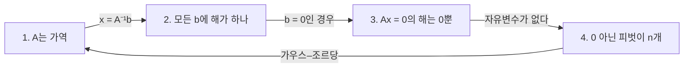



요약

역행렬은 행렬이 한 변환을 되돌리는 행렬이다. 암호화한 좌표를 복원하거나, 결과에서 원인을 거꾸로 구할 때 쓴다. 되돌릴 수 있으려면 변환이 정보를 잃지 않아야 한다. 서로 다른 두 입력이 같은 출력으로 뭉개지면(예: 평면을 한 직선으로 누르면) 어느 쪽으로 되돌릴지 정할 수 없다. 또 실제 계산에서는 역행렬을 직접 구해 곱하는 것보다 소거로 방정식을 푸는 편이 빠르고 정확하다.

## 예시로 보기

좌표 $$(x, y)$$를 $$A = \begin{pmatrix}2 & 1\\ 5 & 3\end{pmatrix}$$로 암호화해 보낸다. $$(1, 2)$$는 $$(4, 11)$$이 된다. 받는 쪽은 $$A^{-1} = \begin{pmatrix}3 & -1\\ -5 & 2\end{pmatrix}$$를 곱해 $$(3 \cdot 4 - 11,\ -5 \cdot 4 + 2 \cdot 11) = (1, 2)$$로 되살린다. 확인해 보면 $$A^{-1}A = I$$다.

반면 $$B = \begin{pmatrix}1 & 2\\ 2 & 4\end{pmatrix}$$는 $$(2, -1)$$과 $$(0, 0)$$을 모두 $$(0, 0)$$으로 보낸다. $$(0, 0)$$을 받은 쪽은 원래 무엇이었는지 알 수 없다. $$A$$는 아래 정리의 가역 행렬, $$B$$는 특이 행렬이다.

$$B$$는 평면의 모든 점을 직선 $$y = 2x$$ 위로 누른다. 왼쪽 주황 직선 $$x + 2y = 0$$ 위의 점은 모두 $$(0, 0)$$ 한 점으로 간다. 여러 입력이 한 출력으로 모이니 되돌릴 방법이 없다[^s2].

## 정의

정의

$$n \times n$$ 행렬 $$A$$에 대해 $$AB = BA = I$$인 $$B$$가 있으면 $$A$$는 **가역**(비특이)이고, $$B$$를 **역행렬** $$A^{-1}$$이라 한다. 역행렬은 있으면 하나뿐이다. $$B$$와 $$C$$가 모두 역행렬이면 $$B = B(AC) = (BA)C = C$$이기 때문이다[^1].

$$2 \times 2$$는 공식이 있다. $$A = \begin{pmatrix}a & b\\ c & d\end{pmatrix}$$에서 $$ad - bc \ne 0$$이면 $$A^{-1} = \frac{1}{ad - bc}\begin{pmatrix}d & -b\\ -c & a\end{pmatrix}$$이다. $$ad - bc = 0$$이면 역행렬이 없다([행렬식](/Hongs_Blog/studies/linear-algebra/determinant/)).

가역 행렬 정리

$$n \times n$$ 행렬 $$A$$에 대해 다음은 동치다.
1. $$A$$는 가역이다.
2. 모든 $$\mathbf{b}$$에 대해 $$A\mathbf{x} = \mathbf{b}$$의 해가 정확히 하나다.
3. $$A\mathbf{x} = \mathbf{0}$$의 해는 $$\mathbf{x} = \mathbf{0}$$뿐이다.
4. 소거(행 바꾸기 허용)로 0이 아닌 피벗이 $$n$$개 나온다.

증명

*(1 ⇒ 2)* $$\mathbf{x} = A^{-1}\mathbf{b}$$가 해다. 해 $$\mathbf{x}$$가 있으면 양변에 $$A^{-1}$$을 곱해 $$\mathbf{x} = A^{-1}\mathbf{b}$$이므로 하나뿐이다. 
*(2 ⇒ 3)* $$\mathbf{b} = \mathbf{0}$$인 경우이고, $$\mathbf{0}$$은 늘 해다. 
*(3 ⇒ 4)* 피벗이 $$n$$개보다 적으면 피벗 없는 열이 있다. 그 자유변수를 1로 두면 $$A\mathbf{x} = \mathbf{0}$$의 0이 아닌 해가 생겨 3에 어긋난다. 
*(4 ⇒ 1)* 기본 행 연산 하나는 기본 행렬 $$E$$를 왼쪽에 곱하는 것이고, 각 $$E$$는 가역이다(연산을 되돌리는 행렬이 있다). 피벗이 $$n$$개면 계속 줄여 $$E_k \cdots E_1 A = I$$로 만들 수 있다(가우스–조르당). $$B = E_k \cdots E_1$$로 두면 $$BA = I$$이고, $$A = E_1^{-1}\cdots E_k^{-1}$$이라 $$AB = E_1^{-1}\cdots E_k^{-1}E_k\cdots E_1 = I$$다. ∎

증명의 화살표 네 개가 한 바퀴를 돈다. 그래서 어느 조건에서 출발해도 나머지 셋에 닿고, 넷은 모두 같은 말이 된다[^s3].

**가우스–조르당.** $$[A \mid I]$$에 행 연산을 해 왼쪽을 $$I$$로 만들면 오른쪽이 $$A^{-1}$$이 된다. 왼쪽에 곱해진 $$E_k\cdots E_1 = A^{-1}$$이 오른쪽의 $$I$$에도 똑같이 곱해지기 때문이다.

**곱과 전치.** $$(AB)^{-1} = B^{-1}A^{-1}$$이고 $$(A^\top)^{-1} = (A^{-1})^\top$$($$^\top$$는 행과 열을 바꾸는 전치)이다. $$(AB)(B^{-1}A^{-1}) = A(BB^{-1})A^{-1} = I$$로 확인한다. 양말을 신고 신발을 신었으면, 벗을 때는 신발부터 벗는다.

## 예제

$$A = \begin{pmatrix}2 & 1\\ 5 & 3\end{pmatrix}$$의 역행렬을 가우스–조르당으로 구한다.

1. *시작:* $$\left[\begin{smallmatrix}2 & 1 & \mid & 1 & 0\\ 5 & 3 & \mid & 0 & 1\end{smallmatrix}\right]$$.
2. *아래 지우기:* 2행 $$- \frac52 \times$$ 1행 → $$(0, \frac12 \mid -\frac52, 1)$$. 2배 → $$(0, 1 \mid -5, 2)$$.
3. *위 지우기:* 1행 $$-$$ 2행 → $$(2, 0 \mid 6, -2)$$. $$\frac12$$배 → $$(1, 0 \mid 3, -1)$$.
4. *읽기:* $$A^{-1} = \begin{pmatrix}3 & -1\\ -5 & 2\end{pmatrix}$$. $$2 \times 2$$ 공식($$ad - bc = 1$$)과 같다.

검증: 예시의 암호화·복원과 $$B$$의 충돌, 가우스–조르당 구현(유리수)이 무작위 가역 행렬에서 $$AA^{-1} = A^{-1}A = I$$, $$2 \times 2$$ 공식, 가역 행렬 정리의 네 조건이 무작위 행렬(특이 포함)에서 같은 판정, $$(AB)^{-1} = B^{-1}A^{-1}$$, $$(A^\top)^{-1} = (A^{-1})^\top$$ — [07_inverse-matrix_verify.py](/Hongs_Blog/studies/linear-algebra/code/07_inverse-matrix_verify/)

## 활용

- **계산에서는 역행렬을 피한다.** $$A\mathbf{x} = \mathbf{b}$$를 풀 때 $$A^{-1}$$을 구해 곱하면 연산이 약 세 배 들고 반올림 오차도 커진다. 라이브러리는 `solve`(내부적으로 [LU 분해](/Hongs_Blog/studies/linear-algebra/lu-decomposition/))를 권한다[^s1].
- **공식과 이론에서는 쓴다.** [선형 변환](/Hongs_Blog/studies/linear-algebra/matrix-vector/)을 되돌리는 것, 좌표계를 바꾸는 $$P^{-1}AP$$([기저 변환](/Hongs_Blog/studies/linear-algebra/change-of-basis/)), [최소제곱](/Hongs_Blog/studies/linear-algebra/least-squares/)의 $$(A^\top A)^{-1}A^\top$$처럼 식을 쓸 때 역행렬 기호를 쓴다.
- **흔한 실수.** 정사각이 아닌 행렬의 역행렬을 찾는 것, $$(AB)^{-1}$$을 $$A^{-1}B^{-1}$$로 쓰는 것.
- 알고리즘에서: 대각선과 그 아래가 모두 1인 아래삼각행렬 $$L$$을 곱하면 앞에서부터 그 칸까지 더한 합(누적 합)이 되고, $$L^{-1}$$을 곱하면 이웃한 두 칸의 차(차분)가 된다. 실제 코드는 행렬을 만들지 않고 둘 다 $$O(n)$$에 계산한다([누적 합과 차분 배열](/Hongs_Blog/studies/algorithms/prefix-sum/)).
- 브리지: [누적 합 ↔ 아래삼각행렬](/Hongs_Blog/studies/algorithms/prefix-sum-triangular/)

## 연결

- 선수: [가우스 소거법](/Hongs_Blog/studies/linear-algebra/gaussian-elimination/), [행렬 곱셈과 전치](/Hongs_Blog/studies/linear-algebra/matrix-multiplication/)
- 같은 생각: [역함수](/Hongs_Blog/studies/college-math/inverse-function/)는 일대일 대응일 때만 있다. 가역 행렬은 일대일 대응인 선형 변환이다.
- 이어지는 개념: [LU 분해](/Hongs_Blog/studies/linear-algebra/lu-decomposition/), [행렬식](/Hongs_Blog/studies/linear-algebra/determinant/)

## 과목별 관점

**수치해석 (2-2학기).** 역행렬을 여인수로 쓰는 공식을 먼저 배운다. $$A_{ij}$$를 $$i$$행과 $$j$$열을 지운 행렬의 행렬식(소행렬식)이라 하면 다음과 같다. 오른쪽 첨자가 $$ji$$로 뒤바뀐 것에 주의한다[^n1].

$$(A^{-1})_{ij} = \frac{(-1)^{i+j}\vert A_{ji}\vert }{\vert A\vert }$$

슬라이드의 가우스–조르당 알고리즘은 열 $$j$$마다 $$j$$번째 행과 그 아래 행 중 $$\vert a_{ij}\vert $$가 가장 큰 행을 골라 $$j$$번째 행과 맞바꾼다. 0이 아닌 수가 하나도 없으면 역행렬이 없다[^n2]. 이렇게 큰 수를 골라 나누는 것을 부분 피벗팅이라 한다. 0으로 나누는 것을 피하고, 0에 가까운 수로 나눠 반올림 오차가 커지는 것도 막는다[^sn1].

예: $$A = \begin{pmatrix}2 & -1 & 3\\ 1 & 6 & -4\\ 5 & 0 & 8\end{pmatrix}$$은 첫 열에서 가장 큰 5가 있는 셋째 행을 첫 행과 바꾸며 시작한다. 결과는 $$A^{-1} = \frac{1}{34}\begin{pmatrix}48 & 8 & -14\\ -28 & 1 & 11\\ -30 & -5 & 13\end{pmatrix}$$이다[^n3]. 연립방정식 $$x - 3y + z = 5$$, $$4x + y - 2z = -2$$, $$-2x + 3y = 1$$은 $$\vert A\vert  = 8$$이고 $$X = A^{-1}B = (\frac{29}{8}, \frac{22}{8}, \frac{77}{8})$$이다[^n4].

$$\vert A\vert  = 0$$이면 $$x - 3y = 5$$, $$-2x + 6y = 1$$처럼 두 직선이 평행해 만나지 않을 수 있다. 우변이 0인 $$AX = 0$$은 $$\vert A\vert  \ne 0$$이면 $$X = 0$$만 해이고, $$\vert A\vert  = 0$$이면 0이 아닌 해가 있다[^n5].

## 확인 문제

**C1** $$\begin{pmatrix}4 & 7\\ 2 & 6\end{pmatrix}$$의 역행렬을 구하라.

**답:** $$ad - bc = 24 - 14 = 10$$. $$\frac{1}{10}\begin{pmatrix}6 & -7\\ -2 & 4\end{pmatrix} = \begin{pmatrix}0.6 & -0.7\\ -0.2 & 0.4\end{pmatrix}$$.

**C2** $$(AB)^{-1} = B^{-1}A^{-1}$$에서 순서가 뒤집히는 이유를 변환으로 설명하라.

**답:** $$AB\mathbf{x}$$는 먼저 $$B$$, 다음 $$A$$를 한다. 되돌리려면 마지막에 한 $$A$$를 먼저 되돌리고($$A^{-1}$$), 그다음 $$B$$를 되돌린다($$B^{-1}$$). 그래서 $$B^{-1}A^{-1}$$이다. 곱해 보면 $$ABB^{-1}A^{-1} = I$$다.

**C3** $$\begin{pmatrix}1 & 2\\ 2 & 4\end{pmatrix}$$에 역행렬이 없음을 가역 행렬 정리의 조건 하나로 보여라.

**답:** $$A\mathbf{x} = \mathbf{0}$$에 $$\mathbf{x} = (2, -1)$$이라는 0이 아닌 해가 있다(조건 3 위반). 즉 $$(2, -1)$$과 $$\mathbf{0}$$이 같은 곳으로 가 되돌릴 수 없다. 소거해도 둘째 행이 $$(0, 0)$$이 되어 피벗이 하나뿐이다.

**C4** 부분 피벗팅을 쓰는 가우스–조르당으로 $$\begin{pmatrix}1 & 2\\ 3 & 4\end{pmatrix}$$의 역행렬을 구한다. 첫 단계에서 무엇을 하고, 답은?

**답:** 첫 열에서 $$\vert 3\vert  > \vert 1\vert $$이라 두 행을 바꾼다. 답은 $$\begin{pmatrix}-2 & 1\\ \frac32 & -\frac12\end{pmatrix}$$[^n6].

[^1]: Strang, *Introduction to Linear Algebra* 5판, 2.5절 "Inverse Matrices"(역행렬의 유일성, $$2 \times 2$$ 공식, 가우스–조르당, $$(AB)^{-1}$$, 가역성과 피벗).
[^s1]: 에이전트 보충. "역행렬을 구해 곱하지 말고 푼다"는 수치 선형대수의 표준 권고다(NumPy 문서도 `inv` 대신 `solve`를 권한다). 연산 수 비교: 역행렬 약 $$2n^3$$, LU 풀이 약 $$\frac23 n^3$$.
[^n1]: 2-2학기/수치해석/1.수업자료/03.na03_matrix.pdf, p.23
[^n2]: 같은 자료, p.26~28
[^n3]: 같은 자료, p.25, p.29~30
[^n4]: 같은 자료, p.31, p.34~36
[^n5]: 같은 자료, p.32~33
[^n6]: 같은 자료, p.24
[^sn1]: 에이전트 보충. "부분 피벗팅"이라는 이름과 오차를 줄이는 이유는 원본에 없다. 슬라이드 예의 역행렬과 해, 카드 C4는 07_inverse-matrix_verify.py로 확인했다.
[^s2]: 에이전트 보충. 그림은 원본에 없다. [07_inverse-matrix_plot.py](/Hongs_Blog/studies/linear-algebra/code/07_inverse-matrix_plot/)로 그렸고, $$B(2, -1) = B(0, 0) = (0, 0)$$, 무작위 점 400개의 상이 모두 $$y = 2x$$ 위에 있다는 것, $$\det B = 0$$을 같은 코드로 확인했다.
[^s3]: 에이전트 보충. 다이어그램 1개는 원본에 없다. 이 문서 `정의`의 가역 행렬 정리와 그 증명(1 ⇒ 2 ⇒ 3 ⇒ 4 ⇒ 1)을 그대로 옮겼다(Strang 5판 2.5절).

