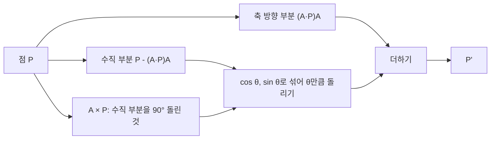



요약

3차원에서는 $$x$$, $$y$$, $$z$$축을 중심으로 도는 회전은 쉽지만, 비스듬한 축을 중심으로 돌리는 것은 바로 쓰기 어렵다. 한 방법은 축을 $$x$$축으로 눕히고, $$x$$축으로 돌리고, 다시 세우는 다섯 단계다. 다른 방법은 점을 "축 방향 부분"과 "축에 수직인 부분"으로 나눠, 수직인 부분만 원을 따라 돌리는 공식(로드리게스 공식) 하나다. 두 방법은 같은 답을 내지만, 3차원 회전은 순서를 바꾸면 결과가 달라진다.

## 예시로 보기

정육면체를 한 꼭짓점과 맞은편 꼭짓점을 잇는 대각선 축 $$(1, 1, 1)$$로 120° 돌리면, $$x$$축 방향이 $$y$$축으로, $$y$$축이 $$z$$축으로, $$z$$축이 $$x$$축으로 간다. 세 축이 대각선 축 둘레에 고르게 120°씩 떨어져 있기 때문이다.

$$z$$축으로 90° 돌리는 것 같은 기본 회전으로는 이 결과를 한 번에 쓸 수 없다. 축이 비스듬하기 때문이다[^s1].

검증: 세 기본 회전의 방향, 순서 바꾸면 다름, 무작위 축·각 300개에서 다섯 단계 = 로드리게스 공식, 예시의 120° 회전, 축 성분·길이 보존, 단위 벡터가 아니면 틀림, 카드 C2 — [08_axis-rotation_verify.py](/Hongs_Blog/studies/numerical-analysis/code/08_axis-rotation_verify/)

## 정의

**기본 회전.** 오른손 좌표계에서 축을 바라보는 쪽(양의 방향)에서 볼 때 반시계 방향이 양의 각이다. 2차원 회전은 $$z$$축 회전과 같다[^1].

$$R_x(\theta) = \begin{pmatrix}1 & 0 & 0\\ 0 & \cos\theta & -\sin\theta\\ 0 & \sin\theta & \cos\theta\end{pmatrix}, \quad R_y(\theta) = \begin{pmatrix}\cos\theta & 0 & \sin\theta\\ 0 & 1 & 0\\ -\sin\theta & 0 & \cos\theta\end{pmatrix}, \quad R_z(\theta) = \begin{pmatrix}\cos\theta & -\sin\theta & 0\\ \sin\theta & \cos\theta & 0\\ 0 & 0 & 1\end{pmatrix}$$

90°로 확인하면 $$R_z$$는 $$x \to y$$, $$R_x$$는 $$y \to z$$, $$R_y$$는 $$z \to x$$로 보낸다. $$R_y$$만 $$\sin$$의 부호 자리가 다른 것은 이 순환($$x \to y \to z \to x$$) 때문이다[^2][^s1].

### 다섯 단계 방법

원점을 지나는 축 $$A$$를 중심으로 $$\theta$$만큼 돌린다[^3].

1. $$z$$축을 중심으로 돌려 $$A$$를 $$xz$$ 평면에 놓는다. $$\alpha$$는 $$A$$를 $$xy$$ 평면에 내린 그림자 $$A_{xy}$$와 $$x$$축 사이의 각이다($$R_\alpha$$).
2. $$y$$축을 중심으로 $$\beta$$만큼 돌려 $$A$$를 $$x$$축에 맞춘다. $$\beta$$는 $$R_\alpha A$$와 $$x$$축 사이의 각이다($$R_\beta$$).
3. $$x$$축을 중심으로 $$\theta$$만큼 돌린다($$R_\theta$$).
4. $$y$$축을 중심으로 $$-\beta$$만큼 돌린다.
5. $$z$$축을 중심으로 $$-\alpha$$만큼 돌린다.

$$X' = R_\alpha^{-1}R_\beta^{-1}R_\theta R_\beta R_\alpha X$$

축이 원점을 지나지 않으면 앞뒤에 평행이동을 하나씩 더한다([동차 좌표](/Hongs_Blog/studies/numerical-analysis/homogeneous-coordinates/)).

### 로드리게스 공식

$$A$$가 단위 벡터일 때, 점 $$P$$를 $$A$$ 방향 부분(사영)과 $$A$$에 수직인 부분으로 나눈다[^4].

$$P = \underbrace{(A\cdot P)A}_{\text{축 방향, 돌려도 그대로}} + \underbrace{P - (A\cdot P)A}_{\text{축에 수직, 원을 따라 돈다}}$$

수직인 부분은 축에 수직인 평면에서 2차원 회전을 한다. 그 평면의 두 축은 수직 부분 자신과, 그것을 90° 돌린 $$A \times P$$다. 둘의 길이는 같다: $$\vert P - (A\cdot P)A\vert  = \vert P\vert \sin\alpha = \vert A \times P\vert $$[^4].

$$P' = P\cos\theta + (A \times P)\sin\theta + A(A\cdot P)(1 - \cos\theta)$$

점을 두 갈래로 나눈 뒤 수직 부분만 돌리고, 축 방향 부분은 그대로 다시 더한다[^s2].

유도 과정

수직 부분을 $$\theta$$만큼 돌리면 $$\big[P - (A\cdot P)A\big]\cos\theta + (A \times P)\sin\theta$$ (2차원 회전의 $$\cos$$, $$\sin$$ 섞기)

축 방향 부분 $$(A\cdot P)A$$를 더하면 $$P\cos\theta + (A \times P)\sin\theta + (A\cdot P)A(1 - \cos\theta)$$

### 스스로 설명해 보기

1. 다섯 단계에서 $$R_\theta$$가 꼭 $$x$$축 회전인 이유

1·2단계가 축 $$A$$를 $$x$$축에 맞춰 놓았기 때문이다. 이제 "$$A$$를 중심으로 돌리기"가 "$$x$$축을 중심으로 돌리기"와 같다.

2. 4·5단계가 $$R_\beta^{-1}$$, $$R_\alpha^{-1}$$이고 순서가 거꾸로인 이유

1·2단계로 옮긴 것을 되돌려야 한다. 마지막에 한 것($$R_\beta$$)부터 먼저 되돌린다. $$(R_\beta R_\alpha)^{-1} = R_\alpha^{-1}R_\beta^{-1}$$이다.

3. 로드리게스 공식에서 $$A$$가 단위 벡터여야 하는 이유

사영 $$(A\cdot P)A$$는 $$\vert A\vert  = 1$$일 때만 $$A$$ 방향 부분이다. $$\vert A\vert  = 2$$이면 사영이 4배가 되고, $$A \times P$$의 길이도 2배가 되어 원을 따라 돌지 않는다.

이 방법의 핵심 아이디어는?

어려운 문제(비스듬한 축)를 쉬운 문제(좌표축)로 옮겨 풀고 되돌리거나, 벡터를 돌지 않는 부분과 도는 부분으로 나눈다.

이 방법을 쓸 수 있는 다른 상황은?

점 $$P$$를 중심으로 하는 2차원 회전([동차 좌표](/Hongs_Blog/studies/numerical-analysis/homogeneous-coordinates/)), 임의의 직선·평면에 대한 반사([반사와 반전](/Hongs_Blog/studies/numerical-analysis/reflection/)), 대각화($$P^{-1}AP$$로 쉬운 좌표에서 계산).

## 예제

**$$z$$축으로 90°, $$P = (2, 0, 5)$$.**

- 목표 1, 나누기: $$A\cdot P = 5$$라 축 방향 부분 $$(0, 0, 5)$$, 수직 부분 $$(2, 0, 0)$$.
- 목표 2, 수직 부분 돌리기: $$A \times P = (0, 2, 0)$$. $$\cos90° = 0$$, $$\sin90° = 1$$이라 $$(0, 2, 0)$$.
- 목표 3, 다시 더하기: $$(0, 2, 5)$$.

## 활용

- 연습: [예제 사다리](/Hongs_Blog/studies/numerical-analysis/axis-rotation-ladder/)(완전한 풀이 → 빈칸 → 독립 문제)
- 로봇 관절, 카메라를 물체 둘레로 돌리는 궤도 카메라처럼 "이 축을 중심으로 돌리기"가 자연스러운 곳에서 쓴다. 로드리게스 공식은 OpenCV의 `Rodrigues` 함수처럼 축-각 표현과 회전 행렬을 오갈 때 쓴다[^s1].
- 흔한 실수: 축 벡터를 정규화하지 않는 것. 또 3차원 기본 회전을 이어 붙일 때 순서를 바꾸는 것. $$R_xR_y \ne R_yR_x$$다.

## 연결

- 선수: [동차 좌표](/Hongs_Blog/studies/numerical-analysis/homogeneous-coordinates/), [외적](/Hongs_Blog/studies/numerical-analysis/cross-product/), [직교성과 직교 사영](/Hongs_Blog/studies/linear-algebra/orthogonal-projection/)(사영)
- 기본 회전 세 번으로 아무 회전이나: [오일러 각과 짐벌 잠금](/Hongs_Blog/studies/numerical-analysis/euler-angles/)
- 축과 각을 숫자 네 개로: [쿼터니언](/Hongs_Blog/studies/numerical-analysis/quaternion/)

## 자주 하는 오해

"3차원 회전도 2차원처럼 어느 순서로 해도 결과가 같다"

틀렸다. 2차원 회전은 모두 같은 축($$z$$)을 써서 순서를 바꿔도 각을 더한 것과 같다. 3차원에서는 축이 다르면 바뀐다. $$x$$축으로 90°, $$y$$축으로 90° 돌린 결과와 순서를 바꾼 결과를 점 $$(1, 0, 0)$$에 해 보면 $$(0, 0, -1)$$과 $$(0, 1, 0)$$으로 다르다(검증 코드). 책을 직접 돌려 봐도 확인된다.

## 확인 문제

**C1** 로드리게스 회전 공식을 쓰고, 조건을 밝혀라.

**답:** $$P' = P\cos\theta + (A \times P)\sin\theta + A(A\cdot P)(1 - \cos\theta)$$. 축 $$A$$는 원점을 지나는 단위 벡터다.

**C2** 로드리게스 공식으로 $$z$$축을 중심으로 $$(2, 0, 5)$$를 90° 돌려라.

**답:** $$A = (0, 0, 1)$$, $$A\cdot P = 5$$, $$A \times P = (0, 2, 0)$$. $$P' = 0 + (0, 2, 0) + (0, 0, 5)(1 - 0) = (0, 2, 5)$$.

**C3** 로드리게스 공식에서 축 방향 부분 $$(A\cdot P)A$$가 회전 뒤에도 그대로인 이유는?

**답:** 축 위의 점은 축을 중심으로 돌아도 움직이지 않는다. 축 방향 부분은 축 위에 있으므로 그대로다. 그래서 수직 부분만 원을 따라 돌린 뒤 다시 더한다.

**C4** 다섯 단계 방법의 식 $$X' = R_\alpha^{-1}R_\beta^{-1}R_\theta R_\beta R_\alpha X$$를 말로 읽어라.

**답:** $$z$$축으로 돌려 축을 $$xz$$ 평면에 놓고($$R_\alpha$$), $$y$$축으로 돌려 $$x$$축에 맞추고($$R_\beta$$), $$x$$축으로 $$\theta$$ 돌린 뒤($$R_\theta$$), $$y$$축 회전과 $$z$$축 회전을 그 순서로 되돌린다.

[^1]: 2-2학기/수치해석/1.수업자료/06.na06_rotation.pdf, p.9
[^2]: 같은 자료, p.10
[^3]: 같은 자료, p.11~16
[^4]: 같은 자료, p.17~18
[^s1]: 에이전트 보충. 정육면체 대각선 예, 부호 자리의 설명, 로드리게스 유도의 한 줄, 스스로 설명해 보기, 예제, OpenCV, 흔한 실수, 오해, 카드 C2~C4는 원본에 없다. 검증 코드로 확인했다.
[^s2]: 에이전트 보충. 다이어그램 1개는 원본에 없다. 이 문서 '로드리게스 공식' 절의 분해와 공식(원본 06.na06_rotation.pdf p.17~18)으로 그렸다.

