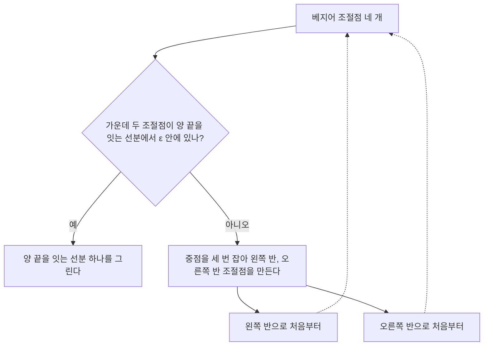



요약

화면에 곡선을 그리려면 결국 짧은 선분 여러 개로 바꿔야 한다. 베지어 곡선은 중점을 몇 번 잡기만 하면 왼쪽 반과 오른쪽 반, 두 개의 베지어 곡선으로 정확히 나뉜다. 나눈 조각이 충분히 평평해질 때까지 되풀이하고, 평평한 조각은 선분으로 그린다. 굽은 곳만 잘게 나누므로 효율적이다. 다른 곡선도 조절점을 베지어 조절점으로 바꾸면 같은 방법을 쓴다.

## 예시로 보기

곡선을 그리는 가장 쉬운 방법은 $$u$$를 일정 간격으로 놓고 점들을 선분으로 잇는 것이다. 간격이 촘촘할수록 보기 좋지만 계산이 늘고, 평평한 곳까지 똑같이 촘촘하게 나누는 낭비가 생긴다[^1].

조절점 $$\mathbf p_0 = (0, 0)$$, $$\mathbf p_1 = (0, 4)$$, $$\mathbf p_2 = (4, 4)$$, $$\mathbf p_3 = (4, 0)$$을 반으로 나눈다. 중점을 차례로 잡는다.

| 단계 | 계산 | 결과 |
|---|---|---|
| 1 | $$\mathbf l_1 = \frac{\mathbf p_0 + \mathbf p_1}{2}$$, $$\frac{\mathbf p_1 + \mathbf p_2}{2}$$, $$\mathbf r_2 = \frac{\mathbf p_2 + \mathbf p_3}{2}$$ | $$(0, 2)$$, $$(2, 4)$$, $$(4, 2)$$ |
| 2 | $$\mathbf l_2$$, $$\mathbf r_1$$: 1단계 이웃 점의 중점 | $$(1, 3)$$, $$(3, 3)$$ |
| 3 | $$\mathbf l_3 = \mathbf r_0 = \frac{\mathbf l_2 + \mathbf r_1}{2}$$ | $$(2, 3)$$ |

왼쪽 반의 조절점은 $$(0, 0), (0, 2), (1, 3), (2, 3)$$, 오른쪽 반은 $$(2, 3), (3, 3), (4, 2), (4, 0)$$이다. $$(2, 3)$$은 원래 곡선의 한가운데 점 $$\mathbf p(\frac12)$$다[^2][^s1].

회색 점선이 원래 조절점이고, 점으로 찍은 옅은 선이 중점을 잡는 단계다. 파란 선과 주황 선이 두 반쪽 곡선과 그 조절점이다. 두 반쪽은 $$(2, 3)$$에서 만나고, 이어 붙이면 원래 곡선과 똑같다. 새 조절점은 원래 조절점보다 곡선에 훨씬 가깝다[^s2].

검증: 예시 표와 카드 C2, 무작위 100개 곡선에서 $$\mathbf l(u) = \mathbf p(u/2)$$, $$\mathbf r(u) = \mathbf p((1 + u)/2)$$, 가운데 점과 도함수 공식, 슬라이드 p.25의 두 변환 행렬, 기준을 줄이면 조각이 늘어남(4 → 8 → 32) — [18_bezier-subdivision_verify.py](/Hongs_Blog/studies/numerical-analysis/code/18_bezier-subdivision_verify/)

## 정의

**입력:** 3차 베지어 조절점 $$\mathbf p_0..\mathbf p_3$$, 평평함 기준 $$\varepsilon > 0$$. **출력:** 곡선을 근사하는 선분 목록.

곡선을 반으로 나눠 왼쪽 반 $$\mathbf l(u)$$와 오른쪽 반 $$\mathbf r(u)$$를 각각 베지어 곡선으로 만들고, 두 반을 되풀이해 그린다[^3]. 왼쪽 반의 조절점은 대수로 구할 수 있다. 왼쪽 반은 $$\mathbf l(u) = \mathbf p(u/2)$$라 $$\mathbf l'(u) = \frac12\mathbf p'(u/2)$$다[^4].

$$\mathbf l_0 = \mathbf p_0, \qquad \mathbf l_3 = \mathbf p(\tfrac12) = \tfrac18(\mathbf p_0 + 3\mathbf p_1 + 3\mathbf p_2 + \mathbf p_3)$$

$$3(\mathbf l_1 - \mathbf l_0) = \tfrac12\mathbf p'(0) = \tfrac12\cdot3(\mathbf p_1 - \mathbf p_0), \qquad 3(\mathbf l_3 - \mathbf l_2) = \tfrac12\mathbf p'(\tfrac12) = \tfrac12\cdot\tfrac34(-\mathbf p_0 - \mathbf p_1 + \mathbf p_2 + \mathbf p_3)$$

이것을 풀면 중점만 쓰는 기하적 방법과 같다[^5].

$$\mathbf l_1 = \tfrac12(\mathbf p_0 + \mathbf p_1), \quad \mathbf r_2 = \tfrac12(\mathbf p_2 + \mathbf p_3), \quad \mathbf l_2 = \tfrac12\left(\mathbf l_1 + \tfrac{\mathbf p_1 + \mathbf p_2}{2}\right), \quad \mathbf r_1 = \tfrac12\left(\mathbf r_2 + \tfrac{\mathbf p_1 + \mathbf p_2}{2}\right), \quad \mathbf l_3 = \mathbf r_0 = \tfrac12(\mathbf l_2 + \mathbf r_1)$$

**언제 멈추나.** 곡선이 평평하거나 거의 평평해질 때까지 나눈다. $$\mathbf l_1$$과 $$\mathbf l_2$$가 $$\mathbf l_0$$과 $$\mathbf l_3$$을 잇는 선분에서 얼마나 떨어졌는지 재서, 기준보다 작으면 멈추고 선분 하나로 그린다[^6].

점선은 같은 절차를 반쪽 곡선에 다시 하는 자리다. 평평한 조각만 선분이 되어 나오고, 굽은 조각은 계속 반으로 나뉜다[^s3].

**다른 곡선 나누기.** 다른 곡선은 계산이 더 복잡하다. 그래서 같은 곡선을 내는 베지어 조절점으로 바꾼 뒤 위 방법을 쓴다[^7]. 곡선이 $$\mathbf p(u) = \mathbf u^\top M\mathbf p$$로 주어지면, $$\mathbf u^\top M_B\mathbf q$$와 같아야 하므로 $$\mathbf q = M_B^{-1}M\mathbf p$$다[^8]. $$M_B$$는 베지어 기하 행렬이다([추상 벡터공간과 베지어 곡선](/Hongs_Blog/studies/linear-algebra/abstract-vector-spaces/)의 과목별 관점).

$$M_B^{-1}M_I = \begin{pmatrix}1 & 0 & 0 & 0\\ -\frac56 & 3 & -\frac32 & \frac13\\ \frac13 & -\frac32 & 3 & -\frac56\\ 0 & 0 & 0 & 1\end{pmatrix}, \qquad M_B^{-1}M_S = \frac16\begin{pmatrix}1 & 4 & 1 & 0\\ 0 & 4 & 2 & 0\\ 0 & 2 & 4 & 0\\ 0 & 1 & 4 & 1\end{pmatrix}$$

왼쪽이 3차 보간 곡선, 오른쪽이 B-스플라인을 베지어로 바꾸는 행렬이다[^9].

**곡면 나누기.** 베지어 곡면 $$\mathbf P(u, v)$$의 조절점 $$4 \times 4$$에 대해 다음을 한다[^10].

1. $$u$$를 $$0, \frac13, \frac23, 1$$로 고정하고 네 곡선을 $$v$$ 방향으로 나눈다.
2. 나온 반쪽 곡선 8개마다 $$v$$를 $$0, \frac13, \frac23, 1$$로 고정하고 $$u$$ 방향으로 나눈다.
3. 곡면을 사분면마다 패치 넷으로 나누고 각각에 되풀이한다.
4. 다 나누면 사각형들로 그린다(OpenGL의 `GL_QUADS`).

## 활용

- 폰트 렌더러와 벡터 그래픽(PDF, SVG 뷰어)은 이런 적응형 세분화로 곡선을 선분으로 바꾼다. 이 중점 계산은 드 카스텔조 알고리즘을 $$u = \frac12$$에서 한 것이다[^s1].
- 복잡도: 한 번 나눌 때 덧셈과 반으로 나누기만 6번씩이다(곱셈 없음). 조각 수는 곡선의 굽은 정도와 $$\varepsilon$$에 달려 있다.
- 흔한 실수: 끝점 $$\mathbf l_0$$, $$\mathbf l_3$$만 비교해 평평함을 판정하는 것. 가운데 조절점이 멀리 있으면 끝점이 가까워도 크게 굽는다.

## 연결

- 선수: [추상 벡터공간과 베지어 곡선](/Hongs_Blog/studies/linear-algebra/abstract-vector-spaces/)(드 카스텔조, $$M_B$$), [B-스플라인](/Hongs_Blog/studies/numerical-analysis/b-spline/), [매개변수 곡면 패치](/Hongs_Blog/studies/numerical-analysis/surface-patches/)
- 같은 "반으로 나눠 스스로를 다시 부르기" 구조: [재귀와 백트래킹](/Hongs_Blog/studies/algorithms/recursion-backtracking/)

## 확인 문제

**C1** 조절점 $$(0, 0)$$, $$(0, 4)$$, $$(4, 4)$$, $$(4, 0)$$을 반으로 나눌 때 1·2·3단계의 중점을 차례로 쓰라.

**답:** 1단계 $$(0, 2)$$, $$(2, 4)$$, $$(4, 2)$$. 2단계 $$(1, 3)$$, $$(3, 3)$$. 3단계 $$(2, 3)$$. 왼쪽 반 $$(0,0), (0,2), (1,3), (2,3)$$, 오른쪽 반 $$(2,3), (3,3), (4,2), (4,0)$$.

**C2** 같은 곡선의 $$\mathbf p(\frac12)$$를 공식 $$\frac18(\mathbf p_0 + 3\mathbf p_1 + 3\mathbf p_2 + \mathbf p_3)$$로 구하고 C1의 3단계 결과와 비교하라.

**답:** $$\frac18((0,0) + (0,12) + (12,12) + (4,0)) = \frac18(16, 24) = (2, 3)$$. 3단계의 $$\mathbf l_3$$과 같다.

**C3** "평평하면 선분, 아니면 반으로 나눠 양쪽에 되풀이"하는 이 절차가 전체적으로 하는 일을 한 문장으로 쓰라.

**답:** 곡선을 굽은 정도에 맞춰 필요한 곳만 잘게 쪼개, 기준 이내의 오차로 곡선을 따라가는 선분 목록을 만든다.

**C4** B-스플라인을 그릴 때 베지어로 바꾼 뒤 세분화하는 이유는?

**답:** 베지어 곡선은 반으로 나눠도 다시 베지어 곡선이고, 새 조절점을 중점 계산만으로 얻는다. 다른 곡선은 이런 간단한 나누기 공식이 없다. $$\mathbf q = M_B^{-1}M_S\mathbf p$$로 같은 곡선을 내는 베지어 조절점을 구하면 이 쉬운 방법을 그대로 쓴다.

[^1]: 수치해석 8회 강의 자료 「na08_surfaces」, p.18
[^2]: 같은 자료, p.22
[^3]: 같은 자료, p.19
[^4]: 같은 자료, p.21
[^5]: 같은 자료, p.22
[^6]: 같은 자료, p.20
[^7]: 같은 자료, p.23
[^8]: 같은 자료, p.24
[^9]: 같은 자료, p.25
[^10]: 같은 자료, p.26
[^s1]: 보충 예시 수치, $$\mathbf l(u) = \mathbf p(u/2)$$의 설명, 폰트 렌더러·드 카스텔조, 연산 수, 흔한 실수, 카드는 원본에 없다. 검증 코드로 확인했다.
[^s2]: 보충 그림은 원본에 없다. [18_bezier-subdivision_plot.py](/Hongs_Blog/studies/numerical-analysis/code/18_bezier-subdivision_plot/)로 그렸고, 같은 코드로 다음 값을 확인했다: 표의 중점 $$(0, 2)$$, $$(2, 4)$$, $$(4, 2)$$, $$(1, 3)$$, $$(3, 3)$$, $$(2, 3)$$과, 왼쪽 반이 $$\mathbf p(u/2)$$, 오른쪽 반이 $$\mathbf p((1 + u)/2)$$와 같음.
[^s3]: 보충 다이어그램 1개는 원본에 없다. 이 문서 '정의'의 입출력, 반으로 나누기와 멈추는 기준(원본 08.na08_surfaces.pdf p.19~22)으로 그렸다.

