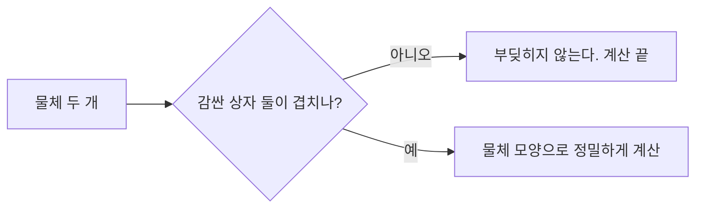



요약

복잡한 물체 두 개가 부딪히는지 매번 정확히 계산하면 너무 느리다. 그래서 물체를 감싸는 단순한 상자(경계 볼륨)를 먼저 비교하고, 상자가 겹칠 때만 정밀하게 계산한다. 좌표축에 나란한 상자는 만들기 쉽지만, 비스듬히 긴 물체에서는 빈 공간이 많아 쓸데없이 자주 겹친다. 점들이 가장 길게 퍼진 방향을 주성분 분석으로 찾아 그 방향으로 상자를 돌리면 훨씬 꼭 맞는다. 다만 상자를 돌린 만큼 겹침 판정이 조금 더 복잡해진다.

## 예시로 보기

비스듬히 길쭉한 점 구름을 감싼다. $$x$$, $$y$$축에 나란한 상자(왼쪽 그림)는 구름 양옆에 빈 공간이 크다. 구름의 방향에 맞춰 돌린 상자(오른쪽 그림)는 꼭 맞는다[^1][^2].

상자 비교는 싸고, 정밀 계산은 비싸다. 상자가 꼭 맞을수록 "예" 쪽으로 가는 헛걸음이 준다[^s3].

검증 코드에서 35° 기울어진 길이 10, 폭 1, 높이 1의 점 구름 400개를 감쌌다. 축에 나란한 상자의 부피는 52.48, 주성분 방향으로 돌린 상자는 13.72로 약 4분의 1이다[^s1].

같은 점 구름을 위에서 내려다본 모습이다. 주황 상자는 구름 양옆에 빈 곳이 넓고, 파란 상자는 구름 방향을 따라 꼭 맞는다[^s2].

검증: 슬라이드 예의 평균·공분산·특성다항식·고윳값·고유벡터, $$ACA^\top$$가 대각, 상자 부피 비교, 카드 C2 — [19_bounding-volume_verify.py](/Hongs_Blog/studies/numerical-analysis/code/19_bounding-volume_verify/)

## 정의

주성분은 모두 원점(평균)에서 시작한다. 첫 주성분은 분산이 가장 큰 방향이고, 다음 주성분들은 앞의 것과 수직이면서 남은 분산이 가장 큰 방향이다[^3].

점 $$\mathbf P_1, \dots, \mathbf P_N$$에 대해 평균과 $$3 \times 3$$ 공분산 행렬을 구한다[^4].

$$\mathbf m = \frac1N\sum_{i=1}^{N}\mathbf P_i, \qquad C = \frac1N\sum_{i=1}^{N}(\mathbf P_i - \mathbf m)(\mathbf P_i - \mathbf m)^\top$$

$$C$$의 칸은 $$x$$, $$y$$, $$z$$ 좌표 두 개씩이 함께 변하는 정도다. 대각 밖 칸이 0이면 그 두 좌표는 상관이 없고, $$C$$가 대각행렬이면 세 좌표가 서로 상관이 없다[^5].

점들을 $$A$$로 돌려 공분산을 대각으로 만들고 싶다. 돌린 점의 공분산은 다음과 같다[^6].

$$C' = \frac1N\sum_{i=1}^{N}(A\mathbf P_i - A\mathbf m)(A\mathbf P_i - A\mathbf m)^\top = ACA^\top$$

$$A$$의 행을 $$C$$의 단위 고유벡터로, 고윳값이 큰 순서로 놓으면 $$ACA^\top$$가 대각이 된다. $$C$$는 대칭이라 고유벡터들이 서로 수직이고 $$A$$는 회전(직교 행렬)이다[^6][^s1]. $$N$$차원에서도 똑같다. 고윳값이 가장 큰 고유벡터가 가장 많이 퍼진 방향, 가장 작은 것이 가장 덜 퍼진 방향이다[^7].

경계 상자는 각 점을 세 고유벡터에 사영(내적)해 축마다 최솟값과 최댓값을 잡아 만든다. 이것이 방향 경계 상자(OBB)다[^s1].

**슬라이드의 예.** 점 $$(-1, -2, 1)$$, $$(1, 0, 2)$$, $$(2, -1, 3)$$, $$(2, -1, 2)$$의 평균은 $$(1, -1, 2)$$다[^8].

$$C = \begin{pmatrix}\frac32 & \frac12 & \frac34\\ \frac12 & \frac12 & \frac14\\ \frac34 & \frac14 & \frac12\end{pmatrix}, \qquad \det(C - \lambda I) = -\lambda^3 + \tfrac52\lambda^2 - \tfrac78\lambda + \tfrac1{16}$$

고윳값은 $$\lambda_1 = 2.097$$, $$\lambda_2 = 0.3055$$, $$\lambda_3 = 0.09756$$이고 고유벡터는 $$R = (-0.833, -0.330, -0.443)$$, $$S = (-0.257, 0.941, -0.218)$$, $$T = (0.489, -0.0675, -0.870)$$이다[^9]. 이 세 방향의 상자는 폭이 3.717, 1.417, 0.870이고 부피가 약 4.58이다. 축에 나란한 상자의 부피 12보다 작다[^s1].

## 활용

- 게임·물리 엔진의 충돌 판정과 광선 추적의 가속 구조(경계 볼륨 계층, BVH)에서 정밀 계산 전에 상자로 걸러 낸다[^s1].
- 흔한 실수: 고유벡터를 꼭짓점 몇 개로만 구하는 것. 점이 고르게 퍼져 있지 않으면 주성분이 모양보다 점이 몰린 쪽을 따라간다. 또 PCA 상자가 늘 가장 작은 상자인 것은 아니다.

## 연결

- 선수: [주성분 분석](/Hongs_Blog/studies/probability-statistics/pca/), [좌표계 변환](/Hongs_Blog/studies/numerical-analysis/coordinate-frame/)(상자의 축으로 좌표 바꾸기)
- 고유벡터가 서로 수직인 이유: [대칭행렬과 스펙트럼 정리](/Hongs_Blog/studies/linear-algebra/spectral-theorem/)
- 상자와 광선의 교차: [점·직선·평면 사이의 거리와 교점](/Hongs_Blog/studies/numerical-analysis/distance-intersection/)

## 확인 문제

**C1** PCA로 방향 경계 상자를 만드는 순서를 쓰라.

**답:** 평균 $$\mathbf m$$을 구한다 → 공분산 $$C = \frac1N\sum(\mathbf P_i - \mathbf m)(\mathbf P_i - \mathbf m)^\top$$ → $$C$$의 단위 고유벡터를 고윳값 큰 순으로 → 점마다 세 고유벡터에 내적해 축별 최솟값·최댓값 → 그 범위가 상자.

**C2** 2차원 점 $$(0, 0)$$, $$(2, 2)$$, $$(4, 4)$$의 공분산 행렬과 첫 주성분 방향은?

**답:** 평균 $$(2, 2)$$, 편차 $$(-2,-2), (0,0), (2,2)$$. $$C = \frac13\begin{pmatrix}8 & 8\\ 8 & 8\end{pmatrix}$$. 고윳값 $$\frac{16}{3}$$, 0이고 첫 주성분은 $$(1, 1)/\sqrt2$$. 점이 모두 한 직선 위라 둘째 방향의 폭은 0이다.

**C3** $$A$$의 행을 $$C$$의 고유벡터로 두면 $$ACA^\top$$가 대각이 되는 이유는?

**답:** $$C\mathbf a_j = \lambda_j\mathbf a_j$$라 $$(ACA^\top)_{ij} = \mathbf a_i^\top C\mathbf a_j = \lambda_j\,\mathbf a_i\cdot\mathbf a_j$$다. 대칭행렬의 고유벡터는 서로 수직이고 단위 길이라 $$i \ne j$$이면 0, $$i = j$$이면 $$\lambda_i$$다.

[^1]: 2-2학기/수치해석/1.수업자료/09.na09_PCA.pdf, p.2
[^2]: 같은 자료, p.3
[^3]: 같은 자료, p.4
[^4]: 같은 자료, p.5
[^5]: 같은 자료, p.6~7
[^6]: 같은 자료, p.8
[^7]: 같은 자료, p.9
[^8]: 같은 자료, p.10
[^9]: 같은 자료, p.11
[^s1]: 에이전트 보충. 충돌 판정 동기, 점 구름 실험, 대칭이라 $$A$$가 회전이라는 설명, 사영으로 상자 만들기, 슬라이드 예의 상자 폭·부피, BVH, 흔한 실수, 카드 C2·C3은 원본에 없다. 검증 코드로 확인했다.
[^s2]: 에이전트 보충. 그림은 원본에 없다. [19_bounding-volume_plot.py](/Hongs_Blog/studies/numerical-analysis/code/19_bounding-volume_plot/)로 그렸고, 같은 코드로 다음 값을 확인했다: 검증 코드와 같은 난수로 만든 점 구름에서 상자 부피 52.48과 13.72, 첫 주성분이 35° 방향.
[^s3]: 에이전트 보충. 다이어그램 1개는 원본에 없다. 이 문서 요약과 '활용'의 충돌 판정 설명(원본 09.na09_PCA.pdf p.2~3)으로 그렸다.

