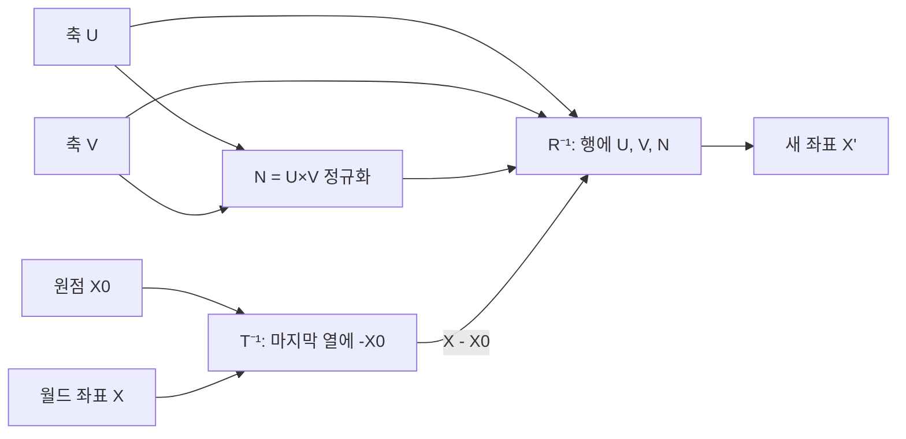



요약

같은 점도 누가 어디서 보느냐에 따라 좌표가 다르다. 카메라가 오른쪽으로 걸어가면, 카메라가 보는 세상은 왼쪽으로 움직인다. 좌표계를 옮기거나 돌리는 것은 점을 거꾸로 옮기거나 돌리는 것과 같다. 그래서 새 좌표계에서의 좌표는 원점을 빼고, 새 축 방향으로 얼마나 가는지 재서 얻는다. 다만 빼기(평행이동)를 돌리기보다 먼저 해야 한다.

## 예시로 보기

게임 속 카메라가 $$(1, 2, 3)$$에 서 있다. 카메라의 오른쪽은 월드의 $$+y$$, 위쪽은 월드의 $$-x$$ 방향이다. 월드 좌표 $$(1, 3, 3)$$에 있는 물체는 카메라에게 어디로 보일까?

1. 카메라 위치를 뺀다: $$(1, 3, 3) - (1, 2, 3) = (0, 1, 0)$$.
2. 새 축마다 내적해 얼마나 가는지 잰다. 오른쪽 축 $$U = (0, 1, 0)$$으로 1, 위쪽 축 $$V = (-1, 0, 0)$$으로 0, 앞 축 $$N = U \times V = (0, 0, 1)$$로 0.

카메라 좌표로 $$(1, 0, 0)$$, 곧 "오른쪽으로 1"이다[^s1].

검증: 예시, 원점이 (0,0,0)이 됨, 순서를 바꾸면 틀림, 좌표계 이동·회전 = 점의 반대 이동·회전, 무작위 100개 점의 되돌리기, 카드 C2 — [06_coordinate-frame_verify.py](/Hongs_Blog/studies/numerical-analysis/code/06_coordinate-frame_verify/)

## 정의

좌표계를 $$\mathbf t$$만큼 옮기는 것은 점을 $$-\mathbf t$$만큼 옮기는 것과 같다. 좌표계를 $$\theta$$만큼 돌리는 것은 점을 $$-\theta$$만큼 돌리는 것과 같다[^1][^2].

새 좌표계는 원점 $$X_0 = (x_0, y_0, z_0)$$와 서로 수직인 단위 축 $$U = (u_x, u_y, u_z)$$, $$V = (v_x, v_y, v_z)$$, $$N = (n_x, n_y, n_z)$$로 정한다. $$N$$은 $$U$$와 $$V$$로 만들 수 있다[^3].

$$N = \frac{U \times V}{\vert U \times V\vert }$$

월드 좌표 $$X$$를 새 좌표 $$X'$$로 바꾸는 순서는 평행이동 다음 회전이다[^4]. 먼저 $$T^{-1}$$로 원점 $$X_0$$를 빼고, 다음에 $$R^{-1}$$로 축을 맞춘다[^5].

$$X' = R^{-1}T^{-1}X, \qquad R^{-1} = \begin{pmatrix}u_x & u_y & u_z & 0\\ v_x & v_y & v_z & 0\\ n_x & n_y & n_z & 0\\ 0 & 0 & 0 & 1\end{pmatrix}, \qquad T^{-1} = \begin{pmatrix}1 & 0 & 0 & -x_0\\ 0 & 1 & 0 & -y_0\\ 0 & 0 & 1 & -z_0\\ 0 & 0 & 0 & 1\end{pmatrix}$$

$$R$$은 열에 $$U, V, N$$을 놓은 회전 행렬이다. 직교 행렬이라 역행렬은 전치, 곧 행에 $$U, V, N$$을 놓은 것이다. 그래서 $$R^{-1}$$을 곱하는 것은 축마다 내적하는 것이다: $$X' = (U\cdot(X - X_0),\ V\cdot(X - X_0),\ N\cdot(X - X_0))$$[^s1].

원점과 두 축으로 두 행렬을 만든다. 월드 좌표 $$X$$는 $$T^{-1}$$을 먼저, $$R^{-1}$$을 나중에 지나 새 좌표가 된다[^s2].

## 활용

- 그래픽스의 뷰 행렬(카메라 행렬)이 바로 이 $$R^{-1}T^{-1}$$이다. OpenGL의 `gluLookAt`는 카메라 위치와 바라보는 점, 위쪽 방향으로 $$U, V, N$$을 외적으로 만들어 이 행렬을 짠다[^s1].
- 흔한 실수: $$T^{-1}R^{-1}$$로 순서를 바꾸는 것. 그러면 원점의 위치까지 돌아가서 틀린다(검증 코드).

## 연결

- 선수: [동차 좌표](/Hongs_Blog/studies/numerical-analysis/homogeneous-coordinates/), [외적](/Hongs_Blog/studies/numerical-analysis/cross-product/), [기저 변환](/Hongs_Blog/studies/linear-algebra/change-of-basis/)(원점이 같은 경우)
- 바꾼 좌표계에서 화면으로: [평행 투영과 원근 투영](/Hongs_Blog/studies/numerical-analysis/projection/)

## 확인 문제

**C1** 원점 $$X_0$$와 축 $$U, V, N$$인 좌표계로 점 $$X$$를 바꾸는 식을 쓰라. 순서는?

**답:** $$X' = R^{-1}T^{-1}X$$. 먼저 $$T^{-1}$$로 $$X_0$$를 빼고, 다음 $$R^{-1}$$(행이 $$U, V, N$$)을 곱한다. 성분으로는 $$(U\cdot(X - X_0), V\cdot(X - X_0), N\cdot(X - X_0))$$.

**C2** 예시의 카메라(원점 $$(1, 2, 3)$$, $$U = (0, 1, 0)$$, $$V = (-1, 0, 0)$$)에서 월드 점 $$(0, 2, 5)$$의 카메라 좌표는?

**답:** $$X - X_0 = (-1, 0, 2)$$. $$U$$로 0, $$V$$로 1, $$N = (0, 0, 1)$$로 2. 답은 $$(0, 1, 2)$$.

**C3** 좌표계를 오른쪽으로 옮기면 왜 점의 좌표는 줄어드는가?

**답:** 좌표는 원점에서 잰 거리다. 원점이 점 쪽으로 다가오면 그 거리가 줄어든다. 그래서 좌표계를 $$+\mathbf t$$ 옮기는 것은 점을 $$-\mathbf t$$ 옮기는 것과 같다.

[^1]: 2-2학기/수치해석/1.수업자료/05.na05_ortho.pdf, p.7
[^2]: 같은 자료, p.8~9
[^3]: 같은 자료, p.10
[^4]: 같은 자료, p.11~12
[^5]: 같은 자료, p.13
[^s1]: 에이전트 보충. 카메라 예시, 내적으로 읽는 법, gluLookAt, 흔한 실수, 카드 C2·C3은 원본에 없다. 검증 코드로 확인했다.
[^s2]: 에이전트 보충. 다이어그램 1개는 원본에 없다. 이 문서 '정의'의 $$N = U \times V$$, $$X' = R^{-1}T^{-1}X$$와 두 행렬(원본 05.na05_ortho.pdf p.10~13)로 그렸다.

