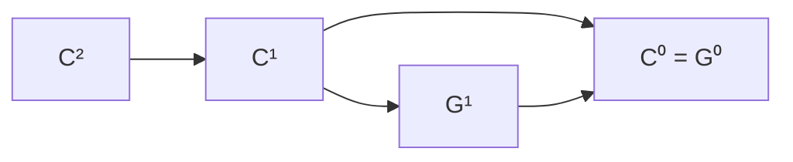
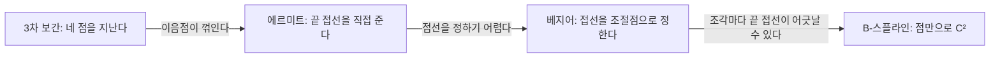



요약

곡선 조각 두 개를 이을 때 "얼마나 매끄럽게 이어졌나"를 단계로 나눈다. 끊기지만 않으면 $$C^0$$, 이음점에서 속도(1계 도함수)까지 같으면 $$C^1$$, 가속도(2계 도함수)까지 같으면 $$C^2$$다. 방향만 같고 빠르기는 달라도 되는 $$G^1$$은 눈으로 보기에는 매끄럽다. 단계가 높을수록 매끄럽지만, 그만큼 조절점을 마음대로 놓을 자유가 준다.

## 예시로 보기

자동차 경주 트랙을 곡선 조각으로 만든다. 이음점에서 길이 끊기면 안 되고($$C^0$$), 핸들을 갑자기 꺾게 되면 안 되고($$G^1$$ 또는 $$C^1$$), 핸들을 돌리는 빠르기도 갑자기 바뀌지 않아야 승차감이 좋다($$C^2$$).

3차 베지어 조각 $$A$$ = $$(0, 0)$$, $$(1, 2)$$, $$(3, 2)$$, $$(4, 0)$$ 뒤에 $$B$$를 붙인다. $$A$$는 끝에서 $$3(\mathbf p_3 - \mathbf p_2) = (3, -6)$$으로 나간다[^s1].

| $$B$$의 조절점 | $$B$$의 출발 속도 | 연속성 |
|---|---|---|
| $$(4, 0), (6, 3), (7, 1), (8, 0)$$ | $$(6, 9)$$ | $$C^0$$만 (꺾임) |
| $$(4, 0), (6, -4), (7, 1), (8, 0)$$ | $$(6, -12)$$ | $$G^1$$ (같은 방향, 두 배 빠르기) |
| $$(4, 0), (5, -2), (7, 1), (8, 0)$$ | $$(3, -6)$$ | $$C^1$$ |

파란 조각이 $$A$$, 주황 조각이 $$B$$이고, 점선은 조절점을 이은 선이다. 왼쪽은 이음점에서 뾰족하게 꺾인다. 가운데와 오른쪽은 $$A$$의 셋째 조절점, 이음점, $$B$$의 둘째 조절점이 한 직선 위에 있어 꺾이지 않는다. 오른쪽은 이음점 양쪽 간격까지 같아 $$C^1$$이다[^s2].

검증: 표의 세 경우, $$C^1$$ 경우의 2계 도함수가 다름, 카드 C2 — [15_curve-continuity_verify.py](/Hongs_Blog/studies/numerical-analysis/code/15_curve-continuity_verify/)

## 정의

두 조각 $$\mathbf p(u)$$, $$\mathbf q(u)$$($$0 \le u \le 1$$)를 $$\mathbf p(1) = \mathbf q(0)$$에서 잇는다[^1].

**매개변수 연속성**

- $$C^0$$: 이음점에서 곡선이 이어진다. 매끄럽지는 않을 수 있다.
- $$C^1$$: 이어지고, 두 조각의 도함수가 이음점에서 같다: $$\mathbf p'(1) = \mathbf q'(0)$$.
- $$C^2$$: 이어지고, 1계와 2계 도함수가 모두 같다.

**기하 연속성**

- $$G^0$$: $$C^0$$과 같다.
- $$G^1$$: 이어지고, 도함수의 방향이 같다. 크기는 달라도 된다.

$$C^1$$이면 $$G^1$$이지만 거꾸로는 아니다[^s1].

화살표는 "이것이면 저것도 된다"는 뜻이다. 거꾸로 가는 화살표는 없다[^s3].

**곡선 종류별 연속성**[^2]

| 곡선 | 이음점 | 이유 |
|---|---|---|
| 3차 보간 | $$C^0$$ | 위치만 맞춘다 |
| 에르미트 | $$C^1$$로 만들 수 있다 | 이음점의 도함수를 직접 준다 |
| 베지어 | $$C^0$$ (도함수가 맞지 않을 수 있다) | 조절점을 따로 놓으면 끝 접선이 어긋난다 |
| B-스플라인 | $$C^2$$ | 이웃 조각이 조절점 셋을 함께 쓴다 |

원하는 방법은 에르미트처럼 이음점이 매끄러우면서 베지어처럼 점들만으로 정하는 것이다. 스플라인이 두 가지를 모두 하고 $$C^2$$까지 준다[^2].

화살표 위의 말이 앞 곡선의 약점이고, 다음 곡선이 그 약점을 고친다[^s3].

베지어 조각을 $$C^1$$으로 잇는 조건은 $$3(\mathbf p_3 - \mathbf p_2) = 3(\mathbf q_1 - \mathbf q_0)$$이다. $$\mathbf q_0 = \mathbf p_3$$이므로 $$\mathbf q_1 = 2\mathbf p_3 - \mathbf p_2$$, 곧 $$\mathbf p_2$$, $$\mathbf p_3$$, $$\mathbf q_1$$이 한 직선 위에 같은 간격으로 놓이면 된다[^s1].

## 활용

- 그림 도구(일러스트레이터, 피그마)의 "부드러운 점"은 이음점 양쪽 핸들을 한 직선 위에 두어 $$G^1$$을 지키고, 길이까지 같게 하면 $$C^1$$이다[^s1].
- 도로·철도 설계와 카메라 경로처럼 가속도가 튀면 안 되는 곳에는 $$C^2$$를 요구한다.
- 흔한 실수: $$G^1$$과 $$C^1$$을 같은 것으로 보는 것. 모양은 같아 보여도 일정한 빠르기로 $$u$$를 움직이는 애니메이션에서는 이음점에서 속도가 튄다.

## 연결

- 선수: [에르미트 곡선](/Hongs_Blog/studies/numerical-analysis/hermite-curve/), [베지어 곡선](/Hongs_Blog/studies/linear-algebra/abstract-vector-spaces/)
- $$C^2$$를 주는 곡선: [B-스플라인](/Hongs_Blog/studies/numerical-analysis/b-spline/)
- 함수의 연속: [연속과 사잇값 정리](/Hongs_Blog/studies/calculus/continuity/)

## 확인 문제

**C1** $$C^0$$, $$C^1$$, $$C^2$$, $$G^1$$의 뜻을 쓰라.

**답:** $$C^0$$ 이어짐. $$C^1$$ 이어지고 1계 도함수가 같음. $$C^2$$ 1계와 2계 도함수까지 같음. $$G^1$$ 이어지고 1계 도함수의 방향이 같음(크기는 달라도 됨).

**C2** 3차 베지어 조각의 끝 두 조절점이 $$\mathbf p_2 = (3, 2)$$, $$\mathbf p_3 = (4, 0)$$이다. 다음 조각을 $$C^1$$로 이으려면 $$\mathbf q_0$$, $$\mathbf q_1$$은?

**답:** $$\mathbf q_0 = \mathbf p_3 = (4, 0)$$, $$\mathbf q_1 = 2\mathbf p_3 - \mathbf p_2 = (5, -2)$$.

**C3** 이음점에서 두 조각의 도함수가 $$(3, -6)$$과 $$(6, -12)$$다. $$C^1$$인가, $$G^1$$인가? 모양에서 차이가 보이는가?

**답:** 방향은 같고 크기가 두 배라 $$G^1$$이지만 $$C^1$$은 아니다. 모양에는 꺾임이 없어 매끄러워 보인다. 차이는 $$u$$를 일정하게 움직일 때 이음점에서 빠르기가 두 배로 튀는 것으로 나타난다.

[^1]: 수치해석 7회 강의 자료 「na07_curves」, p.25
[^2]: 같은 자료, p.26
[^s1]: 보충 트랙 비유, 표의 세 경우, $$C^1 \Rightarrow G^1$$, 표의 "이유" 칸, 베지어의 $$C^1$$ 조건, 그림 도구, 흔한 실수, 카드 C2·C3은 원본에 없다. 검증 코드로 확인했다.
[^s2]: 보충 그림은 원본에 없다. [15_curve-continuity_plot.py](/Hongs_Blog/studies/numerical-analysis/code/15_curve-continuity_plot/)로 그렸고, 같은 코드로 다음 값을 확인했다: $$A$$의 끝 속도 $$(3, -6)$$, $$B$$의 출발 속도 $$(6, 9)$$, $$(6, -12)$$, $$(3, -6)$$.
[^s3]: 보충 다이어그램 2개는 원본에 없다. 첫째는 이 문서 '정의'의 연속성 정의, 둘째는 '곡선 종류별 연속성' 표와 그 아래 문단(원본 07.na07_curves.pdf p.25~26), [3차 보간 곡선](/Hongs_Blog/studies/numerical-analysis/cubic-interpolation-curve/)과 [에르미트 곡선](/Hongs_Blog/studies/numerical-analysis/hermite-curve/)의 장단점으로 그렸다.

