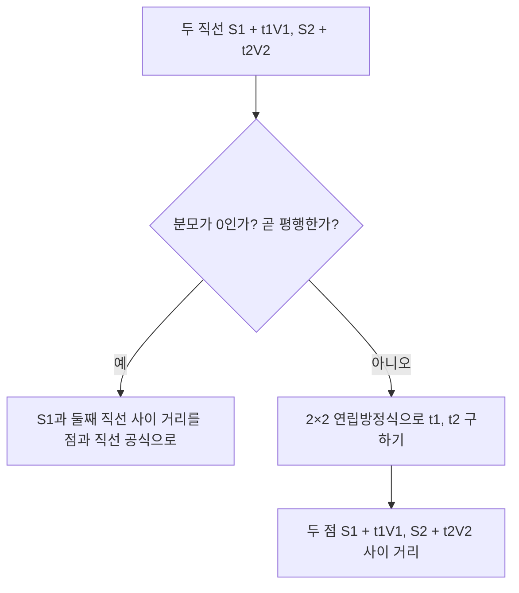



요약

3차원 공간에서 "얼마나 떨어져 있나"와 "어디서 만나나"를 재는 공식 모음이다. 점과 직선의 거리는 직선 방향 그림자를 빼고 남은 수직 부분의 길이이고, 두 직선의 거리는 두 직선 위 점 사이 거리를 가장 작게 만드는 위치에서 잰다. 평면과의 계산은 법선과의 내적 하나로 거리와 어느 쪽인지를 함께 준다. 다만 법선이 단위 벡터가 아니면 내적 값이 실제 거리가 아니다.

## 예시로 보기

게임에서 총알이 날아가는 직선이 적의 몸통(점)을 얼마나 아깝게 비켜 갔는지, 두 로봇 팔이 서로 부딪히는지(두 직선의 거리), 공이 바닥 아래로 빠졌는지(점과 평면의 부호)를 매 프레임 계산한다.

$$x$$축과, $$(0, 1, 0)$$을 지나 $$z$$ 방향으로 뻗은 직선은 서로 만나지도 평행하지도 않는다(꼬인 위치). 두 직선에서 가장 가까운 점은 $$(0, 0, 0)$$과 $$(0, 1, 0)$$이고 거리는 1이다. 그 둘을 잇는 선분은 두 직선 모두에 수직이다[^s1].

검증: 점과 직선의 거리를 무작위 100개에서 촘촘한 탐색과 비교, 예시, 무작위 50쌍에서 가장 짧은 선분이 두 직선에 수직, 평행이면 분모 0, 점-평면 부호와 단위 법선, 세 평면·두 평면의 교점, 카드 C2 — [12_distance-intersection_verify.py](/Hongs_Blog/studies/numerical-analysis/code/12_distance-intersection_verify/)

## 정의

직선은 점 $$S$$와 방향 $$V$$로 $$S + tV$$, 평면은 법선 $$N$$과 평면 위 점 $$P$$로 $$N\cdot(X - P) = 0$$이다. 평면을 $$L = \langle N, D\rangle = \langle N, -N\cdot P\rangle$$ 한 묶음으로도 쓴다[^1][^2].

### 점과 직선

$$Q - S$$를 직선 방향으로 사영한 부분을 빼면 수직 부분이 남는다. 피타고라스 정리로 그 길이가 거리다[^3].

$$d = \sqrt{\vert Q - S\vert ^2 - \frac{\big((Q - S)\cdot V\big)^2}{\vert V\vert ^2}}$$

### 두 직선

두 직선 $$S_1 + t_1V_1$$, $$S_2 + t_2V_2$$ 위 점 사이 거리의 제곱 $$f(t_1, t_2)$$를 가장 작게 하는 $$t_1, t_2$$를 찾는다[^4]. 최소인 곳에서 두 편미분이 0이다[^5].

$$\begin{pmatrix}V_1\cdot V_1 & -V_1\cdot V_2\\ V_1\cdot V_2 & -V_2\cdot V_2\end{pmatrix}\begin{pmatrix}t_1\\ t_2\end{pmatrix} = \begin{pmatrix}(S_2 - S_1)\cdot V_1\\ (S_2 - S_1)\cdot V_2\end{pmatrix}$$

$$\begin{pmatrix}t_1\\ t_2\end{pmatrix} = \frac{1}{(V_1\cdot V_2)^2 - \vert V_1\vert ^2\vert V_2\vert ^2}\begin{pmatrix}-V_2\cdot V_2 & V_1\cdot V_2\\ -V_1\cdot V_2 & V_1\cdot V_1\end{pmatrix}\begin{pmatrix}(S_2 - S_1)\cdot V_1\\ (S_2 - S_1)\cdot V_2\end{pmatrix}$$

두 직선이 평행하면 분모 $$(V_1\cdot V_2)^2 - \vert V_1\vert ^2\vert V_2\vert ^2$$이 0이다(코시-슈바르츠 부등식의 등호). 이때는 한 직선 위의 아무 점과 다른 직선 사이의 거리(점과 직선)로 잰다[^6].

먼저 평행인지 보고, 평행이면 점과 직선 문제로 넘긴다. 평행하지 않을 때만 $$t_1, t_2$$를 구한다[^s2].

### 점과 평면

$$d = N\cdot Q - N\cdot P = L\cdot Q \quad (Q \text{를 } (Q, 1)\text{로 보고})$$

$$d = 0$$이면 $$Q$$는 평면 위, $$d > 0$$이면 법선 쪽, $$d < 0$$이면 반대쪽이다[^7]. $$d$$가 실제 거리인 것은 $$\vert N\vert  = 1$$일 때다. 그렇지 않으면 $$d$$를 $$\vert N\vert $$로 나눈다[^s1].

### 교점

- **직선과 평면.** $$N\cdot(S + tV) + D = 0$$을 풀면 $$t = -\frac{N\cdot S + D}{N\cdot V}$$이다. $$N\cdot V = 0$$이면 평행이다[^8].
- **세 평면.** 세 식 $$N_i\cdot Q = N_i\cdot P_i$$를 모으면 $$MQ = \mathbf b$$다. $$M$$은 행이 $$N_1^\top, N_2^\top, N_3^\top$$인 행렬이라 $$Q = M^{-1}\mathbf b$$다[^9].
- **두 평면.** 교선의 방향은 두 법선에 모두 수직인 $$N_1 \times N_2$$다. 교선 위 한 점 $$Q$$는 셋째 식으로 "$$N_1 \times N_2$$ 방향 성분이 0"을 더해 구한다[^10].

$$Q = \begin{pmatrix}N_1\\ N_2\\ N_1 \times N_2\end{pmatrix}^{-1}\begin{pmatrix}N_1\cdot P_1\\ N_2\cdot P_2\\ 0\end{pmatrix}, \qquad X = Q + t(N_1 \times N_2)$$

## 활용

- 충돌 판정(캡슐 두 개가 닿는지는 두 선분의 거리), 광선과 면의 교차, 마우스로 3D 물체를 집기(화면에서 쏜 광선과 물체의 거리)에 쓴다[^s1].
- 흔한 실수: 선분인데 직선 공식을 그대로 쓰는 것. 구한 $$t$$가 $$[0, 1]$$ 밖이면 끝점까지의 거리로 바꿔야 한다.

## 연결

- 선수: [직선과 평면의 방정식](/Hongs_Blog/studies/numerical-analysis/lines-planes/), [직교성과 직교 사영](/Hongs_Blog/studies/linear-algebra/orthogonal-projection/)(사영), [다변수 함수와 편미분](/Hongs_Blog/studies/calculus/partial-derivatives/)(최소에서 편미분 0)
- 교선 방향: [외적](/Hongs_Blog/studies/numerical-analysis/cross-product/), 세 평면의 교점: [역행렬](/Hongs_Blog/studies/linear-algebra/inverse-matrix/)

## 확인 문제

**C1** 점과 직선의 거리, 점과 평면의 부호 있는 거리 공식을 쓰라.

**답:** $$d = \sqrt{\vert Q - S\vert ^2 - ((Q - S)\cdot V)^2/\vert V\vert ^2}$$. 평면은 $$d = N\cdot Q - N\cdot P$$, $$\vert N\vert  = 1$$일 때 거리이고 부호는 법선 쪽이면 양수.

**C2** 점 $$(2, 3, 4)$$와 직선 $$(1, 0, 0) + t(0, 0, 2)$$ 사이의 거리는?

**답:** $$Q - S = (1, 3, 4)$$, $$\vert Q - S\vert ^2 = 26$$, $$((Q - S)\cdot V)^2/\vert V\vert ^2 = 8^2/4 = 16$$. $$d = \sqrt{10}$$.

**C3** 두 직선 사이의 거리 공식에서 분모가 0이 되는 경우와 그 이유는?

**답:** 두 직선이 평행할 때. $$(V_1\cdot V_2)^2 = \vert V_1\vert ^2\vert V_2\vert ^2$$는 코시-슈바르츠 부등식의 등호이고, 두 방향이 평행할 때만 맞다. 평행하면 어느 위치에서나 거리가 같아 가장 가까운 $$t_1, t_2$$가 하나로 정해지지 않는다.

[^1]: 2-2학기/수치해석/1.수업자료/06.na06_rotation.pdf, p.34
[^2]: 같은 자료, p.39
[^3]: 같은 자료, p.35
[^4]: 같은 자료, p.36
[^5]: 같은 자료, p.37
[^6]: 같은 자료, p.38
[^7]: 같은 자료, p.39
[^8]: 같은 자료, p.40
[^9]: 같은 자료, p.41
[^10]: 같은 자료, p.42
[^s1]: 에이전트 보충. 꼬인 직선 예, 평행일 때 분모가 0인 이유(코시-슈바르츠), 단위 법선 조건, 교선의 셋째 식 설명, 충돌 판정 등 활용, 흔한 실수, 카드 C2·C3은 원본에 없다. 검증 코드로 확인했다.
[^s2]: 에이전트 보충. 다이어그램 1개는 원본에 없다. 이 문서 '두 직선' 절의 연립방정식과 평행일 때의 처리(원본 06.na06_rotation.pdf p.36~38)로 그렸다.

