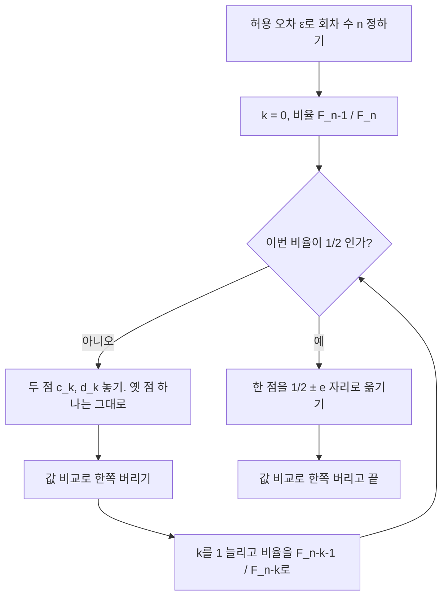



요약

황금분할 탐색처럼 단봉 함수의 최솟값 구간을 두 점 비교로 좁히되, 남기는 비율을 회차마다 피보나치 수의 비로 바꾼다. 원하는 정확도에서 회차 수를 미리 정하고, 그 회차 안에 정확히 끝나도록 비율을 맞춘다. 마지막 회차에서는 두 점이 겹치므로 아주 작은 값만큼 벌려 놓는다. 같은 계산 횟수에서 얻는 구간의 폭은 황금분할과 거의 같다.

## 예시로 보기

$$f(x) = x^2 - \sin x$$를 $$[0, 1]$$에서 허용 오차 $$\epsilon = 10^{-4}$$로 줄인다. 먼저 회차 수를 정한다. $$F_n > \frac{b_0 - a_0}{\epsilon} = 10{,}000$$인 가장 작은 $$n$$은 $$F_{21} = 10{,}946$$이라 $$n = 21$$이다[^1].

첫 두 점은 $$c_0 = 1 - \frac{F_{20}}{F_{21}} \approx 0.3819660$$, $$d_0 = \frac{F_{20}}{F_{21}} \approx 0.6180340$$이다. 황금분할의 점과 거의 같다. $$F_{20}/F_{21}$$이 황금비 0.618에 매우 가깝기 때문이다[^1][^s1].

| $$k$$ | $$a_k$$ | $$c_k$$ | $$d_k$$ | $$b_k$$ |
|---|---|---|---|---|
| 0 | 0 | 0.3819660 | 0.6180340 | 1 |
| 1 | 0 | 0.2360680 | 0.3819660 | 0.6180340 |
| 2 | 0.2360680 | 0.3819660 | 0.4721359 | 0.6180340 |
| ⋮ | | | | |
| 17 | 0.4501188 | 0.4502101 | 0.4503015 | 0.4503928 |
| 18 | 0.4501188 | 0.4502083 | 0.4502101 | 0.4503015 |

마지막 18회차에서 비율이 $$\frac12$$이라 두 점이 겹치므로 $$c_{18}$$을 $$0.5 - 0.01$$ 자리에 둔다[^2][^3].

회차마다 남기는 비율 $$r_k$$다. 열몇 회차까지는 황금비 0.618과 거의 같다. 끝으로 가면 작은 피보나치 수의 비(5/8, 3/5, 2/3)가 되어 출렁이고, 마지막에 $$\frac12$$이 된다[^s2].

검증: 피보나치 수, $$n = 21$$, 표의 0~4·16~18행, 단계 수 $$n - 2 = 19$$, 마지막 폭 $$\approx 2/F_{21}$$, $$c_{18}$$ 계산, 황금분할과 폭 비교, 카드 C2 — [26_fibonacci-search_impl.py](/Hongs_Blog/studies/numerical-analysis/code/26_fibonacci-search_impl/)

## 정의

피보나치 수는 $$F_0 = 0$$, $$F_1 = 1$$, $$F_n = F_{n-1} + F_{n-2}$$($$n \ge 2$$)다: $$0, 1, 1, 2, 3, 5, 8, 13, 21, \dots$$[^4]. 황금분할과 달리 비율 $$r$$이 회차마다 다르고, 회차 수는 허용 오차로 미리 정한다[^4].

**비율 정하기.** $$f(c_0) \le f(d_0)$$이면 $$[a_1, b_1] = [a_0, d_0]$$이고 $$d_1 = c_0$$이다. 다음 회차의 비율 $$r_1$$은 옛 점 $$c_0$$이 새 구간에서 다시 쓰이도록 $$d_0 - c_0 = b_1 - d_1$$에서 정한다[^5][^6].

$$r_1 = \frac{1 - r_0}{r_0}$$

$$r_0 = \frac{F_{n-1}}{F_n}$$로 두면 $$r_1 = \frac{F_n - F_{n-1}}{F_{n-1}} = \frac{F_{n-2}}{F_{n-1}}$$이다. 같은 식으로 $$r_k = \frac{F_{n-1-k}}{F_{n-k}}$$이고, $$r_{n-3} = \frac{F_2}{F_3} = \frac12$$에서 더 넣을 점이 없다. 모두 $$(n - 3) + 1 = n - 2$$단계다[^7].

**마지막 구간.** 구간은 회차마다 $$r_k$$배가 된다. 곱하면 $$\frac{F_{n-1}}{F_n}\cdot\frac{F_{n-2}}{F_{n-1}}\cdots\frac{F_2}{F_3} = \frac{F_2}{F_n} = \frac{1}{F_n}$$이라 마지막 길이는 $$\frac{b_0 - a_0}{F_n}$$이다[^8].

**회차 수와 점.** 허용 오차 $$\epsilon$$에 대해 $$\frac{b_0 - a_0}{F_n} < \epsilon$$, 곧 $$F_n > \frac{b_0 - a_0}{\epsilon}$$인 가장 작은 $$n$$을 고른다. $$k$$번째 구간 $$[a_k, b_k]$$의 두 점은 다음과 같다[^9].

$$c_k = a_k + \left(1 - \frac{F_{n-k-1}}{F_{n-k}}\right)(b_k - a_k), \qquad d_k = a_k + \frac{F_{n-k-1}}{F_{n-k}}(b_k - a_k)$$

마지막 $$r_{n-3} = \frac12$$에서는 두 점이 같아진다. 그래서 작은 구별 상수 $$e$$를 두고 $$(b_k - a_k)$$의 계수를 $$\frac12 - e$$나 $$\frac12 + e$$로 한다[^10].

비율이 회차마다 작은 피보나치 수의 비로 바뀌다가 $$\frac12$$이 되는 회차에서 멈춘다. 그 마지막 회차만 구별 상수가 필요하다[^s3].

원본 오류 의심

원문: $$c_{18} = 0.4501188 - 0.49(0.450315 - 0.4501188) \approx 0.4502083$$ (p.28) / 문제점: $$b_{18}$$은 0.4503015인데 0.450315로 적었다. 부호를 $$+$$로 바로잡아도 0.450315를 넣으면 0.4502149가 나온다. 바로 윗줄의 식 $$c_{18} = a_{18} + (0.5 - 0.01)(b_{18} - a_{18})$$과 달리 0.49 앞의 부호도 $$-$$로 적었다. 적힌 숫자 그대로 계산하면 0.4500227이 나와 결과 0.4502083과 맞지 않는다 / 수정안: $$0.4501188 + 0.49(0.4503015 - 0.4501188) \approx 0.4502083$$ / 근거: 같은 자료 p.29 표의 $$b_{18} = 0.4503015$$, 26_fibonacci-search_impl.py로 계산[^2]

## 활용

- 같은 함수 계산 20번에서 이 예의 마지막 폭은 피보나치 약 0.000183, 황금분할 약 0.000173으로 거의 같다. 구별 상수 때문에 피보나치가 조금 넓다. 피보나치는 허용 오차에서 계산 횟수를 정확히 정해 두는 것이 장점이고, 황금분할은 비율이 고정이라 구현이 쉽다[^s1].
- 흔한 실수: 피보나치 수의 첨자를 다른 정의($$F_0 = F_1 = 1$$)와 섞는 것. 그러면 $$n$$이 하나 어긋난다.

## 연결

- 선수: [황금분할 탐색](/Hongs_Blog/studies/numerical-analysis/golden-section-search/), [선형 점화식](/Hongs_Blog/studies/discrete-math/linear-recurrences/)($$F_{n-1}/F_n \to$$ 황금비)
- 여러 변수로: [직접 탐색법](/Hongs_Blog/studies/numerical-analysis/direct-search/)

## 확인 문제

**C1** 피보나치 탐색에서 회차 수 $$n$$을 정하는 조건과 $$k$$번째 두 점의 공식을 쓰라.

**답:** $$F_n > \frac{b_0 - a_0}{\epsilon}$$인 가장 작은 $$n$$. $$c_k = a_k + (1 - \frac{F_{n-k-1}}{F_{n-k}})(b_k - a_k)$$, $$d_k = a_k + \frac{F_{n-k-1}}{F_{n-k}}(b_k - a_k)$$.

**C2** 폭 1인 구간을 허용 오차 0.01로 줄이려면 $$n$$은?

**답:** $$F_n > 100$$인 가장 작은 $$n$$. $$F_{11} = 89$$, $$F_{12} = 144$$라 $$n = 12$$.

**C3** 마지막 회차에 구별 상수 $$e$$가 필요한 이유는?

**답:** 마지막 비율이 $$\frac{F_2}{F_3} = \frac12$$라 두 안쪽 점이 구간 한가운데에서 겹친다. 같은 점의 값을 두 번 비교해서는 어느 쪽을 버릴지 정할 수 없으므로, 한 점을 $$\frac12 \pm e$$로 조금 옮긴다.

**C4** 함수 계산 횟수가 정확히 30번으로 정해진 실험이다. 황금분할과 피보나치 중 무엇이 더 자연스러운가? 다른 쪽은 왜 덜 맞는가?

**답:** 피보나치. 계산 횟수에서 $$n$$을 정하고 그 안에 정확히 끝나도록 비율을 맞춘다. 황금분할은 비율이 고정이라 멈추는 시점을 따로 정해야 하고, 정해진 횟수에 딱 맞춰 끝나도록 설계되어 있지 않다. 두 방법의 마지막 폭은 거의 같다.

[^1]: 수치해석 14회 강의 자료 「na14_optimization」, p.27
[^2]: 같은 자료, p.28
[^3]: 같은 자료, p.29
[^4]: 같은 자료, p.19
[^5]: 같은 자료, p.20~21
[^6]: 같은 자료, p.22
[^7]: 같은 자료, p.23
[^8]: 같은 자료, p.24
[^9]: 같은 자료, p.25
[^10]: 같은 자료, p.26
[^s1]: 보충 황금비와의 관계, 두 방법의 폭 비교, 장단점, 흔한 실수, 카드 C2~C4는 원본에 없다. 구현 코드로 확인했다.
[^s2]: 보충 그림은 원본에 없다. [26_fibonacci-search_plot.py](/Hongs_Blog/studies/numerical-analysis/code/26_fibonacci-search_plot/)로 그렸고, 같은 코드로 다음 값을 확인했다: $$F_{21} = 10{,}946$$, $$r_0 \approx 0.6180340$$, $$r_{18} = \frac12$$, 비율을 모두 곱하면 $$\frac{1}{F_{21}}$$.
[^s3]: 보충 다이어그램 1개는 원본에 없다. 이 문서 '정의'의 비율 정하기, 회차 수와 점, 구별 상수(원본 14.na14_optimization.pdf p.20~26)로 그렸다.

