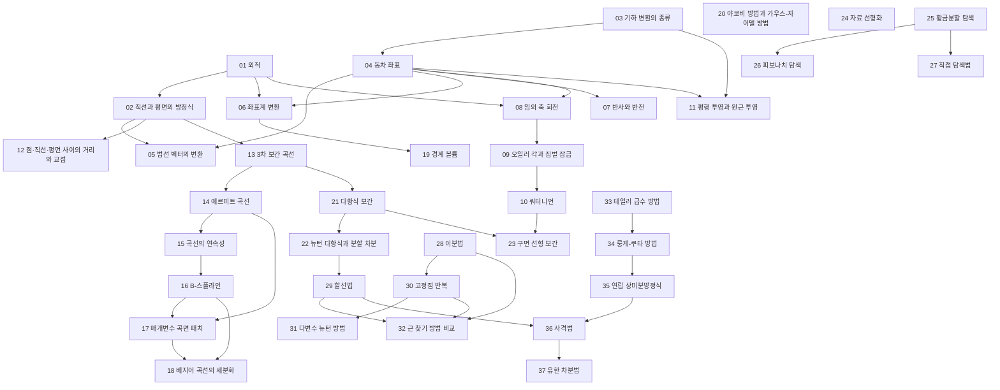


## 먼저 알아야 할 것
- [벡터](/Hongs_Blog/studies/linear-algebra/vectors/), [내적과 노름](/Hongs_Blog/studies/linear-algebra/dot-product/), [선형독립](/Hongs_Blog/studies/linear-algebra/linear-independence/) (공학수학 선형대수학): 2회 앞부분의 좌표, 벡터 연산, 내적, 선형독립, 기저
- [행렬과 행렬-벡터 곱](/Hongs_Blog/studies/linear-algebra/matrix-vector/), [행렬 곱셈과 전치](/Hongs_Blog/studies/linear-algebra/matrix-multiplication/) (공학수학 선형대수학): 3회의 행렬 종류, 곱셈, 전치, 블록 분할
- [행렬식](/Hongs_Blog/studies/linear-algebra/determinant/), [역행렬](/Hongs_Blog/studies/linear-algebra/inverse-matrix/), [대각화와 행렬 거듭제곱](/Hongs_Blog/studies/linear-algebra/diagonalization/) (공학수학 선형대수학): 3회 전체. 문서의 `과목별 관점`에 슬라이드의 여인수 전개, 부분 피벗팅 가우스–조르당, 대각화 예가 있다
- [직교성과 직교 사영](/Hongs_Blog/studies/linear-algebra/orthogonal-projection/) (공학수학 선형대수학): 5회의 직교 행렬과 두 정리. 문서의 `과목별 관점`에 있다
- [추상 벡터공간과 베지어 곡선](/Hongs_Blog/studies/linear-algebra/abstract-vector-spaces/) (공학수학 선형대수학): 7회의 베지어 곡선. 문서의 `과목별 관점`에 기하 행렬 $$M_B$$와 끝 접선이 있다
- [주성분 분석](/Hongs_Blog/studies/probability-statistics/pca/) (공학수학 확률과 통계): 9회의 PCA
- [LU 분해](/Hongs_Blog/studies/linear-algebra/lu-decomposition/) (공학수학 선형대수학): 10회 전체. 문서의 `과목별 관점`에 있다
- [도함수의 활용과 최적화](/Hongs_Blog/studies/calculus/curve-analysis/) (공학수학 미분적분학): 14회 앞부분의 극값 판정. 문서의 `과목별 관점`에 있다
- [헤세 행렬과 극값 판정](/Hongs_Blog/studies/calculus/hessian/), [경사 하강법](/Hongs_Blog/studies/calculus/gradient-descent/) (공학수학 미분적분학): 15회의 헤세 판정·중심 차분과 기울기·최급상승법. 문서의 `과목별 관점`에 있다
- [선형 근사와 뉴턴 방법](/Hongs_Blog/studies/calculus/linear-approx-newton/) (공학수학 미분적분학): 16회의 뉴턴-랩슨 방법. 문서의 `과목별 관점`에 있다
- [미분방정식과 오일러 방법](/Hongs_Blog/studies/calculus/ode-euler/), [테일러 급수](/Hongs_Blog/studies/calculus/taylor-series/) (공학수학 미분적분학): 18회의 오일러 방법(문서의 `과목별 관점`)과 테일러 급수
- [최소제곱법](/Hongs_Blog/studies/linear-algebra/least-squares/) (공학수학 선형대수학): 13회의 오차 노름, 최소제곱 직선과 포물선. 문서의 `과목별 관점`에 있다
- [선형변환](/Hongs_Blog/studies/linear-algebra/linear-transformations/), [기저 변환](/Hongs_Blog/studies/linear-algebra/change-of-basis/) (공학수학 선형대수학): 4·5회의 변환과 좌표계

> 자료 출처: 강의 슬라이드 18개(2~19회, 그래픽스 응용 중심). 1회 슬라이드와 필기는 자료에 없다.

## 2회 · 벡터, 직선과 평면

읽기 전에

1. $$y = mx + b$$로 수직선 $$x = 3$$을 적을 수 있을까? → [직선과 평면의 방정식](/Hongs_Blog/studies/numerical-analysis/lines-planes/)
2. 두 벡터에 모두 수직인 벡터를 계산 한 번으로 만들 수 있을까? → [외적](/Hongs_Blog/studies/numerical-analysis/cross-product/)

| 번호 | 개념 | 한 줄 | 개념 코드 | 연습 |
|---|---|---|---|---|
| 01 | [외적](/Hongs_Blog/studies/numerical-analysis/cross-product/) | 두 벡터에 모두 수직, 길이는 평행사변형 넓이, 오른손 법칙 | [verify](/Hongs_Blog/studies/numerical-analysis/code/01_cross-product_verify/) | — |
| 02 | [직선과 평면의 방정식](/Hongs_Blog/studies/numerical-analysis/lines-planes/) | 직선 $$\mathbf x = \mathbf a u + \mathbf b$$, 평면 $$(\mathbf x - \mathbf x_0)\cdot\mathbf n = 0$$, 부호로 어느 쪽인지 | [verify](/Hongs_Blog/studies/numerical-analysis/code/02_lines-planes_verify/) | — |

자료: na02_vector
필기: 아직 없다.
떠올려 보기: 노트를 닫고 직선의 매개변수 식, 평면의 법선 식, 점이 어느 쪽인지 판정하는 법, 직선과 평면의 교점 공식을 한 장에 써 본다.

## 3회 · 행렬
개념: 이 회차는 공학수학 선형대수학 문서에 `과목별 관점`으로 합쳤다(위 '먼저 알아야 할 것'). 고윳값 정의는 [고윳값과 고유벡터](/Hongs_Blog/studies/linear-algebra/eigenvalues/)에 있다.
자료: na03_matrix
필기: 아직 없다.

## 4회 · 기하 변환

읽기 전에

1. 회전은 행렬 곱인데 평행이동은 덧셈이다. 둘을 행렬 하나로 묶을 수 있을까? → [동차 좌표](/Hongs_Blog/studies/numerical-analysis/homogeneous-coordinates/)
2. 넓이를 지키는 변환은 길이도 지킬까? → [기하 변환의 종류](/Hongs_Blog/studies/numerical-analysis/transformation-classes/)

| 번호 | 개념 | 한 줄 | 개념 코드 | 연습 |
|---|---|---|---|---|
| 03 | [기하 변환의 종류](/Hongs_Blog/studies/numerical-analysis/transformation-classes/) | 무엇을 지키나: 강체(거리) ⊂ 닮음(각) ⊂ 아핀(평행) ⊂ 사영(곧은 선) | [verify](/Hongs_Blog/studies/numerical-analysis/code/03_transformation-classes_verify/) | — |
| 04 | [동차 좌표](/Hongs_Blog/studies/numerical-analysis/homogeneous-coordinates/) | 끝에 1을 붙여 평행이동도 행렬 곱. 오른쪽 행렬이 먼저 (강조)[^강조] | [verify](/Hongs_Blog/studies/numerical-analysis/code/04_homogeneous-coordinates_verify/) | [동차 좌표 예제 사다리](/Hongs_Blog/studies/numerical-analysis/homogeneous-ladder/) · [문제 코드](/Hongs_Blog/studies/numerical-analysis/code/04_homogeneous-ladder_p4/) |

자료: na04_transformation
필기: 아직 없다.
떠올려 보기: 노트를 닫고 강체·닮음·아핀·사영 변환을 '지키는 것'으로 포함 관계 그림을 그리고, 점 $$P$$ 중심 회전을 동차 좌표 행렬 곱으로 써 본다.

## 5회 · 직교 행렬과 좌표계

읽기 전에

1. 면을 $$x$$ 방향으로 2배 늘리면, 면의 법선도 같은 행렬로 바꾸면 될까? → [법선 벡터의 변환](/Hongs_Blog/studies/numerical-analysis/normal-transform/)
2. 카메라가 오른쪽으로 움직이면 화면 속 물체의 좌표는 어떻게 될까? → [좌표계 변환](/Hongs_Blog/studies/numerical-analysis/coordinate-frame/)

| 번호 | 개념 | 한 줄 | 개념 코드 | 연습 |
|---|---|---|---|---|
| 05 | [법선 벡터의 변환](/Hongs_Blog/studies/numerical-analysis/normal-transform/) | 법선은 $$(M^{-1})^\top$$로. 직교 행렬이면 $$M$$ 그대로 | [verify](/Hongs_Blog/studies/numerical-analysis/code/05_normal-transform_verify/) | — |
| 06 | [좌표계 변환](/Hongs_Blog/studies/numerical-analysis/coordinate-frame/) | 원점을 빼고 새 축마다 내적: $$X' = R^{-1}T^{-1}X$$ | [verify](/Hongs_Blog/studies/numerical-analysis/code/06_coordinate-frame_verify/) | — |

자료: na05_ortho
필기: 아직 없다.
떠올려 보기: 노트를 닫고 직교 행렬의 정의와 두 정리(정규직교 열, 길이·각 보존), 법선 변환식, 좌표계 변환 $$X' = R^{-1}T^{-1}X$$를 써 본다.

## 6회 · 반사, 회전, 투영

읽기 전에

1. 비스듬한 축을 중심으로 돌리는 행렬을 기본 회전만으로 만들 수 있을까? → [임의 축 회전](/Hongs_Blog/studies/numerical-analysis/axis-rotation/)
2. 세 각도로 자세를 적으면 무엇이 문제일까? → [오일러 각과 짐벌 잠금](/Hongs_Blog/studies/numerical-analysis/euler-angles/)
3. 철길이 멀리서 한 점으로 모여 보이는 것을 행렬로 쓸 수 있을까? → [평행 투영과 원근 투영](/Hongs_Blog/studies/numerical-analysis/projection/)

| 번호 | 개념 | 한 줄 | 개념 코드 | 연습 |
|---|---|---|---|---|
| 07 | [반사와 반전](/Hongs_Blog/studies/numerical-analysis/reflection/) | 축으로 옮기기 → 축에 대해 부호 뒤집기 → 되돌리기 | [verify](/Hongs_Blog/studies/numerical-analysis/code/07_reflection_verify/) | — |
| 08 | [임의 축 회전](/Hongs_Blog/studies/numerical-analysis/axis-rotation/) | 다섯 단계로 축을 $$x$$축에 맞추거나 로드리게스 공식 하나로 (강조)[^강조] | [verify](/Hongs_Blog/studies/numerical-analysis/code/08_axis-rotation_verify/) | [임의 축 회전 예제 사다리](/Hongs_Blog/studies/numerical-analysis/axis-rotation-ladder/) · [문제 코드](/Hongs_Blog/studies/numerical-analysis/code/08_axis-rotation-ladder_p4/) |
| 09 | [오일러 각과 짐벌 잠금](/Hongs_Blog/studies/numerical-analysis/euler-angles/) | 기본 회전 세 번. 가운데가 90°이면 자유도 하나를 잃는다 | [verify](/Hongs_Blog/studies/numerical-analysis/code/09_euler-angles_verify/) | — |
| 10 | [쿼터니언](/Hongs_Blog/studies/numerical-analysis/quaternion/) | $$q = (\cos\frac\theta2, \sin\frac\theta2\mathbf n)$$, $$q\mathbf v\bar q$$. 짐벌 잠금 없음, 매끄러운 보간 | [verify](/Hongs_Blog/studies/numerical-analysis/code/10_quaternion_verify/) | — |
| 11 | [평행 투영과 원근 투영](/Hongs_Blog/studies/numerical-analysis/projection/) | 평행은 크기 그대로, 원근은 $$z$$로 나눠 먼 것이 작게 | [verify](/Hongs_Blog/studies/numerical-analysis/code/11_projection_verify/) | — |
| 12 | [점·직선·평면 사이의 거리와 교점](/Hongs_Blog/studies/numerical-analysis/distance-intersection/) | 사영을 빼고 남은 수직 부분, 편미분 0, 법선과의 내적 | [verify](/Hongs_Blog/studies/numerical-analysis/code/12_distance-intersection_verify/) | — |

자료: na06_rotation
필기: 아직 없다.
떠올려 보기: 노트를 닫고 회전을 나타내는 세 방법(기본 회전의 곱, 축-각과 로드리게스, 쿼터니언)을 장단점과 함께 표로 쓰고, 원근 투영 행렬을 써 본다.

## 7회 · 곡선

읽기 전에

1. 네 점을 모두 지나는 3차 곡선을 이어 붙이면 이음점이 매끄러울까? → [에르미트 곡선](/Hongs_Blog/studies/numerical-analysis/hermite-curve/)
2. 곡선이 조절점을 꼭 지나지 않아도 된다면 무엇을 얻을까? → [B-스플라인](/Hongs_Blog/studies/numerical-analysis/b-spline/)
3. 두 곡선이 같은 방향으로 이어지면 '매끄럽다'고 해도 될까? → [곡선의 연속성](/Hongs_Blog/studies/numerical-analysis/curve-continuity/)

| 번호 | 개념 | 한 줄 | 개념 코드 | 연습 |
|---|---|---|---|---|
| 13 | [3차 보간 곡선](/Hongs_Blog/studies/numerical-analysis/cubic-interpolation-curve/) | 네 점을 $$u = 0, \frac13, \frac23, 1$$에서 지나게. $$\mathbf p(u) = \mathbf u^\top M_I\mathbf p$$ | [verify](/Hongs_Blog/studies/numerical-analysis/code/13_cubic-interpolation_verify/) | — |
| 14 | [에르미트 곡선](/Hongs_Blog/studies/numerical-analysis/hermite-curve/) | 끝점 둘과 끝 접선 둘로. 이음점 기울기를 맞출 수 있다 | [verify](/Hongs_Blog/studies/numerical-analysis/code/14_hermite-curve_verify/) | — |
| 15 | [곡선의 연속성](/Hongs_Blog/studies/numerical-analysis/curve-continuity/) | $$C^0$$ 이어짐, $$C^1$$ 속도, $$C^2$$ 가속도, $$G^1$$ 방향만 | [verify](/Hongs_Blog/studies/numerical-analysis/code/15_curve-continuity_verify/) | — |
| 16 | [B-스플라인](/Hongs_Blog/studies/numerical-analysis/b-spline/) | 점을 지나지 않고 근처를 지나며 $$C^2$$, 점 하나는 조각 넷에만 (강조)[^강조] | [verify](/Hongs_Blog/studies/numerical-analysis/code/16_b-spline_verify/) | [B-스플라인 예제 사다리](/Hongs_Blog/studies/numerical-analysis/b-spline-ladder/) · [문제 코드](/Hongs_Blog/studies/numerical-analysis/code/16_b-spline-ladder_p4/) |

자료: na07_curves
필기: 아직 없다.
떠올려 보기: 노트를 닫고 3차 보간·에르미트·베지어·B-스플라인을 '무엇으로 정하나, 점을 지나나, 이음점 연속성, 블렌딩 함수가 0 이상인가' 네 칸의 표로 쓰고, 네 기하 행렬 $$M_I, M_H, M_B, M_S$$가 같은 틀 $$\mathbf u^\top M\mathbf p$$에서 나온다는 것을 설명해 본다.

## 8회 · 곡면

읽기 전에

1. 네 꼭짓점만으로 휘어진 곡면을 만들 수 있을까? → [매개변수 곡면 패치](/Hongs_Blog/studies/numerical-analysis/surface-patches/)
2. 곡선을 화면에 그리려면 몇 개의 선분으로 나눠야 할까? → [베지어 곡선의 세분화](/Hongs_Blog/studies/numerical-analysis/bezier-subdivision/)

| 번호 | 개념 | 한 줄 | 개념 코드 | 연습 |
|---|---|---|---|---|
| 17 | [매개변수 곡면 패치](/Hongs_Blog/studies/numerical-analysis/surface-patches/) | $$u$$, $$v$$ 두 방향: 쌍선형, 쌍3차(꼬임 벡터), 베지어, 스플라인 | [verify](/Hongs_Blog/studies/numerical-analysis/code/17_surface-patches_verify/) | — |
| 18 | [베지어 곡선의 세분화](/Hongs_Blog/studies/numerical-analysis/bezier-subdivision/) | 중점만으로 반씩 나눠 평평할 때까지. 다른 곡선은 $$M_B^{-1}M$$으로 바꿔서 | [verify](/Hongs_Blog/studies/numerical-analysis/code/18_bezier-subdivision_verify/) | — |

자료: na08_surfaces
필기: 아직 없다.
떠올려 보기: 노트를 닫고 곡면 패치 네 종류의 식과 장단점, 베지어 곡선을 반으로 나누는 중점 계산 세 단계를 써 본다.

## 9회 · 경계 볼륨과 PCA

읽기 전에

1. 비스듬히 길쭉한 물체를 감싸는 가장 작은 상자는 어느 방향일까? → [경계 볼륨](/Hongs_Blog/studies/numerical-analysis/bounding-volume/)

| 번호 | 개념 | 한 줄 | 개념 코드 | 연습 |
|---|---|---|---|---|
| 19 | [경계 볼륨](/Hongs_Blog/studies/numerical-analysis/bounding-volume/) | 물체를 감싸는 상자. PCA 방향으로 돌리면 꼭 맞는다 | [verify](/Hongs_Blog/studies/numerical-analysis/code/19_bounding-volume_verify/) | — |

자료: na09_PCA
필기: 아직 없다.
떠올려 보기: 노트를 닫고 점 네 개로 평균, 공분산, 고유벡터, 상자의 폭을 구하는 순서를 처음부터 써 본다.

## 10회 · 삼각 행렬과 LU 분해
개념: 이 회차는 공학수학 [LU 분해](/Hongs_Blog/studies/linear-algebra/lu-decomposition/)의 `과목별 관점`으로 합쳤다(삼각 연립방정식, 둘리틀 방법, 오차 줄이기, 역행렬). 슬라이드 p.11·p.14의 문제는 그 문서의 카드 C4와 본문에 답이 있다.
자료: na10_decomposition
필기: 아직 없다.

## 11회 · 반복법

읽기 전에

1. 미지수가 10만 개인 연립방정식을 소거법 대신 '대충 넣고 고치기'로 풀 수 있을까? → [야코비 방법과 가우스-자이델 방법](/Hongs_Blog/studies/numerical-analysis/jacobi-gauss-seidel/)
2. 식의 순서를 바꾸기만 해도 반복법이 실패할 수 있을까? → [야코비 방법과 가우스-자이델 방법](/Hongs_Blog/studies/numerical-analysis/jacobi-gauss-seidel/)

| 번호 | 개념 | 한 줄 | 개념 코드 | 연습 |
|---|---|---|---|---|
| 20 | [야코비 방법과 가우스-자이델 방법](/Hongs_Blog/studies/numerical-analysis/jacobi-gauss-seidel/) | 식마다 자기 변수로 풀어 되풀이. 대각 우세면 수렴, 가우스-자이델이 더 빠름 (강조)[^강조] | [impl](/Hongs_Blog/studies/numerical-analysis/code/20_jacobi-gauss-seidel_impl/) | [야코비와 가우스-자이델 예제 사다리](/Hongs_Blog/studies/numerical-analysis/jacobi-gs-ladder/) · [문제 코드](/Hongs_Blog/studies/numerical-analysis/code/20_jacobi-gs-ladder_p4/) |

자료: na11_iterative
필기: 아직 없다.
떠올려 보기: 노트를 닫고 야코비와 가우스-자이델의 갱신식, 수렴 조건, 이완 계수의 세 범위를 쓰고, 예의 3×3 계를 한 회차씩 돌려 본다.

## 12회 · 보간

읽기 전에

1. 표에 1, 1.1, 1.2, 1.3의 값만 있을 때 1.15의 값을 짐작하려면? → [다항식 보간](/Hongs_Blog/studies/numerical-analysis/polynomial-interpolation/)
2. 점을 하나 더 얻었을 때 보간 다항식을 처음부터 다시 구해야 할까? → [뉴턴 다항식과 분할 차분](/Hongs_Blog/studies/numerical-analysis/newton-divided-difference/)
3. 두 방향 사이를 직선으로 섞으면 무엇이 문제일까? → [구면 선형 보간](/Hongs_Blog/studies/numerical-analysis/slerp/)

| 번호 | 개념 | 한 줄 | 개념 코드 | 연습 |
|---|---|---|---|---|
| 21 | [다항식 보간](/Hongs_Blog/studies/numerical-analysis/polynomial-interpolation/) | $$n + 1$$개 점을 지나는 $$n$$차 이하 다항식은 하나. 라그랑주 $$\sum y_iL_i$$ | [verify](/Hongs_Blog/studies/numerical-analysis/code/21_polynomial-interpolation_verify/) | — |
| 22 | [뉴턴 다항식과 분할 차분](/Hongs_Blog/studies/numerical-analysis/newton-divided-difference/) | 항 하나씩 덧붙이는 꼴. 계수는 분할 차분표의 대각선 | [impl](/Hongs_Blog/studies/numerical-analysis/code/22_newton-divided-difference_impl/) | — |
| 23 | [구면 선형 보간](/Hongs_Blog/studies/numerical-analysis/slerp/) | 사잇각을 $$\theta t$$로 고르게. 쌍선형·삼선형은 축마다 선형 보간 | [verify](/Hongs_Blog/studies/numerical-analysis/code/23_slerp_verify/) | — |

자료: na12_interpolation
필기: 아직 없다.
떠올려 보기: 노트를 닫고 라그랑주와 뉴턴 꼴을 같은 세 점으로 각각 만들어 같은 다항식인지 확인하고, 선형 보간·정규화 선형 보간·구면 선형 보간의 차이를 그림으로 그려 본다.

## 13회 · 최소제곱법

읽기 전에

1. 지수 곡선을 최소제곱으로 맞추려는데 정규방정식이 일차가 아니다. 어떻게 할까? → [자료 선형화](/Hongs_Blog/studies/numerical-analysis/data-linearization/)

| 번호 | 개념 | 한 줄 | 개념 코드 | 연습 |
|---|---|---|---|---|
| 24 | [자료 선형화](/Hongs_Blog/studies/numerical-analysis/data-linearization/) | 축을 바꿔 직선으로 편 뒤 최소제곱. 원래 오차의 최소는 아니다 | [verify](/Hongs_Blog/studies/numerical-analysis/code/24_data-linearization_verify/) | — |

자료: na13_least-squares
필기: 아직 없다.
떠올려 보기: 노트를 닫고 오차 노름 세 가지, 최소제곱 직선의 정규방정식, 지수·로그·분수 모형의 선형화 표를 써 본다.

## 14회 · 1차원 최적화

읽기 전에

1. 도함수 없이, 함수 값을 몇 번만 계산해서 최솟값의 위치를 좁힐 수 있을까? → [황금분할 탐색](/Hongs_Blog/studies/numerical-analysis/golden-section-search/)
2. 함수 계산을 정확히 20번만 할 수 있다면 구간을 어떻게 나눠야 할까? → [피보나치 탐색](/Hongs_Blog/studies/numerical-analysis/fibonacci-search/)

| 번호 | 개념 | 한 줄 | 개념 코드 | 연습 |
|---|---|---|---|---|
| 25 | [황금분할 탐색](/Hongs_Blog/studies/numerical-analysis/golden-section-search/) | 단봉 함수에서 두 점 비교로 구간을 0.618배씩. 회차당 계산 한 번 | [impl](/Hongs_Blog/studies/numerical-analysis/code/25_golden-section_impl/) | — |
| 26 | [피보나치 탐색](/Hongs_Blog/studies/numerical-analysis/fibonacci-search/) | 비율을 $$F_{n-k-1}/F_{n-k}$$로 바꿔 회차 수를 미리 정함. 마지막 폭 $$(b - a)/F_n$$ | [impl](/Hongs_Blog/studies/numerical-analysis/code/26_fibonacci-search_impl/) | — |

자료: na14_optimization
필기: 아직 없다.
떠올려 보기: 노트를 닫고 황금분할 탐색의 $$r^2 + r - 1 = 0$$이 어디서 나오는지 그림으로 설명하고, 피보나치 탐색의 회차 수를 허용 오차에서 정하는 법을 써 본다.

## 15회 · 다차원 최적화

읽기 전에

1. 미분할 수 없는 두 변수 함수의 최댓값은 어떻게 찾을까? → [직접 탐색법](/Hongs_Blog/studies/numerical-analysis/direct-search/)

| 번호 | 개념 | 한 줄 | 개념 코드 | 연습 |
|---|---|---|---|---|
| 27 | [직접 탐색법](/Hongs_Blog/studies/numerical-analysis/direct-search/) | 도함수 없이: 무작위로 찍기, 한 변수씩, 지나온 방향으로 한 번 더 | [impl](/Hongs_Blog/studies/numerical-analysis/code/27_direct-search_impl/) | — |

자료: na15_multiop
필기: 아직 없다.
떠올려 보기: 노트를 닫고 직접 탐색 세 가지와 기울기 방법(최급상승법), 2변수 헤세 판정 $$\lvert H\rvert$$를 한 장에 정리해 본다.

## 16회 · 비선형 방정식 1

읽기 전에

1. 부호가 다른 두 점 사이에서 근을 반드시 찾는 방법은? → [이분법](/Hongs_Blog/studies/numerical-analysis/bisection-method/)
2. 도함수를 모를 때 뉴턴 방법을 쓸 수 있을까? → [할선법](/Hongs_Blog/studies/numerical-analysis/secant-method/)

| 번호 | 개념 | 한 줄 | 개념 코드 | 연습 |
|---|---|---|---|---|
| 28 | [이분법](/Hongs_Blog/studies/numerical-analysis/bisection-method/) | 부호가 다른 구간을 반씩. 늘 수렴하지만 느림 | [impl](/Hongs_Blog/studies/numerical-analysis/code/28_bisection_impl/) | — |
| 29 | [할선법](/Hongs_Blog/studies/numerical-analysis/secant-method/) | 뉴턴의 도함수를 두 점의 기울기로. 근을 사이에 둘 필요 없음 | [impl](/Hongs_Blog/studies/numerical-analysis/code/29_secant-method_impl/) | — |

자료: na16_nonlinear
필기: 아직 없다.
떠올려 보기: 노트를 닫고 이분법·뉴턴·할선법의 갱신식, 멈추는 기준, 장점과 단점을 표로 쓴다.

## 17회 · 비선형 방정식 2

읽기 전에

1. $$x^2 - x - 2 = 0$$을 $$x = g(x)$$로 바꾸는 방법에 따라 결과가 달라질까? → [고정점 반복](/Hongs_Blog/studies/numerical-analysis/fixed-point-iteration/)
2. 비선형 방정식 두 개를 동시에 푸는 데 뉴턴 방법을 쓸 수 있을까? → [다변수 뉴턴 방법](/Hongs_Blog/studies/numerical-analysis/multivariate-newton/)
3. 근 찾기 방법 네 개 중 무엇을 고를지 가르는 질문은? → [근 찾기 방법 비교](/Hongs_Blog/studies/numerical-analysis/root-finding-compared/)

| 번호 | 개념 | 한 줄 | 개념 코드 | 연습 |
|---|---|---|---|---|
| 30 | [고정점 반복](/Hongs_Blog/studies/numerical-analysis/fixed-point-iteration/) | $$x = g(x)$$를 되풀이. 근 근처에서 $$\lvert g'\rvert < 1$$이면 선형 수렴 | [impl](/Hongs_Blog/studies/numerical-analysis/code/30_fixed-point-iteration_impl/) | — |
| 31 | [다변수 뉴턴 방법](/Hongs_Blog/studies/numerical-analysis/multivariate-newton/) | 각 식을 평면으로 근사해 연립 일차방정식을 풀며 이동. 이차 수렴 | [impl](/Hongs_Blog/studies/numerical-analysis/code/31_multivariate-newton_impl/) | — |
| 32 | [근 찾기 방법 비교](/Hongs_Blog/studies/numerical-analysis/root-finding-compared/) | 가르는 질문: 근이 있는 구간을 아는가, 도함수를 아는가 | [verify](/Hongs_Blog/studies/numerical-analysis/code/32_root-finding-compared_verify/) | — |

자료: na17_nonlinear2
필기: 아직 없다.
떠올려 보기: 노트를 닫고 고정점 반복의 수렴 조건을 평균값 정리로 설명하고, 다변수 뉴턴 방법의 한 걸음을 행렬로 써 본다.

## 18회 · 미분방정식 1

읽기 전에

1. 오일러 방법보다 정확하게 가려면 무엇을 더 알아야 할까? → [테일러 급수 방법](/Hongs_Blog/studies/numerical-analysis/taylor-method/)
2. 미분을 하지 않고도 테일러 급수만큼 정확할 수 있을까? → [룽게-쿠타 방법](/Hongs_Blog/studies/numerical-analysis/runge-kutta/)

| 번호 | 개념 | 한 줄 | 개념 코드 | 연습 |
|---|---|---|---|---|
| 33 | [테일러 급수 방법](/Hongs_Blog/studies/numerical-analysis/taylor-method/) | 한 걸음을 고계 도함수까지 넣은 테일러 급수로. $$k = 1$$이면 오일러 | [impl](/Hongs_Blog/studies/numerical-analysis/code/33_taylor-method_impl/) | — |
| 34 | [룽게-쿠타 방법](/Hongs_Blog/studies/numerical-analysis/runge-kutta/) | 미분 대신 여러 곳의 기울기를 무게 평균. RK4는 4번 재서 4차 (강조)[^강조] | [impl](/Hongs_Blog/studies/numerical-analysis/code/34_runge-kutta_impl/) | [룽게-쿠타 예제 사다리](/Hongs_Blog/studies/numerical-analysis/runge-kutta-ladder/) · [문제 코드](/Hongs_Blog/studies/numerical-analysis/code/34_runge-kutta-ladder_p4/) |

자료: na18_diff_eq
필기: 아직 없다.
떠올려 보기: 노트를 닫고 2차 RK의 두 조건 $$w_1 + w_2 = 1$$, $$aw_2 = \frac12$$를 테일러 전개로 끌어내고, RK4의 네 기울기를 써 본다.

## 19회 · 미분방정식 2

읽기 전에

1. $$y'' = \dots$$ 같은 2계 방정식에 1계용 RK4를 쓸 수 있을까? → [연립 상미분방정식](/Hongs_Blog/studies/numerical-analysis/ode-systems/)
2. 막대 양 끝의 온도만 알 때 안쪽 온도는 어떻게 구할까? → [사격법](/Hongs_Blog/studies/numerical-analysis/shooting-method/)
3. 미분방정식을 연립 일차방정식으로 바꿀 수 있을까? → [유한 차분법](/Hongs_Blog/studies/numerical-analysis/finite-difference-bvp/)

| 번호 | 개념 | 한 줄 | 개념 코드 | 연습 |
|---|---|---|---|---|
| 35 | [연립 상미분방정식](/Hongs_Blog/studies/numerical-analysis/ode-systems/) | 미지 함수를 벡터로 묶어 같은 공식. 고계는 $$z = y'$$로 1계 연립 | [impl](/Hongs_Blog/studies/numerical-analysis/code/35_ode-systems_impl/) | — |
| 36 | [사격법](/Hongs_Blog/studies/numerical-analysis/shooting-method/) | 모르는 처음 기울기를 짐작해 쏘고 끝점에 맞게 고치기 | [impl](/Hongs_Blog/studies/numerical-analysis/code/36_shooting-method_impl/) | — |
| 37 | [유한 차분법](/Hongs_Blog/studies/numerical-analysis/finite-difference-bvp/) | 미분을 이웃 점 차이로 바꿔 삼중대각 연립방정식 하나로 | [impl](/Hongs_Blog/studies/numerical-analysis/code/37_finite-difference-bvp_impl/) | — |

자료: na19_diff_eq2
필기: 아직 없다.
떠올려 보기: 노트를 닫고 같은 막대 문제를 사격법과 유한 차분법으로 각각 푸는 순서를 쓰고, 두 방법이 비선형일 때 어떻게 달라지는지 비교해 본다.

## 다른 과목과의 연결
- [쿼터니언](/Hongs_Blog/studies/numerical-analysis/quaternion/) ↔ [덧셈정리 ↔ 복소수 곱 ↔ 회전 행렬](/Hongs_Blog/studies/linear-algebra/rotation-bridge/) (공학수학): 복소수 곱이 2차원 회전이듯 쿼터니언 곱이 3차원 회전이다
- [베지어 곡선의 세분화](/Hongs_Blog/studies/numerical-analysis/bezier-subdivision/) ↔ [재귀와 백트래킹](/Hongs_Blog/studies/algorithms/recursion-backtracking/) (알고리즘): 반으로 나눠 스스로를 다시 부르고, 평평하면 멈춘다
- [경계 볼륨](/Hongs_Blog/studies/numerical-analysis/bounding-volume/) ↔ [차원의 저주](/Hongs_Blog/studies/data-science/curse-of-dimensionality/) (데이터 과학): 같은 PCA를 그래픽스는 상자 방향 찾기에, 데이터 과학은 차원 줄이기에 쓴다
- [뉴턴 다항식과 분할 차분](/Hongs_Blog/studies/numerical-analysis/newton-divided-difference/) ↔ [동적 계획법](/Hongs_Blog/studies/algorithms/dynamic-programming/) (알고리즘): 앞 열의 결과로 다음 열을 채우는 표
- [야코비 방법과 가우스-자이델 방법](/Hongs_Blog/studies/numerical-analysis/jacobi-gauss-seidel/) ↔ [PageRank](/Hongs_Blog/studies/probability-statistics/pagerank/) (공학수학): 둘 다 같은 식을 되풀이해 고정점으로 다가간다
- [이분법](/Hongs_Blog/studies/numerical-analysis/bisection-method/) ↔ [매개변수 탐색 ↔ 사잇값 정리](/Hongs_Blog/studies/algorithms/parametric-search-ivt/) (알고리즘): 같은 '부호가 바뀌는 곳을 반씩 좁히기'
- [피보나치 탐색](/Hongs_Blog/studies/numerical-analysis/fibonacci-search/) ↔ [선형 점화식](/Hongs_Blog/studies/discrete-math/linear-recurrences/) (공학수학): $$F_{n-1}/F_n$$이 황금비로 가는 것이 두 탐색이 거의 같은 이유
- [연립 상미분방정식](/Hongs_Blog/studies/numerical-analysis/ode-systems/) ↔ [1계 선형 미분방정식](/Hongs_Blog/studies/signals-and-systems/first-order-linear-ode/) (신호 및 시스템): 같은 미분방정식을 식으로 푸는 쪽과 수치로 푸는 쪽
- [외적](/Hongs_Blog/studies/numerical-analysis/cross-product/) ↔ [계산 기하 기초](/Hongs_Blog/studies/algorithms/geometry-ccw/) (알고리즘): 외적의 $$z$$ 성분 부호로 꺾는 방향을 판정한다

## 흐름

[^강조]: 원본에서 여러 쪽에 걸쳐 다룬 개념. 동차 좌표: 4회 p.33~43(11쪽, 블록 행렬과 역행렬까지). 임의 축 회전: 6회 p.11~18(8쪽, 다섯 단계를 한 쪽씩 쌓아 보임). 룽게-쿠타: 18회 p.8~10에서 2차 방법을 유도하고 19회의 사격법 예가 RK4를 쓴다. 야코비·가우스-자이델: 11회 13쪽 전체가 이 방법(표 2개, 수렴 그래프, 수렴 조건, 이완). B-스플라인: 7회 p.26~31에서 앞의 세 곡선의 한계를 모두 푸는 방법으로 소개하고, 8회 p.16~17·25에서 곡면과 베지어 변환으로 다시 쓴다.

